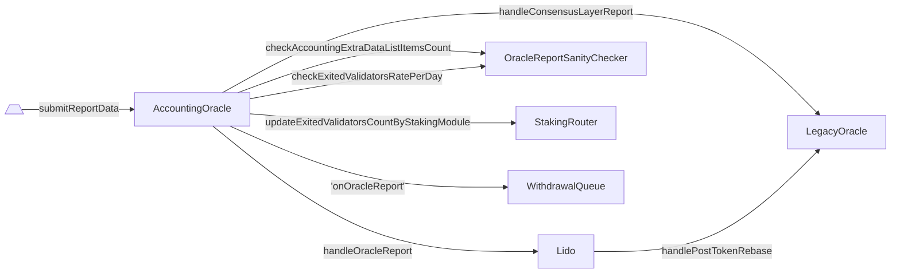

# AccountingOracle

- [Source code](https://github.com/lidofinance/lido-dao/blob/master/contracts/0.8.9/oracle/AccountingOracle.sol)
- [Deployed contract](https://etherscan.io/address/0x852deD011285fe67063a08005c71a85690503Cee)
- Inherits [BaseOracle](https://github.com/lidofinance/lido-dao/blob/master/contracts/0.8.9/oracle/BaseOracle.sol)

:::info
It's advised to read [What is Lido Oracle mechanism](/guides/oracle-operator-manual#intro) before
:::

## What is AccountingOracle

AccountingOracle is a contract which collects information submitted by the off-chain oracles about state of the Lido-participating validators and their balances, the
amount of funds accumulated on the protocol vaults (i.e., [withdrawal](./withdrawal-vault) and [execution layer rewards](./lido-execution-layer-rewards-vault) vaults), the number [exited and stuck](./staking-router#exited-and-stuck-validators) validators, the number of [withdrawal requests](./withdrawal-queue-erc721#request) the protocol is able to process and distributes node-operator rewards.

## Report cycle

The oracle work is delineated by equal time periods called frames. In normal operation, oracles finalize a report in each frame (the frame duration is 225 Ethereum Consensus Layer epochs, each frame starts at ~12:00 noon UTC). Each frame has a reference slot and processing deadline. Report data is gathered by looking at the world state (both Ethereum Execution and Consensus Layers) at the moment of the frame's reference slot (including any state changes made in that slot), and must be processed before the frame's processing deadline.

Reference slot for each frame is set to the last slot of the epoch preceding the frame's first epoch. The processing deadline is set to the last slot of the last epoch of the frame.

It's worth noting that frame length [can be changed](./hash-consensus#setframeconfig). And if oracle report is delayed it does not extend the report period, unless it's missed. In this case, the next report will have the report period increased.

The frame includes these stages:

- **Waiting:** oracle starts as a [daemon](/guides/oracle-operator-manual#the-oracle-daemon) and wakes up every 12 seconds (by default) in order to find the last finalized slot, trying to collate with it with the expected reference slot;
- **Data collection:** oracles monitor the state of both the execution and consensus layers and collect the data for the successfully arrived finalized reference slot;
- **Hash consensus:** oracles analyze the data, compile the report and submit its hash to the [`HashConsensus`](./hash-consensus) smart contract;
- **Core update report:** once the [quorum](./hash-consensus#getquorum) of hashes is reached, meaning more than half of the oracles submitted the same hash (i.e., 5 of 9 oracle committee members at the moment of writing), one of the oracles chosen in turn submits the actual report to the `AccountingOracle` contract, which triggers the core protocol state update, including the token rebase, distribution of node operator rewards, finalization of withdrawal requests, and the protocol mode decision: whether to go in the bunker mode, and
- **Extra data report:** an additional report carrying additional information that is not vital for the core update is submitted to the AccountingOracle, can be submitted in chunks (e.g, node operator key states and reward distribution data).

:::note
As it was said, daily oracle reports shouldn't be taken for granted.
Oracle daemons could stop pushing their reports for extended periods of time in case of no
[finality](https://ethereum.org/en/developers/docs/consensus-mechanisms/pos/#finality) on the Ethereum Consensus Layer.
This would ultimately result in no oracle reports and no stETH rebases for this whole period.
:::

## Report processing

The [submission](./accounting-oracle#submitreportdata) of the main report to `AccountingOracle` triggers the next processes in order, although within a single tx:

1. Update exited validators counts for each StakingModule in StakingRouter;
2. Update bunker mode status for WithdrawalQueue;
3. Handle function on the Lido contract which performs the main protocol state change.
4. Store information about ExtraData

The diagram shows the interaction with contracts.



## Report data

The function `submitReportData()` accepts the following `ReportData` structure.

```solidity
struct ReportData {
    uint256 consensusVersion;
    uint256 refSlot;
    uint256 numValidators;
    uint256 clBalanceGwei;
    uint256[] stakingModuleIdsWithNewlyExitedValidators;
    uint256[] numExitedValidatorsByStakingModule;
    uint256 withdrawalVaultBalance;
    uint256 elRewardsVaultBalance;
    uint256 sharesRequestedToBurn;
    uint256[] withdrawalFinalizationBatches;
    uint256 simulatedShareRate;
    bool isBunkerMode;
    uint256 extraDataFormat;
    bytes32 extraDataHash;
    uint256 extraDataItemsCount;
}
```

**Oracle consensus info**

- `consensusVersion` — Version of the oracle consensus rules. A current version expected by the oracle can be obtained by calling `getConsensusVersion()`.
- `refSlot` — Reference slot for which the report was calculated. The state being reported must include all state changes resulting from the all blocks up to this reference slot (inclusive). The epoch containing the slot must be finalized prior to calculating the report.

**CL values**

- `numValidators` — The number of validators on the Ethereum Consensus Layer that were ever deposited via Lido as observed at the reference slot.
- `clBalanceGwei` — Cumulative balance nominated in gwei of all Lido validators on the Ethereum Consensus Layer as observed at the reference slot.
- `stakingModuleIdsWithNewlyExitedValidators` — Ids of staking modules that have more exited validators than the number stored in the respective staking module contract as observed at the reference slot.
- `numExitedValidatorsByStakingModule` — Number of ever exited validators for each of the staking modules from the `stakingModuleIdsWithNewlyExitedValidators` array as observed at the reference slot.

**EL values**

- `withdrawalVaultBalance` — Ether balance of the Lido [withdrawal vault](/contracts/withdrawal-vault) as observed at the reference slot.
- `elRewardsVaultBalance` — Ether balance of the Lido [execution layer rewards vault](/contracts/lido-execution-layer-rewards-vault) as observed at the reference slot.
- `sharesRequestedToBurn` — The shares amount requested to burn through [Burner](/contracts/burner) as observed at the reference slot. The value can be obtained in the following way:

```solidity
(coverSharesToBurn, nonCoverSharesToBurn) = IBurner(burner).getSharesRequestedToBurn()
sharesRequestedToBurn = coverSharesToBurn + nonCoverSharesToBurn
```

**Withdrawals finalization decision**

- `withdrawalFinalizationBatches` — The ascendingly-sorted array of withdrawal request IDs obtained by the oracle daemon on report gathering via calling [`WithdrawalQueue.calculateFinalizationBatches`](./withdrawal-queue-erc721#calculatefinalizationbatches). An empty array means that no withdrawal requests to be finalized.
- `simulatedShareRate` — The share rate (i.e., [total pooled ether](./lido#gettotalpooledether) divided by [total shares](./lido#gettotalshares)) with the 10^27 precision (i.e., multiplied by 10^27) that would be effective as the result of applying this oracle report at the reference slot, with `withdrawalFinalizationBatches` set to empty array and `simulatedShareRate` set to 0. To estimate `simulatedShareRate` one should perform a view call [Lido.handleOracleReport](/contracts/lido#handleoraclereport) directly via [`eth_call`](https://ethereum.org/en/developers/docs/apis/json-rpc/#eth_call) JSON-RPC API and calculate as follows:

```solidity
_simulatedShareRate = (postTotalPooledEther * 10**27) / postTotalShares
```

where `postTotalPooledEther` and `postTotalShares` were retrieved as return values from the performed view call

- `isBunkerMode` — Whether, based on the state observed at the reference slot, the protocol must be in the bunker mode or the turbo (regular) mode.

:::note

##### Extra data

Extra data — the oracle information that allows asynchronous processing, potentially in
    chunks, after the main data is processed. The oracle doesn't enforce that extra data
    attached to the same data report is processed in full before the processing deadline expires
    or a new data report starts being processed, but enforces that no processing of extra
    data for a report is possible after its processing deadline passes or a new data report
    arrives.

Extra data is an array of items, each item being encoded as follows:

       3 bytes    2 bytes      X bytes
    | itemIndex | itemType | itemPayload |

- `itemIndex` is a 0-based index into the extra data array;
- `itemType` is the type of extra data item;
- `itemPayload` is the item's data which interpretation depends on the item's type.

Items must be sorted ascendingly by the `(itemType, ...itemSortingKey)` compound key
where `itemSortingKey` calculation depends on the item's type (see below).

---------------------------------------------------------------------------------------

**`itemType=0`** (`EXTRA_DATA_TYPE_STUCK_VALIDATORS`): stuck validators by node operators.

The `itemPayload` field has the following format:

    | 3 bytes  |   8 bytes    |  nodeOpsCount * 8 bytes  |  nodeOpsCount * 16 bytes  |
    | moduleId | nodeOpsCount |      nodeOperatorIds     |   stuckValidatorsCounts   |

`moduleId` is the staking module for which exited keys counts are being reported.

`nodeOperatorIds` contains an array of ids of node operators that have total stuck
    validators counts changed compared to the staking module smart contract storage as
    observed at the reference slot. Each id is a 8-byte uint, ids are packed tightly.

`nodeOpsCount` contains the number of node operator ids contained in the nodeOperatorIds
    array. Thus,

    nodeOpsCount = byteLength(nodeOperatorIds) / 8

`stuckValidatorsCounts` contains an array of stuck validators total counts, as observed at
    the reference slot, for the node operators from the nodeOperatorIds array, in the same
    order. Each count is a 16-byte uint, counts are packed tightly. Thus,

    byteLength(stuckValidatorsCounts) = nodeOpsCount * 16

`nodeOpsCount` must not be greater than `maxAccountingExtraDataListItemsCount` specified
    in the [`OracleReportSanityChecker`](./oracle-report-sanity-checker) contract. If a staking module has more node operators
    with total stuck validators counts changed compared to the staking module smart contract
    storage (as observed at the reference slot), reporting for that module should be split
    into multiple items.

Item sorting key is a compound key consisting of the module id and the first reported
    node operator's id:

    itemSortingKey = (moduleId, nodeOperatorIds[0:8])

---------------------------------------------------------------------------------------

**`itemType=1`** (`EXTRA_DATA_TYPE_EXITED_VALIDATORS`): exited validators by node operators.

The payload format is exactly the same as for `itemType=EXTRA_DATA_TYPE_STUCK_VALIDATORS`,
    except that, instead of stuck validators counts, exited validators counts are reported.
    The `itemSortingKey` is calculated identically.

---------------------------------------------------------------------------------------

The oracle daemon must report exited/stuck validators counts ONLY for those
    `(moduleId, nodeOperatorId)` pairs that contain outdated counts in the staking
    module smart contract as observed at the reference slot.

Extra data array can be passed in different formats, see below.

:::

- `extraDataFormat` -  Format of the extra data. Currently, only the `EXTRA_DATA_FORMAT_EMPTY=0` and `EXTRA_DATA_FORMAT_LIST=1` formats are supported. See the constant defining a specific data format for more info.
- `extraDataHash` - Hash of the extra data. See the constant defining a specific extra data format for the info on how to calculate the hash. Must be set to a zero hash if the oracle report contains no extra data.
- `extraDataItemsCount` - Number of the extra data items. Must be set to zero if the oracle report contains no extra data.

## Access and permissioms

Access to lever methods is restricted using the functionality of the
[AccessControlEnumerable](https://github.com/lidofinance/lido-dao/blob/master/contracts/0.8.9/utils/access/AccessControlEnumerable.sol)
contract and a bunch of [granular roles](#permissions).

## Constants

### LIDO()

Returns an address of the [Lido](/contracts/lido) contract

```solidity
address public immutable LIDO
```

### LOCATOR()

Returns an address of the [LidoLocator](/contracts/lido-locator) contract

```solidity
ILidoLocator public immutable LOCATOR
```

### LEGACY_ORACLE()

Returns an address of the [LegacyOracle](/contracts/legacy-oracle) contract

```solidity
address public immutable LEGACY_ORACLE
```

### SECONDS_PER_SLOT()

See [https://ethereum.org/en/developers/docs/blocks/#block-time](https://ethereum.org/en/developers/docs/blocks/#block-time)

:::note
always returns 12 seconds due to [the Merge](https://ethereum.org/en/roadmap/merge/)
:::

```solidity
uint256 public immutable SECONDS_PER_SLOT
```

### GENESIS_TIME()

See [https://blog.ethereum.org/2020/11/27/eth2-quick-update-no-21](https://blog.ethereum.org/2020/11/27/eth2-quick-update-no-21)

:::note
always returns 1606824023 (December 1, 2020, 12:00:23pm UTC) on [Mainnet](https://blog.ethereum.org/2020/11/27/eth2-quick-update-no-21)
:::

```solidity
uint256 public immutable GENESIS_TIME
```

### EXTRA_DATA_TYPE_STUCK_VALIDATORS()

This type carries the details of [stuck](/contracts/staking-router#exited-and-stuck-validators) validator(s).

```solidity
uint256 public constant EXTRA_DATA_TYPE_STUCK_VALIDATORS = 1
```

### EXTRA_DATA_TYPE_EXITED_VALIDATORS()

This type contains the details of [exited](/contracts/staking-router#exited-and-stuck-validators) validator(s).

```solidity
uint256 public constant EXTRA_DATA_TYPE_EXITED_VALIDATORS = 2
```

### EXTRA_DATA_FORMAT_EMPTY()

The extra data format used to signify that the oracle report contains no [extra data](/contracts/accounting-oracle#extra-data).

Sends as a part of the Oracle's [Phase 3](/guides/oracle-operator-manual#phase-3-submitting-a-report-extra-data).

This format uses when there are no new [stuck](/contracts/staking-router#exited-and-stuck-validators) or [exited](/contracts/staking-router#exited-and-stuck-validators) validators on report period.

```solidity
uint256 public constant EXTRA_DATA_FORMAT_EMPTY = 0
```

### EXTRA_DATA_FORMAT_LIST()

The list format for the extra data array. Used when all extra data processing
 fits into a single transaction.

Extra data is passed within a single transaction as a bytearray containing all data items
packed tightly.

Hash is a `keccak256` hash calculated over the bytearray items. The Solidity equivalent of
the hash calculation code would be `keccak256(array)`, where `array` has the `bytes` type.

```solidity
uint256 public constant EXTRA_DATA_FORMAT_LIST = 1
```

## ProcessingState

```solidity
struct ProcessingState {
    uint256 currentFrameRefSlot;
    uint256 processingDeadlineTime;
    bytes32 mainDataHash;
    bool mainDataSubmitted;
    bytes32 extraDataHash;
    uint256 extraDataFormat;
    bool extraDataSubmitted;
    uint256 extraDataItemsCount;
    uint256 extraDataItemsSubmitted;
}
```

- `currentFrameRefSlot` - Reference slot for the current reporting frame.
- `processingDeadlineTime` - The last time at which a data can be submitted for the current reporting frame.
- `mainDataHash` - Hash of the main report data. Zero bytes if consensus on the hash hasn't been reached yet for the current reporting frame.
- `mainDataSubmitted` - Whether the main report data for the current reporting frame has already been submitted.
- `extraDataHash` - Hash of the extra report data. Should be ignored unless `mainDataSubmitted` is true.
- `extraDataFormat` - Format of the extra report data for the current reporting frame. Should be ignored unless `mainDataSubmitted` is true.
- `extraDataSubmitted` - Total number of extra report data items for the current reporting frame. Should be ignored unless `mainDataSubmitted` is true.
- `extraDataItemsSubmitted` - How many extra report data items are already submitted for the current reporting frame.

## View methods

### getConsensusContract()

Returns the address of the [HashConsensus](/contracts/hash-consensus) contract instance used by `AccountingOracle`.

```solidity
function getConsensusContract() external view returns (address)
```

### getConsensusReport()

Returns the last consensus report hash and metadata.

```solidity
function getConsensusReport() external view returns (
    bytes32 hash,
    uint256 refSlot,
    uint256 processingDeadlineTime,
    bool processingStarted
)
```

#### Returns

| Name                     | Type      | Description                                                |
| ------------------------ | --------- | ---------------------------------------------------------- |
| `hash`                   | `bytes32` | The last reported hash                 |
| `refSlot`                | `uint256` | The frame's reference slot: if the data the consensus is being reached upon includes or depends on any onchain state, this state should be queried at the reference slot. The state being reported must include all state changes resulting from all blocks up to this reference slot (inclusive).                 |
| `processingDeadlineTime` | `uint256` | Timestamp of the last slot at which a report can be reported and processed |
| `processingStarted`      | `bool`    | Has the processing of the report been started or not                       |

### getConsensusVersion()

Returns the current consensus version expected by the oracle contract.

:::note
Consensus version must change every time consensus rules change, meaning that
 an oracle looking at the same reference slot would calculate a different hash.
:::

```solidity
function getConsensusVersion() external view returns (uint256)
```

### getContractVersion()

Returns the current contract version.

```solidity
function getContractVersion() public view returns (uint256)
```

### getLastProcessingRefSlot()

Returns the last reference slot for which processing of the report was started.

```solidity
function getLastProcessingRefSlot() external view returns (uint256)
```

### getProcessingState()

Returns data processing state for the current reporting frame. See the docs for the [ProcessingState](#processingstate) struct.

```solidity
function getProcessingState() external view returns (ProcessingState memory result)
```

## Methods

### submitReportData()

Submits report data for processing.

```solidity
function submitReportData(ReportData calldata data, uint256 contractVersion)
```

#### Parameters

| Name              | Type          | Description                                                  |
| ------------------ | ------------ | ------------------------------------------------------------ |
| `data`             | `ReportData` | The data. See the [ReportData](./accounting-oracle#report-data) structure's docs for details. |
| `contractVersion`  | `uint256`    | Expected version of the oracle contract.                     |

#### Reverts

For more information about reverts, see a separate section [here](#reverts-3)

### submitReportExtraDataEmpty()

Triggers the processing required when no extra data is present in the report, i.e. when extra data format equals EXTRA_DATA_FORMAT_EMPTY.

```solidity
function submitReportExtraDataEmpty()
```

#### Reverts

- Reverts with `SenderNotAllowed()` if sender doesn't have a `SUBMIT_DATA_ROLE` role and sender is not a consensus member.

### submitReportExtraDataList()

Submits report extra data in the EXTRA_DATA_FORMAT_LIST format for processing.

```solidity
function submitReportExtraDataList(bytes calldata items)
```

#### Parameters

| Name    | Type    | Description                                                  |
| ------- | ------- | ------------------------------------------------------------ |
| `items` | `bytes` | The extra data items list. See docs for the [EXTRA_DATA_FORMAT_LIST](#extra_data_format_list) constant for details. |

#### Reverts

- Reverts with `SenderNotAllowed()` if sender doesn't have a `SUBMIT_DATA_ROLE` role and sender is not a consensus member.

### submitConsensusReport()

Called by [AccountingOracle HashConsensus](/contracts/hash-consensus) contract to push a consensus report for processing.

:::note
Note that submitting the report doesn't require the processor to start processing it right
 away, this can happen later (see [`getLastProcessingRefSlot`](#getlastprocessingrefslot)). Until processing is started,
 HashConsensus is free to reach consensus on another report for the same reporting frame an
 submit it using this same function, or to lose the consensus on the submitted report,
 notifying the processor via `discardConsensusReport`.
:::

```solidity
function submitConsensusReport(bytes32 reportHash, uint256 refSlot, uint256 deadline)
```

#### Parameters

| Name              | Type          | Description                                                  |
| ------------------ | ------------ | ------------------------------------------------------------ |
| `reportHash` | `bytes32` | Hash of the data calculated for the given reference slot. |
| `refSlot`    | `uint256` | The reference slot the data was calculated for. Reverts if doesn't match the current reference slot.                     |
| `deadline`   | `uint256` | The timestamp of the last slot at which the report can be processed by the report processor contract.                     |

### discardConsensusReport()

Called by HashConsensus contract to notify that the report for the given ref. slot
 is not a consensus report anymore and should be discarded. This can happen when a member
 changes their report, is removed from the set, or when the quorum value gets increased.

Only called when, for the given reference slot:

1. there previously was a consensus report; AND
2. processing of the consensus report hasn't started yet; AND
3. report processing deadline is not expired yet; AND
4. there's no consensus report now (otherwise, [submitConsensusReport](#submitconsensusreport) is called instead).

Can be called even when there's no submitted non-discarded consensus report for the current
reference slot, i.e. can be called multiple times in succession.

```solidity
function discardConsensusReport(uint256 refSlot)
```

### setConsensusContract()

```solidity
function setConsensusContract(address addr)
```

### setConsensusVersion()

Sets the consensus version expected by the oracle contract.

```solidity
function setConsensusVersion(uint256 version)
```

## Permissions

### SUBMIT_DATA_ROLE()

An ACL role granting the permission to submit the data for a committee report.

```solidity
bytes32 public constant SUBMIT_DATA_ROLE = keccak256("SUBMIT_DATA_ROLE");
```

### MANAGE_CONSENSUS_CONTRACT_ROLE()

An ACL role granting the permission to set the consensus contract address by calling setConsensusContract.

```solidity
bytes32 public constant MANAGE_CONSENSUS_CONTRACT_ROLE = keccak256("MANAGE_CONSENSUS_CONTRACT_ROLE");
```

### MANAGE_CONSENSUS_VERSION_ROLE()

An ACL role granting the permission to set the consensus version by calling setConsensusVersion.

```solidity
bytes32 public constant MANAGE_CONSENSUS_VERSION_ROLE = keccak256("MANAGE_CONSENSUS_VERSION_ROLE");
```

## Events

### ExtraDataSubmitted()

Emits when any extra report data for the current reporting frame has been submitted.

```solidity
ExtraDataSubmitted(uint256 indexed refSlot, uint256 itemsProcessed, uint256 itemsCount)
```

### WarnExtraDataIncompleteProcessing()

Emits when try to submit the same report, but not all items are processed yet.

```solidity
event WarnExtraDataIncompleteProcessing(
    uint256 indexed refSlot,
    uint256 processedItemsCount,
    uint256 itemsCount
)
```

### ConsensusHashContractSet()

Emits when a contract hash value is changed.

```solidity
event ConsensusHashContractSet(address indexed addr, address indexed prevAddr)
```

### ConsensusVersionSet()

Emits when a consensus version value is changed.

```solidity
event ConsensusVersionSet(uint256 indexed version, uint256 indexed prevVersion)
```

### ReportSubmitted()

Emits when a new consensus report hash is submitted

```solidity
event ReportSubmitted(uint256 indexed refSlot, bytes32 hash, uint256 processingDeadlineTime)
```

### ReportDiscarded()

Emits when consensus report is discarded.

```solidity
event ReportDiscarded(uint256 indexed refSlot, bytes32 hash)
```

### ProcessingStarted()

Emits when report data is submitted

```solidity
event ProcessingStarted(uint256 indexed refSlot, bytes32 hash)
```

### WarnProcessingMissed()

Emits on [submitConsensusReport](#submitconsensusreport) when `refSlot != prevSubmittedRefSlot && prevProcessingRefSlot != prevSubmittedRefSlot`

```solidity
event WarnProcessingMissed(uint256 indexed refSlot)
```

## Reverts

### submitReportData()

To ensure that the reported data is within possible values, the handler function performs a number of sanity checks. When checking, reverts may occur in different contracts.

#### AccountingOracle and BaseOracle contracts

- Reverts with `SenderNotAllowed()` if caller doesn't have a `SUBMIT_DATA_ROLE` role and is not a member of the oracle committee.
- Reverts with `UnexpectedContractVersion(expectedVersion, version)` if provided contract version is different from the current one.
- Reverts with `UnexpectedConsensusVersion(expectedConsensusVersion, consensusVersion)` if provided consensus version is different from the expected one.
- Reverts with `UnexpectedRefSlot(report.refSlot, refSlot)` if provided reference slot differs from the current consensus frame's one.
- Reverts with `UnexpectedDataHash(report.hash, hash)` if keccak256 hash of the ABI-encoded data is different from the last hash.
- Reverts with `NoConsensusReportToProcess()` if report hash data is 0.
- Reverts with `RefSlotAlreadyProcessing()` if report reference slot is equal to previous processing reference slot.
- Reverts with `UnexpectedExtraDataHash(bytes32(0), data.extraDataHash)` if `data.extraDataFormat` is `EXTRA_DATA_FORMAT_EMPTY` and `data.extraDataHash` is 0
- Reverts with `UnexpectedExtraDataItemsCount(0, data.extraDataItemsCount)` if `data.extraDataFormat` is `EXTRA_DATA_FORMAT_EMPTY` and `data.extraDataItemsCount` is not 0
- Reverts with `UnsupportedExtraDataFormat(data.extraDataFormat)` if `data.extraDataFormat` is not `EXTRA_DATA_FORMAT_EMPTY` and not `EXTRA_DATA_FORMAT_LIST`
- Reverts with `ExtraDataItemsCountCannotBeZeroForNonEmptyData()` if `data.extraDataFormat` is `EXTRA_DATA_FORMAT_LIST` and `data.extraDataItemsCount` is 0
- Reverts with `ExtraDataHashCannotBeZeroForNonEmptyData()` if  `data.extraDataFormat` is `EXTRA_DATA_FORMAT_LIST` and `data.extraDataHash` is 0
- Reverts with `InvalidExitedValidatorsData()` if provided exited validators data doesn't meet safety checks.

#### OracleReportSanityChecker

- Reverts with `MaxAccountingExtraDataItemsCountExceeded(uint256 maxItemsCount, uint256 receivedItemsCount)` error when check is failed, more [here](/contracts/oracle-report-sanity-checker.md#checkaccountingextradatalistitemscount)
- Reverts with `ExitedValidatorsLimitExceeded(uint256 limitPerDay, uint256 exitedPerDay)` if provided exited validators data doesn't meet safety checks. (OracleReportSanityChecker)

#### StakingRouter

- Reverts with `ArraysLengthMismatch(_stakingModuleIds.length, _exitedValidatorsCounts.length)` if provided exited validators data doesn't meet safety checks. (StakingRouter)
- Reverts with `ExitedValidatorsCountCannotDecrease()` if provided exited validators data doesn't meet safety checks. (StakingRouter)
- Reverts with `ReportedExitedValidatorsExceedDeposited(uint256 reportedExitedValidatorsCount,uint256 depositedValidatorsCount)` if provided exited validators data doesn't meet safety checks. (StakingRouter)

Other reverts on `Lido.handleOracleReport()`
