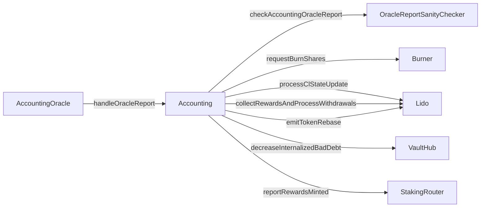

# Accounting

- [Source code](https://github.com/lidofinance/core/blob/v3.0.1/contracts/0.8.9/Accounting.sol)
- [Deployed contract](https://etherscan.io/address/0x23ED611be0e1a820978875C0122F92260804cdDf)

Handles oracle reports and calculates protocol state changes including rebases, fee distribution, and stVault bad debt internalization.

## What is Accounting?

Accounting is the core contract that processes oracle reports for Lido:

- receives oracle reports from `AccountingOracle`
- calculates share rate changes and token rebases
- distributes protocol fees to staking modules and treasury
- finalizes withdrawal requests
- internalizes bad debt from stVaults via `VaultHub`
- notifies external contracts about rebases

The contract acts as the central point for all accounting operations, replacing the previous `handleOracleReport` logic that was in the Lido contract.

## How it works

1. `AccountingOracle` submits a report via `handleOracleReport()`.
2. Accounting snapshots current protocol state (CL validators, balances, shares, external shares/ether, bad debt to internalize).
3. Calculates all state changes (withdrawals, fees, burns) accounting for both internal and external ether/shares.
4. Runs sanity checks via `OracleReportSanityChecker`.
5. Applies changes: updates CL state, internalizes bad debt, processes withdrawals, distributes fees.
6. Notifies observers and emits the token rebase event.



## Structs

### ReportValues

Oracle report input data (defined in `contracts/common/interfaces/ReportValues.sol`):

```solidity
struct ReportValues {
    uint256 timestamp;                        // Block timestamp when the report is based
    uint256 timeElapsed;                      // Duration since the previous report
    uint256 clValidators;                     // Total count of Lido validators on CL
    uint256 clBalance;                        // Combined balance of all Lido validators on CL
    uint256 withdrawalVaultBalance;           // Current withdrawal vault holdings
    uint256 elRewardsVaultBalance;            // Execution Layer rewards vault holdings
    uint256 sharesRequestedToBurn;            // stETH shares marked for burning via Burner
    uint256[] withdrawalFinalizationBatches;  // Sorted array of withdrawal request IDs
    uint256 simulatedShareRate;               // Projected share rate value
}
```

### PreReportState

Snapshot of protocol state before report processing (internal struct):

```solidity
struct PreReportState {
    uint256 clValidators;           // Number of CL validators before report
    uint256 clBalance;              // CL balance before report
    uint256 totalPooledEther;       // Total pooled ether before report
    uint256 totalShares;            // Total shares before report
    uint256 depositedValidators;    // Number of deposited validators
    uint256 externalShares;         // Shares backed by external vaults
    uint256 externalEther;          // Ether in external vaults
    uint256 badDebtToInternalize;   // Bad debt amount to internalize this report
}
```

### CalculatedValues

Computed state changes from a report:

```solidity
struct CalculatedValues {
    uint256 withdrawalsVaultTransfer;    // ETH to transfer from withdrawal vault
    uint256 elRewardsVaultTransfer;      // ETH to transfer from EL rewards vault
    uint256 etherToFinalizeWQ;           // ETH needed to finalize withdrawal queue
    uint256 sharesToFinalizeWQ;          // Shares to finalize withdrawal queue
    uint256 sharesToBurnForWithdrawals;  // Shares to burn for withdrawals
    uint256 totalSharesToBurn;           // Total shares to be burned
    uint256 sharesToMintAsFees;          // Shares to mint as protocol fees
    FeeDistribution feeDistribution;     // Fee distribution details
    uint256 principalClBalance;          // Principal CL balance
    uint256 preTotalShares;              // Total shares before update
    uint256 preTotalPooledEther;         // Total pooled ETH before update
    uint256 postInternalShares;          // Internal shares after update
    uint256 postInternalEther;           // Internal ETH after update
    uint256 postTotalShares;             // Total shares after update
    uint256 postTotalPooledEther;        // Total pooled ETH after update
}
```

### FeeDistribution

Protocol fee allocation:

```solidity
struct FeeDistribution {
    address[] moduleFeeRecipients;   // Addresses receiving module fees
    uint256[] moduleIds;             // IDs of staking modules
    uint256[] moduleSharesToMint;    // Shares to mint for each module
    uint256 treasurySharesToMint;    // Shares to mint for treasury
}
```

## Constructor

### constructor(ILidoLocator _lidoLocator, ILido _lido)

```solidity
constructor(ILidoLocator _lidoLocator, ILido _lido)
```

Initializes immutable references to `LidoLocator` and `Lido`.

## View methods

### simulateOracleReport(ReportValues \_report)

```solidity
function simulateOracleReport(
    ReportValues calldata _report
) external view returns (CalculatedValues memory)
```

Simulates an oracle report without applying changes. Returns calculated state changes that would result from the report. Used by oracle daemons to compute the simulated share rate before submitting.

Note: For simulation, uses `vaultHub.badDebtToInternalize()` to fetch the current bad debt value, whereas actual reports use `badDebtToInternalizeForLastRefSlot()`.

## Methods

### handleOracleReport(ReportValues \_report)

```solidity
function handleOracleReport(ReportValues calldata _report) external
```

Handles an oracle report and applies all calculated state changes to the protocol. Can only be called by the `AccountingOracle` contract.

The method performs these operations in order:

1. Runs sanity checks on report data
2. Updates consensus layer state on Lido via `processClStateUpdate()`
3. Internalizes bad debt (calls `vaultHub.decreaseInternalizedBadDebt()` and `lido.internalizeExternalBadDebt()`)
4. Requests and commits shares to burn via Burner (including withdrawal queue finalization shares)
5. Collects EL rewards and processes withdrawals via `collectRewardsAndProcessWithdrawals()`
6. Distributes protocol fees to modules and treasury (mints and distributes fee shares, calls `reportRewardsMinted()`)
7. Notifies rebase observers via `handlePostTokenRebase()`
8. Emits token rebase event via `emitTokenRebase()`

## Errors

```solidity
error NotAuthorized(string operation, address addr);
error IncorrectReportTimestamp(uint256 reportTimestamp, uint256 upperBoundTimestamp);
error IncorrectReportValidators(uint256 reportValidators, uint256 minValidators, uint256 maxValidators);
error InternalSharesCantBeZero();
```

## Related

- [AccountingOracle](/contracts/accounting-oracle)
- [Lido](/contracts/lido)
- [VaultHub](/contracts/vault-hub.md)
- [OracleReportSanityChecker](/contracts/oracle-report-sanity-checker)
- [WithdrawalQueue](/contracts/withdrawal-queue-erc721)
