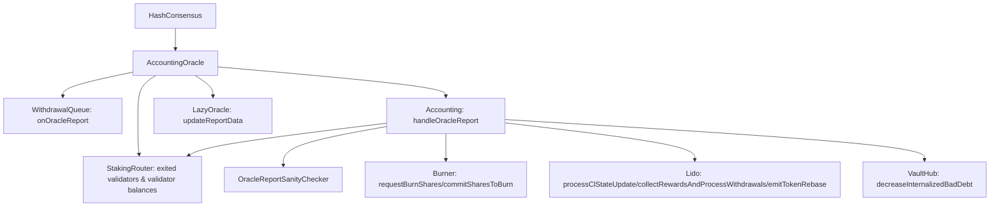

# Accounting

- [Source code](https://github.com/lidofinance/core/blob/v4.0.0/contracts/0.8.9/Accounting.sol)
- [Deployed contract](https://etherscan.io/address/0x23ED611be0e1a820978875C0122F92260804cdDf)

Handles oracle reports and calculates protocol state changes including rebases, fee distribution, and stVault bad debt internalization.

## What is Accounting?

Accounting is the core contract that processes oracle reports for Lido:

- receives oracle reports from `AccountingOracle`
- calculates share rate changes and token rebases
- distributes protocol fees to staking modules and treasury
- finalizes withdrawal requests
- internalizes bad debt from stVaults via `VaultHub`
- notifies external contracts about rebases

The contract acts as the central point for all accounting operations.

## How it works

1. `HashConsensus` reaches consensus on the accounting report hash.
2. `AccountingOracle.submitReportData()` validates the sender, contract version, consensus version, and report hash.
3. `AccountingOracle` pre-validates the per-module validator balances and the CL balance change rates via `StakingRouter.validateReportValidatorBalancesByStakingModule()` and `OracleReportSanityChecker.checkModuleAndCLBalancesChangeRates()`.
4. `AccountingOracle` reports exited validator counts to `StakingRouter` and checks them via `OracleReportSanityChecker.checkExitedValidatorsCount()`.
5. `AccountingOracle` reports per-module validator balances to `StakingRouter` via `reportValidatorBalancesByStakingModule()` — these are used as the basis for rewards distribution.
6. `AccountingOracle` calls `WithdrawalQueue.onOracleReport()` to update bunker mode and timing bounds.
7. `AccountingOracle` calls `Accounting.handleOracleReport()`.
8. Accounting snapshots pre-report state (including `Lido.getBalanceStats()` and the bad debt to internalize from `VaultHub`) and simulates the report (including `WithdrawalQueue.prefinalize()` and `OracleReportSanityChecker.smoothenTokenRebase()`).
9. Accounting runs sanity checks via `OracleReportSanityChecker.checkAccountingOracleReport()`.
10. Accounting calls `Burner.requestBurnShares()` to lock shares for withdrawal finalization (if needed).
11. Accounting updates CL state via `Lido.processClStateUpdate()`.
12. Accounting internalizes bad debt via `VaultHub.decreaseInternalizedBadDebt()` and `Lido.internalizeExternalBadDebt()`.
13. Accounting calls `Burner.commitSharesToBurn()` (if needed).
14. Accounting calls `Lido.collectRewardsAndProcessWithdrawals()` to process withdrawals and rewards.
15. If fees are due, Accounting mints fee shares, distributes them, and calls `StakingRouter.reportRewardsMinted()`.
16. Accounting notifies the post-rebase receiver and calls `Lido.emitTokenRebase()`.
17. `AccountingOracle` updates `LazyOracle.updateReportData()` and stores extra-data processing state.


```mermaid
graph TB;
  HC[HashConsensus]-->AO[AccountingOracle];
  AO-->SR[StakingRouter: exited validators & validator balances];
  AO-->WQ[WithdrawalQueue: onOracleReport];
  AO-->A[Accounting: handleOracleReport];
  A-->SC[OracleReportSanityChecker];
  A-->B[Burner: requestBurnShares/commitSharesToBurn];
  A-->L[Lido: processClStateUpdate/collectRewardsAndProcessWithdrawals/emitTokenRebase];
  A-->VH[VaultHub: decreaseInternalizedBadDebt];
  A-->SR;
  AO-->LO[LazyOracle: updateReportData];
```

## Structs

### ReportValues

Oracle report input data (defined in `contracts/common/interfaces/ReportValues.sol`):

```solidity
struct ReportValues {
    uint256 timestamp;                        // Block timestamp when the report is based
    uint256 timeElapsed;                      // Duration since the previous report
    uint256 clValidatorsBalance;              // Balance of Lido validators on CL, excluding pending deposits
    uint256 clPendingBalance;                 // Balance of Lido-attributed pending deposits on CL
    uint256 withdrawalVaultBalance;           // Current withdrawal vault holdings
    uint256 elRewardsVaultBalance;            // Execution Layer rewards vault holdings
    uint256 sharesRequestedToBurn;            // stETH shares marked for burning via Burner
    uint256[] withdrawalFinalizationBatches;  // Sorted array of withdrawal request IDs
    uint256 simulatedShareRate;               // Projected share rate value
}
```

### PreReportState

Snapshot of protocol state before report processing (internal struct):

```solidity
struct PreReportState {
    uint256 clValidatorsBalance;    // CL validators balance (excluding pending deposits) at the last report
    uint256 clPendingBalance;       // CL pending deposits balance at the last report
    uint256 depositedBalance;       // Ether deposited since the last report, as of the reporting refSlot
    uint256 totalPooledEther;       // Total pooled ether before report
    uint256 totalShares;            // Total shares before report
    uint256 externalShares;         // Shares backed by external vaults
    uint256 externalEther;          // Ether in external vaults
    uint256 badDebtToInternalize;   // Bad debt amount to internalize this report
}
```

### CalculatedValues

Computed state changes from a report:

```solidity
struct CalculatedValues {
    uint256 withdrawalsVaultTransfer;    // ETH to transfer from withdrawal vault
    uint256 elRewardsVaultTransfer;      // ETH to transfer from EL rewards vault
    uint256 etherToFinalizeWQ;           // ETH needed to finalize withdrawal queue
    uint256 sharesToFinalizeWQ;          // Shares to finalize withdrawal queue
    uint256 sharesToBurnForWithdrawals;  // Shares to burn for withdrawals
    uint256 totalSharesToBurn;           // Total shares to be burned
    uint256 sharesToMintAsFees;          // Shares to mint as protocol fees
    FeeDistribution feeDistribution;     // Fee distribution details
    uint256 principalClBalance;          // CL balances at the previous report plus deposits made since then
    uint256 preTotalShares;              // Total shares before update
    uint256 preTotalPooledEther;         // Total pooled ETH before update
    uint256 postInternalShares;          // Internal shares after update
    uint256 postInternalEther;           // Internal ETH after update
    uint256 postTotalShares;             // Total shares after update
    uint256 postTotalPooledEther;        // Total pooled ETH after update
}
```

### FeeDistribution

Protocol fee allocation:

```solidity
struct FeeDistribution {
    address[] moduleFeeRecipients;   // Addresses receiving module fees
    uint256[] moduleIds;             // IDs of staking modules
    uint256[] moduleSharesToMint;    // Shares to mint for each module
    uint256 treasurySharesToMint;    // Shares to mint for treasury
}
```

## View methods

### simulateOracleReport(ReportValues \_report)

```solidity
function simulateOracleReport(
    ReportValues calldata _report
) external view returns (CalculatedValues memory)
```

Simulates an oracle report without applying changes. Returns calculated state changes that would result from the report. Used by oracle daemons to compute the simulated share rate before submitting.

Note: For simulation, uses `vaultHub.badDebtToInternalize()` to fetch the current bad debt value, whereas actual reports use `badDebtToInternalizeForLastRefSlot()`.

## Methods

### handleOracleReport(ReportValues \_report)

```solidity
function handleOracleReport(ReportValues calldata _report) external
```

Handles an oracle report and applies all calculated state changes to the protocol. Can only be called by the `AccountingOracle` contract.

The method performs these operations in order:

1. Runs sanity checks on report data.
2. Requests `Burner.requestBurnShares()` for withdrawal queue finalization (if applicable).
3. Updates consensus layer state on Lido via `processClStateUpdate()`.
4. Internalizes bad debt (calls `VaultHub.decreaseInternalizedBadDebt()` and `Lido.internalizeExternalBadDebt()`).
5. Commits shares to burn via `Burner.commitSharesToBurn()`.
6. Collects EL rewards and processes withdrawals via `Lido.collectRewardsAndProcessWithdrawals()`.
7. If fees are due: mints fee shares, distributes fees, then calls `StakingRouter.reportRewardsMinted()`.
8. Notifies rebase observers via `handlePostTokenRebase()`.
9. Emits token rebase event via `emitTokenRebase()`.

## Errors

```solidity
error NotAuthorized(string operation, address addr);
error IncorrectReportTimestamp(uint256 reportTimestamp, uint256 upperBoundTimestamp);
error InternalSharesCantBeZero();
```

## Related

- [AccountingOracle](/contracts/accounting-oracle)
- [Lido](/contracts/lido)
- [VaultHub](/contracts/vault-hub)
- [OracleReportSanityChecker](/contracts/oracle-report-sanity-checker)
- [WithdrawalQueue](/contracts/withdrawal-queue-erc721)
