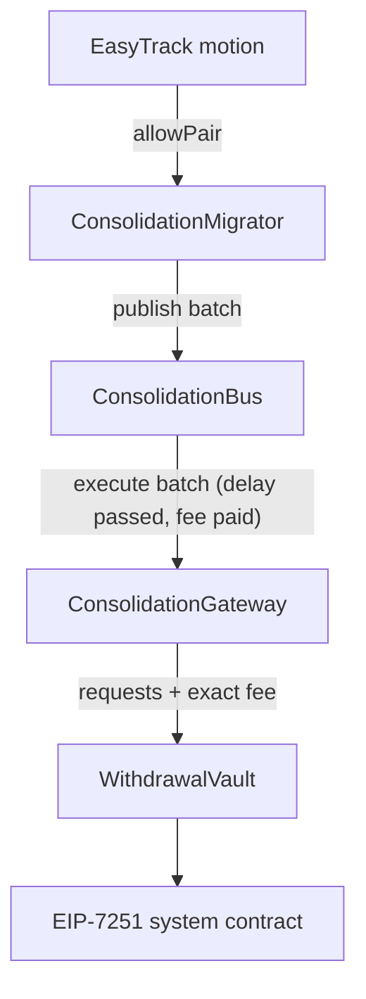

# ConsolidationGateway

- [Source code](https://github.com/lidofinance/core/blob/v3.1.0/contracts/0.8.25/consolidation/ConsolidationGateway.sol)
- Specification basis: [LIP-35 — Staking Router v3](https://github.com/lidofinance/lido-improvement-proposals/blob/develop/LIPS/lip-35.md)

ConsolidationGateway is the single entry point for [EIP-7251](https://eips.ethereum.org/EIPS/eip-7251) validator consolidation requests in Lido Core. It proxies consolidation requests to the [WithdrawalVault](/contracts/withdrawal-vault), checking permissions, verifying target validators' withdrawal credentials, applying rate limits, and refunding any excess fee.

## What is ConsolidationGateway

A consolidation is an [EIP-7251](https://eips.ethereum.org/EIPS/eip-7251) operation that merges a source validator's balance into a target `0x02` (compounding) validator. A consolidation request must be signed by the source validator's withdrawal address, and since Lido Core validators use [WithdrawalVault](/contracts/withdrawal-vault) withdrawal credentials, requests to the EIP-7251 system contract are submitted from the WithdrawalVault. The vault, in turn, accepts consolidation requests only from ConsolidationGateway.

Placing this logic in a dedicated contract rather than in the WithdrawalVault itself allows the consolidation flow to be paused independently in an emergency, without affecting protocol withdrawals or [triggerable exits](/contracts/triggerable-withdrawals-gateway).

The contract inherits [AccessControlEnumerable](https://github.com/lidofinance/core/blob/v3.1.0/contracts/0.8.25/utils/access/AccessControlEnumerable.sol), [PausableUntil](https://github.com/lidofinance/core/blob/v3.1.0/contracts/common/utils/PausableUntil.sol), and [CLProofVerifier](https://github.com/lidofinance/core/blob/v3.1.0/contracts/0.8.25/vaults/predeposit_guarantee/CLProofVerifier.sol). It is not deployed behind a proxy.

:::note
ConsolidationGateway serves the Lido Core consolidation flow. For consolidations into stVaults, see [ValidatorConsolidationRequests](/contracts/validator-consolidation-requests).
:::

## Consolidation flow in Lido Core

The gateway is the last permissioned step of the consolidation pipeline introduced in [LIP-35](https://github.com/lidofinance/lido-improvement-proposals/blob/develop/LIPS/lip-35.md) to migrate stake between staking modules (initially, from Curated Module v1 to Curated Module v2):

1. A node operator obtains permission to migrate stake via an [EasyTrack](https://dao.lido.fi/easy-track/motions) motion that allowlists a (source operator → target operator) pair with a designated Consolidation Manager address on the [ConsolidationMigrator](/contracts/consolidation-migrator).
2. The Consolidation Manager submits validator key indices to the Migrator, which validates them, resolves them to public keys via the staking modules, and publishes the batch to the [ConsolidationBus](/contracts/consolidation-bus).
3. After the bus's [execution delay](/contracts/consolidation-bus#execution-delay) has elapsed, a permissionless executor calls `ConsolidationBus.executeConsolidation`, supplying the published batch together with withdrawal credentials proofs for the target validators and the required fee. The bus forwards the batch to the gateway.
4. The gateway validates the request (see [Request processing](#request-processing)) and forwards it, together with the exact required fee, to [`WithdrawalVault.addConsolidationRequests`](/contracts/withdrawal-vault#addconsolidationrequests), which submits one EIP-7251 request per (source, target) pair to the system contract.



## Request processing

[`addConsolidationRequests`](#addconsolidationrequests) accepts consolidation requests grouped by target validator: each group contains the source validators' public keys and a [`ValidatorWitness`](/contracts/predeposit-guarantee#validatorwitness) proving the shared target validator's withdrawal credentials. Before forwarding anything to the WithdrawalVault, the gateway enforces the following:

1. **Access.** The caller holds `ADD_CONSOLIDATION_REQUEST_ROLE` (intended for the [ConsolidationBus](/contracts/consolidation-bus)), and the contract is not paused.
2. **Well-formedness.** A non-zero fee is attached, the batch is not empty, and every group contains at least one source key.
3. **Protocol state.** Deposits are not paused on the [DepositSecurityModule](/contracts/deposit-security-module), and [`Lido.canDeposit()`](/contracts/lido#candeposit) returns true (i.e., the protocol is not stopped and bunker mode is not active). See [Protocol state checks](#protocol-state-checks).
4. **Target withdrawal credentials.** Every target validator's withdrawal credentials are proven on-chain to match the Lido `0x02` withdrawal credentials. See [Target validator verification](#target-validator-verification).
5. **Rate limit.** The number of individual requests in the batch (the total count of source keys) fits into the current frame's quota. See [Consolidation limits](#consolidation-limits).
6. **Fee.** The attached ether covers `requestsCount × WithdrawalVault.getConsolidationRequestFee()`. Exactly this amount is forwarded to the vault, and any excess is refunded to the `refundRecipient` (or to the caller if the recipient is the zero address).

The entire call is wrapped in a balance-preservation check (the `preservesEthBalance` modifier): the gateway never accumulates ether — everything it receives is either forwarded to the WithdrawalVault or refunded within the same transaction.

### Protocol state checks

Consolidation requests are blocked while [DepositSecurityModule](/contracts/deposit-security-module) deposits are paused. If the DSM has paused deposits, some recently deposited validators may not belong to Lido and can therefore have non-Lido withdrawal credentials; blocking consolidations in this state acts as an additional safety check on top of the withdrawal credentials proof verification. Combined with the [execution delay](/contracts/consolidation-bus#execution-delay) on the ConsolidationBus, this gives honest DSM guardians time to pause deposits — and thereby block pending consolidations — if keys with invalid withdrawal credentials were deposited.

For the same reason, requests are also blocked while the protocol is not operating normally: if Lido is stopped or bunker mode is active (`Lido.canDeposit()` returns false), the call reverts.

### Target validator verification

A consolidation credits the source validator's balance to the target validator, so the gateway must ensure the target is controlled by the protocol. The expected withdrawal credentials are derived on the fly as the `0x02` prefix joined with the [WithdrawalVault](/contracts/withdrawal-vault) address:

```
withdrawalCredentials = 0x02 | 11 zero bytes | 20-byte WithdrawalVault address
```

For each group, the target validator's actual withdrawal credentials are verified against this value using an on-chain Merkle proof of the validator container in the Consensus Layer state, anchored to a beacon block root obtained via [EIP-4788](https://eips.ethereum.org/EIPS/eip-4788) (the `CLProofVerifier` base contract).

Source validators are not verified by the gateway: an EIP-7251 consolidation request is only actionable by the Consensus Layer if the source validator actually has the protocol's withdrawal credentials, so an invalid source key results in a no-op request. Source keys are additionally validated upstream by the [ConsolidationMigrator](/contracts/consolidation-migrator) and [ConsolidationBus](/contracts/consolidation-bus).

### Consolidation limits

To prevent overload, the gateway rate-limits the number of consolidation requests using a replenishing quota (the same `RateLimit` mechanism as the [TriggerableWithdrawalsGateway](/contracts/triggerable-withdrawals-gateway) exit limits):

- `maxConsolidationRequestsLimit` — the quota ceiling;
- `consolidationsPerFrame` — how many requests are restored to the quota per frame;
- `frameDurationInSec` — the frame duration in seconds.

Each processed request consumes one unit of the quota, and the quota is restored at a rate of `consolidationsPerFrame` per frame up to the ceiling. If a batch does not fit into the remaining quota, the whole call reverts with `ConsolidationRequestsLimitExceeded`. Setting `maxConsolidationRequestsLimit` to zero disables limiting entirely.

The limit parameters are set at deployment and can be updated via [`setConsolidationRequestLimit`](#setconsolidationrequestlimit); the current state is readable via [`getConsolidationRequestLimitFullInfo`](#getconsolidationrequestlimitfullinfo).

## Roles

Access to lever methods is restricted using the functionality of the [AccessControlEnumerable](https://github.com/lidofinance/core/blob/v3.1.0/contracts/0.8.25/utils/access/AccessControlEnumerable.sol) contract:

- `DEFAULT_ADMIN_ROLE` — manages role assignments; held by the Lido DAO Aragon Agent;
- `ADD_CONSOLIDATION_REQUEST_ROLE` — allows submitting consolidation requests; intended for the [ConsolidationBus](/contracts/consolidation-bus);
- `EXIT_LIMIT_MANAGER_ROLE` — allows updating the [consolidation limits](#consolidation-limits);
- `PAUSE_ROLE` / `RESUME_ROLE` — allow pausing and resuming the contract (see [PausableUntil](https://github.com/lidofinance/core/blob/v3.1.0/contracts/common/utils/PausableUntil.sol)).

## View methods

### `getConsolidationRequestLimitFullInfo`

Returns the full state of the [consolidation limits](#consolidation-limits).

```solidity
function getConsolidationRequestLimitFullInfo()
    external
    view
    returns (
        uint256 maxConsolidationRequestsLimit,
        uint256 consolidationsPerFrame,
        uint256 frameDurationInSec,
        uint256 prevConsolidationRequestsLimit,
        uint256 currentConsolidationRequestsLimit
    );
```

**Returns:**

| Name                                | Type      | Description                                                                                     |
| ----------------------------------- | --------- | ----------------------------------------------------------------------------------------------- |
| `maxConsolidationRequestsLimit`     | `uint256` | maximum number of consolidation requests (the quota ceiling)                                    |
| `consolidationsPerFrame`            | `uint256` | number of requests restored to the quota per frame                                              |
| `frameDurationInSec`                | `uint256` | frame duration in seconds                                                                       |
| `prevConsolidationRequestsLimit`    | `uint256` | quota left after the previous requests                                                          |
| `currentConsolidationRequestsLimit` | `uint256` | current quota; `type(uint256).max` if the limit is not set                                      |

## Write methods

### `addConsolidationRequests`

Submits grouped consolidation requests to the [WithdrawalVault](/contracts/withdrawal-vault). Each group represents multiple source validators consolidating into a single target validator, whose withdrawal credentials are verified on-chain. Any excess ether beyond the exact required fee is refunded to `refundRecipient`. See [Request processing](#request-processing) for the detailed flow.

Restricted to the `ADD_CONSOLIDATION_REQUEST_ROLE` role, intended for the [ConsolidationBus](/contracts/consolidation-bus).

```solidity
function addConsolidationRequests(
    ConsolidationWitnessGroup[] calldata groups,
    address refundRecipient
) external payable;
```

**Parameters:**

| Name              | Type                          | Description                                                                                                            |
| ----------------- | ----------------------------- | ----------------------------------------------------------------------------------------------------------------------- |
| `groups`          | `ConsolidationWitnessGroup[]` | consolidation groups, each containing source public keys and a target validator witness with a withdrawal credentials proof |
| `refundRecipient` | `address`                     | address to receive any excess ether sent for fees; if zero, the excess is refunded to the caller                          |

**Reverts:**

- if the caller does not have the `ADD_CONSOLIDATION_REQUEST_ROLE` or the contract is paused;
- with `ZeroArgument` if no ether is attached or `groups` is empty, and with `EmptyGroup` if any group has no source keys;
- with `DSMDepositsPaused` or `LidoDepositsPaused` if the [protocol state checks](#protocol-state-checks) fail;
- if any target validator's withdrawal credentials proof fails verification;
- with `ConsolidationRequestsLimitExceeded` if the batch does not fit into the current frame's quota;
- with `InsufficientFee` if the attached ether does not cover the total fee, and with `FeeRefundFailed` if the excess fee refund fails.

### `setConsolidationRequestLimit`

Updates the [consolidation limits](#consolidation-limits): the quota ceiling and the pace at which the quota is restored. Restricted to the `EXIT_LIMIT_MANAGER_ROLE` role.

```solidity
function setConsolidationRequestLimit(
    uint256 maxConsolidationRequestsLimit,
    uint256 consolidationsPerFrame,
    uint256 frameDurationInSec
) external;
```

**Parameters:**

| Name                            | Type      | Description                                          |
| ------------------------------- | --------- | ----------------------------------------------------- |
| `maxConsolidationRequestsLimit` | `uint256` | maximum number of consolidation requests; zero disables limiting |
| `consolidationsPerFrame`        | `uint256` | number of requests restored to the quota per frame    |
| `frameDurationInSec`            | `uint256` | frame duration in seconds                             |

### `pauseFor`

Pauses the contract for the specified duration, blocking new consolidation requests. Restricted to the `PAUSE_ROLE` role.

```solidity
function pauseFor(uint256 _duration) external;
```

**Parameters:**

| Name        | Type      | Description                                                     |
| ----------- | --------- | ---------------------------------------------------------------- |
| `_duration` | `uint256` | pause duration in seconds (use `PAUSE_INFINITELY` for unlimited) |

### `pauseUntil`

Pauses the contract until the specified timestamp (inclusive). Restricted to the `PAUSE_ROLE` role.

```solidity
function pauseUntil(uint256 _pauseUntilInclusive) external;
```

**Parameters:**

| Name                   | Type      | Description                              |
| ---------------------- | --------- | ----------------------------------------- |
| `_pauseUntilInclusive` | `uint256` | the last second to pause until, inclusive |

### `resume`

Resumes the contract. Restricted to the `RESUME_ROLE` role.

```solidity
function resume() external;
```

## Events

### `ConsolidationRequestsLimitSet`

Emitted when the [consolidation limits](#consolidation-limits) are set or updated.

```solidity
event ConsolidationRequestsLimitSet(
    uint256 maxConsolidationRequestsLimit,
    uint256 consolidationsPerFrame,
    uint256 frameDurationInSec
);
```
