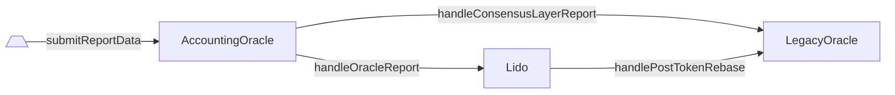

# LegacyOracle

- [Source code](https://github.com/lidofinance/lido-dao/blob/master/contracts/0.4.24/oracle/LegacyOracle.sol)
- [Deployed contract](https://etherscan.io/address/0x442af784A788A5bd6F42A01Ebe9F287a871243fb)

:::warning
`LegacyOracle` will be maintained till the end of 2023.
Afterwards, it will be discontinued and external integrations should rely on [`AccountingOracle`](/contracts/accounting-oracle).
:::

## What is LegacyOracle?

`LegacyOracle` is an Aragon app previously known as `LidoOracle`, used to track changes on the Beacon Chain.
Following the Lido V2 upgrade, this was replaced by the [`AccountingOracle`](/contracts/accounting-oracle)
and the oracle workflow was redesigned to deliver synchronized historical data chunks for the same reference slot
both for the Consensus and Execution Layer parts.

## Key changes

In Lido V2, `LegacyOracle` only supports a subset of view functions and events.
`AccountingOracle` interacts with it to push data changes on each report.

### How does LegacyOracle receive the AccountingOracle reports anyway (flow)

The `LegacyOracle` contract receives the data changes on each `AccountingOracle` report using two stages
(still within the same transaction):

1. Invoke [`handleConsensusLayerReport`](./legacy-oracle#handleconsensuslayerreport)
providing the reference slot and validators data from `AccountingOracle` itself.
1. Invoke [`handlePostTokenRebase`](./legacy-oracle#handleposttokenrebase)
from [`Lido`](/contracts/lido).



### Rebase and APR

To calculate the protocol's daily rebase and APR projections one would use the old `LidoOracle` APIs for a while.
Although the old way of calculating the APR would still result in relevant numbers, the math might be off in case of significant withdrawals.

#### How it was with LidoOracle

:::note
The formula is outdated and inaccurate since the [Lido V2 upgrade](https://blog.lido.fi/lido-v2-launch/) happened.
:::

```javascript
protocolAPR = (postTotalPooledEther - preTotalPooledEther) * secondsInYear / (preTotalPooledEther * timeElapsed)
lidoFeeAsFraction = lidoFee / basisPoint
userAPR = protocolAPR * (1 - lidoFeeAsFraction)
```

#### What's new from Lido V2

See the new Lido API docs with regards to [APR](../integrations/api#lido-apr).

```js
// Emits when token rebased (total supply and/or total shares were changed)
event TokenRebased(
    uint256 indexed reportTimestamp,
    uint256 timeElapsed,
    uint256 preTotalShares,
    uint256 preTotalEther, /* preTotalPooledEther */
    uint256 postTotalShares,
    uint256 postTotalEther, /* postTotalPooledEther */
    uint256 sharesMintedAsFees /* fee part included in `postTotalShares` */
);

preShareRate = preTotalEther * 1e27 / preTotalShares
postShareRate = postTotalEther * 1e27 / postTotalShares

userAPR =
    secondsInYear * (
        (postShareRate - preShareRate) / preShareRate
    ) / timeElapsed
```

In short, the new formula takes into account both `preTotalShares` and `postTotalShares` values, while,
in contrast, the old formula didn't use them. The new formula also doesn't require to calculate `lidoFee`
at all (because the fee distribution works by changing the total shares amount under the hood).

#### Why does it matter

When Lido V2 protocol finalizes withdrawal requests, the `Lido` contract sends ether to `WithdrawalQueue` (excluding these funds from `totalPooledEther`, i.e., decreasing TVL) and assigns to burn underlying locked requests' `stETH` shares in return.

In other words, withdrawal finalization decreases both TVL and total shares.

Old formula isn't suitable anymore because it catches TVL changes, but skips total shares changes.

Illustrative example (using smallish numbers far from the real ones for simplicity):

```javascript
preTotalEther = 1000 ETH
preTotalShares = 1000 * 10^18 // 1 share : 1 wei

postTotalEther = 999 ETH
postTotalShares = 990 * 10^18

timeElapsed = 24 * 60 * 60 // 1 day, or 86400 seconds

//!!! using the old (imprecise) method

// protocolAPR = (postTotalPooledEther - preTotalPooledEther) * secondsInYear / (preTotalPooledEther * timeElapsed)
protocolAPR = (999ETH - 1000ETH) * 31557600 / (1000ETH * 86400) = -0.36525
//lidoFeeAsFraction = lidoFee / basisPoint = 0.1
//userAPR = protocolAPR * (1 - lidoFeeAsFraction) = protocolAPR * (1 - 0.1)

userAPR = -0.36525 * (1 - 0.1) = -0.328725

//!!! i.e, userAPR now is ~minus 32.9%

//!!! using the updated (proper) method

preShareRate = 1000 ETH * 1e27 / 1000 * 10^18 = 1e27
postShareRate = 999 ETH * 1e27 / 990 * 10^18 = 1.009090909090909e+27
userAPR = 31557600 * ((postShareRate - preShareRate) / preShareRate) / 86400 = 3.320454545454529

//!!! i.e., userAPR now is ~plus 332%
```

## View Methods

### getLido()

Returns the `Lido` contract address.

```sol
function getLido() returns (address)
```

:::note
Always returns the `Lido` address stated in the [deployed addresses](/deployed-contracts) list.
:::

### getAccountingOracle()

Returns the `AccountingOracle` contract address.

```sol
function getAccountingOracle() returns (address)
```

:::note
Always returns the `AccountingOracle` address stated in the [deployed addresses](/deployed-contracts) list.
:::

### getContractVersion()

Returns the current contract version.

```sol
function getContractVersion() returns (uint256)
```

:::note
Always returns `4`.
:::

### getVersion()

Returns the current contract version (compatibility method).

```sol
function getVersion() returns (uint256)
```

:::note
Always returns `4`, calls `getContractVersion()` internally.
:::

### getBeaconSpec()

Returns the `AccountingOracle` frame period together with Ethereum Beacon Chain specification constants.

```sol
function getBeaconSpec() returns (
    uint64 epochsPerFrame,
    uint64 slotsPerEpoch,
    uint64 secondsPerSlot,
    uint64 genesisTime
)
```

:::note
Always returns (225, 32, 12, 1606824023) for Mainnet and (225, 32, 12, 1616508000) for Görli.
:::

#### Returns

| Name             | Type     | Description                                                    |
| ---------------- | -------- | -------------------------------------------------------------- |
| `epochsPerFrame` | `uint64` | Beacon Chain epochs per single `AccountingOracle` report frame |
| `slotsPerEpoch`  | `uint64` | Beacon Chain slots per single Beacon Chain epoch               |
| `secondsPerSlot` | `uint64` | Seconds per single Beacon Chain slot                           |
| `genesisTime`    | `uint64` | Beacon Chain genesis timestamp                                 |

### getCurrentEpochId()

Returns the Beacon Chain epoch id calculated from the current timestamp using the [beacon chain spec](./legacy-oracle#getbeaconspec).

```sol
function getCurrentEpochId() returns (uint256)
```

### getCurrentFrame()

Returns the first epoch of the current `AccountingOracle` reporting frame as well as its start and end times in seconds.

```sol
function getCurrentFrame() returns (
    uint256 frameEpochId,
    uint256 frameStartTime,
    uint256 frameEndTime
)
```

#### Returns

| Name              | Type       | Description                                                       |
| ----------------- | ---------- | ----------------------------------------------------------------- |
| `frameEpochId`    | `uint256`  | The first epoch of the current `AccountingOracle` reporting frame |
| `frameStartTime`  | `uint256`  | The start timestamp of the current reporting frame                |
| `frameEndTime`    | `uint256`  | The end timestamp of the current reporting frame                  |

### getLastCompletedEpochId()

Returns the starting epoch of the last frame in which the last `AccountingOracle` report was received and applied.

```sol
function getLastCompletedEpochId() returns (uint256)
```

### getLastCompletedReportDelta()

Returns the total supply change ocurred with the last completed `AccountingOracle` report.

```sol
function getLastCompletedReportDelta() returns (
    uint256 postTotalPooledEther,
    uint256 preTotalPooledEther,
    uint256 timeElapsed
)
```

#### Returns

| Name                      | Type       | Description                                                   |
| ------------------------- | ---------- | ------------------------------------------------------------- |
| `postTotalPooledEther`    | `uint256`  | Post-report `stETH`` total pooled ether (i.e., total supply)  |
| `preTotalPooledEther`     | `uint256`  | Pre-report `stETH` total pooled ether (i.e., total supply)    |
| `timeElapsed`             | `uint256`  | Time elapsed since the previously completed report, seconds   |

## Methods

### handlePostTokenRebase()

Handles a `stETH` token rebase incurred by the succeeded `AccountingOracle` report storing
the total ether and time elapsed stats.

Emits [`PostTotalShares`](./legacy-oracle#posttotalshares)

```sol
function handlePostTokenRebase(
    uint256 reportTimestamp,
    uint256 timeElapsed,
    uint256 preTotalShares,
    uint256 preTotalEther,
    uint256 postTotalShares,
    uint256 postTotalEther,
    uint256 totalSharesMintedAsFees
)
```

:::note
The caller must be `Lido`.
:::

#### Parameters

| Name                      | Type       | Description                                                                           |
| ------------------------- | ---------- | ------------------------------------------------------------------------------------- |
| `reportTimestamp`         | `uint256`  | The reference timestamp corresponding to the moment of the oracle report calculation  |
| `timeElapsed`             | `uint256`  | Time elapsed since the previously completed report, seconds                           |
| `preTotalShares`          | `uint256`  | Pre-report `stETH` total shares                                                       |
| `preTotalEther`           | `uint256`  | Pre-report `stETH` total pooled ether (i.e., total supply)                            |
| `postTotalShares`         | `uint256`  | Post-report `stETH` total shares                                                      |
| `postTotalEther`          | `uint256`  | Post-report `stETH` total pooled ether (i.e., total supply)                           |
| `totalSharesMintedAsFees` | `uint256`  | Total shares amount minted as the protocol fees on top of the accrued rewards         |

### handleConsensusLayerReport()

Handles a new completed `AccountingOracle` report storing the corresponding Beacon Chain epoch id.

Emits [`Completed`](./legacy-oracle#completed).

```sol
function handleConsensusLayerReport(
    uint256 _refSlot,
    uint256 _clBalance,
    uint256 _clValidators
)
```

:::note
The caller must be `AccountingOracle`.
:::

#### Parameters

| Name             | Type       | Description                                                                      |
| ---------------- | ---------- | -------------------------------------------------------------------------------- |
| `_refSlot`       | `uint256`  | The reference slot corresponding to the moment of the oracle report calculation  |
| `_clBalance`     | `uint256`  | Lido-participating validators balance on the Beacon Chain side                   |
| `_clValidators`  | `uint256`  | Number of the Lido-participating validators on the Beacon Chain side             |

## Events

### Completed()

Emits whenever the `AccountingOracle` report landed.

This event is still emitted after oracle committee reaches consensus on a report, but only for compatibility purposes.
The values in this event are not enough to calculate APR or TVL anymore due to withdrawals, Execution Layer rewards, and Consensus Layer rewards skimming.

```solidity
event Completed(
    uint256 epochId,
    uint128 beaconBalance,
    uint128 beaconValidators
);
```

:::note
Emits inside the [`handleConsensusLayerReport`](./legacy-oracle#handleconsensuslayerreport) methods.
:::

#### Parameters

| Name               | Type      | Description                                                                  |
| ------------------ | --------- | ---------------------------------------------------------------------------- |
| `epochId`          | `uint256` | Report reference epoch identifier                                            |
| `beaconBalance`    | `uint128` | The balance of the Lido-participating validators on the Consensus Layer side |
| `beaconValidators` | `uint128` | The number of the ever appeared Lido-participating validators                |

### PostTotalShares()

Emits whenever the `AccountingOracle` report landed.

This event is still emitted after each rebase but only for compatibility purposes. The values in this event are not enough to correctly calculate the rebase APR since a rebase can result from shares burning without changing total ETH held by the protocol.

```solidity
event PostTotalShares(
    uint256 postTotalPooledEther,
    uint256 preTotalPooledEther,
    uint256 timeElapsed,
    uint256 totalShares
)
```

:::note
The new [`TokenRebased`](../integrations/api#last-lido-apr-for-steth) event emitted from the main Lido contract should be used instead because it provides the pre-report total shares amount as well which is essential to properly estimate a token rebase and its projected APR.
:::

#### Parameters

| Name                   | Type      | Description                                     |
| ---------------------- | --------- | ----------------------------------------------- |
| `postTotalPooledEther` | `uint256` | Post-report total pooled ether                  |
| `preTotalPooledEther`  | `uint256` | Pre-report total pooled ether                   |
| `timeElapsed`          | `uint256` | Time elapsed since the previous report, seconds |
| `totalShares`          | `uint256` | Post-report total shares                        |
