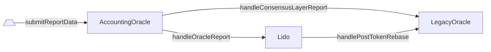

# LegacyOracle

- [Source code](https://github.com/lidofinance/lido-dao/blob/master/contracts/0.4.24/oracle/LegacyOracle.sol)
- [Deployed contract](https://etherscan.io/address/0x442af784A788A5bd6F42A01Ebe9F287a871243fb)

:::warning
LegacyOracle is used to be a previous oracle contract for Lido.
It's left currently for compatibility reasons only and might be deprecated completely in the future releases.
:::

## What is LegacyOracle?

`LegacyOracle` is an Aragon app previously known (before Lido V2 to be precise) as `LidoOracle`.

The original purpose of the `LidoOracle` contract was to accept the learnt changes of the Beacon Chain
(nowadays referred mostly as the Ethereum Consensus Layer) to account for the Lido-participating validators major state changes
(e.g., when a new validator appears or when the validator's balance changes).

With the latest Lido V2 protocol upgrade, the oracle workflow was redesigned to deliver more synchronized
historical data chunks for the same reference slot of the already finalized epoch (having both the Consensus and Execution Layer parts).

The `LidoOracle` contract functionality was superseded with [AccountingOracle](/contracts/accounting-oracle).

## What is left in LegacyOracle

The `AccountingOracle` lives at a different address, and the `LegacyOracle` contract is kept for the compatibility, supporting only a limited subset of view functions and events.

### How it is invoked (flow)

The `LegacyOracle` contract receives the data changes on each `AccountingOracle` report using two stages
(still within the same transaction)



### Rebase and APR

TODO

## Future plans

The `LegacyOracle` contract will be maintained till the end of 2023.
Then it will be eventually discontinued and unmaintained with a notice of a couple of months.

Any of the external integrations should rely on the `AccountingOracle` methods and events instead.

## View Methods

### getLido()

Returns the `Lido` contract address.

```sol
function getLido() returns (address)
```

:::note
Always returns the `Lido` address stated in the [deployed addresses](/deployed-contracts) list.
:::

### getAccountingOracle()

Returns the `AccountingOracle` contract address.

```sol
function getAccountingOracle() returns (address)
```

:::note
Always returns the `AccountingOracle` address stated in the [deployed addresses](/deployed-contracts) list.
:::

### getContractVersion()

Returns the current contract version.

```sol
function getContractVersion() returns (uint256)
```

:::note
Always returns `4`.
:::

### getVersion()

Returns the current contract version (compatibility method).

```sol
function getVersion() returns (uint256)
```

:::note
Always returns `4`, calls `getContractVersion()` internally.
:::

### getBeaconSpec()

Returns the `AccountingOracle` frame period together with Ethereum Beacon Chain specification constants.

```sol
function getBeaconSpec() returns (
    uint64 epochsPerFrame,
    uint64 slotsPerEpoch,
    uint64 secondsPerSlot,
    uint64 genesisTime
)
```

:::note
Always returns (225, 32, 12, 1606824023) for Mainnet and (225, 32, 12, 1616508000) for Görli.
:::

#### Returns

| Name             | Type     | Description                                                    |
| ---------------- | -------- | -------------------------------------------------------------- |
| `epochsPerFrame` | `uint64` | Beacon Chain epochs per single `AccountingOracle` report frame |
| `slotsPerEpoch`  | `uint64` | Beacon Chain slots per single Beacon Chain epoch               |
| `secondsPerSlot` | `uint64` | Seconds per single Beacon Chain slot                           |
| `genesisTime`    | `uint64` | Beacon Chain genesis timestamp                                 |

### getCurrentEpochId()

Returns the Beacon Chain epoch id calculated from the current timestamp using the [beacon chain spec](/contracts/legacy-oracle#getBeaconSpec).

```sol
function getCurrentEpochId() returns (uint256)
```

### getCurrentFrame()

Returns the first epoch of the current `AccountingOracle` reporting frame as well as its start and end times in seconds.

```sol
function getCurrentFrame() returns (
    uint256 frameEpochId,
    uint256 frameStartTime,
    uint256 frameEndTime
)
```

#### Returns

| Name              | Type       | Description                                                       |
| ----------------- | ---------- | ----------------------------------------------------------------- |
| `frameEpochId`    | `uint256`  | The first epoch of the current `AccountingOracle` reporting frame |
| `frameStartTime`  | `uint256`  | The start timestamp of the current reporting frame                |
| `frameEndTime`    | `uint256`  | The end timestamp of the current reporting frame                  |

### getLastCompletedEpochId()

Returns the starting epoch of the last frame in which the last `AccountingOracle` report was received and applied.

```sol
function getLastCompletedEpochId() returns (uint256)
```

### getLastCompletedReportDelta()

Returns the total supply change ocurred with the last completed `AccountingOracle` report.

```sol
function getLastCompletedReportDelta() returns (
    uint256 postTotalPooledEther,
    uint256 preTotalPooledEther,
    uint256 timeElapsed
)
```

#### Returns

| Name                      | Type       | Description                                                   |
| ------------------------- | ---------- | ------------------------------------------------------------- |
| `postTotalPooledEther`    | `uint256`  | Post-report `stETH`` total pooled ether (i.e., total supply)  |
| `preTotalPooledEther`     | `uint256`  | Pre-report `stETH` total pooled ether (i.e., total supply)    |
| `timeElapsed`             | `uint256`  | Time elapsed since the previously completed report, seconds   |

## Methods

### handlePostTokenRebase()

Handles a `stETH` token rebase incurred by the succeeded `AccountingOracle` report storing
the total ether and time elapsed stats.

Emits [`PostTotalShares`](/contracts/legacy-oracle#PostTotalShares)

```sol
function handlePostTokenRebase(
    uint256 reportTimestamp,
    uint256 timeElapsed,
    uint256 preTotalShares,
    uint256 preTotalEther,
    uint256 postTotalShares,
    uint256 postTotalEther,
    uint256 totalSharesMintedAsFees
)
```

:::note
The caller must be `Lido`.
:::

#### Parameters

| Name                      | Type       | Description                                                                           |
| ------------------------- | ---------- | ------------------------------------------------------------------------------------- |
| `reportTimestamp`         | `uint256`  | The reference timestamp corresponding to the moment of the oracle report calculation  |
| `timeElapsed`             | `uint256`  | Time elapsed since the previously completed report, seconds                           |
| `preTotalShares`          | `uint256`  | Pre-report `stETH` total shares                                                       |
| `preTotalEther`           | `uint256`  | Pre-report `stETH` total pooled ether (i.e., total supply)                            |
| `postTotalShares`         | `uint256`  | Post-report `stETH` total shares                                                      |
| `postTotalEther`          | `uint256`  | Post-report `stETH` total pooled ether (i.e., total supply)                           |
| `totalSharesMintedAsFees` | `uint256`  | Total shares amount minted as the protocol fees on top of the accrued rewards         |

### handleConsensusLayerReport()

Handles a new completed `AccountingOracle` report storing the corresponding Beacon Chain epoch id.

Emits [`Completed`](/contracts/legacy-oracle#Completed).

```sol
function handleConsensusLayerReport(
    uint256 _refSlot,
    uint256 _clBalance,
    uint256 _clValidators
)
```

:::note
The caller must be `AccountingOracle`.
:::

#### Parameters

| Name             | Type       | Description                                                                      |
| ---------------- | ---------- | -------------------------------------------------------------------------------- |
| `_refSlot`       | `uint256`  | The reference slot corresponding to the moment of the oracle report calculation  |
| `_clBalance`     | `uint256`  | Lido-participating validators balance on the Beacon Chain side                   |
| `_clValidators`  | `uint256`  | Number of the Lido-participating validators on the Beacon Chain side             |

## Events

### Completed()

Emits whenever the `AccountingOracle` report landed.

This event is still emitted after oracle committee reaches consensus on a report, but only for compatibility purposes.
The values in this event are not enough to calculate APR or TVL anymore due to withdrawals, Execution Layer rewards, and Consensus Layer rewards skimming.

```solidity
event Completed(
    uint256 epochId,
    uint128 beaconBalance,
    uint128 beaconValidators
);
```

:::note
Emits inside the [`handleConsensusLayerReport`](/contracts/legacy-oracle#handleConsensusLayerReport) methods.
:::

#### Parameters

| Name               | Type      | Description                                                                  |
| ------------------ | --------- | ---------------------------------------------------------------------------- |
| `epochId`          | `uint256` | Report reference epoch identifier                                            |
| `beaconBalance`    | `uint128` | The balance of the Lido-participating validators on the Consensus Layer side |
| `beaconValidators` | `uint128` | The number of the ever appeared Lido-participating validators                |

### PostTotalShares()

Emits whenever the `AccountingOracle` report landed.

This event is still emitted after each rebase but only for compatibility purposes. The values in this event are not enough to correctly calculate the rebase APR since a rebase can result from shares burning without changing total ETH held by the protocol.

```solidity
event PostTotalShares(
    uint256 postTotalPooledEther,
    uint256 preTotalPooledEther,
    uint256 timeElapsed,
    uint256 totalShares
)
```

:::note
The new [`TokenRebased`](/contracts/lido#TokenRebased) event emitted from the main Lido contract should be used instead because it provides the pre-report total shares amount as well which is essential to properly estimate a token rebase and its projected APR.
:::

#### Parameters

| Name                   | Type      | Description                                     |
| ---------------------- | --------- | ----------------------------------------------- |
| `postTotalPooledEther` | `uint256` | Post-report total pooled ether                  |
| `preTotalPooledEther`  | `uint256` | Pre-report total pooled ether                   |
| `timeElapsed`          | `uint256` | Time elapsed since the previous report, seconds |
| `totalShares`          | `uint256` | Post-report total shares                        |
