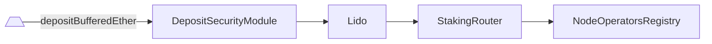
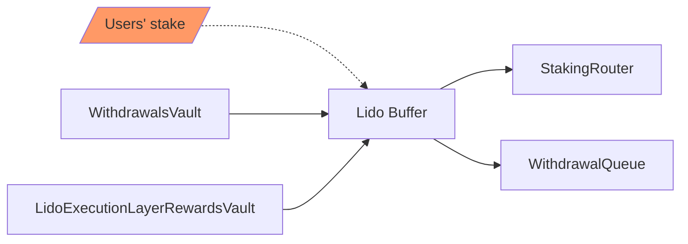

# Lido

- [Source code](https://github.com/lidofinance/lido-dao/blob/master/contracts/0.4.24/Lido.sol)
- [Deployed contract](https://etherscan.io/address/0xae7ab96520de3a18e5e111b5eaab095312d7fe84)

Liquid staking pool and a related [ERC-20](https://eips.ethereum.org/EIPS/eip-20)
rebasing token (`stETH`)

## What is Lido?

Lido is a liquid staking pool and the core contract that is responsible for:

- accepting users' stake, buffering it and minting respective amounts of liquid token
- do a proper accounting based on received oracle reports and the current state of the protocol
- collecting withdrawals, priority fees and MEV from respective vaults into the buffer
- applying fees and distributing rewards
- passing buffered ether further to [StakingRouter](/contracts/staking-router) or [WithdrawalQueueERC721](/contracts/withdrawal-queue-erc721)

Also, Lido is an [ERC-20](https://eips.ethereum.org/EIPS/eip-20) rebasing token,
which represents staked ether, `stETH`. Tokens are minted upon ether submission and
burned when redeemed. `stETH` holder balances are updated daily with oracle
reports.
It also implements the [ERC-2612](https://eips.ethereum.org/EIPS/eip-2612)
permit and [ERC-1271](https://eips.ethereum.org/EIPS/eip-1271) signature
validation extensions.

Other contracts are bound to the core and have the following responsibilities:

- [`LidoLocator`](./lido-locator.md): protocol-wide address book which contains
references to all meaningful parts of the Lido protocol on-chain
- [`WithdrawalQueueERC721`](./withdrawal-queue-erc721.md): a withdrawal requests
FIFO queue and a respective NFT (unstETH)
- [`StakingRouter`](./staking-router.md): hub, which manages staking modules and
distributes the stake among them
- [`NodeOperatorsRegistry`](./node-operators-registry.md): original module,
responsible for managing the curated set of node operators
- [`OracleReportSanityChecker`](./oracle-report-sanity-checker.md): helper for
validation of oracle report parameters and smoothening token rebases
- [`Burner`](./burner.md): vault to contain `stETH` that ought to be burned on
oracle report
- [`WithdrawalVault`](./withdrawal-vault.md): vault to collect partial and full
withdrawals coming from the Beacon Chain
- [`LidoExecutionLayerRewardsVault`](./lido-execution-layer-rewards-vault.md):
vault to collect priority fees and MEV rewards coming from validators of the pool
- [`DepositSecurityModule`](./deposit-security-module.md): protection from
deposit frontrunning vulnerability
- [`AccountingOracle`](./accounting-oracle.md): oracle committee, which gathers
an accounting report for the protocol
- [`EIP712StETH`](./eip712-steth.md): ad-hoc helper to implement ERC-2612 permit
for Solidity 0.4.24 Lido contract

## Submit

Lido contract is a main entry point for stakers. To take part in the pool, a
user can send some ETH to the contract address and the same amount of `stETH`
tokens will be minted to the sender address. Submitted ether is accumulated in
the buffer and can be passed further to
[`WithdrawalQueueERC721`](./withdrawal-queue-erc721.md) to fulfill withdrawal
requests or to [`StakingRouter`](./staking-router.md) to deposit as a new
validator stake.

To withdraw the underlying ETH back, a user may use the [`WithdrawalQueueERC721`](./withdrawal-queue-erc721.md) contract or swap the token on the secondary market (it may be a cheaper and faster alternative).

## Deposit

User-submitted ether is stored in the buffer and can be later used for
withdrawals or passed further to [`StakingRouter`](./staking-router.md) to be
used as validator's deposits. It happens asynchronously and uses
[`DepositSecurityModule`](./deposit-security-module.md) as a guard to prevent
deposit frontrunning vulnerability.



## Redeem

The token might be redeemed for ether through the protocol using
the [`WithdrawalQueueERC721`](./withdrawal-queue-erc721.md) contract leveraging [staking withdrawals](https://ethereum.org/en/staking/withdrawals/)
enabled with the Shanghai/Capella (aka "Shapella") Ethereum hardfork.

## Rebase

When an oracle report occurs, the supply of the token is increased or decreased
algorithmically, based on staking rewards (or slashing penalties) on the Beacon
Chain, execution layer rewards (starting from
[the Merge](https://ethereum.org/en/upgrades/merge/) Ethereum upgrade) or
fulfilled withdrawal requests (starting from
[Lido V2](https://blog.lido.fi/introducing-lido-v2/)). A rebase happens when
oracle reports beacon stats.

The rebasing mechanism is implemented via the "shares" concept. Instead of
storing a map with account balances, Lido stores which share of the total pool
is owned by the account. The balance of an account is calculated as follows:

```js
balanceOf(account) = shares[account] * totalPooledEther / totalShares
```

- `shares` - map of user account shares. Every time a user deposits ether, it is
 converted to shares and added to the current user shares amount.
- `totalShares` - the sum of shares of all accounts in the `shares` map
- `totalPooledEther` - a sum of three types of ether owned by protocol:

  - buffered balance - ether stored on contract and hasn't been deposited or
  locked for withdrawals yet
  - transient balance - ether submitted to the official Deposit contract but not
   yet visible in the beacon state
  - beacon balance - the total amount of ether on validator accounts. This value
  is reported by oracles and makes the strongest impact on stETH total supply
  change

For example, assume that we have:

```js
totalShares = 5
totalPooledEther = 10 ETH
sharesOf(Alice) -> 1
sharesOf(Bob) -> 4
```

Therefore:

```js
balanceOf(Alice) -> 2 tokens which corresponds to 2 ETH
balanceOf(Bob) -> 8 tokens which corresponds to 8 ETH
```

On each rebase `totalPooledEther` normally increases, indicating that there were
some rewards earned by validators, that ought to be distributed, so the user
balance gets increased as well automatically, despite their shares remaining as
they were.

```js
totalPooledEther = 15 ETH
// user balance increased
balanceOf(Alice) -> 3 tokens which corresponds to 3 ETH now
balanceOf(Bob) -> 12 tokens which corresponds to 12 ETH now
// shares remain still
sharesOf(Alice) -> 1
sharesOf(Bob) -> 4
```

:::note

Since the balances of all token holders change when the amount of total pooled
ether changes, this token cannot fully implement the ERC-20 standard: it only
emits `Transfer` events upon explicit transfer between holders. In contrast,
when the total amount of pooled ether increases, no `Transfer` events are
generated: doing so would require emitting an event for each token holder and
thus running an unbounded loop.

:::

## Oracle report

One of the cornerstones of the Lido protocol is the oracle report, that usually
(but not guaranteed) once a day provides the protocol with the data that can't
be easily accessed on-chain, but is required for precise accounting. It includes
some Beacon chain stats as well as corresponding EL-side values that are valid
on the reporting block and the decision data required to fulfill pending
withdrawal requests.

- Beacon chain stats:
  - the total number of validators managed by the pool
  - the total balance of validators managed by the pool
- Historical EL values:
  - withdrawal vault balance
  - execution layer rewards vault balance
  - burner stETH shares balance
- Withdrawal-related data
  - requests in the queue to be finalized
  - share rate to be used for finalization

Oracle report is processed in 9 simple steps:

1. Memorize the pre-state that will be required for incremental updates of the
protocol balance
2. Validate the report data using [`OracleReportSanityChecker`](./oracle-report-sanity-checker.md)
3. Calculate the amount of ether to be locked on [`WithdrawalQueueERC721`](./withdrawal-queue-erc721.md)
and move the respective amount of shares to be burnt to [`Burner`](./burner.md)
4. Using [`OracleReportSanityChecker`](./oracle-report-sanity-checker.md)
calculate the amounts of ether that can be withdrawn from
[`LidoExecutionLayerRewardsVault`](./lido-execution-layer-rewards-vault.md) and
[`WithdrawalVault`](./withdrawal-vault.md) as well as the number of shares that
can be burnt from [`Burner`](./burner.md) to avoid the rebase that can be easily
frontrun.
5. Collect the calculated amounts of ether from vaults and proceed with
withdrawal requests finalization: send requested ether to [`WithdrawalQueue`](./withdrawal-queue-erc721.md)
6. Burn the previously requested shares from [`Burner`](./burner.md) for
withdrawals or coverage application
7. Distribute rewards and protocol fees minting new stETH for the respective
parties
8. Complete token rebase by informing observers (emit an event and call the
external receivers if any)
9. Post-report sanity check for share rate provided with the report



So, the observable outcome of the report for the protocol is the following:

- withdrawal requests in the queue are fulfilled
- ether is collected from withdrawal and EL rewards vaults to the buffer
- CL balance is updated according to the report
- rewards are distributed among stakers, staking modules and protocol treasury

## Standards

Contract implements the following Ethereum standards:

- [ERC-20: Token Standard](https://eips.ethereum.org/EIPS/eip-20)
- [ERC-2612: Permit Extension for ERC-20 Signed Approvals](https://eips.ethereum.org/EIPS/eip-2612)
- [EIP-712: Typed structured data hashing and signing](https://eips.ethereum.org/EIPS/eip-712)
- [ERC-1271: Standard Signature Validation Method for Contracts](https://eips.ethereum.org/EIPS/eip-1271)

## Staking-related Methods

### fallback

Sends funds to the pool and mints `StETH` tokens to the `msg.sender` address

```sol
function() payable
```

:::note
Allows users to submit their funds by sending it to the contract address
:::

### submit()

Sends funds to the pool with the optional `_referral` parameter and mints `StETH`
tokens to the `msg.sender` address.

See [https://lido.fi/referral](https://lido.fi/referral) for referral program details.

```sol
function submit(address _referral) payable returns (uint256)
```

| Parameter   | Type      | Description               |
| ----------- | --------- | ------------------------- |
| `_referral` | `address` | Optional referral address |

Returns the number of `StETH` shares generated.

### getBufferedEther()

Returns the amount of ether temporarily buffered on the contract's balance.

```sol
function getBufferedEther() view returns (uint256)
```

:::note
The buffered balance is kept on the contract from the moment the funds are received from a user until the moment
they are sent to the official [Deposit contract](https://ethereum.org/en/staking/deposit-contract/)
or [`WithdrawalsQueueERC721`](/contracts/withdrawal-queue-erc721)
:::

### isStakingPaused()

Returns staking state: whether it's paused or not.

```sol
function isStakingPaused() view returns (bool)
```

:::note
'staking' here means the ability to accept new [submit](/contracts/lido#submit) requests
:::

### getCurrentStakeLimit()

Returns how much ether can be staked in the current block.

```sol
function getCurrentStakeLimit() view returns (uint256)
```

:::note
Special return values:

- `2^256 - 1` if staking is unlimited;
- `0` if staking is paused or if the limit is exhausted.

:::

### getStakeLimitFullInfo()

Returns full info about current stake limit parameters and state.

```sol
function getStakeLimitFullInfo() view returns (
    bool isStakingPaused,
    bool isStakingLimitSet,
    uint256 currentStakeLimit,
    uint256 maxStakeLimit,
    uint256 maxStakeLimitGrowthBlocks,
    uint256 prevStakeLimit,
    uint256 prevStakeBlockNumber
)
```

| Name                        | Type      | Description                                                             |
| --------------------------- | --------- | ----------------------------------------------------------------------- |
| `isStakingPaused`           | `bool`    | Staking pause state (equivalent to return of `isStakingPaused()`)       |
| `isStakingLimitSet`         | `bool`    | Whether the stake limit is set or not                                   |
| `currentStakeLimit`         | `uint256` | Current stake limit (equivalent to return of `getCurrentStakeLimit()`)  |
| `maxStakeLimit`             | `uint256` | Max stake limit                                                         |
| `maxStakeLimitGrowthBlocks` | `uint256` | Blocks needed to restore max stake limit from the fully exhausted state |
| `prevStakeLimit`            | `uint256` | Previously reached stake limit                                          |
| `prevStakeBlockNumber`      | `uint256` | Previously seen block number

## Deposit-related methods

### deposit()

Deposit buffered ether to the StakingRouter's module with the id of `_stakingModuleId`.

Can be called only by [DepositSecurityModule](./deposit-security-module.md) contract.

```sol
function deposit(uint256 _maxDeposits, uint256 _stakingModuleId, bytes _depositCalldata)
```

| Parameter         | Type      | Description                              |
| ----------------- | --------- | ---------------------------------------- |
| `_maxDeposits`    | `uint256` | Number of max deposit calls              |
| `_stakingModuleId`| `uint256` | Id of the staking module to be deposited |
| `_depositCalldata`| `bytes`   | module calldata

### getDepositableEther()

Returns the amount of ether available to deposit.

```sol
function getDepositableEther() view returns (uint256)
```

### canDeposit()

Returns `true` if depositing buffered ether to the consensus layer is allowed.

```sol
function canDeposit() view returns (bool)
```

## Accounting-related methods

### handleOracleReport()

Updates accounting stats, collects EL rewards and distributes collected rewards
if beacon balance increased, performs withdrawal requests finalization.

Can be called only by [AccountingOracle](./accounting-oracle.md) contract.

```sol
function handleOracleReport(
    uint256 _reportTimestamp,
    uint256 _timeElapsed,
    uint256 _clValidators,
    uint256 _clBalance,
    uint256 _withdrawalVaultBalance,
    uint256 _elRewardsVaultBalance,
    uint256 _sharesRequestedToBurn,
    uint256[] _withdrawalFinalizationBatches,
    uint256 _simulatedShareRate
) returns (uint256[4] postRebaseAmounts)
```

| Parameter                        | Type       | Description                                                       |
| -------------------------------- | ---------- | ----------------------------------------------------------------- |
| `_reportTimestamp`               | `uint256`  | The moment of the oracle report calculation                       |
| `_timeElapsed`                   | `uint256`  | Seconds elapsed since the previous report calculation             |
| `_clValidators`                  | `uint256`  | Number of Lido validators on Consensus Layer                      |
| `_clBalance`                     | `uint256`  | Sum of all Lido validators' balances on Consensus Layer           |
| `_withdrawalVaultBalance`        | `uint256`  | Withdrawal vault balance on Execution Layer                       |
| `_elRewardsVaultBalance`         | `uint256`  | elRewards vault balance on Execution Layer                        |
| `_sharesRequestedToBurn`         | `uint256`  | shares requested to burn through Burner                           |
| `_withdrawalFinalizationBatches` | `uint256[]`| the ascendingly-sorted array of withdrawal request IDs to finalize|
| `_simulatedShareRate`            | `uint256`  | share rate simulated by oracle when (1e27 precision)              |

Returns a fixed array of 4 values that represents changes made during the report

| Name                  | Type      | Description                                                 |
| --------------------- | --------- | ----------------------------------------------------------- |
| `postRebaseAmounts[0]`| `uint256` | `postTotalPooledEther` amount of ether in the protocol      |
| `postRebaseAmounts[1]`| `uint256` | `postTotalShares` amount of shares in the protocol          |
| `postRebaseAmounts[2]`| `uint256` | `withdrawals` withdrawn from the withdrawals vault          |
| `postRebaseAmounts[3]`| `uint256` | `elRewards` withdrawn from the execution layer rewards vault|

### getTotalPooledEther()

Returns the entire amount of ether controlled by the protocol

```sol
function getTotalPooledEther() view returns (uint256)
```

:::note
The sum of all ETH balances in the protocol, equals to the total supply of `stETH`.
:::

### getTotalELRewardsCollected()

Returns the total amount of execution layer rewards collected to Lido contract buffer.

```sol
function getTotalELRewardsCollected() view returns (uint256)
```

### getBeaconStat()

Returns the tuple of key statistics related to the Beacon Chain.

```sol
function getBeaconStat() view returns (
    uint256 depositedValidators,
    uint256 beaconValidators,
    uint256 beaconBalance
)
```

| Name                  | Type      | Description                                                                    |
| --------------------- | --------- | ------------------------------------------------------------------------------ |
| `depositedValidators` | `uint256` | Number of the ever deposited Lido-participating validators                     |
| `beaconValidators`    | `uint256` | Number of Lido's validators visible in the Beacon state, reported by oracles   |
| `beaconBalance`       | `uint256` | Total amount of Beacon-side ether (sum of all the balances of Lido validators) |

:::note
`depositedValidators` is always greater or equal to `beaconValidators`
:::
                                           |

### receiveELRewards()

A payable function for execution layer rewards.
Can be called only by the [`LidoExecutionLayerRewardsVault`](./lido-execution-layer-rewards-vault.md) contract.

```sol
function receiveELRewards() payable
```

### receiveWithdrawals()

A payable function for withdrawals acquisition. Can be called only by [`WithdrawalVault`](./withdrawal-vault.md).

```sol
function receiveWithdrawals() payable
```

## Protocol levers

### stop()

Stop pool routine operations.

Can be called only by the bearer of `PAUSE_ROLE`

```sol
function stop()
```

### resume()

Resume pool routine operations.

Can be called only by the bearer of `RESUME_ROLE`

```sol
function resume()
```

### pauseStaking()

Stops accepting new ether to the protocol.

Can be called only by the bearer of `STAKING_PAUSE_ROLE`

```sol
function pauseStaking()
```

:::note
While accepting new ether is stopped, calls to the `submit` function,
as well as to the default payable function, will revert.
:::

### resumeStaking()

Resumes accepting new ether to the protocol (if `pauseStaking` was called previously).

Can be called only by the bearer of `STAKING_CONTROL_ROLE`

```sol
function resumeStaking()
```

:::note
Staking could be rate-limited by imposing a limit on the stake amount at each moment in time,
see [`setStakingLimit()`](/contracts/lido#setstakinglimit) and [`removeStakingLimit()`](/contracts/lido#removestakinglimit).
:::

### setStakingLimit()

Sets the staking rate limit.

Can be called only by the bearer of `STAKING_CONTROL_ROLE`

Limit explanation scheme:

```txt
    * ▲ Stake limit
    * │.....  .....   ........ ...            ....     ... Stake limit = max
    * │      .       .        .   .   .      .    . . .
    * │     .       .              . .  . . .      . .
    * │            .                .  . . .
    * │──────────────────────────────────────────────────> Time
    * │     ^      ^          ^   ^^^  ^ ^ ^     ^^^ ^     Stake events
```

```sol
function setStakingLimit(uint256 _maxStakeLimit, uint256 _stakeLimitIncreasePerBlock)
```

| Parameter                     | Type      | Description                           |
| ----------------------------- | --------- | ------------------------------------- |
| `_maxStakeLimit`              | `uint256` | Max stake limit value                 |
| `_stakeLimitIncreasePerBlock` | `uint256` | Stake limit increase per single block |

:::note
Reverts if:

- `_maxStakeLimit` == 0
- `_maxStakeLimit` >= 2^96
- `_maxStakeLimit` < `_stakeLimitIncreasePerBlock`
- `_maxStakeLimit` / `_stakeLimitIncreasePerBlock` >= 2^32 (only if `_stakeLimitIncreasePerBlock` != 0)

:::

### removeStakingLimit()

Removes the staking rate limit.

Can be called only by the bearer of `STAKING_CONTROL_ROLE`

```sol
function removeStakingLimit()
```

### unsafeChangeDepositedValidators()

Unsafely change deposited validators counter.

The method unsafely changes the deposited validator counter.
Can be required when onboarding external validators to Lido (i.e., had deposited before and rotated their type-0x00 withdrawal credentials to Lido).

Can be called only by the bearer of `UNSAFE_CHANGE_DEPOSITED_VALIDATORS_ROLE`

| Parameter                 | Type      | Description                                   |
| ------------------------- | --------- | ----------------------------------------------|
| `_newDepositedValidators` | `uint256` | New value for the deposited validators counter|

:::warning
The method might break the internal protocol state if applied incorrectly
:::

## `ERC-20`-related Methods

### name()

Returns the name of the token.

```sol
function name() view returns (string)
```

:::note
Always returns `Liquid staked Ether 2.0`.
:::

### symbol()

Returns the symbol of the token.

```sol
function symbol() view returns (string)
```

:::note
Always returns `stETH`.
:::

### decimals()

Returns the number of decimals for getting user representation of a token amount.

```sol
function decimals() view returns (uint8)
```

:::note
Always returns `18`.
:::

### totalSupply()

Returns the number of tokens in existence.

```sol
function totalSupply() view returns (uint256)
```

:::note
Always equals to `getTotalPooledEther()` since the token amount
is pegged to the total amount of ether controlled by the protocol.
:::

### balanceOf()

Returns the number of tokens owned by the `_account`

```sol
function balanceOf(address _account) view returns (uint256)
```

:::note
Balances are dynamic and equal the `_account`'s share in the amount of
total ether controlled by the protocol. See [`sharesOf`](/contracts/lido#sharesof).
:::

### allowance()

Returns the remaining number of tokens that `_spender` is allowed to spend
on behalf of `_owner` through `transferFrom()`. This is zero by default.

```sol
function allowance(address _owner, address _spender) view returns (uint256)
```

| Parameter  | Type      | Description        |
| ---------- | --------- | ------------------ |
| `_owner`   | `address` | Address of owner   |
| `_spender` | `address` | Address of spender |

:::note
This value changes when `approve()` or `transferFrom()` is called unless the allowance is infinite (2^256)
:::

### approve()

Sets `_amount` as the allowance of `_spender` over the caller's tokens

```sol
function approve(address _spender, uint256 _amount) returns (bool)
```

| Parameter  | Type      | Description        |
| ---------- | --------- | ------------------ |
| `_spender` | `address` | Address of spender |
| `_amount`  | `uint256` | Amount of tokens   |

Returns a boolean value indicating whether the operation succeeded.

:::note
Requirements:

- `_spender` cannot be the zero address.
- the contract must not be paused.

:::

### increaseAllowance()

Atomically increases the allowance granted to `_spender` by the caller by `_addedValue`.

This is an alternative to `approve()` that can be used as a mitigation for problems described [here](https://github.com/OpenZeppelin/openzeppelin-contracts/blob/master/contracts/token/ERC20/IERC20.sol#L42).

```sol
function increaseAllowance(address _spender, uint256 _addedValue) returns (bool)
```

| Parameter     | Type      | Description                            |
| ------------- | --------- | -------------------------------------- |
| `_sender`     | `address` | Address of spender                     |
| `_addedValue` | `uint256` | Amount of tokens to increase allowance |

Returns a boolean value indicating whether the operation succeeded

:::note
Requirements:

- `_spender` address cannot be zero.
- the contract must not be paused.

:::

### decreaseAllowance()

Atomically decreases the allowance granted to `_spender` by the caller by `_subtractedValue`.

This is an alternative to `approve()` that can be used as a mitigation for
problems described [here](https://github.com/OpenZeppelin/openzeppelin-contracts/blob/master/contracts/token/ERC20/IERC20.sol#L42).

```sol
function decreaseAllowance(address _spender, uint256 _subtractedValue) returns (bool)
```

| Parameter          | Type      | Description                            |
| ------------------ | --------- | -------------------------------------- |
| `_sender`          | `address` | Address of spender                     |
| `_subtractedValue` | `uint256` | Amount of tokens to decrease allowance |

Returns a boolean value indicating whether the operation succeeded.

:::note
Requirements:

- `_spender` cannot be the zero address.
- `_spender` must have an allowance for the caller of at least `_subtractedValue`.
- the contract must not be paused.

:::

### transfer()

Moves `_amount` tokens from the caller's account to the `_recipient` account.

```sol
function transfer(address _recipient, uint256 _amount) returns (bool)
```

| Parameter    | Type      | Description                  |
| ------------ | --------- | ---------------------------- |
| `_recipient` | `address` | Address of tokens recipient  |
| `_amount`    | `uint256` | Amount of tokens to transfer |

Returns a boolean value indicating whether the operation succeeded.

:::note
Requirements:

- `_recipient` cannot be the zero address or stETH contract itself.
- the caller must have a balance of at least `_amount`.
- the contract must not be paused.

:::

### transferFrom()

Moves `_amount` tokens from `_sender` to `_recipient` using the
allowance mechanism. `_amount` is then deducted from the caller's
allowance.

```sol
function transferFrom(
    address _sender,
    address _recipient,
    uint256 _amount
) returns (bool)
```

| Parameter    | Type      | Description          |
| ------------ | --------- | -------------------- |
| `_sender`    | `address` | Address of spender   |
| `_recipient` | `address` | Address of recipient |
| `_amount`    | `uint256` | Amount of tokens     |

Returns a boolean value indicating whether the operation succeeded.

:::note
Requirements:

- `_sender` cannot be the zero addresses.
- `_recipient` cannot be the zero address or stETH contract itself.
- `_sender` must have a balance of at least `_amount`.
- the caller must have an allowance for `_sender`'s tokens of at least `_amount`.
- the contract must not be paused.

:::

## Shares-related Methods

### getTotalShares()

Returns the total amount of shares in existence.

```sol
function getTotalShares() view returns (uint256)
```

### sharesOf()

Returns the number of shares owned by `_account`

```sol
function sharesOf(address _account) view returns (uint256)
```

### getSharesByPooledEth()

Returns the number of shares that corresponds to `_ethAmount` of the protocol-controlled ether.

```sol
function getSharesByPooledEth(uint256 _ethAmount) view returns (uint256)
```

### getPooledEthByShares()

Returns the amount of ether that corresponds to `_sharesAmount` token shares.

```sol
function getPooledEthByShares(uint256 _sharesAmount) view returns (uint256)
```

### transferShares()

Moves token shares from the caller's account to the provided recipient account.

```sol
function transferShares(address _recipient, uint256 _sharesAmount) returns (uint256)
```

| Parameter       | Type      | Description                  |
| --------------- | --------- | ---------------------------- |
| `_recipient`    | `address` | Address of shares recipient  |
| `_sharesAmount` | `uint256` | Amount of shares to transfer |

Returns the number Amount of transferred tokens.

:::note
Requirements:

- `_recipient` cannot be the zero address or stETH contract itself.
- the caller must have at least `_sharesAmount` shares.
- the contract must not be paused.

:::

### transferSharesFrom()

Moves `_sharesAmount` token shares from the `_sender` account to the `_recipient` using the allowance mechanism. The amount of tokens equivalent to `_sharesAmount` is then deducted from the caller's allowance.

```sol
function transferSharesFrom(
    address _sender,
    address _recipient,
    uint256 _sharesAmount
) returns (uint256)
```

| Parameter      | Type      | Description          |
| -------------- | --------- | -------------------- |
| `_sender`      | `address` | Address of spender   |
| `_recipient`   | `address` | Address of recipient |
| `_sharesAmount`| `uint256` | Amount of shares     |

Returns the number of transferred tokens.

:::note
Requirements:

- `_sender` cannot be the zero address.
- `_recipient` cannot be the zero address or stETH contract itself.
- `_sender` must have at least `_sharesAmount` shares.
- the caller must have an allowance for `_sender`'s tokens of at least `getPooledEthByShares(_sharesAmount)`.
- the contract must not be paused.

:::

## `ERC-2612`-related methods

### nonces()

Returns the current nonce for the `owner`. This value must be included whenever a signature is generated for an ERC-2612 permit.

```sol
function nonces(address owner) view returns (uint256)
```

### DOMAIN_SEPARATOR()

Returns the domain separator used in the encoding of the signature for the ERC-2612 permit, as defined by EIP-712.

```sol
function DOMAIN_SEPARATOR() view returns (bytes32)
```

### permit()

Sets `value` as the allowance of `spender` over `owner`'s tokens, given `owner`'s signed approval.

Emits an Approval event.

```sol
function permit(address owner, address spender, uint256 value, uint256 deadline, uint8 v, bytes32 r, bytes32 s)
```

| Parameter  | Type      | Description                    |
| ---------- | --------- | -------------------------------|
| `owner`    | `address` | Address of spender             |
| `spender`  | `address` | Address of recipient           |
| `value`    | `uint256` | Allowance to set               |
| `deadline` | `uint256` | Permit expiry time             |
| `v`        | `uint8`   | extended `secp256k1` signature |
| `r`        | `bytes32` | extended `secp256k1` signature |
| `s`        | `bytes32` | extended `secp256k1` signature |

:::note
Requirements:

- `spender` cannot be the zero address.
- `deadline` must be a timestamp in the future.
- `v`, `r` and `s` must be a valid `secp256k1` signature from `owner`
over the EIP712-formatted function arguments.
- the signature must use `owner`'s current nonce (see `nonces`).

:::

## `ERC-712`-related methods

### eip712Domain()

Returns the fields and values that describe the domain separator used by this contract for EIP-712

```sol
function eip712Domain() view returns (
    string name,
    string version,
    uint256 chainId,
    address verifyingContract
)
```

## General Methods

### getLidoLocator()

Returns the address of [LidoLocator](./lido-locator.md).

```sol
function getLidoLocator() view returns (address)
```

### getContractVersion()

Returns the current contract version.

```sol
function getContractVersion() view returns (uint256)
```

:::note
Always returns `2`.
:::

### transferToVault()

Overrides default AragonApp behavior to disallow recovery.

```sol
function transferToVault(address _token)
```

| Parameter| Type      | Description                        |
| -------- | --------- | ---------------------------------- |
| `_token` | `address` | Token to be sent to recovery vault |

:::note
Always reverts with `NOT_SUPPORTED` reason
:::
