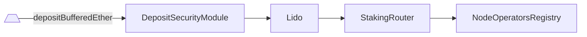
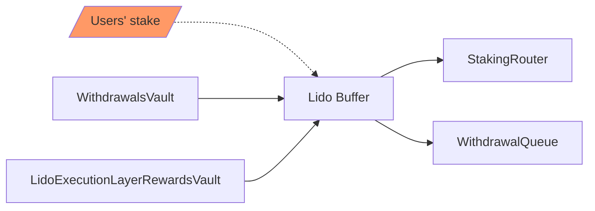

# Lido

- [Source code](https://github.com/lidofinance/lido-dao/blob/master/contracts/0.4.24/Lido.sol)
- [Deployed contract](https://etherscan.io/address/0xae7ab96520de3a18e5e111b5eaab095312d7fe84)

Liquid staking pool and a related ERC-20 rebasing token (stETH)

## What is Lido?

Lido is a liquid staking pool and the core contract that is responsible for:

- accepting users' stake, buffering it and minting respective amount of liquid token
- do a proper accounting based on received oracle reports and the current state of the protocol
- collecting withdrawals, priority fees and MEV from respective vaults into the buffer
- applying fees and distributing rewards
- passing buffered ether further to StakingRouter or WithdrawalQueue

Also, Lido is an ERC-20 rebasing token which represents staked ether, `stETH`. Tokens are minted upon deposit and burned when redeemed. stETH holder balances are updated daily with oracle reports. It also implements ERC-2612 permit and ERC-1271 signature validation extensions.

Other contracts are bound to the core and have the following responsibilities:

- [`WithdrawalQueue`](./withdrawal-queue-erc721.md): withdrawal requests FIFO queue and respective NFT
- [`StakingRouter`](./staking-router.md): hub that manages staking modules and distributes the stake among them
- [`NodeOperatorsRegistry`](./node-operators-registry.md): original module responsible for managing the curated set of node operators
- [`OracleReportSanityChecker`](./oracle-report-sanity-checker.md): helper for validation of oracle report parameters and smoothening token rebases
- [`Burner`](./burner.md): vault to contain stETH that ought to be burned on oracle report
- [`WithdrawalVault`](./withdrawal-vault.md): vault to collect partial and full withdrawals coming from Beacon chain
- [`LidoExecutionLayerRewardsVault`](./lido-execution-layer-rewards-vault.md): vault to collect priority fees and MEV rewards coming from validators of the pool
- [`DepositSecurityModule`](./deposit-security-module.md): protection from deposit frontrunning vulnerability
- [`AccountingOracle`](./accounting-oracle.md): oracle committee, that gathers an accounting report for the protocol
- [`LidoLocator`](./lido-locator.md): protocol-wide address book which contains references to all meaningful parts of the Lido protocol on-chain
- [`EIP712StETH`](./eip712-steth.md): ad-hoc helper to implement ERC-2612 permit for Solidity 0.4.24 Lido contract

## Submit

Lido contract is a main entry point for stakers. To take part in the pool, a user can send some ETH to contract address and the same amount of stETH tokens will be minted to the sender address. Submitted ether are accumulated in the buffer and can be passed further to [`WithdrawalQueue`](./withdrawal-queue-erc721.md) to fulfill withdrawal requests or to [`StakingRouter`](./staking-router.md) to deposit as a new validator stake.

To withdraw the underlying ETH back, user may use [`WithdrawalQueue`](./withdrawal-queue-erc721.md) contract or swap the token on the secondary market (it may be a cheaper and faster alternative).

## Deposit

User submitted ether is stored in the buffer and can be later used for withdrawals or passed further to [`StakingRouter`](./staking-router.md) to be used as validator's deposits. It happens asyncronously and uses [`DepositSecurityModule`](./deposit-security-module.md) as a guard to prevent deposit frontrunning vulnerability.



## Rebasing

When an oracle report occurs, the supply of the token is increased or decreased algorithmically, based on staking rewards (or slashing penalties) on the Beacon chain, execution layer rewards (starting from [the Merge](https://ethereum.org/en/upgrades/merge/) Ethereum upgrade) or fulfilled withdrawal requests (starting from [Lido V2](https://blog.lido.fi/introducing-lido-v2/)). A rebase happens when oracle reports beacon stats.

The rebasing mechanism is implemented via "shares" concept. Instead of storing map with account balances, Lido stores which share of the total pool is owned by account. The balance of an account is calculated as follows:

```js
balanceOf(account) = shares[account] * totalPooledEther / totalShares
```

- `shares` - map of user account shares. Every time a user deposits ether, it is converted to shares and added to current user shares amount.

- `totalShares` - sum of shares of all account in `shares` map

- `totalPooledEther` - a sum of three types of ether owned by protocol:

  - buffered balance - ether stored on contract and haven't deposited or locked for withdrawals yet
  - transient balance - ether submitted to the official Deposit contract but not yet visible in the beacon state
  - beacon balance - total amount of ether on validator accounts. This value reported by oracles and makes strongest impact to stETH total supply change

For example, assume that we have:

```js
totalShares = 5
totalPooledEther = 10 ETH
sharesOf(Alice) -> 1
sharesOf(Bob) -> 4
```

Therefore:

```js
balanceOf(Alice) -> 2 tokens which corresponds to 2 ETH
balanceOf(Bob) -> 8 tokens which corresponds to 8 ETH
```

On each rebase `totalPooledEther` normally increases, indicating that there were some rewards earned by validators, that ought to be distributed, so user balance gets increased as well automatically, in spite their shares remaining as they were.

```js
totalPooledEther = 15 ETH
// user balance increased
balanceOf(Alice) -> 3 tokens which corresponds to 3 ETH now
balanceOf(Bob) -> 12 tokens which corresponds to 12 ETH now
// shares remain still
sharesOf(Alice) -> 1
sharesOf(Bob) -> 4
```

:::note
Since the balances of all token holders change when the amount of total pooled Ether changes, this token cannot fully implement ERC-20 standard: it only emits `Transfer` events upon explicit transfer between holders. In contrast, when the total amount of pooled ether increases, no `Transfer` events are generated: doing so would require emitting an event for each token holder and thus running an unbounded loop.
:::

## Oracle report

One of the cornerstones of the Lido protocol is the oracle report, that usually (but not guaranteed) once a day provides the protocol with the data that can't be easily accessed on-chain, but required for precise accounting. It includes some Beacon chain stats as well as corresponding EL-side values that are valid on the reporting block and the decision data required to fulfill pending withdrawal requests.

- Beacon chain stats:
  - the total number of validators managed by the pool
  - the total balance of validators managed by the pool
- Historical EL values:
  - withdrawal vault balance
  - execution layer rewards vault balance
  - burner stETH shares balance
- Withdrawal-related data
  - requests in the queue to be finalized
  - share rate to be used for finalization

Oracle report is processed in 9 simple steps:

1. Memorize the pre-state that will be required for incremental updates of the protocol balance
2. Validate the report data using [`OracleReportSanityChecker`](./oracle-report-sanity-checker.md)
3. Calculate the amount of ether to be locked on [`WithdrawalQueue`](./withdrawal-queue-erc721.md) and move the respective amount of shares to be burnt to [`Burner`](./burner.md)
4. Using [`OracleReportSanityChecker`](./oracle-report-sanity-checker.md) calculate the amounts of ether that can be withdrawn from [`LidoExecutionLayerRewardsVault`](./lido-execution-layer-rewards-vault.md) and [`WithdrawalVault`](./withdrawal-vault.md) as well as the amount of shares that can be burnt from [`Burner`](./burner.md) to avoid the rebase that can be easily frontrun.
5. Collect the calculated amounts of ether from vaults and proceed with withdrawal requests finalization: send requested ether to [`WithdrawalQueue`](./withdrawal-queue-erc721.md)
6. Burn the previously requested shares from [`Burner`](./burner.md) for withdrawals or coverage application
7. Distribute rewards and protocol fee minting new stETH for the respective parties
8. Complete token rebase by informing observers (emit an event and call the external receivers if any)
9. Post-report sanity check for share rate provided with report



So, the observable outcome of the report for the protocol is the following:

- withdrawal requests in the queue are fulfilled
- ether is collected from withdrawal and EL rewards vaults to the buffer
- CL balance is updated according to the report
- rewards are distributed among stakers, staking modules and protocol treasury

## View Methods

### name()

Returns the name of the token. Lido contract always returns `Liquid staked Ether 2.0`

```sol
function name() returns (string)
```

### symbol()

Returns the symbol of the token. Always returns `stETH` for Lido

```sol
function symbol() returns (string)
```

### decimals()

Returns the number of decimals for getting user representation of a token amount. Returns `18` for Lido

```sol
function decimals() returns (uint8)
```

### totalSupply()

Returns the amount of tokens in existence.

```sol
function totalSupply() returns (uint256)
```

:::note
Always equals to `getTotalPooledEther()` since token amount
is pegged to the total amount of ether controlled by the protocol.
:::

### getTotalPooledEther()

Returns the entire amount of ether controlled by the protocol

```sol
function getTotalPooledEther() returns (uint256)
```

:::note
The sum of all ETH balances in the protocol, equals to the total supply of stETH.
:::

### balanceOf()

Returns the amount of tokens owned by the `_account`

```sol
function balanceOf(address _account) returns (uint256)
```

:::note
Balances are dynamic and equal the `_account`'s share in the amount of the
total Ether controlled by the protocol. See `sharesOf`.
:::

### getTotalShares()

Returns the total amount of shares in existence.

```sol
function getTotalShares() returns (uint256)
```

### sharesOf()

Returns the amount of shares owned by `_account`

```sol
function sharesOf(address _account) returns (uint256)
```

### getSharesByPooledEth()

Returns the amount of shares that corresponds to `_ethAmount` of protocol-controlled ether

```sol
function getSharesByPooledEth(uint256 _ethAmount) returns (uint256)
```

### getPooledEthByShares()

Returns the amount of ether that corresponds to `_sharesAmount` token shares

```sol
function getPooledEthByShares(uint256 _sharesAmount) returns (uint256)
```

### getBufferedEther()

Get the amount of ether temporary buffered on this contract balance

:::note
Buffered balance is kept on the contract from the moment the funds are received from user
until the moment they are actually sent to the official Deposit contract or to WithdrawalsQueue
:::

```sol
function getBufferedEther()  returns (uint256)
```

#### Returns:

Amount of buffered funds in wei

### getBeaconStat()

Returns the key values related to Beacon chain

```sol
function getBeaconStat() returns (
  uint256 depositedValidators,
  uint256 beaconValidators,
  uint256 beaconBalance
)
```

#### Returns:

| Name                  | Type      | Description                                                                    |
| --------------------- | --------- | ------------------------------------------------------------------------------ |
| `depositedValidators` | `uint256` | Number of deposited validators                                                 |
| `beaconValidators`    | `uint256` | Number of Lido's validators visible in the Beacon state, reported by oracles   |
| `beaconBalance`       | `uint256` | Total amount of Beacon-side ether (sum of all the balances of Lido validators) |

### isStakingPaused()

Returns staking state: whether it's paused or not

```sol
function isStakingPaused() external view returns (bool)
```

#### Returns:

| Name              | Type   | Description         |
| ----------------- | ------ | ------------------- |
| `isStakingPaused` | `bool` | Staking pause state |

### getCurrentStakeLimit()

Returns how much ether can be staked in the current block

```sol
function getCurrentStakeLimit() public view returns (uint256)
```

#### Returns:

| Name         | Type      | Description                                                     |
| ------------ | --------- | --------------------------------------------------------------- |
| `stakeLimit` | `uint256` | Currently availble limit for stake request in the current block |

:::note
Special return values:

- `2^256 - 1` if staking is unlimited;
- `0` if staking is paused or if limit is exhausted.
:::

### getStakeLimitFullInfo()

Returns full info about current stake limit params and state

```sol
function getStakeLimitFullInfo() external view returns (
    bool isStakingPaused,
    bool isStakingLimitSet,
    uint256 currentStakeLimit,
    uint256 maxStakeLimit,
    uint256 maxStakeLimitGrowthBlocks,
    uint256 prevStakeLimit,
    uint256 prevStakeBlockNumber
)
```

#### Returns:

| Name                        | Type      | Description                                                             |
| --------------------------- | --------- | ----------------------------------------------------------------------- |
| `isStakingPaused`           | `bool`    | Staking pause state (equivalent to return of `isStakingPaused()`)       |
| `isStakingLimitSet`         | `bool`    | Whether the stake limit is set or not                                   |
| `currentStakeLimit`         | `uint256` | Current stake limit (equivalent to return of `getCurrentStakeLimit()`)  |
| `maxStakeLimit`             | `uint256` | Max stake limit                                                         |
| `maxStakeLimitGrowthBlocks` | `uint256` | Blocks needed to restore max stake limit from the fully exhausted state |
| `prevStakeLimit`            | `uint256` | Previously reached stake limit                                          |
| `prevStakeBlockNumber`      | `uint256` | Previously seen block number                                            |

### getTotalELRewardsCollected()

Get total amount of execution layer rewards collected to Lido contract

:::note
Ether got through [`LidoExecutionLayerRewardsVault`](lido-execution-layer-rewards-vault) is kept on this contract's balance the same way
as other buffered ether is kept (until it gets deposited).

:::

```sol
function getTotalELRewardsCollected() external view returns (uint256)
```

#### Returns:

| Name                      | Type      | Description                                                   |
| ------------------------- | --------- | ------------------------------------------------------------- |
| `totalELRewardsCollected` | `uint256` | Amount of funds received as execution layer rewards (in wei)  |

### getELRewardsVault()

Returns address of the contract set as [`LidoExecutionLayerRewardsVault`](lido-execution-layer-rewards-vault).

```sol
function getELRewardsVault() public view returns (address)
```

#### Returns:

| Name             | Type      | Description     |
| ---------------- | --------- | --------------- |
| `elRewardsVault` | `address` | Vault's address |

## Methods

### transfer()

Moves `_amount` tokens from the caller's account to the `_recipient` account.

```sol
function transfer(address _recipient, uint256 _amount) returns (bool)
```

:::note
Requirements:

- `_recipient` cannot be the zero address.
- the caller must have a balance of at least `_amount`.
- the contract must not be paused.

:::

#### Parameters:

| Name         | Type      | Description                  |
| ------------ | --------- | ---------------------------- |
| `_recipient` | `address` | Address of tokens recipient  |
| `_amount`    | `uint256` | Amount of tokens to transfer |

#### Returns:

A boolean value indicating whether the operation succeeded.

### transferShares()

Moves  token shares from the caller's account to the provided recipient account.

```sol
function transferShares(address _recipient, uint256 _sharesAmount) public returns (uint256)
```

:::note
Requirements:

- `_recipient` cannot be the zero address.
- the caller must have at least `_sharesAmount` shares.
- the contract must not be paused.

:::

#### Parameters:

| Name            | Type      | Description                  |
| --------------- | --------- | ---------------------------- |
| `_recipient`    | `address` | Address of shares recipient  |
| `_sharesAmount` | `uint256` | Amount of shares to transfer |

#### Returns:

Amount of transferred tokens.

### allowance()

Returns the remaining number of tokens that `_spender` is allowed to spend
on behalf of `_owner` through `transferFrom`. This is zero by default.

```sol
function allowance(address _owner, address _spender) returns (uint256)
```

:::note
This value changes when `approve` or `transferFrom` is called.
:::

#### Parameters:

| Name       | Type      | Description        |
| ---------- | --------- | ------------------ |
| `_owner`   | `address` | Address of owner   |
| `_spender` | `address` | Address of spender |

### approve()

Sets `_amount` as the allowance of `_spender` over the caller's tokens

```sol
function approve(address _spender, uint256 _amount) returns (bool)
```

:::note
Requirements:

- `_spender` cannot be the zero address.
- the contract must not be paused.

:::

#### Parameters:

| Name       | Type      | Description        |
| ---------- | --------- | ------------------ |
| `_spender` | `address` | Address of spender |
| `_amount`  | `uint256` | Amount of tokens   |

#### Returns:

A boolean value indicating whether the operation succeeded

### transferFrom()

Moves `_amount` tokens from `_sender` to `_recipient` using the
allowance mechanism. `_amount` is then deducted from the caller's
allowance.

```sol
function transferFrom(
  address _sender,
  address _recipient,
  uint256 _amount
) returns (bool)
```

:::note

Requirements:

- `_sender` and `_recipient` cannot be the zero addresses.
- `_sender` must have a balance of at least `_amount`.
- the caller must have allowance for `_sender`'s tokens of at least `_amount`.
- the contract must not be paused.

:::

#### Parameters:

| Name         | Type      | Description          |
| ------------ | --------- | -------------------- |
| `_sender`    | `address` | Address of spender   |
| `_recipient` | `address` | Address of recipient |
| `_amount`    | `uint256` | Amount of tokens     |

#### Returns:

A boolean value indicating whether the operation succeeded

### increaseAllowance()

Atomically increases the allowance granted to `_spender` by the caller by `_addedValue`

This is an alternative to `approve` that can be used as a mitigation for problems described [here](https://github.com/OpenZeppelin/openzeppelin-contracts/blob/master/contracts/token/ERC20/IERC20.sol#L42)

```sol
function increaseAllowance(address _spender, uint256 _addedValue) returns (bool)
```

:::note

Requirements:

- `_spender` cannot be the the zero address.
- the contract must not be paused.

:::

#### Parameters:

| Name          | Type      | Description                            |
| ------------- | --------- | -------------------------------------- |
| `_sender`     | `address` | Address of spender                     |
| `_addedValue` | `uint256` | Amount of tokens to increase allowance |

#### Returns:

Returns a boolean value indicating whether the operation succeeded

### decreaseAllowance()

Atomically decreases the allowance granted to `_spender` by the caller by `_subtractedValue`

This is an alternative to `approve` that can be used as a mitigation for
problems described [here](https://github.com/OpenZeppelin/openzeppelin-contracts/blob/master/contracts/token/ERC20/IERC20.sol#L42)

```sol
function decreaseAllowance(address _spender, uint256 _subtractedValue) returns (bool)
```

:::note
Requirements:

- `_spender` cannot be the zero address.
- `_spender` must have allowance for the caller of at least `_subtractedValue`.
- the contract must not be paused.

:::

#### Parameters:

| Name               | Type      | Description                            |
| ------------------ | --------- | -------------------------------------- |
| `_sender`          | `address` | Address of spender                     |
| `_subtractedValue` | `uint256` | Amount of tokens to decrease allowance |

#### Returns:

Returns a boolean value indicating whether the operation succeeded

### submit()

Send funds to the pool with optional \_referral parameter

```sol
function submit(address _referral) payable returns (uint256)
```

#### Parameters:

| Name        | Type      | Description               |
| ----------- | --------- | ------------------------- |
| `_referral` | `address` | Optional referral address |

#### Returns:

Amount of StETH shares generated

### deposit()

Deposits buffered ethers to the official DepositContract. If `_maxDeposits` provided makes no more than `_maxDeposits` deposit calls

```sol
function depositBufferedEther(uint256 _maxDeposits)
```

#### Parameters:

| Name           | Type      | Description                 |
| -------------- | --------- | --------------------------- |
| `_maxDeposits` | `uint256` | Number of max deposit calls |

### stop()

Stop pool routine operations

```sol
function stop()
```

### resume()

Resume pool routine operations

```sol
function resume()
```

### pauseStaking()

Stops accepting new ether to the protocol

:::note
While accepting new ether is stopped, calls to the `submit` function,
as well as to the default payable function, will revert.

:::

```sol
function pauseStaking() external
```

### resumeStaking()

Resumes accepting new ether to the protocol (if `pauseStaking` was called previously)

:::note
Staking could be rate-limited by imposing a limit on the stake amount at each moment in time,
see `setStakingLimit()` and `removeStakingLimit()`

:::

```sol
function resumeStaking() external
```

### setStakingLimit()

Sets the staking rate limit

:::note
Reverts if:

- `_maxStakeLimit` == 0
- `_maxStakeLimit` >= 2^96
- `_maxStakeLimit` < `_stakeLimitIncreasePerBlock`
- `_maxStakeLimit` / `_stakeLimitIncreasePerBlock` >= 2^32 (only if `_stakeLimitIncreasePerBlock` != 0)

:::

```sol
function setStakingLimit(uint256 _maxStakeLimit, uint256 _stakeLimitIncreasePerBlock) external
```

#### Parameters:

| Name                          | Type      | Description                           |
| ----------------------------- | --------- | ------------------------------------- |
| `_maxStakeLimit`              | `uint256` | Max stake limit value                 |
| `_stakeLimitIncreasePerBlock` | `uint256` | Stake limit increase per single block |

Limit explanation scheme:

```
    * ▲ Stake limit
    * │.....  .....   ........ ...            ....     ... Stake limit = max
    * │      .       .        .   .   .      .    . . .
    * │     .       .              . .  . . .      . .
    * │            .                .  . . .
    * │──────────────────────────────────────────────────> Time
    * │     ^      ^          ^   ^^^  ^ ^ ^     ^^^ ^     Stake events
```

### removeStakingLimit()

Removes the staking rate limit

```sol
function removeStakingLimit() external
```

### receiveELRewards()

A payable function for execution layer rewards,
can be called only by the [`LidoExecutionLayerRewardsVault`](lido-execution-layer-rewards-vault) contract

```sol
function receiveELRewards() external payable
```

### handleOracleReport()

Updates the number of Lido-controlled keys in the beacon validators set and their total balance.
The method is called by the Lido oracle to handle its quorum-reached report.

```sol
function handleOracleReport(uint256 _beaconValidators, uint256 _beaconBalance)
```

#### Parameters:

| Name                | Type      | Description                                       |
| ------------------- | --------- | ------------------------------------------------- |
| `_beaconValidators` | `uint256` | Number of Lido's keys in the beacon state         |
| `_beaconBalance`    | `uint256` | Summarized balance of Lido-controlled keys in wei |

### transferToVault()

Overrides default AragonApp behaviour to disallow recovery. Always reverts with `NOT_SUPPORTED`

```sol
function transferToVault(address _token)
```

#### Parameters:

| Name     | Type      | Description                        |
| -------- | --------- | ---------------------------------- |
| `_token` | `address` | Token to be sent to recovery vault |
