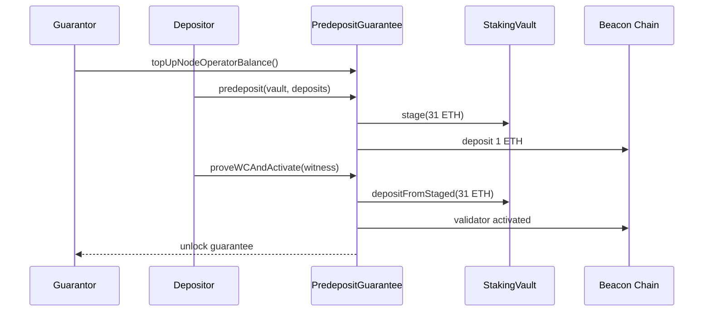

# PredepositGuarantee

- [Source code](https://github.com/lidofinance/core/blob/v3.0.0/contracts/0.8.25/vaults/predeposit_guarantee/PredepositGuarantee.sol)
- [Deployed contract](https://etherscan.io/address/0xF4bF42c6D6A0E38825785048124DBAD6c9eaaac3)

PredepositGuarantee (PDG) mitigates deposit frontrunning by requiring a node operator guarantee and validator proofs (EIP-4788) before activating staged deposits.

:::warning
On mainnet PDG is deployed but paused during Phase 1 (soft-launch). It becomes active in Phase 2.
:::

## What is PredepositGuarantee?

PDG enables trust-minimized deposits for stVaults:

- node operators post a guarantee (1 ETH per predeposit)
- vault owners stage 31 ETH per validator
- PDG verifies validator existence and withdrawal credentials via beacon root proofs
- PDG unlocks guarantees once activation is proven

### On-chain BLS verification

Predeposit operations require valid BLS12-381 signatures verified on-chain using [EIP-2537](https://eips.ethereum.org/EIPS/eip-2537) precompiles. This cryptographic verification ensures:
- The predeposit is legitimate and properly signed
- The validator will appear on the consensus layer with correct withdrawal credentials
- Frontrunning attacks cannot substitute different validator keys

## How it works

1. Guarantor tops up the node operator balance.
2. Depositor submits a 1 ETH predeposit for a validator.
3. Depositor proves validator inclusion to PDG.
4. PDG activates the validator by topping up the remaining 31 ETH from staged balance.



See the [PDG guide](/run-on-lido/stvaults/tech-documentation/pdg) for step-by-step flows.

## Structs

### ValidatorStatus

Status of a validator in PDG:

```solidity
struct ValidatorStatus {
    address stakingVault;    // Vault the validator belongs to
    address nodeOperator;    // Node operator responsible
    uint8 status;            // Current status (0=Unknown, 1=Predeposited, 2=Proven, 3=Activated)
}
```

### ValidatorWitness

Proof data for validator verification:

```solidity
struct ValidatorWitness {
    bytes pubkey;                  // Validator public key
    bytes32 withdrawalCredentials; // Expected withdrawal credentials
    uint64 validatorIndex;         // Validator index on beacon chain
    bytes32 beaconBlockRoot;       // Beacon block root for proof
    bytes32[] validatorProof;      // Merkle proof of validator inclusion
}
```

### NodeOperatorBalance

Node operator guarantee balance:

```solidity
struct NodeOperatorBalance {
    uint256 total;    // Total guarantee balance
    uint256 locked;   // Locked for pending predeposits
}
```

## View methods

### nodeOperatorBalance(address _nodeOperator)

```solidity
function nodeOperatorBalance(address _nodeOperator) external view returns (NodeOperatorBalance memory)
```

Returns node operator balances and locked guarantees.

### unlockedBalance(address _nodeOperator)

```solidity
function unlockedBalance(address _nodeOperator) external view returns (uint256 unlocked)
```

Returns unlocked guarantee balance.

### nodeOperatorGuarantor(address _nodeOperator)

```solidity
function nodeOperatorGuarantor(address _nodeOperator) external view returns (address)
```

Returns guarantor for the node operator.

### nodeOperatorDepositor(address _nodeOperator)

```solidity
function nodeOperatorDepositor(address _nodeOperator) external view returns (address)
```

Returns depositor for the node operator.

### claimableRefund(address _guarantor)

```solidity
function claimableRefund(address _guarantor) external view returns (uint256)
```

Returns claimable refund for a guarantor.

### validatorStatus(bytes _validatorPubkey)

```solidity
function validatorStatus(bytes calldata _validatorPubkey) external view returns (ValidatorStatus memory)
```

Returns PDG status for a validator.

### pendingActivations(IStakingVault _vault)

```solidity
function pendingActivations(IStakingVault _vault) external view returns (uint256)
```

Returns number of pending activations for a vault.

### validatePubKeyWCProof(ValidatorWitness _witness, bytes32 _withdrawalCredentials)

```solidity
function validatePubKeyWCProof(
    ValidatorWitness calldata _witness,
    bytes32 _withdrawalCredentials
) external view
```

Validates a proof of validator pubkey and withdrawal credentials.

### verifyDepositMessage(...)

```solidity
function verifyDepositMessage(
    IStakingVault.Deposit calldata _deposit,
    BLS12_381.DepositY calldata _depositsY,
    bytes32 _withdrawalCredentials
) public view
```

Verifies deposit message against BLS proof data.

## Methods

### initialize(address _defaultAdmin)

```solidity
function initialize(address _defaultAdmin) external initializer
```

Initializes PDG with admin.

### topUpNodeOperatorBalance(address _nodeOperator)

```solidity
function topUpNodeOperatorBalance(address _nodeOperator) external payable whenResumed
```

Top ups guarantee balance for a node operator.

### withdrawNodeOperatorBalance(address _nodeOperator, uint256 _amount, address _recipient)

```solidity
function withdrawNodeOperatorBalance(
    address _nodeOperator,
    uint256 _amount,
    address _recipient
) external onlyGuarantorOf(_nodeOperator) whenResumed
```

Withdraws unlocked guarantee balance.

### setNodeOperatorGuarantor(address _newGuarantor)

```solidity
function setNodeOperatorGuarantor(address _newGuarantor) external whenResumed
```

Sets the guarantor for the calling node operator.

### setNodeOperatorDepositor(address _newDepositor)

```solidity
function setNodeOperatorDepositor(address _newDepositor) external whenResumed
```

Sets the depositor for the calling node operator.

### claimGuarantorRefund(address _recipient)

```solidity
function claimGuarantorRefund(address _recipient) external whenResumed returns (uint256 claimedEther)
```

Claims a guarantor refund.

### predeposit(...)

```solidity
function predeposit(
    IStakingVault _stakingVault,
    IStakingVault.Deposit[] calldata _deposits,
    BLS12_381.DepositY[] calldata _depositsY
) external payable whenResumed
```

Performs 1 ETH predeposits for validators.

### proveWCAndActivate(ValidatorWitness _witness)

```solidity
function proveWCAndActivate(ValidatorWitness calldata _witness) external whenResumed
```

Proves validator and activates the staged deposit.

### activateValidator(bytes _pubkey)

```solidity
function activateValidator(bytes calldata _pubkey) external whenResumed
```

Activates a validator previously proven to PDG.

### proveUnknownValidator(...)

```solidity
function proveUnknownValidator(
    ValidatorWitness calldata _witness,
    IStakingVault _stakingVault
) external whenResumed
```

Registers a validator that was deposited outside PDG.

### proveInvalidValidatorWC(...)

```solidity
function proveInvalidValidatorWC(
    ValidatorWitness calldata _witness,
    bytes32 _invalidWithdrawalCredentials
) external whenResumed
```

Proves invalid withdrawal credentials to slash guarantee.

### topUpExistingValidators(ValidatorTopUp[] _topUps)

```solidity
function topUpExistingValidators(ValidatorTopUp[] calldata _topUps) external whenResumed
```

Top ups existing validators from vault balance.

### proveWCActivateAndTopUpValidators(...)

```solidity
function proveWCActivateAndTopUpValidators(
    ValidatorWitness[] calldata _witnesses,
    uint256[] calldata _amounts
) external whenResumed
```

Batch proof, activation, and top up.

## Related

- [StakingVault](/contracts/staking-vault)
- [VaultHub](/contracts/vault-hub)
- [Dashboard](/contracts/dashboard)
- [PDG guide](/run-on-lido/stvaults/tech-documentation/pdg)
