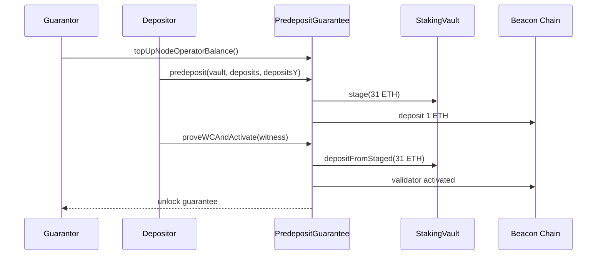

# PredepositGuarantee

- [Source code](https://github.com/lidofinance/core/blob/v3.0.1/contracts/0.8.25/vaults/predeposit_guarantee/PredepositGuarantee.sol)
- [Deployed contract](https://etherscan.io/address/0xF4bF42c6D6A0E38825785048124DBAD6c9eaaac3)

PredepositGuarantee (PDG) mitigates deposit frontrunning by requiring a node operator guarantee and validator withdrawal credentials proofs (EIP-4788) before activating staged deposits.

:::warning
On mainnet PDG is deployed but paused during Phase 1 (soft-launch). It becomes active in Phase 2.
:::

## What is PredepositGuarantee?

PDG enables trust-minimized deposits for stVaults:

- node operators post a guarantee (1 ETH per predeposit)
- vault owners stage 31 ETH per validator
- PDG verifies validator existence and withdrawal credentials via beacon root proofs
- PDG unlocks guarantees once activation is proven

### Trust assumptions

There are mutual trust assumptions in PDG:

- **NO ↔ Guarantor**: Guards prevent mistakes but cannot fully prevent misbehavior where NOs can access guarantor-provided ether
- **NO ↔ Depositor**: The designated depositor acts on behalf of the node operator

### On-chain BLS verification

Predeposit operations require valid BLS12-381 signatures verified on-chain using [EIP-2537](https://eips.ethereum.org/EIPS/eip-2537) precompiles. This cryptographic verification ensures:

- The predeposit is legitimate and properly signed
- The validator will appear on the consensus layer with correct withdrawal credentials
- Frontrunning attacks cannot substitute different validator keys

## How it works

1. Guarantor tops up the node operator balance.
2. Depositor submits a 1 ETH predeposit for a validator with BLS signature verification.
3. Depositor proves validator inclusion to PDG via Merkle proof against beacon block root.
4. PDG activates the validator by depositing the remaining 31 ETH from staged balance.



See the [PDG guide](/run-on-lido/stvaults/tech-documentation/pdg) for step-by-step flows.

## Constants

| Constant                    | Value      | Description                              |
| --------------------------- | ---------- | ---------------------------------------- |
| `MIN_SUPPORTED_WC_VERSION`  | 0x01       | Minimum withdrawal credentials version   |
| `MAX_SUPPORTED_WC_VERSION`  | 0x02       | Maximum withdrawal credentials version   |
| `PREDEPOSIT_AMOUNT`         | 1 ether    | Amount deposited with each predeposit    |
| `ACTIVATION_DEPOSIT_AMOUNT` | 31 ether   | Amount deposited to activate a validator |
| `MAX_TOPUP_AMOUNT`          | 2016 ether | Maximum top-up amount (2048 - 31 - 1)    |
| `DEPOSIT_DOMAIN`            | (computed) | Chain-specific deposit domain            |

## Structs

### ValidatorStage (enum)

Validator lifecycle stages in PDG:

```solidity
enum ValidatorStage {
    NONE,          // Initial stage, validator unknown to PDG
    PREDEPOSITED,  // 1 ETH predeposit made, guarantee locked
    PROVEN,        // Validator WC proven via beacon proof
    ACTIVATED,     // 31 ETH activation deposit made
    COMPENSATED    // Frontrun detected, guarantee compensated to vault
}
```

### ValidatorStatus

Status of a validator in PDG:

```solidity
struct ValidatorStatus {
    ValidatorStage stage;        // Current lifecycle stage
    IStakingVault stakingVault;  // Vault the validator belongs to
    address nodeOperator;        // Node operator responsible
}
```

### ValidatorWitness

Proof data for validator verification against beacon block root:

```solidity
struct ValidatorWitness {
    bytes32[] proof;           // Merkle proof from parent(pubkey,wc) to beacon block root
    bytes pubkey;              // Validator public key
    uint256 validatorIndex;    // Validator index on beacon chain
    uint64 childBlockTimestamp;// Timestamp of EL block with beacon root
    uint64 slot;               // Beacon slot for the proof
    uint64 proposerIndex;      // Beacon block proposer index
}
```

### NodeOperatorBalance

Node operator guarantee balance (fits in single slot):

```solidity
struct NodeOperatorBalance {
    uint128 total;    // Total guarantee balance
    uint128 locked;   // Locked for pending predeposits
}
```

### ValidatorTopUp

Parameters for topping up existing validators:

```solidity
struct ValidatorTopUp {
    bytes pubkey;     // Public key of validator to top up
    uint256 amount;   // Amount of ether to deposit (max 2016 ETH)
}
```

## View methods

### nodeOperatorBalance(address \_nodeOperator)

```solidity
function nodeOperatorBalance(address _nodeOperator) external view returns (NodeOperatorBalance memory)
```

Returns node operator total and locked guarantee balances.

### unlockedBalance(address \_nodeOperator)

```solidity
function unlockedBalance(address _nodeOperator) external view returns (uint256 unlocked)
```

Returns unlocked guarantee balance (total - locked).

### nodeOperatorGuarantor(address \_nodeOperator)

```solidity
function nodeOperatorGuarantor(address _nodeOperator) external view returns (address)
```

Returns guarantor for the node operator. Returns the node operator address if they are self-guarantor.

### nodeOperatorDepositor(address \_nodeOperator)

```solidity
function nodeOperatorDepositor(address _nodeOperator) external view returns (address)
```

Returns depositor for the node operator. Returns the node operator address if no depositor is set.

### claimableRefund(address \_guarantor)

```solidity
function claimableRefund(address _guarantor) external view returns (uint256)
```

Returns claimable refund for a guarantor (from changing guarantor with balance).

### validatorStatus(bytes \_validatorPubkey)

```solidity
function validatorStatus(bytes calldata _validatorPubkey) external view returns (ValidatorStatus memory)
```

Returns PDG status for a validator by pubkey.

### pendingActivations(IStakingVault \_vault)

```solidity
function pendingActivations(IStakingVault _vault) external view returns (uint256)
```

Returns number of validators in PREDEPOSITED or PROVEN stages awaiting activation.

### validatePubKeyWCProof(ValidatorWitness \_witness, bytes32 \_withdrawalCredentials)

```solidity
function validatePubKeyWCProof(
    ValidatorWitness calldata _witness,
    bytes32 _withdrawalCredentials
) external view
```

Validates a Merkle proof of validator pubkey and withdrawal credentials against beacon block root. Reverts with `InvalidProof` if invalid.

### verifyDepositMessage(...)

```solidity
function verifyDepositMessage(
    IStakingVault.Deposit calldata _deposit,
    BLS12_381.DepositY calldata _depositsY,
    bytes32 _withdrawalCredentials
) public view
```

Verifies deposit message BLS signature using EIP-2537 precompiles. Reverts with `InvalidSignature` if invalid.

## Methods

### initialize(address \_defaultAdmin)

```solidity
function initialize(address _defaultAdmin) external initializer
```

Initializes PDG with admin role.

### topUpNodeOperatorBalance(address \_nodeOperator)

```solidity
function topUpNodeOperatorBalance(address _nodeOperator) external payable whenResumed
```

Tops up guarantee balance for a node operator. Only callable by the node operator's guarantor. Amount must be a multiple of 1 ETH.

### withdrawNodeOperatorBalance(address \_nodeOperator, uint256 \_amount, address \_recipient)

```solidity
function withdrawNodeOperatorBalance(
    address _nodeOperator,
    uint256 _amount,
    address _recipient
) external whenResumed
```

Withdraws unlocked guarantee balance. Only callable by the node operator's guarantor. Amount must be a multiple of 1 ETH.

### setNodeOperatorGuarantor(address \_newGuarantor)

```solidity
function setNodeOperatorGuarantor(address _newGuarantor) external whenResumed
```

Sets the guarantor for the calling node operator. If there's existing balance with a different guarantor, it becomes claimable by the previous guarantor. Reverts if locked balance is non-zero.

### setNodeOperatorDepositor(address \_newDepositor)

```solidity
function setNodeOperatorDepositor(address _newDepositor) external whenResumed
```

Sets the depositor for the calling node operator.

### claimGuarantorRefund(address \_recipient)

```solidity
function claimGuarantorRefund(address _recipient) external whenResumed returns (uint256 claimedEther)
```

Claims a guarantor refund (from previous NO relationship).

### predeposit(...)

```solidity
function predeposit(
    IStakingVault _stakingVault,
    IStakingVault.Deposit[] calldata _deposits,
    BLS12_381.DepositY[] calldata _depositsY
) external payable whenResumed
```

Performs 1 ETH predeposits for validators. Requires:

- Caller is the node operator's depositor
- BLS signatures are valid (verified via `_depositsY`)
- Sufficient unlocked guarantee balance
- Deposit amounts are exactly `PREDEPOSIT_AMOUNT`

Optionally accepts msg.value (multiples of 1 ETH) to top up balance if NO is self-guarantor.

**State transition:** NONE → PREDEPOSITED

### proveWCAndActivate(ValidatorWitness \_witness)

```solidity
function proveWCAndActivate(ValidatorWitness calldata _witness) external whenResumed
```

Proves validator withdrawal credentials and activates if possible. Unlocks the guarantee. If activation fails (vault disconnected), validator moves to PROVEN state for later activation.

**State transition:** PREDEPOSITED → PROVEN [→ ACTIVATED]

### activateValidator(bytes \_pubkey)

```solidity
function activateValidator(bytes calldata _pubkey) external whenResumed
```

Activates a previously proven validator by depositing 31 ETH from staged balance.

**State transition:** PROVEN → ACTIVATED

### proveUnknownValidator(...)

```solidity
function proveUnknownValidator(
    ValidatorWitness calldata _witness,
    IStakingVault _stakingVault
) external whenResumed
```

Registers a validator that was deposited outside PDG (side-deposited). Only callable by vault owner. Validator must be eligible for activation (not in far-future epoch).

**State transition:** NONE → ACTIVATED

### proveInvalidValidatorWC(...)

```solidity
function proveInvalidValidatorWC(
    ValidatorWitness calldata _witness,
    bytes32 _invalidWithdrawalCredentials
) external whenResumed
```

Proves that a predeposit was frontrun with invalid withdrawal credentials. Compensates the vault from the locked guarantee.

**State transition:** PREDEPOSITED → COMPENSATED

### topUpExistingValidators(ValidatorTopUp[] \_topUps)

```solidity
function topUpExistingValidators(ValidatorTopUp[] calldata _topUps) external whenResumed
```

Tops up existing activated validators from their respective vault balances. Only callable by the node operator's depositor. Maximum top-up per validator is 2016 ETH.

### proveWCActivateAndTopUpValidators(...)

```solidity
function proveWCActivateAndTopUpValidators(
    ValidatorWitness[] calldata _witnesses,
    uint256[] calldata _amounts
) external whenResumed
```

Batch operation to prove, activate, and optionally top up multiple validators. Handles validators in PREDEPOSITED, PROVEN, or ACTIVATED states. Top-up amounts require caller to be the depositor.

**State transitions:** [PREDEPOSITED →] [PROVEN →] ACTIVATED

## Pausable

PDG inherits from `PausableUntilWithRoles`. All state-changing methods require the contract to be resumed (`whenResumed` modifier). The contract is initialized in a paused state.

## Related

- [StakingVault](/contracts/staking-vault)
- [VaultHub](/contracts/vault-hub)
- [Dashboard](/contracts/dashboard)
- [PDG guide](/run-on-lido/stvaults/tech-documentation/pdg)
