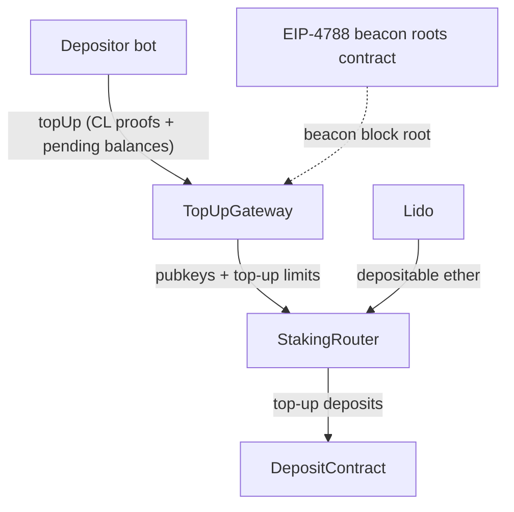

# TopUpGateway

- [Source code](https://github.com/lidofinance/core/blob/v4.0.0/contracts/0.8.25/TopUpGateway.sol)
- [Deployed contract](https://etherscan.io/address/0x3FC2C71579D80790Aaa3fc7Be8B66ac39dC57374)
- Specification basis: [LIP-35 — Staking Router v3](https://github.com/lidofinance/lido-improvement-proposals/blob/develop/LIPS/lip-35.md)

TopUpGateway is the entry point for topping up `0x02` (compounding, [EIP-7251](https://eips.ethereum.org/EIPS/eip-7251)) Lido Core validators. It verifies each validator's Consensus Layer state on-chain with Merkle proofs, computes per-validator top-up limits, and forwards them to [`StakingRouter.topUp`](/contracts/staking-router#topup), which pulls ether from [Lido](/contracts/lido) and executes the deposits.

## What is TopUpGateway

TopUpGateway is the only contract allowed to trigger [validator top-ups](/contracts/staking-router#top-ups) on the [StakingRouter](/contracts/staking-router). Before any ether moves, it:

- verifies each validator's container (withdrawal credentials, effective balance, activation/exit epochs, slashed flag) against the Consensus Layer state using a Merkle proof anchored to an [EIP-4788](https://eips.ethereum.org/EIPS/eip-4788) beacon block root;
- computes a per-validator top-up limit from the configured target balance, the proven effective balance, and the validator's pending deposits;
- forwards the validated public keys and limits to the StakingRouter, which determines the exact deposit amounts within these limits.

The contract inherits [CLValidatorVerifier](https://github.com/lidofinance/core/blob/v4.0.0/contracts/0.8.25/CLValidatorVerifier.sol), OpenZeppelin `AccessControlEnumerableUpgradeable`, and [PausableUntil](https://github.com/lidofinance/core/blob/v4.0.0/contracts/common/utils/PausableUntil.sol). It is deployed behind an [OssifiableProxy](/contracts/ossifiable-proxy).

## Top-up flow

Top-ups are permissioned: [`topUp`](#topup) is restricted to the `TOP_UP_ROLE`, held by the Lido depositor bot.

1. The depositor bot selects validators of a `0x02` staking module and collects for each: the validator container fields, a Merkle proof anchored to a recent beacon block root, and the balance of the validator's pending deposits.
2. The bot calls [`topUp`](#topup). The gateway validates the request (see [Request processing](#request-processing)) and computes a top-up limit for each validator.
3. The gateway calls [`StakingRouter.topUp`](/contracts/staking-router#topup), which determines the exact per-key amounts within these limits — capped by the [allocation algorithm](/contracts/staking-router#allocation-algorithm) and the global per-block top-up limit — pulls the ether from [Lido](/contracts/lido), and executes the deposits.



## Request processing

[`topUp`](#topup) accepts a [`TopUpData`](#topupdata) batch targeting a single staking module. Before calling the StakingRouter, the gateway enforces the following:

1. **Access.** The caller holds `TOP_UP_ROLE`, and the contract is not paused.
2. **Well-formedness.** The batch is not empty, all per-validator arrays have the same length, the batch size does not exceed `maxValidatorsPerTopUp`, and `validatorIndices` are strictly increasing (which also rejects duplicates).
3. **Rate limit.** At least `minBlockDistance` blocks have passed since the last effective top-up.
4. **Proof freshness.** The beacon block root is at most `maxRootAge` seconds old and is newer than the last effective top-up, so a Consensus Layer state observed before the previous top-up cannot be replayed.
5. **Module withdrawal credentials.** The target module's withdrawal credentials, fetched from the StakingRouter, are of type `0x02`.
6. **Validator verification.** Each validator's pubkey is 48 bytes, the validator was activated no later than the epoch of the proven slot, and the full validator container is proven against the beacon block root. See [Validator verification](#validator-verification).

For each verified validator, the gateway evaluates a top-up limit (see [Top-up limit evaluation](#top-up-limit-evaluation)) and forwards the batch to [`StakingRouter.topUp`](/contracts/staking-router#topup). If at least one limit is non-zero, the gateway records the current block and timestamp for rate limiting; a call where every limit evaluates to zero does not consume the rate limit.

### Validator verification

The Merkle proof covers the entire validator container. The gateway builds the expected container leaf using the module's `0x02` withdrawal credentials, so the proof verifies only if the validator's actual withdrawal credentials belong to the protocol — a validator with foreign credentials cannot be topped up.

The proof is anchored to a beacon block root read from the [EIP-4788](https://eips.ethereum.org/EIPS/eip-4788) beacon roots contract by the supplied `childBlockTimestamp`, and the proven `slot` and `proposerIndex` are bound to the same proof. The verifier is fork-aware: it switches the generalized index of the validators tree at a pivot slot configured at deployment.

Pending deposit balances (`pendingBalanceGwei`) are not part of the validator container and cannot be proven this way; they are supplied by the caller, which is one more reason `topUp` is restricted to the trusted depositor bot.

### Top-up limit evaluation

The per-validator limit is derived from two configurable parameters — `targetBalanceGwei`, the validator balance ceiling after a top-up, and `minTopUpGwei`, the minimum top-up worth performing:

- the limit is zero if the validator is exiting or exited (`exitEpoch` is set) or slashed;
- the limit is zero if `effectiveBalance + pendingBalanceGwei ≥ targetBalanceGwei`;
- otherwise, the limit is `targetBalanceGwei − (effectiveBalance + pendingBalanceGwei)`, zeroed if below `minTopUpGwei`.

Pending deposits are counted so that deposits already in flight in the Consensus Layer deposit queue are not doubled by a new top-up. The resulting limits are ceilings, not exact amounts: the StakingRouter and the staking module determine the exact per-key deposit amounts within them.

## Roles

Access to lever methods is restricted using the functionality of the OpenZeppelin `AccessControlEnumerable` contract:

- `DEFAULT_ADMIN_ROLE` — manages role assignments;
- `TOP_UP_ROLE` — allows submitting top-ups; held by the Lido depositor bot;
- `MANAGE_LIMITS_ROLE` — allows updating the gateway parameters: batch size, block distance, root age, and balance limits;
- `PAUSE_ROLE` / `RESUME_ROLE` — allow pausing and resuming the contract (see [PausableUntil](https://github.com/lidofinance/core/blob/v4.0.0/contracts/common/utils/PausableUntil.sol)).

## Structs

### TopUpData

A top-up batch targeting a single staking module. The `keyIndices`, `operatorIds`, `validatorWitness`, and `pendingBalanceGwei` arrays are aligned by position to `validatorIndices[i]`, and `validatorIndices` must be sorted in strictly ascending order.

```solidity
struct TopUpData {
    uint256 moduleId;                    // target staking module id
    uint256[] keyIndices;                // key indices within the module
    uint256[] operatorIds;               // node operator ids within the module
    uint256[] validatorIndices;          // validator indices on the Consensus Layer
    BeaconRootData beaconRootData;       // beacon block root reference for the proofs
    ValidatorWitness[] validatorWitness; // validator containers with Merkle proofs
    uint256[] pendingBalanceGwei;        // pending deposits per validator, in gwei
}
```

### BeaconRootData

Reference to the beacon block root all proofs in the batch are anchored to.

```solidity
struct BeaconRootData {
    uint64 childBlockTimestamp; // EL block timestamp for the EIP-4788 lookup
    uint64 slot;                // beacon block header slot
    uint64 proposerIndex;       // beacon block header proposer index
}
```

### ValidatorWitness

Full validator container fields (except withdrawal credentials, which are derived from the module) with a Merkle proof of the container's inclusion in the Beacon state.

```solidity
struct ValidatorWitness {
    bytes32[] proofValidator; // Merkle path: Validator[i] → state_root → beacon block root
    bytes pubkey;
    uint64 effectiveBalance;
    uint64 activationEligibilityEpoch;
    uint64 activationEpoch;
    uint64 exitEpoch;
    uint64 withdrawableEpoch;
    bool slashed;
}
```

## View methods

### `getLastTopUpTimestamp`

Returns the timestamp of the last effective top-up (one with a non-zero total limit).

```solidity
function getLastTopUpTimestamp() external view returns (uint256);
```

### `getMaxValidatorsPerTopUp`

Returns the maximum number of validators allowed per `topUp` call.

```solidity
function getMaxValidatorsPerTopUp() external view returns (uint256);
```

### `getMinBlockDistance`

Returns the minimum number of blocks that must pass between effective top-ups.

```solidity
function getMinBlockDistance() external view returns (uint256);
```

### `isBlockDistancePassed`

Returns true if enough blocks have passed since the last top-up, or if no top-up has happened yet.

```solidity
function isBlockDistancePassed() external view returns (bool);
```

### `getMaxRootAge`

Returns the maximum age (in seconds) of the beacon block root relative to the current block timestamp.

```solidity
function getMaxRootAge() external view returns (uint256);
```

### `getTargetBalanceGwei`

Returns the target validator balance ceiling after a top-up, in gwei.

```solidity
function getTargetBalanceGwei() external view returns (uint256);
```

### `getMinTopUpGwei`

Returns the minimum top-up that can be performed, in gwei.

```solidity
function getMinTopUpGwei() external view returns (uint256);
```

## Write methods

### `topUp`

Verifies the batched validators against the Consensus Layer state, evaluates per-validator top-up limits, and calls [`StakingRouter.topUp`](/contracts/staking-router#topup). See [Request processing](#request-processing) for the detailed flow.

Restricted to the `TOP_UP_ROLE` role, held by the Lido depositor bot.

```solidity
function topUp(TopUpData calldata _topUps) external;
```

**Parameters:**

| Name      | Type        | Description                                                                                             |
| --------- | ----------- | ------------------------------------------------------------------------------------------------------- |
| `_topUps` | `TopUpData` | top-up batch: validator containers, pending deposit balances, and Merkle proofs (see [TopUpData](#topupdata)) |

**Reverts:**

- if the caller does not have the `TOP_UP_ROLE` or the contract is paused;
- with `WrongArrayLength` if `validatorIndices` is empty or any per-validator array has a different length;
- with `MaxValidatorsPerTopUpExceeded` if the batch exceeds `maxValidatorsPerTopUp`;
- with `InvalidValidatorIndicesSortOrder` if `validatorIndices` is not strictly increasing;
- with `MinBlockDistanceNotMet` if fewer than `minBlockDistance` blocks have passed since the last top-up;
- with `RootIsTooOld` if the beacon root is older than `maxRootAge`, and with `RootPrecedesLastTopUp` if it is not newer than the last top-up;
- with `WrongWithdrawalCredentials` if the module's withdrawal credentials are not of type `0x02`;
- with `WrongPubkeyLength` if any pubkey is not 48 bytes, and with `ValidatorIsNotActivated` if any validator's activation epoch is later than the proven slot's epoch;
- if any validator's Merkle proof fails verification.

### `setMaxValidatorsPerTopUp`

Sets the maximum number of validators per `topUp` call. The value must be non-zero and fit into `uint64`. Restricted to the `MANAGE_LIMITS_ROLE` role.

```solidity
function setMaxValidatorsPerTopUp(uint256 _newValue) external;
```

### `setMinBlockDistance`

Sets the minimum number of blocks between effective top-ups. The value must be non-zero and fit into `uint16`. Restricted to the `MANAGE_LIMITS_ROLE` role.

```solidity
function setMinBlockDistance(uint256 _newValue) external;
```

### `setMaxRootAge`

Sets the maximum allowed age of the beacon block root relative to the current block timestamp, in seconds. The value must be non-zero and fit into `uint16`. Restricted to the `MANAGE_LIMITS_ROLE` role.

```solidity
function setMaxRootAge(uint256 _newValue) external;
```

### `setTopUpBalanceLimits`

Sets the [top-up balance limits](#top-up-limit-evaluation). Both values must be non-zero and fit into `uint64`; reverts with `MinTopUpExceedsTarget` if `_minTopUpGwei` exceeds `_targetBalanceGwei`. Restricted to the `MANAGE_LIMITS_ROLE` role.

```solidity
function setTopUpBalanceLimits(uint256 _targetBalanceGwei, uint256 _minTopUpGwei) external;
```

**Parameters:**

| Name                 | Type      | Description                                              |
| -------------------- | --------- | --------------------------------------------------------- |
| `_targetBalanceGwei` | `uint256` | target validator balance ceiling after a top-up, in gwei |
| `_minTopUpGwei`      | `uint256` | minimum top-up that can be performed, in gwei            |

### `pauseFor`

Pauses the contract for the specified duration, blocking new top-ups. Restricted to the `PAUSE_ROLE` role.

```solidity
function pauseFor(uint256 _duration) external;
```

**Parameters:**

| Name        | Type      | Description                                                     |
| ----------- | --------- | ---------------------------------------------------------------- |
| `_duration` | `uint256` | pause duration in seconds (use `PAUSE_INFINITELY` for unlimited) |

### `pauseUntil`

Pauses the contract until the specified timestamp (inclusive). Restricted to the `PAUSE_ROLE` role.

```solidity
function pauseUntil(uint256 _pauseUntilInclusive) external;
```

**Parameters:**

| Name                   | Type      | Description                              |
| ---------------------- | --------- | ----------------------------------------- |
| `_pauseUntilInclusive` | `uint256` | the last second to pause until, inclusive |

### `resume`

Resumes the contract. Restricted to the `RESUME_ROLE` role.

```solidity
function resume() external;
```

## Events

### `LastTopUpChanged`

Emitted after an effective top-up (one with a non-zero total limit) with the current block timestamp.

```solidity
event LastTopUpChanged(uint256 newValue);
```

### `MaxValidatorsPerTopUpChanged`

```solidity
event MaxValidatorsPerTopUpChanged(uint256 newValue);
```

### `MinBlockDistanceChanged`

```solidity
event MinBlockDistanceChanged(uint256 newValue);
```

### `MaxRootAgeChanged`

```solidity
event MaxRootAgeChanged(uint256 newValue);
```

### `TopUpBalanceLimitsChanged`

```solidity
event TopUpBalanceLimitsChanged(uint256 targetBalanceGwei, uint256 minTopUpGwei);
```
