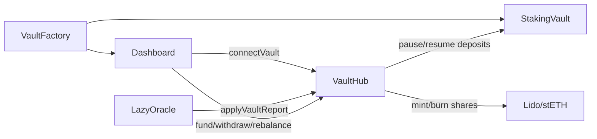

# VaultHub

- [Source code](https://github.com/lidofinance/core/blob/v3.0.0/contracts/0.8.25/vaults/VaultHub.sol)
- [Deployed contract](https://etherscan.io/address/0x1d201BE093d847f6446530Efb0E8Fb426d176709)

Central registry and accounting engine for stVaults. It connects vaults to Lido Core, enforces reserve constraints, and mints/burns stETH against per-vault collateral.

## What is VaultHub?

VaultHub coordinates stVault lifecycle and accounting:

- connects and disconnects `StakingVault` instances
- tracks each vault's total value, liabilities, reserve ratio, and obligations
- mints and burns stETH shares for vaults based on reported health
- enforces force-rebalance when collateralization drops
- settles Lido fees and bad debt events

VaultHub is driven by reports from `LazyOracle` and vault actions routed via the `Dashboard` or direct calls.

## How it works

1. `VaultFactory` deploys a `StakingVault` + `Dashboard` pair.
2. `Dashboard` connects the vault to VaultHub, and VaultHub escrows the 1 ETH connect deposit.
3. `LazyOracle` posts per-vault reports; VaultHub applies them to update total value and liabilities.
4. Vault owners mint/burn stETH shares, fund/withdraw ETH, or rebalance as needed.
5. If a vault becomes unhealthy, VaultHub restricts operations and enables force rebalancing.

VaultHub validates that a vault was deployed by the current VaultFactory (or a
previous factory in the chain) before allowing connection.



## View methods

### vaultsCount()

```solidity
function vaultsCount() external view returns (uint256)
```

Returns the number of connected vaults.

### vaultByIndex(uint256 _index)

```solidity
function vaultByIndex(uint256 _index) external view returns (address)
```

Returns vault address by index.

### vaultConnection(address _vault)

```solidity
function vaultConnection(address _vault) external view returns (VaultConnection memory)
```

Returns static connection parameters for a vault.

### vaultRecord(address _vault)

```solidity
function vaultRecord(address _vault) external view returns (VaultRecord memory)
```

Returns stored accounting record for a vault.

### isVaultConnected(address _vault)

```solidity
function isVaultConnected(address _vault) external view returns (bool)
```

Returns whether a vault is connected.

### isPendingDisconnect(address _vault)

```solidity
function isPendingDisconnect(address _vault) external view returns (bool)
```

Returns whether a vault is queued for disconnect.

### totalValue(address _vault)

```solidity
function totalValue(address _vault) external view returns (uint256)
```

Returns the vault total value used for collateralization.

### liabilityShares(address _vault)

```solidity
function liabilityShares(address _vault) external view returns (uint256)
```

Returns stETH shares minted against the vault.

### locked(address _vault)

```solidity
function locked(address _vault) external view returns (uint256)
```

Returns ETH amount locked as collateral (liability + reserve).

### maxLockableValue(address _vault)

```solidity
function maxLockableValue(address _vault) external view returns (uint256)
```

Returns the maximum value that can be locked for the vault at current parameters.

### totalMintingCapacityShares(address _vault, int256 _deltaValue)

```solidity
function totalMintingCapacityShares(address _vault, int256 _deltaValue) external view returns (uint256)
```

Returns total minting capacity in stETH shares with a value delta.

### withdrawableValue(address _vault)

```solidity
function withdrawableValue(address _vault) external view returns (uint256)
```

Returns ETH amount currently withdrawable.

### latestReport(address _vault)

```solidity
function latestReport(address _vault) external view returns (Report memory)
```

Returns the last applied oracle report for a vault.

### isReportFresh(address _vault)

```solidity
function isReportFresh(address _vault) external view returns (bool)
```

Returns whether the latest report is within the freshness window.

### isVaultHealthy(address _vault)

```solidity
function isVaultHealthy(address _vault) external view returns (bool)
```

Returns whether the vault meets health thresholds.

### healthShortfallShares(address _vault)

```solidity
function healthShortfallShares(address _vault) external view returns (uint256)
```

Returns shares needed to restore health.

### obligationsShortfallValue(address _vault)

```solidity
function obligationsShortfallValue(address _vault) external view returns (uint256)
```

Returns ETH shortfall for obligations.

### obligations(address _vault)

```solidity
function obligations(address _vault) external view returns (uint256 sharesToBurn, uint256 feesToSettle)
```

Returns current obligations (shares to burn and fees to settle).

### settleableLidoFeesValue(address _vault)

```solidity
function settleableLidoFeesValue(address _vault) external view returns (uint256)
```

Returns the amount of Lido fees currently settleable.

### badDebtToInternalize()

```solidity
function badDebtToInternalize() external view returns (uint256)
```

Returns aggregate bad debt queued for internalization.

### badDebtToInternalizeForLastRefSlot()

```solidity
function badDebtToInternalizeForLastRefSlot() external view returns (uint256)
```

Returns bad debt amount computed for the last reference slot.

## Methods

### initialize(address _admin)

```solidity
function initialize(address _admin) external initializer
```

Initializes the contract and sets the admin.

### connectVault(address _vault)

```solidity
function connectVault(address _vault) external whenResumed
```

Connects a vault to VaultHub and escrows the connect deposit.

### setLiabilitySharesTarget(address _vault, uint256 _liabilitySharesTarget)

```solidity
function setLiabilitySharesTarget(address _vault, uint256 _liabilitySharesTarget) external onlyRole(REDEMPTION_MASTER_ROLE)
```

Sets a liability shares target used for redemptions.

### updateConnection(...)

```solidity
function updateConnection(
    address _vault,
    uint256 _shareLimit,
    uint256 _reserveRatioBP,
    uint256 _forcedRebalanceThresholdBP,
    uint256 _infraFeeBP,
    uint256 _liquidityFeeBP,
    uint256 _reservationFeeBP
) external
```

Updates vault connection parameters.

### disconnect(address _vault)

```solidity
function disconnect(address _vault) external onlyRole(VAULT_MASTER_ROLE)
```

Disconnects a vault and releases ownership.

### applyVaultReport(...)

```solidity
function applyVaultReport(
    address _vault,
    uint256 _reportTimestamp,
    uint256 _reportTotalValue,
    int256 _reportInOutDelta,
    uint256 _reportCumulativeLidoFees,
    uint256 _reportLiabilityShares,
    uint256 _reportMaxLiabilityShares,
    uint256 _reportSlashingReserve
) external whenResumed
```

Applies a per-vault oracle report.

### socializeBadDebt(...)

```solidity
function socializeBadDebt(
    address _badDebtVault,
    address _vaultAcceptor,
    uint256 _maxSharesToSocialize
) external onlyRole(BAD_DEBT_MASTER_ROLE) returns (uint256)
```

Socializes bad debt between vaults.

### internalizeBadDebt(...)

```solidity
function internalizeBadDebt(
    address _badDebtVault,
    uint256 _maxSharesToInternalize
) external onlyRole(BAD_DEBT_MASTER_ROLE) returns (uint256)
```

Internalizes bad debt into Lido Core.

### decreaseInternalizedBadDebt(uint256 _amountOfShares)

```solidity
function decreaseInternalizedBadDebt(uint256 _amountOfShares) external
```

Decreases internalized bad debt counter after settlement.

### transferVaultOwnership(address _vault, address _newOwner)

```solidity
function transferVaultOwnership(address _vault, address _newOwner) external
```

Transfers the vault's factual owner stored in VaultHub.

### voluntaryDisconnect(address _vault)

```solidity
function voluntaryDisconnect(address _vault) external whenResumed
```

Disconnects a vault via owner-initiated flow.

### fund(address _vault)

```solidity
function fund(address _vault) external payable whenResumed
```

Forwards ETH funding to a vault.

### withdraw(address _vault, address _recipient, uint256 _ether)

```solidity
function withdraw(address _vault, address _recipient, uint256 _ether) external whenResumed
```

Withdraws ETH from a vault to a recipient.

### rebalance(address _vault, uint256 _shares)

```solidity
function rebalance(address _vault, uint256 _shares) external whenResumed
```

Burns shares to restore health and unlock collateral.

### mintShares(address _vault, address _recipient, uint256 _amountOfShares)

```solidity
function mintShares(address _vault, address _recipient, uint256 _amountOfShares) external whenResumed
```

Mints stETH shares against the vault.

### burnShares(address _vault, uint256 _amountOfShares)

```solidity
function burnShares(address _vault, uint256 _amountOfShares) public whenResumed
```

Burns stETH shares against the vault liability.

### transferAndBurnShares(address _vault, uint256 _amountOfShares)

```solidity
function transferAndBurnShares(address _vault, uint256 _amountOfShares) external
```

Transfers stETH shares from caller then burns them.

### pauseBeaconChainDeposits(address _vault)

```solidity
function pauseBeaconChainDeposits(address _vault) external
```

Sets pause intent and pauses vault deposits if allowed.

### resumeBeaconChainDeposits(address _vault)

```solidity
function resumeBeaconChainDeposits(address _vault) external
```

Clears pause intent and resumes deposits if healthy.

### requestValidatorExit(bytes _pubkeys)

```solidity
function requestValidatorExit(address _vault, bytes calldata _pubkeys) external
```

Requests validator exits for a vault.

### triggerValidatorWithdrawals(...)

```solidity
function triggerValidatorWithdrawals(
    address _vault,
    bytes calldata _pubkeys,
    uint64[] calldata _amountsInGwei,
    address _refundRecipient
) external payable
```

Triggers EL withdrawals via EIP-7002.

### forceValidatorExit(...)

```solidity
function forceValidatorExit(
    address _vault,
    bytes calldata _pubkeys,
    address _refundRecipient
) external payable onlyRole(VALIDATOR_EXIT_ROLE)
```

Forces exits by role.

### forceRebalance(address _vault)

```solidity
function forceRebalance(address _vault) external
```

Permissionless force rebalance for unhealthy vaults.

### settleLidoFees(address _vault)

```solidity
function settleLidoFees(address _vault) external
```

Settles accrued Lido fees from the vault.

### proveUnknownValidatorToPDG(...)

```solidity
function proveUnknownValidatorToPDG(
    address _vault,
    IPredepositGuarantee.ValidatorWitness calldata _witness
) external
```

Proves a validator to PDG on behalf of a vault.

### collectERC20FromVault(...)

```solidity
function collectERC20FromVault(
    address _vault,
    address _token,
    address _recipient,
    uint256 _amount
) external
```

Collects ERC-20 tokens from a vault.

## Permissions

VaultHub uses `AccessControl` with these key roles:

- `DEFAULT_ADMIN_ROLE` for governance/admin actions
- `VAULT_MASTER_ROLE` for connect/disconnect control
- `REDEMPTION_MASTER_ROLE` for liability targets
- `BAD_DEBT_MASTER_ROLE` for bad debt operations
- `VALIDATOR_EXIT_ROLE` for forced exits

## Related

- [StakingVault](/contracts/staking-vault)
- [OperatorGrid](/contracts/operator-grid)
- [LazyOracle](/contracts/lazy-oracle)
- [PredepositGuarantee](/contracts/predeposit-guarantee)
- [stVaults Technical Design](/run-on-lido/stvaults/tech-documentation/tech-design)
