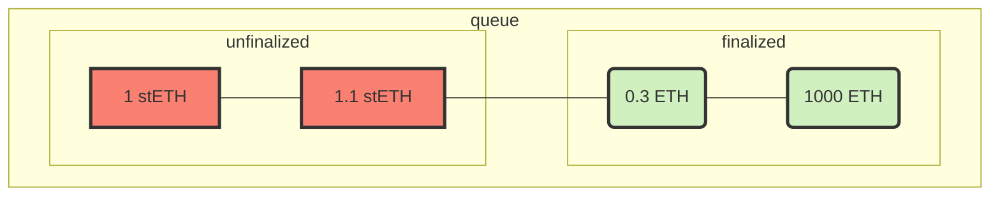

# WithdrawalQueueERC721

- [Source code](https://github.com/lidofinance/lido-dao/blob/master/contracts/0.8.9/WithdrawalQueueERC721.sol)
- [Deployed contract](https://etherscan.io/address/0x889edC2eDab5f40e902b864aD4d7AdE8E412F9B1)

A FIFO queue for `stETH` withdrawal requests and an `unstETH` NFT implementation representing the position in the queue.

Access to lever methods is restricted using the functionality of the
[AccessControlEnumerable](https://github.com/lidofinance/lido-dao/blob/master/contracts/0.8.9/utils/access/AccessControlEnumerable.sol)
contract and a bunch of [granular roles](#roles).

## What is WithdrawalQueueERC721?

This contract is a main entry point to exchange `stETH` for underlying ether directly via Lido protocol.
It is responsible for:

- managing a queue of withdrawal requests
- committing withdrawal request finalization as a part of the [AccountingOracle](./accounting-oracle.md) report
- storing `stETH` before and ether after the finalization
- transfer reserved ether to the user upon the claim

Also, the contract is [ERC-721](https://eips.ethereum.org/EIPS/eip-721) `unstETH` NFT with
metadata extension representing the right to claim underlying ether once the request is
finalized. This NFT is minted upon request and burned on the claim. [ERC-4906](https://eips.ethereum.org/EIPS/eip-4906)
is used to update the metadata as soon as the finalization status of the request is changed.

## Request

To request a withdrawal, one needs to approve the amount of `stETH` or `wstETH` to this contract or sign the
[ERC-2612 Permit](https://eips.ethereum.org/EIPS/eip-2612), and then call the appropriate `requestWithdrawals*` method.

The **minimal** amount for a request is `100 wei`, and the **maximum** is `1000 eth`. More significant amounts should
be split into several requests, which allows us to avoid clogging the queue with an extra large request.

During this call, the request is placed in the queue, and the related `unstETH` NFT is minted. The following structure
represents the request:

```sol
struct WithdrawalRequestStatus {
    uint256 amountOfStETH;
    uint256 amountOfShares;
    address owner;
    uint256 timestamp;
    bool isFinalized;
    bool isClaimed;
}
```

where

- **`amountOfStETH`** — the number of `stETH` tokens transferred to the contract upon request
- **`amountOfShares`** — the number of underlying shares corresponding to transferred `stETH` tokens.
See [Lido rebasing chapter](lido.md#rebase) to learn about the shares mechanic
- **`owner`** — the owner's address for this request. The owner is also a holder of the `unstETH` NFT
and can transfer the ownership and claim the underlying ether once finalized
- **`timestamp`** — the creation time of the request
- **`isFinalized`** — finalization status of the request; finalized requests are available to claim
- **`isClaimed`** — the claim status of the request. Once claimed, NFT is burned, and
the request is not available to claim again

:::note

The amount of ether that will be withdrawn is limited to the number of `stETH` tokens transferred to this contract
at the moment of request. So, the user will not receive the rewards for the period of time while their tokens stay in the queue.

:::

## Finalization

After filing a withdrawal request, one can only claim it once finalization occurs.
[Accounting Oracle](accounting-oracle.md) report finalizes a batch of withdrawal requests,
choosing the `_maxShareRate` and the size of the batch taking in account following factors:

- If there is enough ether to fulfill the request. Ether can be obtained from the Lido buffer, which is filled
from the new users' stake, Beacon chain partial and full withdrawals, protocol tips, and MEV rewards.
Withdrawals are prioritized over deposits, so ether can't be deposited to the Beacon chain if some withdrawal requests
can be fulfilled.
- if enough time has passed since the withdrawal request was placed in the queue (timelock)
- If there was some massive loss for the protocol on the Beacon Chain side since the withdrawal request was filed.
It can lead to finalization by the rate lower than 1:1 if the loss will be high enough to be not covered
with daily rewards (never happened before)

:::note

To put it simply, token holders don't receive rewards but still take risks during withdrawal. Rewards, acquired
since the stETH was locked in the WithdrawalQueue, are burned upon the finalization, effectively distributing them
among the other token holders.

:::

So, the finalization sets the final value of the request, locks ether on the balance of this contract,
and burns the underlying `stETH` and the queue may look like this in arbitrary moment:



## Claim

When the request is finalized, it can be claimed by the current owner, transferring the reserved amount of ether to
the recipient's address and burning the withdrawal NFT.

To see if the request is claimable, one can get its status using `getWithdrawalStatus()` or subscribe to
the event `WithdrawalsFinalized(uint256 from, uint256 to, ...)`, which is emitted once the batch of requests
with ids in the range `(from, to]` is finalized.

## Standards

Contract implements the following Ethereum standards:

- [ERC-721: Non-Fungible Token Standard](https://eips.ethereum.org/EIPS/eip-721)
- [ERC-165: Standard Interface Detection](https://eips.ethereum.org/EIPS/eip-165)
- [ERC-4906: EIP-721 Metadata Update Extension](https://eips.ethereum.org/EIPS/eip-4906)

## `ERC-721`-related Methods

### name()

Returns the token collection name.

```sol
function name() view returns (string memory)
```

### symbol()

Returns the token collection symbol.

```sol
function symbol() view returns (string memory)
```

### tokenURI()

Returns the Uniform Resource Identifier (URI) for the `_requestId` token. Returns an empty string if no base URI
and no `NFTDescriptor` address are set.

```sol
function tokenURI(uint256 _requestId) view returns (string memory)
```

### balanceOf()

Returns the number of tokens in the `_owner`'s account.

```sol
function balanceOf(address _owner) view returns (uint256 balance)
```

:::note

Reverts if `_owner` is zero address

:::

### ownerOf()

Returns the owner of the `_requestId` token.

```sol
function ownerOf(uint256 _requestId) view returns (address owner)
```

:::note

Requirements:
    - `_requestId` request must exist.
    - `_requestId` request must not be claimed.

:::

### approve()

Gives permission to `_to` to transfer the `_requestId` token to another account. The approval is cleared when
the token is transferred.

Emits an `Approval` event.

```sol
function approve(address _to, uint256 _requestId)
```

:::note

Requirements:
    - The caller must own the token or be an approved operator.
    - `_requestId` must exist.
    - `_to` must not be the owner

:::

### getApproved()

Returns the account approved for the `_requestId` token.

```sol
function getApproved(uint256 _requestId) view returns (address)
```

:::note

Reverts if no `_requestId` exists

:::

### setApprovalForAll()

Approve or remove `_operator` as an operator for the caller. Operators can call `transferFrom` or `safeTransferFrom`
for any token owned by the caller.

Emits an `ApprovalForAll` event.

```sol
function setApprovalForAll(address _operator, bool _approved)
```

:::note

Reverts if `msg.sender` is equal to `_operator`

:::

### isApprovedForAll()

Returns `true` if the `_operator` is allowed to manage all of the assets of the `_owner`.

```sol
function isApprovedForAll(address _owner, address _operator) view returns (bool)
```

### safeTransferFrom()

Safely transfers the `_requestId` token from `_from` to `_to`, checking first that contract recipients are aware of
the ERC721 protocol to prevent tokens from being forever locked.
If a version with `_data` parameter is used, it passed to `IERC721Receiver.onERC721Received()` of the target
smart contract as an argument.

Emits a `Transfer` event.

```sol
function safeTransferFrom(address _from, address _to, uint256 _requestId)
function safeTransferFrom(address _from, address _to, uint256 _requestId, bytes memory _data)
```

:::note

Requirements:

- `_from` cannot be the zero address.
- `_to` cannot be the zero address.
- `_requestId` token must exist and be owned by `_from`.
- If the caller is not `_from`, it must have been allowed to move this token by either `approve()` or `setApprovalForAll()`.
- If `_to` refers to a smart contract, it must implement `IERC721Receiver` interface

:::

### transferFrom()

Transfers the `_requestId` token from `_from` to `_to`.

Emits a `Transfer` event.

**WARNING**: Usage of this method is discouraged, use `safeTransferFrom()` whenever possible.

```sol
function transferFrom(address _from, address _to, uint256 _requestId)
```

:::note
Requirements:

- `_from` cannot be the zero address.
- `_to` cannot be the zero address.
- `_requestId` token must be owned by `_from`.
- If the caller is not `_from`, it must be approved to move this token by either `approve()` or `setApprovalForAll()`.
:::

### getBaseUri()

Returns the base URI for computing token URI. If set, the resulting URI for each token will be the concatenation
of the base URI and the `_requestId`.

```sol
function getBaseURI() view returns (string memory)
```

### getNFTDescriptorAddress()

Returns the address of the `NFTDescriptor` contract responsible for the token URI generation.

```sol
function getNFTDescriptorAddress() view returns (address)
```

## `ERC-165`-related Methods

### supportsInterface()

Returns `true` if this contract implements the interface defined by `interfaceId`. See
the [ERC-165](https://eips.ethereum.org/EIPS/eip-165#how-interfaces-are-identified) to learn more about
how these ids are created.

```sol
function supportsInterface(bytes4 interfaceId) view returns (bool)
```

:::note

This contract returns `true` for `IERC721`, `IERC721Metadata`, `IERC4906`, `IAccessControlEnumerable`,
`IAccessControl` and `IERC165` itself.

:::

## Queue-related Methods

### requestWithdrawals()

Batch request the `_amounts` of `stETH` for withdrawal to the `_owner` address. For each request, the respective
amount of `stETH` is transferred to this contract address, and an `unstETH` NFT is minted to the `_owner` address.

```sol
function requestWithdrawals(uint256[] _amounts, address _owner) returns (uint256[] requestIds)
```

Returns the array of ids for each created request. Emits `WithdrawalRequested` and `Transfer` events.

:::note

Requirements:

- withdrawals must not be paused
- `stETH` balance of `msg.sender` must be greater than the sum of all `_amounts`
- there must be approval from the `msg.sender` to this contract address for the overall amount of `stETH` token transfer
- each amount in `_amounts` must be greater than `MIN_STETH_WITHDRAWAL_AMOUNT` and lower than `MAX_STETH_WITHDRAWAL_AMOUNT`

:::

### requestWithdrawalsWstETH()

Batch request the `_amounts` of `wstETH` for withdrawal to the `_owner` address. For each request,
the respective amount of `wstETH` is transferred to this contract address, unwrapped to `stETH`,
and an `unstETH` NFT is minted to the `_owner` address.

```sol
function requestWithdrawalsWstETH(uint256[] _amounts, address _owner) returns (uint256[] requestIds)
```

Returns the array of ids for each created request. Emits `WithdrawalRequested` and `Transfer` events.

:::note

Requirements:

- withdrawals must not be paused
- `wstETH` balance of `msg.sender` must be greater than the sum of all `_amounts`
- there must be approval from the `msg.sender` to this contract address for the overall amount of `wstETH` token transfer
- each amount in `_amounts` must have `getPooledEthByShares(amount)` being greater than  `MIN_STETH_WITHDRAWAL_AMOUNT`
and lower than `MAX_STETH_WITHDRAWAL_AMOUNT`

:::

### requestWithdrawalsWithPermit()

Batch request the `_amounts` of `stETH` for withdrawal to the `_owner` address. For each request,
the respective amount of `stETH` is transferred to this contract address,
and an `unstETH` NFT is minted to the `_owner` address. `ERC-2612` permit is used to approve the token transfer.

```sol
function requestWithdrawalsWithPermit(
    uint256[] _amounts,
    address _owner,
    PermitInput _permit
) returns (uint256[] requestIds)
```

where `_permit` is [ERC-2612](https://eips.ethereum.org/EIPS/eip-2612) signed permit structure defined as:

```sol
struct PermitInput {
    uint256 value;
    uint256 deadline;
    uint8 v;
    bytes32 r;
    bytes32 s;
}
```

Returns the array of ids for each created request. Emits `WithdrawalRequested` and `Transfer` events.

:::note

Requirements:

- withdrawals must not be paused
- `stETH` balance of `msg.sender` must be greater than the sum of all `_amounts`
- permit must have a valid signature, `value` greater than the sum of all `_amounts`, and the `deadline` not expired
- each amount in `_amounts` must be greater than `MIN_STETH_WITHDRAWAL_AMOUNT` and lower than `MAX_STETH_WITHDRAWAL_AMOUNT`

:::

### requestWithdrawalsWstETHWithPermit()

Batch request the `_amounts` of `wstETH` for withdrawal to the `_owner` address. For each request,
the respective amount of `wstETH` is transferred to this contract address, unwrapped to `stETH`,
and an `unstETH` NFT is minted to the `_owner` address.`ERC-2612` permit is used to approve the token transfer.

```sol
function requestWithdrawalsWstETHWithPermit(
  uint256[] _amounts,
  address _owner,
  PermitInput _permit
) returns (uint256[] requestIds)
```

where `_permit` is [ERC-2612](https://eips.ethereum.org/EIPS/eip-2612) signed permit structure defined as:

```sol
struct PermitInput {
    uint256 value;
    uint256 deadline;
    uint8 v;
    bytes32 r;
    bytes32 s;
}
```

Returns the array of ids for each created request. Emits `WithdrawalRequested` and `Transfer` events.

:::note

Requirements:

- withdrawals must not be paused
- `wstETH` balance of `msg.sender` must be greater than the sum of all `_amounts`
- permit must have a valid signature, `value` greater than the sum of all `_amounts`, and the `deadline` not expired
- each amount in `_amounts` must have `getPooledEthByShares(amount)` being greater than  `MIN_STETH_WITHDRAWAL_AMOUNT`
and lower than `MAX_STETH_WITHDRAWAL_AMOUNT`

:::

### getWithdrawalRequests()

Returns all withdrawal requests that belong to the `_owner` address.

```sol
function getWithdrawalRequests(address _owner) view returns (uint256[] requestsIds)
```

:::warning

This operation will copy the entire storage to memory, which can be quite expensive. This method is designed to mostly
be used by view accessors that are queried without gas fees. Developers should keep in mind that this function has an
unbounded cost, and using it as part of a state-changing function may render the function uncallable if the set grows
to a point where copying to memory consumes too much gas to fit in a block.

:::

### getWithdrawalStatus()

Returns `statuses` for requests with ids in `_requestIds`.

```sol
function getWithdrawalStatus(uint256[] _requestIds)
    view
    returns (WithdrawalRequestStatus[] statuses)
```

Returns an array of `WithdrawalRequestStatus` structures, defined as:

```sol
struct WithdrawalRequestStatus {
    uint256 amountOfStETH;
    uint256 amountOfShares;
    address owner;
    uint256 timestamp;
    bool isFinalized;
    bool isClaimed;
}
```

where

- **`amountOfStETH`** — the number of `stETH` tokens transferred to the contract upon request
- **`amountOfShares`** — the number of underlying shares corresponding to transferred `stETH` tokens.
See [Lido rebasing chapter](lido.md#rebase) to learn about the shares mechanic
- **`owner`** — the owner's address for this request. The owner is also a holder of the `unstETH` NFT
and can transfer the ownership and claim the underlying ether once finalized
- **`timestamp`** — the creation time of the request
- **`isFinalized`** — finalization status of the request; finalized requests are available to claim
- **`isClaimed`** — the claim status of the request. Once claimed, NFT is burned, and the request
is not available to claim again

### getClaimableEther()

Returns amounts of ether available for claiming for each provided request id.

```sol
function getClaimableEther(uint256[] _requestIds, uint256[] _hints)
    view
    returns (uint256[] claimableEthValues)
```

where

- **`_requestIds`** — the array of request id to check the claimable ether for
- **`_hints`** — checkpoint hint for each request id. Can be obtained by calling [`findCheckpointHints()`](#findcheckpointhints)

Returns the array of ether amounts available for claiming for each request id. The amount is equal to 0 if the request is not finalized or already claimed.

### claimWithdrawalsTo()

Claim a batch of withdrawal requests if they are finalized, sending ether to `_recipient` address.

```sol
function claimWithdrawalsTo(uint256[] _requestIds, uint256[] _hints, address _recipient)
```

where

- **`_requestIds`** — the array of request id to check the claimable ether for
- **`_hints`** — checkpoint hint for each request id. Can be obtained by calling [`findCheckpointHints()`](#findcheckpointhints)
- **`_recipient`** — the address of the recipient for claimed ether

Emits a batch of `Transfer` to zero address and `WithdrawalClaimed` events.

:::note

Requirements:

- all `_requestIds` must exist, be finalized and not claimed
- all `_hints` must be valid for respective requests
- `msg.sender` must be the owner of all the requests
- `_recipient` must not be zero

:::

### claimWithdrawals()

Claim a batch of withdrawal requests if they are finalized, sending ether to `msg.sender` address.

```sol
function claimWithdrawals(uint256[] _requestIds, uint256[] _hints)
```

where

- **`_requestIds`** — the array of request id to check the claimable ether for
- **`_hints`** — checkpoint hint for each request id. Can be obtained by calling [`findCheckpointHints()`](#findcheckpointhints)

Emits a batch of `Transfer` to zero address and `WithdrawalClaimed` events.

:::note

Requirements:

- all `_requestIds` must exist, be finalized and not claimed
- all `_hints` must be valid for respective requests
- `msg.sender` must be the owner of all the requests

:::

### claimWithdrawal()

Claims the `_requestId` withdrawal request, sending ether to `msg.sender` address.

```sol
function claimWithdrawal(uint256 _requestId)
```

Emits a `Transfer` to zero address and `WithdrawalClaimed` event.

:::note

Requirements:

- `msg.sender` must be the owner of the `_requestId` request
- `_requestId` request must exist, be finalized and not claimed

:::

### findCheckpointHints()

Returns an array of hints for the given `_requestIds` searching among the checkpoints with indices
in the range  `[_firstIndex, _lastIndex]`.

```sol
function findCheckpointHints(uint256[] _requestIds, uint256 _firstIndex, uint256 _lastIndex)
    view
    returns (uint256[] hintIds)
```

:::note

Requirements:

- Array of request ids must be sorted
- `_firstIndex` must be greater than 0, because checkpoint list is 1-based array
- `_lastIndex` must be less than or equal to [`getLastCheckpointIndex()`](#getlastcheckpointindex)
:::

### isBunkerModeActive()

Returns `true` if bunker mode is active.

```sol
function isBunkerModeActive() view returns (bool)
```

### bunkerModeSinceTimestamp()

Returns the timestamp of the last bunker mode activation, if it's active now and
`BUNKER_MODE_DISABLED_TIMESTAMP` if bunker mode is disabled (i.e., protocol in turbo mode).

```sol
function bunkerModeSinceTimestamp() view returns (uint256)
```

### getLastRequestId()

Returns the id of the last request in the queue.

```sol
function getLastRequestId() view returns (uint256)
```

:::note

Requests are indexed from `1`, so it returns `0` if there are no requests in the queue.

:::

### getLastFinalizedRequestId()

Returns the id of the last finalized request in the queue.

```sol
function getLastFinalizedRequestId() view returns (uint256)
```

:::note

Requests are indexed from `1`, so it returns `0` if there are no finalized requests in the queue.

:::

### getLockedEtherAmount()

Returns the amount of ether on the balance locked for withdrawal and available to claim.

```sol
function getLockedEtherAmount() view returns (uint256)
```

### getLastCheckpointIndex()

Returns the length of the checkpoint array. Last possible value for the hint.

```sol
function getLastCheckpointIndex() view returns (uint256)
```

:::note

Checkpoints are indexed from `1`, so it returns `0` if there are no checkpoints yet.

:::

### unfinalizedRequestNumber()

Returns the number of unfinalized requests in the queue.

```sol
function unfinalizedRequestNumber() view returns (uint256)
```

### unfinalizedStETH()

Returns the amount of `stETH` in the queue yet to be finalized.

```sol
function unfinalizedStETH() view returns (uint256)
```

### calculateFinalizationBatches()

View for offchain use by the oracle daemon that calculates how many requests can be finalized within the given budget,
time period, and share rate limits. Returned requests are split into batches. All requests belonging to one batch must
have their share rate above or below (or equal) to the `_maxShareRate`. Below you can see an example of how 14 requests
with different share rates will be split into five batches by this method:

```txt
 ^ share rate
 |
 |         • •
 |       •    •   • • •
 |----------------------•------   _maxShareRate
 |   •          •        • • •
 | •
 +-------------------------------> requestId
  | 1 |    2   |3|  4  |   5   |    batch number
```

```sol
function calculateFinalizationBatches(
    uint256 _maxShareRate,
    uint256 _maxTimestamp,
    uint256 _maxRequestsPerCall,
    BatchesCalculationState _state
) external view returns (BatchesCalculationState)
```

where

- **`_maxShareRate`** — the max share rate (ETH per share) that will be used for the finalization (1e27 precision)
- **`_maxTimestamp`** — the max timestamp of the request that can be finalized
- **`_maxRequestsPerCall`** — the max request number that can be processed per iteration
- **`_state`** — the current state of the calculation, represented with a `BatchesCalculationState` structure:

  ```sol
  struct BatchesCalculationState {
      uint256 remainingEthBudget;
      bool finished;
      uint256[MAX_BATCHES_LENGTH] batches;
      uint256 batchesLength;
  }
  ```

  - **`remainingEthBudget`** — the currently remaining amount of ether. It must be set into the whole budget of
  the finalization at the first call
  - **`finished`** — the flag that is set to `true` if all requests are iterated on
  - **`batches`** — the resulting array of batches, each represented by the id of the last request in the batch
  - **`batchesLength`** — the length of the filled part of the `batches` array

Returns the current state of the finalization batch calculation.

:::note
This method is designed for iterative usage under gas limits. So, in the case of the number of withdrawals are
too large to iterate over in one call, one can use this method repeatedly, passing the return value as an argument
for the next call as long as it returns `finished` equal to `false`
:::

### prefinalize()

Checks finalization batches and calculates the required amount of ether to lock and the number of shares to burn.

Designed to use during the oracle report to find the amount of ether to send along the `finalize()` call.

```sol
function prefinalize(uint256[] _batches, uint256 _maxShareRate)
    view
    returns (uint256 ethToLock, uint256 sharesToBurn)
```

where

- **`_batches`** — finalization batches calculated off-chain using `calculateFinalizationBatches()`
- **`_maxShareRate`** — max share rate (ETH per share) for request finalization (1e27 precision)

Returns

- **`ethToLock`** — the amount of ether to be sent with `finalize()` method
- **`sharesToBurn`** — the number of shares to be burnt to match this finalization call

## Protected methods

### Roles

- **FINALIZE_ROLE** — role to finalize withdrawal requests in the queue
- **PAUSE_ROLE** — role to pause the withdrawal on the protocol
- **RESUME_ROLE** — role to resume the withdrawal after being paused
- **ORACLE_ROLE** — role to provide required oracle-related data as the last report timestamp
and if the protocol is in the bunker mode
- **MANAGE_TOKEN_URI_ROLE** — role to set the parameters for constructing the token URI: the base URI
or `NFTDescriptor` address

### finalize()

Finalize requests from the last finalized one up to `_lastRequestIdToBeFinalized` using `_maxShareRate`
as a base share rate for `stETH` and passing along some ether as `msg.value`.
The amount of ether to send should be precalculated by the `prefinalize()` method.

Emits a `BatchMetadataUpdate` and a `WithdrawalsFinalized` events.

```sol
function finalize(uint256 _lastRequestIdToBeFinalized, uint256 _maxShareRate) payable
```

where

- **`_lastRequestIdToBeFinalized`** — the last request id to finalize
- **`_maxShareRate`** — the max share rate (ETH per share) for the request finalization (1e27 precision)

:::note

Requirements:

- withdrawals must not be paused
- `msg.sender` must have the `FINALIZE_ROLE` assigned
- `_lastRequestIdToBeFinalized` must be an existing unfinalized request id
- `msg.value` must be less or equal to the sum of unfinalized `stETH` up to `_lastRequestIdToBeFinalized`

:::

### pauseFor()

Pause withdrawal requests placement and finalization for particular `_duration`. Claiming finalized requests
will still be available.

Emits a `Paused` event.

```sol
function pauseFor(uint256 _duration) onlyRole(PAUSE_ROLE)
```

where

- **`_duration`** — pause duration in seconds (use `PAUSE_INFINITELY` for unlimited)

:::note

Requirements:

- `msg.sender` must have a `PAUSE_ROLE` assigned
- `_duration` must not be zero
- the contract must not be already paused

:::

### pauseUntil()

Pause withdrawal requests placement and finalization until `_pauseUntilInclusive` timestamp.
Claiming finalized requests will still be available.

Emits a `Paused` event.

```sol
function pauseUntil(uint256 _pauseUntilInclusive) onlyRole(PAUSE_ROLE)
```

where

- **`_pauseUntilInclusive`** — the `block.timestamp` to pause until (inclusive)

:::note

Requirements:

- `msg.sender` must have a `PAUSE_ROLE` assigned
- `_pauseUntilInclusive` must not be in the past
- the contract must not be already paused

:::

### resume()

Resumes withdrawal requests placement and finalization.
The contract is deployed in a paused state and should be resumed explicitly.

Emits a `Resumed` event.

```sol
function resume()
```

:::note

Requirements:

- `msg.sender` must have a `RESUME_ROLE` assigned
- the contract must not be already resumed

:::

### onOracleReport()

Updates bunker mode state and last report timestamp.

Emits a `BunkerModeEnabled` or a `BunkerModeDisabled` event.

```sol
function onOracleReport(
    bool _isBunkerModeNow,
    uint256 _bunkerStartTimestamp,
    uint256 _currentReportTimestamp
)
```

where

- **`_isBunkerModeNow`** — is bunker mode reported by the oracle
- **`_bunkerStartTimestamp`** — timestamp of the bunker mode activation
- **`_currentReportTimestamp`** — timestamp of the current report ref slot

:::note

Requirements:

- `msg.sender` must have an `ORACLE_ROLE` assigned
- all timestamps must be in the past

:::

### setBaseUri()

Sets the Base URI for computing token URI.

If the `NFTDescriptor` address isn't set, the `baseURI` would be used for generating the `ERC-721` token URI.
Otherwise, the `NFTDescriptor` address would be used as a first-priority method.

Emits a `BaseURISet` event

```sol
function setBaseURI(string _baseURI) external onlyRole(MANAGE_TOKEN_URI_ROLE)
```

where

- **`_baseURI`** — the base URI to derive the token URI from. Should not end on `/`

:::note

Reverts if `msg.sender` has no `MANAGE_TOKEN_URI_ROLE` assigned.

:::

### setNFTDescriptorAddress()

Sets the address of the `NFTDescriptor` contract responsible for token URI generation.

If the `NFTDescriptor` address isn't set, the `baseURI` would be used for generating the `ERC-721` token URI.
Otherwise, the `NFTDescriptor` address would be used as a first-priority method.

Emits a `NftDescriptorAddressSet` event.

```sol
function setNFTDescriptorAddress(address _nftDescriptorAddress) onlyRole(MANAGE_TOKEN_URI_ROLE)
```

where

- **`_nftDescriptorAddress`** — is the address of `NFTDescriptor` contract,
which must support the `INFTDescriptor` interface:

```sol
interface INFTDescriptor {
  function constructTokenURI(uint256 _requestId) external view returns (string memory)
}
```

:::note

Reverts if `msg.sender` has no `MANAGE_TOKEN_URI_ROLE` assigned.

:::
