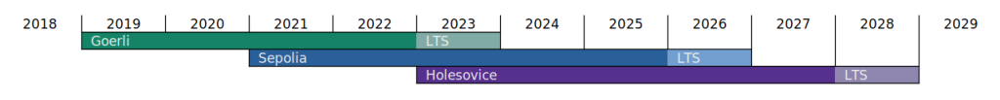

# Görli

:::info
🫡 Görli Testnet: Scheduled End of Life in Q4 2023

The Goerli testnet is set to receive support until the end of 2023.
Please refer to the Ethereum testnets roadmap for a visual representation of the testnet lifecycle:

Approaching this timeline, it's recommended to transition to the [Lido on Holešky](./holesky.md) testnet deployments for future projects.

Note that there will be no comprehensive Lido testnet environments available for Sepolia, due to the network's restricted and permission-based validator set configuration.

:::

## Core protocol

- Lido Locator: [`0x1eDf09b5023DC86737b59dE68a8130De878984f5`](https://goerli.etherscan.io/address/0x1eDf09b5023DC86737b59dE68a8130De878984f5) (proxy)
- Lido and stETH token: [`0x1643E812aE58766192Cf7D2Cf9567dF2C37e9B7F`](https://goerli.etherscan.io/address/0x1643E812aE58766192Cf7D2Cf9567dF2C37e9B7F) (proxy)
- wstETH token: [`0x6320cd32aa674d2898a68ec82e869385fc5f7e2f`](https://goerli.etherscan.io/address/0x6320cd32aa674d2898a68ec82e869385fc5f7e2f)
- EIP-712 helper for stETH: [`0xB4300103FfD326f77FfB3CA54248099Fb29C3b9e`](https://goerli.etherscan.io/address/0xB4300103FfD326f77FfB3CA54248099Fb29C3b9e)
- StakingRouter: [`0xa3Dbd317E53D363176359E10948BA0b1c0A4c820`](https://goerli.etherscan.io/address/0xa3Dbd317E53D363176359E10948BA0b1c0A4c820) (proxy)
- Node Operators registry: [`0x9D4AF1Ee19Dad8857db3a45B0374c81c8A1C6320`](https://goerli.etherscan.io/address/0x9D4AF1Ee19Dad8857db3a45B0374c81c8A1C6320) (proxy)
- Deposit Security module: [`0xe57025E250275cA56f92d76660DEcfc490C7E79A`](https://goerli.etherscan.io/address/0xe57025E250275cA56f92d76660DEcfc490C7E79A)
- Execution Layer Rewards Vault: [`0x94750381bE1AbA0504C666ee1DB118F68f0780D4`](https://goerli.etherscan.io/address/0x94750381bE1AbA0504C666ee1DB118F68f0780D4)
- Withdrawal Queue ERC721: [`0xCF117961421cA9e546cD7f50bC73abCdB3039533`](https://goerli.etherscan.io/address/0xCF117961421cA9e546cD7f50bC73abCdB3039533) (proxy)
- Withdrawal Vault: [`0xdc62f9e8C34be08501Cdef4EBDE0a280f576D762`](https://goerli.etherscan.io/address/0xdc62f9e8C34be08501Cdef4EBDE0a280f576D762) (proxy)
- Burner: [`0x20c61C07C2E2FAb04BF5b4E12ce45a459a18f3B1`](https://goerli.etherscan.io/address/0x20c61C07C2E2FAb04BF5b4E12ce45a459a18f3B1)
- MEV Boost Relay Allowed List: [`0xeabE95AC5f3D64aE16AcBB668Ed0efcd81B721Bc`](https://goerli.etherscan.io/address/0xeabe95ac5f3d64ae16acbb668ed0efcd81b721bc)

## Oracle Contracts

- Accounting Oracle:
  - AccountingOracle: [`0x76f358A842defa0E179a8970767CFf668Fc134d6`](https://goerli.etherscan.io/address/0x76f358A842defa0E179a8970767CFf668Fc134d6) (proxy)
  - HashConsensus: [`0x8d87A8BCF8d4e542fd396D1c50223301c164417b`](https://goerli.etherscan.io/address/0x8d87A8BCF8d4e542fd396D1c50223301c164417b)
- Validators Exit Bus Oracle:
  - ValidatorsExitBusOracle: [`0xb75A55EFab5A8f5224Ae93B34B25741EDd3da98b`](https://goerli.etherscan.io/address/0xb75A55EFab5A8f5224Ae93B34B25741EDd3da98b) (proxy)
  - HashConsensus: [`0x8374B4aC337D7e367Ea1eF54bB29880C3f036A51`](https://goerli.etherscan.io/address/0x8374B4aC337D7e367Ea1eF54bB29880C3f036A51)
- OracleReportSanityChecker: [`0xbf74600040F91D3560d5757280727FB00c64Fd2E`](https://goerli.etherscan.io/address/0xbf74600040F91D3560d5757280727FB00c64Fd2E)
- OracleDaemonConfig: [`0xE9CC5bD91543cdc9788454EE5063E2CD76B5206d`](https://goerli.etherscan.io/address/0xE9CC5bD91543cdc9788454EE5063E2CD76B5206d)
- Legacy Oracle (Lido Oracle before V2, obsolete): [`0x24d8451BC07e7aF4Ba94F69aCDD9ad3c6579D9FB`](https://goerli.etherscan.io/address/0x24d8451BC07e7aF4Ba94F69aCDD9ad3c6579D9FB) (proxy)

## DAO contracts

- Lido DAO (Kernel): [`0x1dD91b354Ebd706aB3Ac7c727455C7BAA164945A`](https://goerli.etherscan.io/address/0x1dD91b354Ebd706aB3Ac7c727455C7BAA164945A) (proxy)
- LDO token: [`0x56340274fB5a72af1A3C6609061c451De7961Bd4`](https://goerli.etherscan.io/address/0x56340274fB5a72af1A3C6609061c451De7961Bd4)
- Aragon Voting: [`0xbc0B67b4553f4CF52a913DE9A6eD0057E2E758Db`](https://goerli.etherscan.io/address/0xbc0B67b4553f4CF52a913DE9A6eD0057E2E758Db) (proxy)
- Aragon Token Manager: [`0xDfe76d11b365f5e0023343A367f0b311701B3bc1`](https://goerli.etherscan.io/address/0xDfe76d11b365f5e0023343A367f0b311701B3bc1) (proxy)
- Aragon Finance: [`0x75c7b1D23f1cad7Fb4D60281d7069E46440BC179`](https://goerli.etherscan.io/address/0x75c7b1D23f1cad7Fb4D60281d7069E46440BC179) (proxy)
- Aragon Agent: [`0x4333218072D5d7008546737786663c38B4D561A4`](https://goerli.etherscan.io/address/0x4333218072D5d7008546737786663c38B4D561A4) (proxy)
- Aragon ACL: [`0xb3CF58412a00282934D3C3E73F49347567516E98`](https://goerli.etherscan.io/address/0xb3CF58412a00282934D3C3E73F49347567516E98)
- Voting Repo: [`0x14de4f901cE0B81F4EfcA594ad7b70935C276806`](https://goerli.etherscan.io/address/0x14de4f901cE0B81F4EfcA594ad7b70935C276806)
- Lido App Repo: [`0xE9eDe497d2417fd980D8B5338232666641B9B9aC`](https://goerli.etherscan.io/address/0xE9eDe497d2417fd980D8B5338232666641B9B9aC)
- Lido Oracle (Legacy Oracle) Repo: [`0x9234e37Adeb44022A078557D9943b72AB89bF36a`](https://goerli.etherscan.io/address/0x9234e37Adeb44022A078557D9943b72AB89bF36a)
- Node Operators Registry Repo: [`0x5F867429616b380f1Ca7a7283Ff18C53a0033073`](https://goerli.etherscan.io/address/0x5F867429616b380f1Ca7a7283Ff18C53a0033073)
- Gate Seal Blueprint: [`0x302F385Ebfc1A8a68105C9f840cDD27E67EE75Bf`](https://goerli.etherscan.io/address/0x302F385Ebfc1A8a68105C9f840cDD27E67EE75Bf)
- Gate Seal Factory: [`0x248C4a34645921C70a591CCc200cb75D6a4C5091`](https://goerli.etherscan.io/address/0x248C4a34645921C70a591CCc200cb75D6a4C5091)
- Gate Seal: [`0xEE656d0C8e9f0646B505a13295C188164a3D8EaC`](https://goerli.etherscan.io/address/0xEE656d0C8e9f0646B505a13295C188164a3D8EaC)

## Reward Programs

- Curve Liquidity Farming:

  - Pool Contract: [`0xCEB67769c63cfFc6C8a6c68e85aBE1Df396B7aDA`](https://goerli.etherscan.io/address/0xCEB67769c63cfFc6C8a6c68e85aBE1Df396B7aDA)

## Easy Track

- EasyTrack: [`0xAf072C8D368E4DD4A9d4fF6A76693887d6ae92Af`](https://goerli.etherscan.io/address/0xAf072C8D368E4DD4A9d4fF6A76693887d6ae92Af)
- EVMScriptExecutor: [`0x3c9AcA237b838c59612d79198685e7f20C7fE783`](https://goerli.etherscan.io/address/0x3c9AcA237b838c59612d79198685e7f20C7fE783)
- IncreaseNodeOperatorStakingLimit: [`0xE033673D83a8a60500BcE02aBd9007ffAB587714`](https://goerli.etherscan.io/address/0xE033673D83a8a60500BcE02aBd9007ffAB587714)
- TopUpLegoProgram: [`0xb2bcf211F103d7F13789394DD475c2274e044C4C`](https://goerli.etherscan.io/address/0xb2bcf211F103d7F13789394DD475c2274e044C4C)
- **reWARDS stETH** (committee ms [`0x3eaE0B337413407FB3C65324735D797ddc7E071D`](https://goerli.etherscan.io/address/0x3eaE0B337413407FB3C65324735D797ddc7E071D))
  - AllowedRecipientsRegistry: [`0x78797efCca6C537BF92FA6b25cBb14A6f1c128A0`](https://goerli.etherscan.io/address/0x78797efCca6C537BF92FA6b25cBb14A6f1c128A0)
  - AddAllowedRecipient: [`0x785A8B1CDC03Bb191670Ed4696e9ED5B11Af910A`](https://goerli.etherscan.io/address/0x785A8B1CDC03Bb191670Ed4696e9ED5B11Af910A)
  - RemoveAllowedRecipient: [`0xEFEa524D1739800fF6F7d2532ED4C8508220239a`](https://goerli.etherscan.io/address/0xEFEa524D1739800fF6F7d2532ED4C8508220239a)
  - TopUpAllowedRecipients: [`0xF2f7FC1E8879c10D4579Bc82D5FEa923A5a228dE`](https://goerli.etherscan.io/address/0xF2f7FC1E8879c10D4579Bc82D5FEa923A5a228dE)
- **Rewards Share stETH** (committee ms [`0xc4094c015666CBC093FffDC9BB3CF077a864ddB3`](https://app.safe.global/gor:0xc4094c015666CBC093FffDC9BB3CF077a864ddB3/home))
  - AllowedRecipientsRegistry: [`0x8b59609f4bEa230E565Ae0C3C7b6913746Df1cF2`](https://goerli.etherscan.io/address/0x8b59609f4bEa230E565Ae0C3C7b6913746Df1cF2)
  - AddAllowedRecipient: [`0x51916FC3D24CbE19c5e981ae8650668A1F5cF19B`](https://goerli.etherscan.io/address/0x51916FC3D24CbE19c5e981ae8650668A1F5cF19B)
  - RemoveAllowedRecipient: [`0x932aab3D6057ed2Beef95471414831C4535600E9`](https://goerli.etherscan.io/address/0x932aab3D6057ed2Beef95471414831C4535600E9)
  - TopUpAllowedRecipients: [`0x5Bb391170899A7b8455A442cca65078ff3E1639C`](https://goerli.etherscan.io/address/0x5Bb391170899A7b8455A442cca65078ff3E1639C)
- **LEGO DAI** (committee ms [`0xc4094c015666CBC093FffDC9BB3CF077a864ddB3`](https://app.safe.global/gor:0xc4094c015666CBC093FffDC9BB3CF077a864ddB3/home))
  - AllowedRecipientsRegistry: [`0x5884f5849414D4317d175fEc144e2F87f699B082`](https://goerli.etherscan.io/address/0x5884f5849414D4317d175fEc144e2F87f699B082)
  - TopUpAllowedRecipients: [`0xbf44eC2b23cA105F8a62e0587900a09A473288c6`](https://goerli.etherscan.io/address/0xbf44eC2b23cA105F8a62e0587900a09A473288c6)
- **LEGO LDO** (committee ms [`0xc4094c015666CBC093FffDC9BB3CF077a864ddB3`](https://app.safe.global/gor:0xc4094c015666CBC093FffDC9BB3CF077a864ddB3/home))
  - AllowedRecipientsRegistry: [`0x6342213719839c56fEe817539863aFB9821B03cb`](https://goerli.etherscan.io/address/0x6342213719839c56fEe817539863aFB9821B03cb)
  - TopUpAllowedRecipients: [`0xc39Dd5B66968e364D99e0c9E7089049351AB89CA`](https://goerli.etherscan.io/address/0xc39Dd5B66968e364D99e0c9E7089049351AB89CA)
- **RCC DAI** (committee ms [`0xc4094c015666CBC093FffDC9BB3CF077a864ddB3`](https://app.safe.global/gor:0xc4094c015666CBC093FffDC9BB3CF077a864ddB3/home))
  - AllowedRecipientsRegistry: [`0x1440E8aDbE3a42a9EDB4b30059df8F6c35205a15`](https://goerli.etherscan.io/address/0x1440E8aDbE3a42a9EDB4b30059df8F6c35205a15)
  - TopUpAllowedRecipients: [`0xd0411e7c4A24E7d4509D5F13AEd19aeb8e5644AB`](https://goerli.etherscan.io/address/0xd0411e7c4A24E7d4509D5F13AEd19aeb8e5644AB)
- **PML DAI** (committee ms [`0xc4094c015666CBC093FffDC9BB3CF077a864ddB3`](https://app.safe.global/gor:0xc4094c015666CBC093FffDC9BB3CF077a864ddB3/home))
  - AllowedRecipientsRegistry: [`0xAadfBd1ADE92d85c967f4aE096141F0F802F46Db`](https://goerli.etherscan.io/address/0xAadfBd1ADE92d85c967f4aE096141F0F802F46Db)
  - TopUpAllowedRecipients: [`0xc749aD24572263887Bc888d3Cb854FCD50eCCB61`](https://goerli.etherscan.io/address/0xc749aD24572263887Bc888d3Cb854FCD50eCCB61)
- **ATC DAI** (committee ms [`0xc4094c015666CBC093FffDC9BB3CF077a864ddB3`](https://app.safe.global/gor:0xc4094c015666CBC093FffDC9BB3CF077a864ddB3/home))
  - AllowedRecipientsRegistry: [`0xedD3B813275e1A88c2283FAfa5bf5396938ef59e`](https://goerli.etherscan.io/address/0xedD3B813275e1A88c2283FAfa5bf5396938ef59e)
  - TopUpAllowedRecipients: [`0xF4b8b5760EE4b5c5Cb154edd0f0841465d821006`](https://goerli.etherscan.io/address/0xF4b8b5760EE4b5c5Cb154edd0f0841465d821006)
- **TRP LDO** (committee ms [`0xcC73e6b8F75326C86B600371576e2C7502627983`](https://app.safe.global/gor:0xcC73e6b8F75326C86B600371576e2C7502627983/home))
  - AllowedRecipientsRegistry: [`0x8C96a6522aEc036C4a384f8B7e05D93d6f3Dae39`](https://goerli.etherscan.io/address/0x8C96a6522aEc036C4a384f8B7e05D93d6f3Dae39)
  - TopUpAllowedRecipients: [`0x43f33C52156d1Fb2eA24d82aBfD342E69835E79f`](https://goerli.etherscan.io/address/0x43f33C52156d1Fb2eA24d82aBfD342E69835E79f)
- **Gas Supply stETH** (committee ms [`0xc4094c015666CBC093FffDC9BB3CF077a864ddB3`](https://app.safe.global/gor:0xc4094c015666CBC093FffDC9BB3CF077a864ddB3/home))
  - AllowedRecipientsRegistry: [`0xF08a5f00824D4554a1FBebaE726609418dc819fb`](https://goerli.etherscan.io/address/0xF08a5f00824D4554a1FBebaE726609418dc819fb)
  - AddAllowedRecipient: [`0xa2286d37Af8F8e84428151bF72922c5Fe5c1EeED`](https://goerli.etherscan.io/address/0xa2286d37Af8F8e84428151bF72922c5Fe5c1EeED)
  - RemoveAllowedRecipient: [`0x48D01979eD9e6CE70a6496B111F5728f9a547C96`](https://goerli.etherscan.io/address/0x48D01979eD9e6CE70a6496B111F5728f9a547C96)
  - TopUpAllowedRecipients: [`0x960CcA0BE6419e9684796Ce3ABE980E8a2d0cd80`](https://goerli.etherscan.io/address/0x960CcA0BE6419e9684796Ce3ABE980E8a2d0cd80)

## Protocol mocks (obsolete)

- Lido and stETH token: [0x2DD6530F136D2B56330792D46aF959D9EA62E276](https://goerli.etherscan.io/address/0x2DD6530F136D2B56330792D46aF959D9EA62E276)
- wstETH token: [0x4942BBAf745f235e525BAff49D31450810EDed5b](https://goerli.etherscan.io/address/0x4942BBAf745f235e525BAff49D31450810EDed5b)
- Node Operators registry: [0x993a1A1745ea09fAbf8dA7EFCD57CD46c889f8B9](https://goerli.etherscan.io/address/0x993a1A1745ea09fAbf8dA7EFCD57CD46c889f8B9)
- DepositContractMock: [0x924B2BB40AfEf29e908bbCaAaE0DBe957d076b4F](https://goerli.etherscan.io/address/0x924B2BB40AfEf29e908bbCaAaE0DBe957d076b4F)

## DAO-ops contracts & addresses

- TRP VestingEscrowFactory: [`0x8D20FD1Ac547e035BF01089cFb92459054F82Ff7`](https://goerli.etherscan.io/address/0x8D20FD1Ac547e035BF01089cFb92459054F82Ff7)

## Lido on L2

### Arbitrum

##### Ethereum part

- L1ERC20TokenGateway: [`0x0ecCFbBEe34f04187361818832385EB4cC11b678`](https://goerli.etherscan.io/address/0x0ecCFbBEe34f04187361818832385EB4cC11b678) (proxy)
- L1ERC20TokenGateway: [`0xd16d006Afbdf4bFbab994685878618B0a9ebF4b2`](https://goerli.etherscan.io/address/0xd16d006Afbdf4bFbab994685878618B0a9ebF4b2) (impl)

##### Arbitrum part

- WstETH ERC20Bridged: [`0xbED18985eC648Ce4b0C5Fc3061d1323116702BC4`](https://goerli.arbiscan.io/address/0xbED18985eC648Ce4b0C5Fc3061d1323116702BC4) (proxy)
- WstETH ERC20Bridged: [`0x944eda38422a1E3A1F36899109330683260D5bB7`](https://goerli.arbiscan.io/address/0x944eda38422a1E3A1F36899109330683260D5bB7) (impl)
- L2ERC20TokenGateway: [`0x12dD5832Fd7e02e49d97D1CBBd14579794945c1E`](https://goerli.arbiscan.io/address/0x12dD5832Fd7e02e49d97D1CBBd14579794945c1E) (proxy)
- L2ERC20TokenGateway: [`0x3B6DFc77Bc3fB6f893D1c356b9e81E3d44E73DFE`](https://goerli.arbiscan.io/address/0x3B6DFc77Bc3fB6f893D1c356b9e81E3d44E73DFE) (impl)
- Arbitrum Governance Bridge Executor: [`0x43De3B7115baA4EbAbd7c5Eaf4cB2856238C6A50`](https://goerli.arbiscan.io/address/0x43De3B7115baA4EbAbd7c5Eaf4cB2856238C6A50)
- LDO token: [`0xe04554C3d1a172581597505D7061C418226EdC23`](https://goerli.arbiscan.io/address/0xe04554C3d1a172581597505D7061C418226EdC23) (proxy)

### Optimism

##### Ethereum part

- L1ERC20TokenBridge: [`0xDdC89Bd27F9A1C47A5c20dF0783dE52f55513598`](https://goerli.etherscan.io/address/0xDdC89Bd27F9A1C47A5c20dF0783dE52f55513598) (proxy)
- L1ERC20TokenBridge: [`0xb291a7f092D5cCE0A3C93eA21Bda3431129dB202`](https://goerli.etherscan.io/address/0xb291a7f092D5cCE0A3C93eA21Bda3431129dB202) (impl)

##### Optimism part

- WstETH ERC20Bridged: [`0xe8964a99d5DE7cEE2743B20113a52C953b0916E9`](https://goerli-optimism.etherscan.io/address/0xe8964a99d5DE7cEE2743B20113a52C953b0916E9) (proxy)
- WstETH ERC20Bridged: [`0x2770f1E47f6cFC88189320d5760f958269b23CC3`](https://goerli-optimism.etherscan.io/address/0x2770f1E47f6cFC88189320d5760f958269b23CC3) (impl)
- L2ERC20TokenBridge: [`0x423702bC3Fb92f59Be440354456f0481934bF1f5`](https://goerli-optimism.etherscan.io/address/0x423702bC3Fb92f59Be440354456f0481934bF1f5) (proxy)
- L2ERC20TokenBridge: [`0x04A1Ac7C5c08eD244f1d69EbB682984Ba7dBf93C`](https://goerli-optimism.etherscan.io/address/0x04A1Ac7C5c08eD244f1d69EbB682984Ba7dBf93C) (impl)
- Optimism Governance Bridge Executor: [`0x55C39356C714Cde16F8a80302c1Ce9DfAC6f5a35`](https://goerli-optimism.etherscan.io/address/0x55C39356C714Cde16F8a80302c1Ce9DfAC6f5a35)
- LDO token: [`0xE265FC71d45fd791c9ebf3EE0a53FBB220Eb8f75`](https://goerli-optimism.etherscan.io/address/0xE265FC71d45fd791c9ebf3EE0a53FBB220Eb8f75)

### Base

#### Ethereum part

- L1ERC20TokenBridge: [`0x4522be59f3C5cebDB798832ee34033Ea9345B452`](https://goerli.etherscan.io/address/0x4522be59f3C5cebDB798832ee34033Ea9345B452) (proxy)
- L1ERC20TokenBridge: [`0x7F6437Cec90f2b87663cc3c4360E9d4A06AE1B36`](https://goerli.etherscan.io/address/0x7F6437Cec90f2b87663cc3c4360E9d4A06AE1B36) (impl)

#### Base part

- WstETH ERC20Bridged: [`0x20727785a5e1b2874349948bD50caB5597B51F66`](https://goerli.basescan.org/address/0x20727785a5e1b2874349948bD50caB5597B51F66) (proxy)
- WstETH ERC20Bridged: [`0x589577FB4c1236820d90Cd4DE37eB3d66eA8a264`](https://goerli.basescan.org/address/0x589577FB4c1236820d90Cd4DE37eB3d66eA8a264) (impl)
- L2ERC20TokenBridge: [`0x21f3e20f8347f6a78745D12B5454e54Bb78B5B62`](https://goerli.basescan.org/address/0x21f3e20f8347f6a78745D12B5454e54Bb78B5B62) (proxy)
- L2ERC20TokenBridge: [`0xec5d1485eC5fbC0F1b56692D2966236bD33B0535`](https://goerli.basescan.org/address/0xec5d1485eC5fbC0F1b56692D2966236bD33B0535) (impl)
- Base Governance Bridge Executor (`OptimismBridgeExecutor` contract is used): [`0xaBeA917846b36Ef193e5532AF0534EB12E1EEc01`](https://goerli.basescan.org/address/0xaBeA917846b36Ef193e5532AF0534EB12E1EEc01)

### ZkSync Era

#### Ethereum part

- L1Executor: [`0xfDF0c6812f10e803757e4A392df019cAdf2Ae0AA`](https://goerli.etherscan.io/address/0xfDF0c6812f10e803757e4A392df019cAdf2Ae0AA) (proxy)
- L1Executor: [`0xBe98f3ac3e9304C50F29c940D5f59673a1Ae4C14`](https://goerli.etherscan.io/address/0xBe98f3ac3e9304C50F29c940D5f59673a1Ae4C14) (impl)
- L1ERC20Bridge: [`0x075b90554C6cE93636B2E63C99EE704f8CC1C2f3`](https://goerli.etherscan.io/address/0x075b90554C6cE93636B2E63C99EE704f8CC1C2f3) (proxy)
- L1ERC20Bridge: [`0xc3f1A4C13532cc9DDeA36B54d83A427B8D4AaeEe`](https://goerli.etherscan.io/address/0xc3f1A4C13532cc9DDeA36B54d83A427B8D4AaeEe) (impl)

#### ZkSync Era part

- ZkSyncBridgeExecutor: [`0x4097BC99a9B5fB253B938d105111FFcb862Be668`](https://goerli.explorer.zksync.io/address/0x4097BC99a9B5fB253B938d105111FFcb862Be668) (proxy)
- ZkSyncBridgeExecutor: [`0x213ec81bB9740c75d2BC186378cf734F9306e7e5`](https://goerli.explorer.zksync.io/address/0x213ec81bB9740c75d2BC186378cf734F9306e7e5) (impl)
- L2ERC20Bridge: [`0x0E1E4af13Bb95C84275b52b6edE1cb5F8c11Abe7`](https://goerli.explorer.zksync.io/address/0x0E1E4af13Bb95C84275b52b6edE1cb5F8c11Abe7) (proxy)
- L2ERC20Bridge: [`0xfD744ba1867B6e6da437bce3ba44f5898A72B9c3`](https://goerli.explorer.zksync.io/address/0xfD744ba1867B6e6da437bce3ba44f5898A72B9c3) (impl)
- ERC20BridgedUpgradeable: [`0x6750967d6e4712Ae6cF9401a87dc34642339E0Ef`](https://goerli.explorer.zksync.io/address/0x6750967d6e4712Ae6cF9401a87dc34642339E0Ef) (proxy)
- ERC20BridgedUpgradeable: [`0x75e79BCe0F5a81b6D0097CCB473D867940A4C2Ca`](https://goerli.explorer.zksync.io/address/0x75e79BCe0F5a81b6D0097CCB473D867940A4C2Ca) (impl)
- ProxyAdmin: [`0xe7e7befca267e5967e20d135941535a2396ccdf4`](https://goerli.explorer.zksync.io/address/0xe7e7befca267e5967e20d135941535a2396ccdf4) for
  - ZkSyncBridgeExecutor
  - ERC20BridgedUpgradeable

### Mantle

#### Ethereum part

- L1ERC20TokenBridge: [`0xBc6bbb98E73D15cc6a280e96b32Cc73b4f9068E1`](https://goerli.etherscan.io/address/0xBc6bbb98E73D15cc6a280e96b32Cc73b4f9068E1) (proxy)
- L1ERC20TokenBridge: [`0x8bed2E40522E21119B8A78A4842767c9bCceC47b`](https://goerli.etherscan.io/address/0x8bed2E40522E21119B8A78A4842767c9bCceC47b) (impl)

#### Mantle part

- WstETH ERC20BridgedPermit: [`0x2C402BE58E5849c5413a79aa3b8aF3136e6C017F`](https://explorer.testnet.mantle.xyz/address/0x2C402BE58E5849c5413a79aa3b8aF3136e6C017F) (proxy)
- WstETH ERC20BridgedPermit: [`0x1008C85f796314c0985639b1a03083Be53eEf5aA`](https://explorer.testnet.mantle.xyz/address/0x1008C85f796314c0985639b1a03083Be53eEf5aA) (impl)
- L2ERC20TokenBridge: [`0xFCCC4297be972bb2861Da6D78a6fad588dF03ab1`](https://explorer.testnet.mantle.xyz/address/0xFCCC4297be972bb2861Da6D78a6fad588dF03ab1) (proxy)
- L2ERC20TokenBridge: [`0x7Aa9EEEcECD56Bd43Bb66ee1B42dBEB754792C84`](https://explorer.testnet.mantle.xyz/address/0x7Aa9EEEcECD56Bd43Bb66ee1B42dBEB754792C84) (impl)
- Mantle Governance Bridge Executor (`OptimismBridgeExecutor` contract is used): [`0xa09BA6f7660C616D2B45218b3169c855A695328f`](https://explorer.testnet.mantle.xyz/address/0xa09BA6f7660C616D2B45218b3169c855A695328f)

### Linea

#### Ethereum part

- L1 TokenBridge (Canonical Bridge): [`0xaa012d038e6440535ec66edf2da592f4f8398133`](https://goerli.etherscan.io/address/0xaa012d038e6440535ec66edf2da592f4f8398133) (proxy)
- L1 TokenBridge (Canonical Bridge): [`0x6E4437828B4A7E7730e3D7efC676E22Ce905B705`](https://goerli.etherscan.io/address/0x6e4437828b4a7e7730e3d7efc676e22ce905b705) (impl)
- ProxyAdmin for L1 TokenBridge: [`0xE80528ac405ffd62cE439593cE74C20726048F62`](https://goerli.etherscan.io/address/0xE80528ac405ffd62cE439593cE74C20726048F62)

#### Linea part

- wstETH CustomBridgedToken: [`0x9ceed01e39279a529f44deb9d35e09a04b1e67c8`](https://goerli.lineascan.build/address/0x9ceed01e39279a529f44deb9d35e09a04b1e67c8) (proxy)
- wstETH CustomBridgedToken: [`0x2bb4036e0cdd52c2134a95b6249eb89e5f6bc7f1`](https://goerli.lineascan.build/address/0x2bb4036e0cdd52c2134a95b6249eb89e5f6bc7f1) (impl)
- ProxyAdmin for wstETH CustomBridgedToken: [`0x71062fbc3da2d792285c3d5dabba12a42339e85c`](https://goerli.lineascan.build/address/0x71062fbc3da2d792285c3d5dabba12a42339e85c)
- L2 TokenBridge (Canonical Bridge): [`0xb191e3d98074f92584e5205b99c3f17fb2068927`](https://goerli.lineascan.build/address/0xb191e3d98074f92584e5205b99c3f17fb2068927) (proxy)
- L2 TokenBridge (Canonical Bridge): [`0x6081c1392793e22da39871d4362c1e7045a5bace`](https://goerli.lineascan.build/address/0x6081c1392793e22da39871d4362c1e7045a5bace) (impl)
- LineaBridgeExecutor: [`0x4b38d24e70079f2dd1d79b86e2b52f4b13872a3b`](https://goerli.lineascan.build/address/0x4b38d24e70079f2dd1d79b86e2b52f4b13872a3b)
