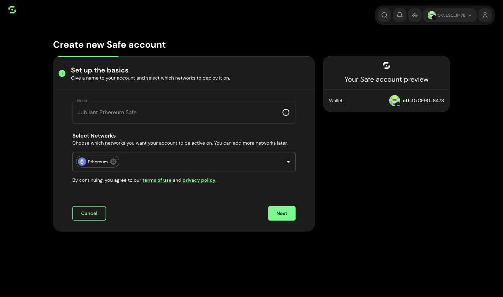
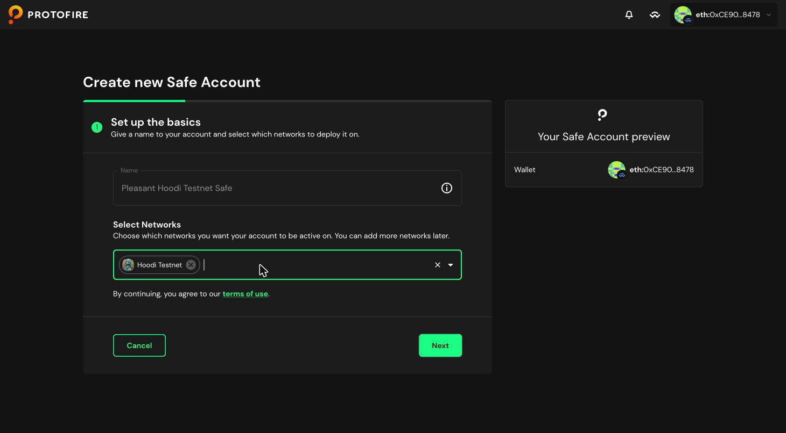
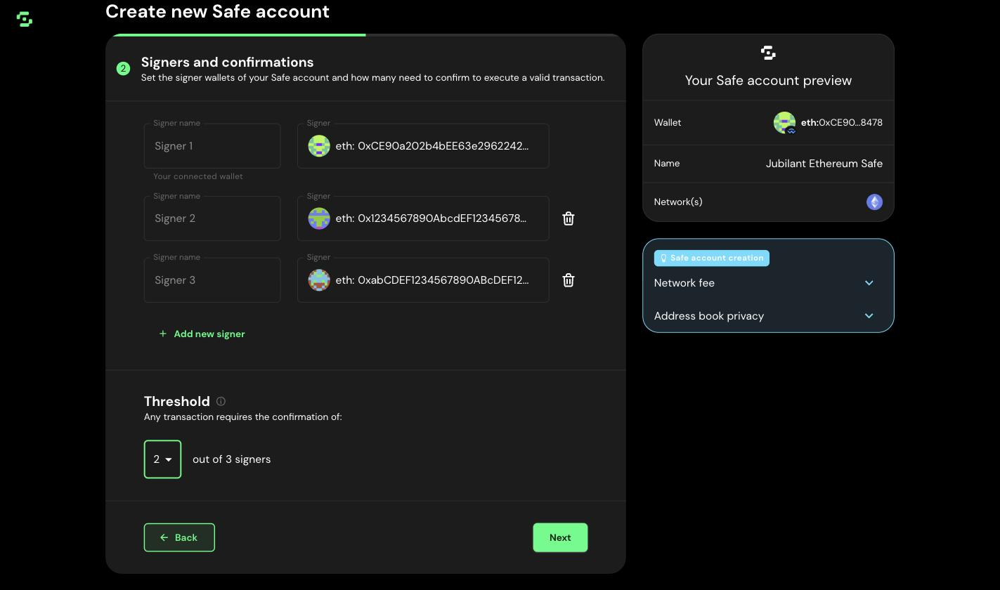
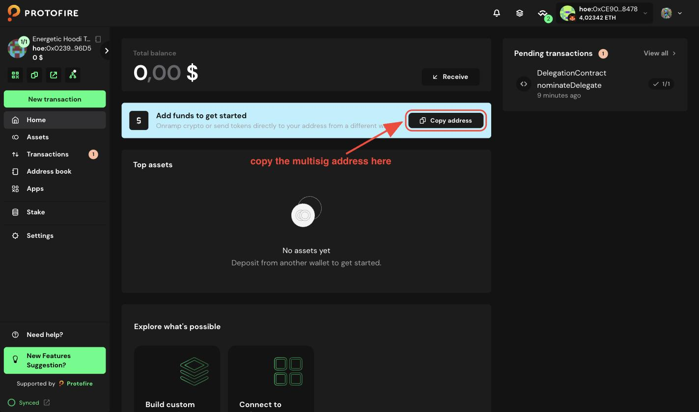
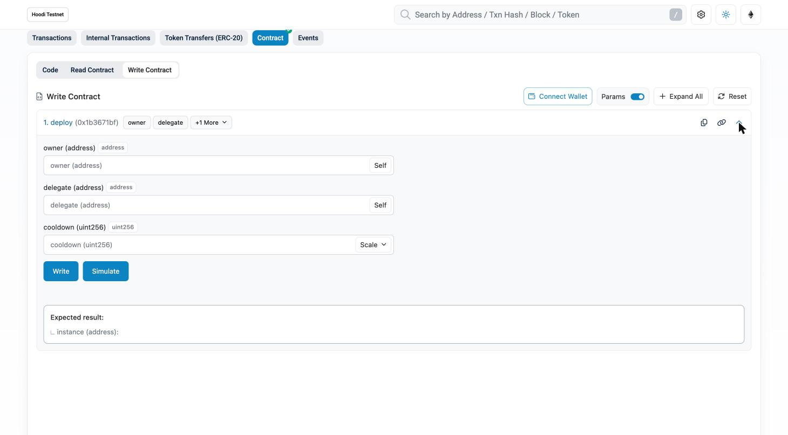
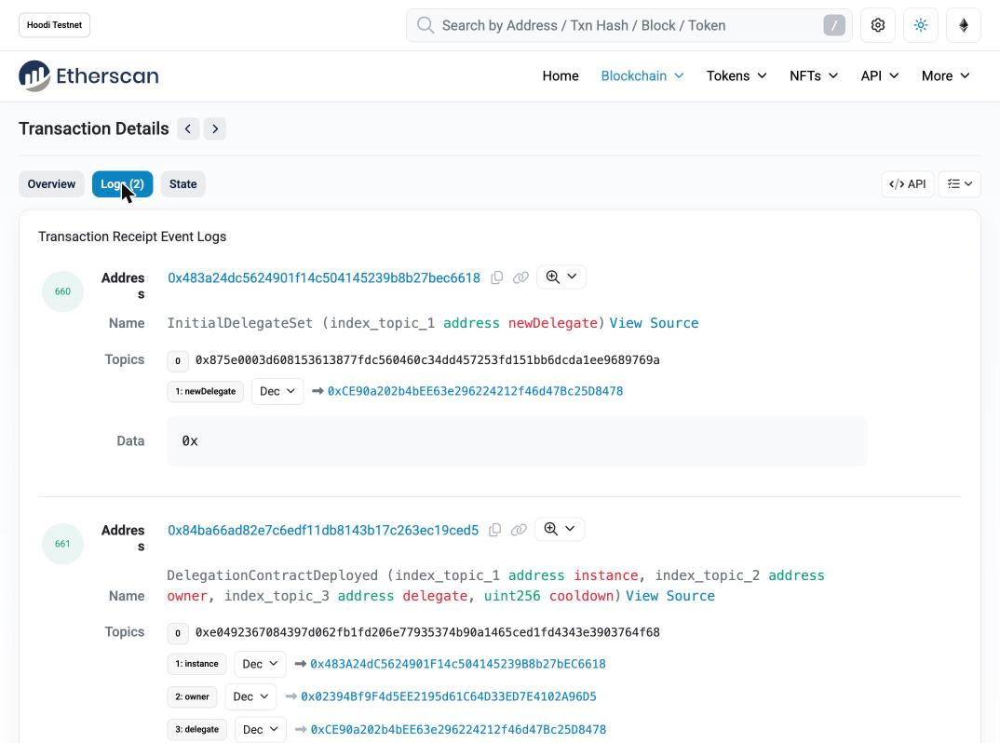
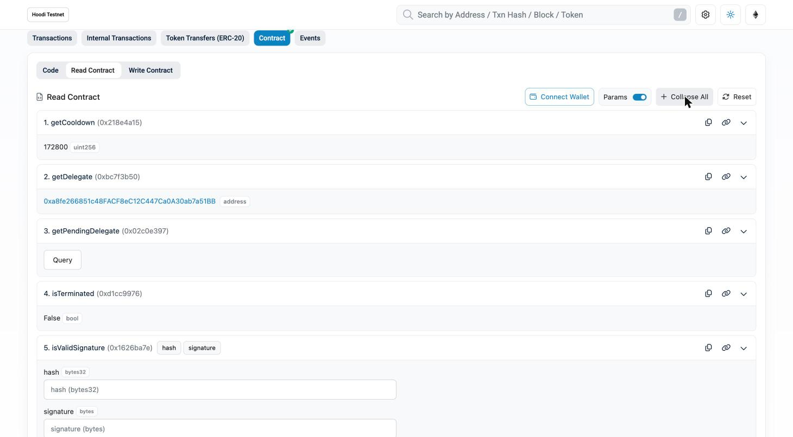

# EDF Operator Guide — Lido Oracle & Council Daemon

Setup instructions for operators (key holders) of a Lido Oracle seat or a DSM guardian seat moving to the **Execution Delegation Framework (EDF)**.

**Reference material:**

- [LIP-37: Execution Delegation Framework](https://github.com/lidofinance/lido-improvement-proposals/blob/develop/LIPS/lip-37.md) — the proposal
- [execution-delegation-framework](https://github.com/lidofinance/execution-delegation-framework) — the contracts, [architecture](https://github.com/lidofinance/execution-delegation-framework/blob/main/docs/architecture.md), [usage guide](https://github.com/lidofinance/execution-delegation-framework/blob/main/docs/usage.md)
- [EDF Operator Key Custody Policy](./key-custody-policy-for-edf-operators.md) — the rules you must follow
- [EDF Rotation and Incidents](./edf-rotation-and-incidents.md) — what to do after the setup

---

## What changes

The protocol permission moves from your hot key to a contract you own — your `DelegationContract`.
Your hot key becomes its **delegate**, and you can rotate or revoke it yourself, with no vote.

| | Before EDF | After EDF |
| --- | --- | --- |
| Who holds the Oracle / guardian seat | your hot EOA | your `DelegationContract` |
| Who signs and pays gas | your hot EOA | your delegate EOA (still a hot key) |
| Rotating the hot key | governance vote, ~10 days | `nominateDelegate()`, effective after 48 h |
| Killing a stolen hot key | governance vote | `revokeDelegate()`, effective immediately |
| Who can call `nominateDelegate` / `revokeDelegate` | — | **multisig participants** |

Two key classes:

- **Owner key** — a **Safe multisig**, 2-of-3 or stronger, with hardware cold wallets recommended
  for the signers. Called **the multisig** everywhere below.
- **Delegate key** — the hot key on the daemon host.

---

## Part 0 — Set up the owner multisig

The owner address and the cooldown are fixed at deployment and **cannot be changed on-chain**.
Redoing them means a new `DelegationContract` and a governance vote.

### 0.1. Read the custody policy

Read the [Key Custody Policy](./key-custody-policy-for-edf-operators.md) before you generate
anything. Two of its values are irreversible:

- the **owner address** — your multisig (step 0.2);
- the **cooldown** — **48 hours = `172800` seconds**.

### 0.2. Prepare the owner multisig

Create the multisig that will own your `DelegationContract`:

| Network | Where to create the multisig |
| --- | --- |
| Ethereum mainnet | [app.safe.global](https://app.safe.global/welcome/spaces) |
| Hoodi | [app.safe.protofire.io](https://app.safe.protofire.io/welcome) — the official Safe UI does not support Hoodi |

Pick the network first — one multisig per network:



On Hoodi the wizard is the same, at [app.safe.protofire.io](https://app.safe.protofire.io/welcome):



Requirements:

- **at least 3 signers, threshold at least 2** (2-of-3 or stronger);
- this multisig is used for **nothing else** — no treasury, no other roles.



**Recommended:** every signer a **hardware cold wallet** (Ledger, Trezor). A software wallet is
acceptable.

Write down who the signers are and how to reach them out of hours.

---

## Part 1 — Set up your seat

### 1.1. Generate the delegate hot key

Generate a fresh key. Do not reuse the EOA that holds your seat today.

### 1.2. Deploy your `DelegationContract` from the factory

The `DelegationFactory` is already deployed by the Lido contributors — you only call it.

| Network | `DelegationFactory` address |
| --- | --- |
| Ethereum mainnet | [`0xD990770eB2B4b6062EDdB06892fF179C693b46e6`](https://etherscan.io/address/0xD990770eB2B4b6062EDdB06892fF179C693b46e6#code) |
| Hoodi | [`0xEb49f72DB1546B0E63e1114E2e403edbcE722AE6`](https://hoodi.etherscan.io/address/0xEb49f72DB1546B0E63e1114E2e403edbcE722AE6#code) |

**Do not accept a factory address from chat or DM.** Take it from the table above or from the
[Deployed Instances table](https://github.com/lidofinance/execution-delegation-framework#deployed-instances),
and check that Etherscan shows it verified under the name `DelegationFactory`.

The call:

```
deploy(address owner, address delegate, uint256 cooldown)
```

Copy the multisig address from its dashboard:



| Argument | Value |
| --- | --- |
| `owner` | your multisig address from its dashboard (see screenshot) |
| `delegate` | your delegate EOA from step 1.1 |
| `cooldown` | `172800` (48 hours) |

`owner` and `delegate` must be different addresses, and `delegate` must not be `address(0)`.

**In Etherscan** (or Blockscout, Otterscan):

1. Open the factory address → **Contract** → **Write Contract**.
2. **Connect to Web3** with your owner multisig through WalletConnect — the same flow as in the
   [Safe + Etherscan example](./edf-rotation-and-incidents.md). Deploying from the multisig also
   verifies that you control the owner address.
3. Expand `deploy`, fill in the three values, send the transaction.

   

4. Open the transaction → **Logs** tab → `DelegationContractDeployed(instance, owner, delegate,
   cooldown)`. Save the **`instance`** address: that is your `DelegationContract`.

   

### 1.3. Verify what you deployed

Open your `DelegationContract` on Etherscan → **Contract** → **Read Contract**:

| Method | Expected |
| --- | --- |
| `owner()` | your multisig address |
| `getDelegate()` | your delegate EOA |
| `getPendingDelegate()` | `0x0000…0000`, `0` |
| `getCooldown()` | `172800` |
| `isTerminated()` | `false` |

Press **Expand All** to see every value at once:



Open the deploy transaction's **Logs** tab and confirm `InitialDelegateSet(newDelegate)` carries the
delegate address you intended.

From a terminal:

```bash
cast call <contract> "owner()(address)"        --rpc-url $RPC_URL   # your multisig
cast call <contract> "getDelegate()(address)"  --rpc-url $RPC_URL   # your delegate EOA
cast call <contract> "getPendingDelegate()(address,uint256)" --rpc-url $RPC_URL   # 0x0…0, 0
cast call <contract> "getCooldown()(uint256)"  --rpc-url $RPC_URL   # 172800
cast call <contract> "isTerminated()(bool)"    --rpc-url $RPC_URL   # false
```

If anything does not match, the deploy parameters were wrong — deploy another contract from the
factory.

### 1.4. Set up your own monitoring and alerts

Lido runs protocol-wide monitoring; monitor your own contract independently.

**Should page a human 24/7** — events on your `DelegationContract`:

- `DelegateNominated(newDelegate, activeFrom)` — if you did not do it, your multisig is compromised.
  React before `activeFrom` (48 h).
- `DelegateRevoked(revokedDelegate)`
- `Terminated()`

Route these to a phone.

**Should alert** — unusual delegate activity:

- `execute()` calls to targets your daemon never calls, or to an EOA;
- non-zero `msg.value` forwarded through `execute()`;
- direct transactions from the delegate EOA that your daemon did not send.

### 1.5. Publish your addresses

For a testnet seat, the internal operators' Telegram chat is enough. The forum post is for mainnet.

Post in the LIP-37 thread on the Lido research forum:

**→ [LIP-37: Execution Delegation Framework (EDF)](https://research.lido.fi/t/lip-37-execution-delegation-framework-edf/11746/6)**

Copy the block below, fill in the addresses, and keep only the lines that are true. If a line is not
true yet, finish that step first.

```markdown
**Seat:** Lido Oracle / DSM guardian
**DelegationContract:** <PASTE address here>
**Owner multisig:** <PASTE address here>
**Delegate EOA:** <PASTE address here>

- [x] I have read the EDF Operator Key Custody Policy and my setup follows it
- [x] I created a dedicated owner multisig, at least 2-of-3, with signers held by different people
      on different devices
- [x] The multisig is used for nothing except this delegation contract
- [x] I deployed my DelegationContract from the official DelegationFactory, with a 48-hour
      (172800 s) cooldown
- [x] I verified on-chain that owner(), getDelegate(), getCooldown() and isTerminated() are what I
      intended
- [x] I set up 24/7 alerts on DelegateNominated, DelegateRevoked and Terminated
```

---

## Part 2 — Configure the Lido Oracle

> Follow **Part 2** if you run the Lido Oracle, **Part 3** if you run the Council daemon.

### 2.1. Configure the oracle

1. **Set the environment variables.**

   | Variable | Value |
   | --- | --- |
   | `DELEGATION_CONTRACT_ADDRESS` | Your `DelegationContract` address. When empty, delegation is off. |
   | `MEMBER_PRIV_KEY` / `MEMBER_PRIV_KEY_FILE` | **The old key** — your existing member EOA. |
   | `MEMBER_PRIV_KEY_2` / `MEMBER_PRIV_KEY_2_FILE` | **The new key** — the delegate of your `DelegationContract`. |

   ```bash
   DELEGATION_CONTRACT_ADDRESS=0xYourDelegationContract
   MEMBER_PRIV_KEY=0xoldmemberkey      # old - active until the vote
   MEMBER_PRIV_KEY_2=0xnewdelegatekey  # new - takes over after the vote
   ```

2. **Restart the oracle.**

### 2.2. Check that the oracle works — in the logs

At startup:

- `Initialize delegation contract.` with your address — config is read correctly.
- `Delegation contract is a member, but its current delegate matches none of the configured
  accounts.` — fix the config.
- `None of the configured accounts is an active member.` — fix the config.
- `Provided Account is not part of Oracle's members and has no submit role.` — fix the config.

### 2.3. Report your oracle setup in the operators' chat

After the oracle setup is ready, write an announcement in the holders' Telegram chat, before the
governance vote:

```markdown
Oracle daemon ready for EDF — DelegationContract <PASTE address here>

- [x] DELEGATION_CONTRACT_ADDRESS is set to my DelegationContract
- [x] Both keys are configured: MEMBER_PRIV_KEY (old member EOA) and MEMBER_PRIV_KEY_2 (new
      delegate)
- [x] I restarted the oracle and saw no configuration errors in the logs
```

### 2.4. After the governance vote

#### Check the delegated path on Etherscan

Reports now arrive as **internal transactions**: the delegate calls `execute()` on your
`DelegationContract`, which calls the oracle contract. Check three address pages:

| Open | Tab | What you must see |
| --- | --- | --- |
| your `DelegationContract` | **Internal Transactions** | outgoing calls to the oracle contracts, starting at the moment the delegate became effective |
| your **old** member EOA | **Transactions** | its calls to the oracle contracts **stopped** at that same moment |
| your **new** delegate EOA | **Transactions** | calls to your `DelegationContract` and **nothing else** |

If the delegate EOA is calling an oracle contract **directly**, `DELEGATION_CONTRACT_ADDRESS` is
unset or wrong — fix the config.

#### Retire the old key

> **⚠ Do this only once the new delegate has produced a successful report** and the checks above
> pass. Not when the vote passes, and not when `getDelegate()` returns the new address.

1. Move the delegate key into `MEMBER_PRIV_KEY` and clear `MEMBER_PRIV_KEY_2`.
2. Restart the oracle.
3. Delete the old key from your secrets store.
4. Move the old address's remaining balance to the new delegate address.

---

## Part 3 — Configure the Council daemon (DSM guardian)

### 3.1. Configure the council daemon

1. **Set the environment variables.**

   | Variable | Value |
   | --- | --- |
   | `DELEGATION_CONTRACT_ADDRESS` | Your `DelegationContract` address. Config validation **fails at startup** if it is empty or not a valid address — even while the DSM is still on v4. |
   | `WALLET_PRIVATE_KEY` / `WALLET_PRIVATE_KEY_FILE` | **The old key** — your existing guardian EOA. Used while the DSM is on v4. |
   | `WALLET_PRIVATE_KEY_2` / `WALLET_PRIVATE_KEY_2_FILE` | **The new key** — the delegate of your `DelegationContract`. |

   ```bash
   DELEGATION_CONTRACT_ADDRESS=0xYourDelegationContract
   WALLET_PRIVATE_KEY=0xoldguardiankey     # old - active until DSM v5
   WALLET_PRIVATE_KEY_2=0xnewdelegatekey   # new - takes over at DSM v5
   ```

2. **Restart the daemon.**

### 3.2. Check that the daemon works — in the logs

The daemon reports its mode on every processed block:

```
Guardian execution mode: edf
  delegateAddress: 0x...   ← the hot key actually in use
  guardianAddress: 0x...   ← your DelegationContract
  dsmAddress: 0x...
  dsmVersion: 5
```

Errors you may hit, and what they mean:

| Error | Meaning |
| --- | --- |
| `DELEGATION_CONTRACT_ADDRESS is required for DSM version 5` | Variable not set. |
| `No contract code at DELEGATION_CONTRACT_ADDRESS 0x…` | Wrong address, or wrong network. |
| `DelegationContract 0x… is terminated` | Someone called `terminate()`. The seat is permanently dead. |
| `DelegationContract 0x… has no active delegate` | The delegate was revoked, or never set. Expected right after an emergency revocation. |
| `DelegationContract 0x… does not support ERC-1271` | The address is not an EDF delegation contract. |
| `No configured wallet private key matches active delegate 0x…` | The on-chain delegate is neither `WALLET_PRIVATE_KEY` nor `WALLET_PRIVATE_KEY_2`. Add the key and restart. |
| `An error occurred when sending a message using Data Bus` with `UNPREDICTABLE_GAS_LIMIT` | The delegate EOA has no xDAI on the DataBus chain, so `estimateGas` fails with "gas required exceeds allowance (0)". Fund the delegate EOA on Gnosis (step 3.1.2). The daemon also warns with `DataBusService account balance is too low`. |

### 3.3. Report your council setup in the operators' chat

After the council daemon setup is ready, write an announcement in the holders' Telegram chat, before
the governance vote:

```markdown
Council daemon ready for EDF — DelegationContract <PASTE address here>

- [x] DELEGATION_CONTRACT_ADDRESS is set to my DelegationContract
- [x] Both keys are configured: WALLET_PRIVATE_KEY (old guardian EOA) and WALLET_PRIVATE_KEY_2
      (new delegate)
- [x] I restarted the daemon and saw no configuration errors in the logs
```

### 3.4. After the governance vote

#### Check the delegated path on Etherscan

A guardian writes on-chain rarely — only `pauseDeposits` and `unvetSigningKeys` produce
transactions, and they now arrive as **internal transactions** through your `DelegationContract`.
Check three address pages:

| Open | Tab | What you must see |
| --- | --- | --- |
| your `DelegationContract` | **Internal Transactions** | calls to the DSM — empty until the first pause or unvet, which is normal |
| your **old** guardian EOA | **Transactions** | its calls to the DSM **stopped** at the cutover |
| your **new** delegate EOA | **Transactions** | calls to your `DelegationContract`, plus messages to the DataBus contract on the DataBus chain — never a direct call to the DSM |

A transaction sent **directly** from the delegate EOA to the DSM means the daemon is still in
`legacy-eoa` mode, or the delegate key was configured as a plain guardian somewhere.

#### Retire the old key

> **⚠ Do this only once the daemon is confirmed running in `edf` mode** — the log reading
> `Guardian execution mode: edf` with `dsmVersion: 5`, and pings and messages still flowing.

1. Move the delegate key into `WALLET_PRIVATE_KEY` and clear `WALLET_PRIVATE_KEY_2`.
2. Restart the daemon.
3. Delete the old key from your secrets store.
4. Move the old address's remaining balance to the new delegate address - on Ethereum and on the
   DataBus chain (Gnosis), if you have not done it in step 3.1.2 yet.

---

Setup is done. Routine key rotation and emergency procedures are in
**[EDF Rotation and Incidents](./edf-rotation-and-incidents.md)**.
