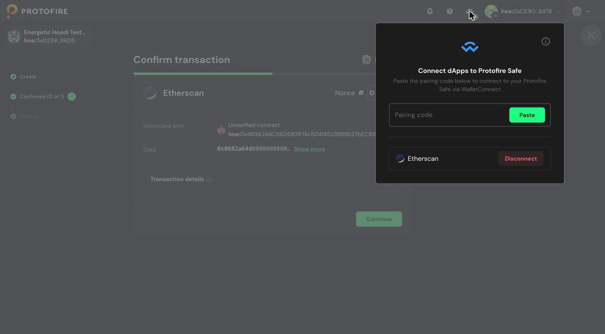
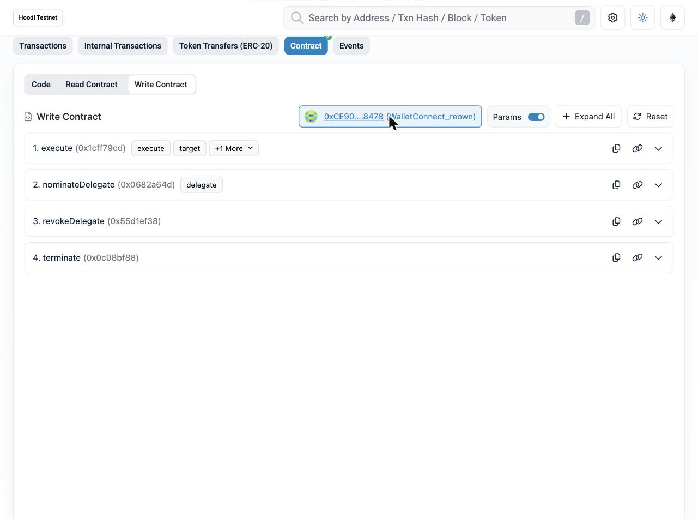
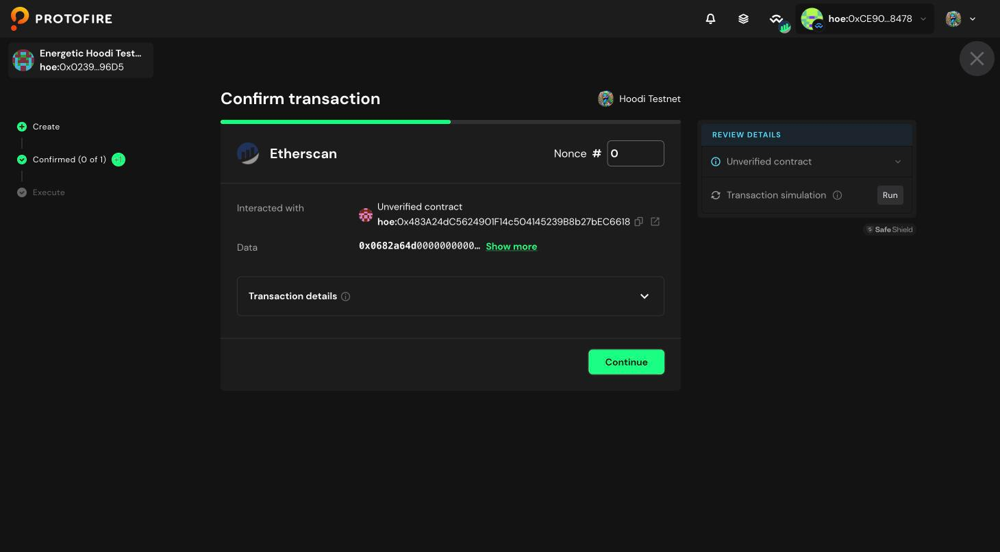

# EDF Rotation and Incidents

Delegate key rotation and emergency procedures for an EDF seat.

- [EDF Operator Guide](./edf-operator-guide.md) — the setup
- [EDF Operator Key Custody Policy](./key-custody-policy-for-edf-operators.md) — the rules you must
  follow

<details>
<summary><b>Example: running an Etherscan Hoodi transaction from a Safe wallet</b></summary>

`nominateDelegate`, `revokeDelegate` and `terminate` are `onlyOwner` — the caller must be the
multisig. A plain MetaMask connection sends them from your own EOA and they revert with `NotOwner`.

1. Open your `DelegationContract` on Etherscan → **Contract** → **Write Contract** →
   **Connect Wallet** → **WalletConnect** → **All Wallets**. A QR code appears — copy the pairing
   link (`wc:...`) next to it. Do **not** pick MetaMask.
2. In the Safe UI, click the **WalletConnect** icon in the header, paste the link into
   **Pairing code**, and approve the session. The link expires within minutes — paste it right
   after copying.

   

3. Etherscan's header must now show the **multisig address**, not your EOA.
4. Fill in the method and press **Write**.

   

5. The call lands in the multisig queue. Signers confirm it with their own wallets, then anyone
   executes it and pays the gas.

   

</details>

---

## Routine rotation

Rotate at least **once a year**; quarterly is recommended. Also rotate when an engineer with host or
secrets access leaves, when the host is rebuilt from an untrusted image, or when the key's history
is unknown.

1. **Generate** the new key on the target host (step 1.1 of the guide applies).
2. **Announce** at least **1 day** ahead on the research forum and in the operators' channel.
   Oracle operators: also send the new delegate address to node operators for their
   `ORACLE_ADDRESSES_ALLOWLIST`.
3. **Stage it in the daemon**, keeping the current key in place:
   - **Oracle:** set `MEMBER_PRIV_KEY_2` to the new key. Restart once.
   - **Council:** set `WALLET_PRIVATE_KEY_2` to the new key, keeping `WALLET_PRIVATE_KEY` as it
     is. Restart once.
4. **Nominate** from the owner multisig, a day after the announcement:

   ```
   nominateDelegate(<newDelegate>)
   ```

5. **Verify your own nomination.** Read `getPendingDelegate()` on Etherscan, or:

   ```bash
   cast call <contract> "getPendingDelegate()(address,uint256)" --rpc-url $RPC_URL
   ```

   The address and `activeFrom` must be exactly what you intended.
6. **Fund the new address** — send it half of the current delegate's balance.
7. **At `activeFrom`** the switch happens with no transaction and no restart. Verify:

   ```bash
   cast call <contract> "getDelegate()(address)" --rpc-url $RPC_URL   # == new delegate
   ```

   - Oracle: confirm a successful report in the following frame.
   - Council: the log shows the new `delegateAddress`; confirm pings and messages continue.
8. **Only after that succeeds, retire the old key:**
   - **Oracle:** move the new key into `MEMBER_PRIV_KEY` and clear `MEMBER_PRIV_KEY_2`. Restart.
   - **Council:** move the new key into `WALLET_PRIVATE_KEY` and clear `WALLET_PRIVATE_KEY_2`.
     Restart.
   - Delete the old key from your secrets store.
   - Move the old address's remaining balance to the new delegate address.

Notes:

- Calling `nominateDelegate` again during the cooldown **replaces** the pending delegate and
  **restarts** the 48 hours.
- It reverts if the address is zero, equals the owner, equals the current delegate, or equals the
  pending delegate.
- Never stage a second key on a host you suspect is compromised.

## Emergency: the delegate hot key may be compromised

Triggers: signatures or transactions you did not originate, host intrusion indicators, a secrets
store breach, malware on the host, or accidental disclosure (pasted in chat, committed to a repo,
captured in logs).

**Revoke first, investigate second.**

1. From the owner multisig, call:

   ```
   revokeDelegate()
   ```

   It takes effect immediately and cancels any rotation in flight.
2. **Notify** the holders' Telegram chat as soon as the transaction is sent: seat, revoked key,
   known facts, and as much evidence as you can collect.
3. **Re-key on clean infrastructure**: new key on a rebuilt or verified host, funded, added to the
   daemon config, then `nominateDelegate(newKey)` from the multisig. The seat comes back **48 hours
   later**.
4. **Publish a post-incident report** (timeline, root cause, exposure window, custody changes) on
   the forum, or in the holders' Telegram chat if disclosure is sensitive.

While revoked, the Council daemon logs `DelegationContract 0x… has no active delegate` every block
and the Oracle logs a warning each cycle. This stops once the new delegate activates.

## Emergency: the owner multisig may be compromised

Triggers: unexpected changes to the multisig participants, unexpected multisig activity, or a
compromised signer device with any doubt about the rest of the quorum.

1. If the owner itself can no longer be trusted, call from the multisig:

   ```
   terminate()
   ```

   **This is irreversible.** It disables `execute()`, fails all signature verification closed, and
   clears the delegate forever.
2. **Notify governance and the holders' Telegram chat immediately.** Restoring the seat needs a *new*
   `DelegationContract` with a *new* owner multisig **and a governance vote**.

You have exactly one cooldown (48 h) between a hostile `DelegateNominated` and it becoming
effective.
