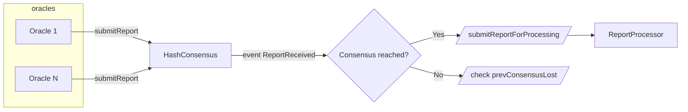
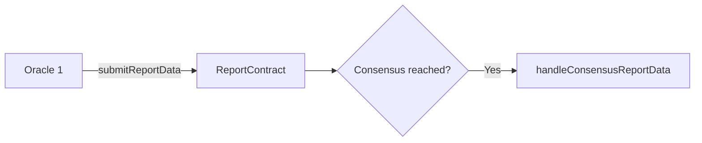
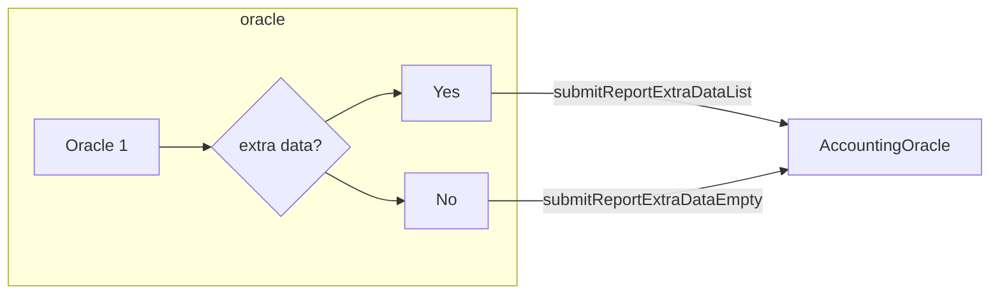

# Oracle Operator Manual

This document is intended for those who wish to participate in the Lido protocol as entity that runs - an entity who runs a daemons synchronizing state from Beacon Layer to Execution Layer of the protocol.
Due to the lack of native communication between these two networks, Lido employs a network of oracles to synchronize the system at regular intervals.

## TL;DR

1. Generate an Ethereum address.
2. Launch and sync an [archive](https://ethereum.org/en/developers/docs/nodes-and-clients/#archive-node) (archive data for at least 2 weeks) Execution Layer node with JSON-RPC endpoint enabled.
3. Launch and sync an [archive](https://ethereum.org/en/developers/docs/nodes-and-clients/#archive-node) Consensus Layer node with API endpoint enabled.
4. Launch and sync a [Keys API Service](https://github.com/lidofinance/lido-keys-api).
5. Launch the **accounting**, **ejector**, and **csm** modules of the Oracle.
6. [**Optional**] Add alerts to Oracle's Prometheus metrics.
7. In case of mainnet, share your address and intention to join the Oracle set with the public. You need to publish it on Twitter and also write a message with a Twitter link under the Onboarding post on [the Research forum](https://research.lido.fi/). You need to publish it on Twitter and also write a message with a twitter link under the Onboarding post on [the Research forum](https://research.lido.fi/).
8. Propose your Oracle's Ethereum address to the Lido team to vote on adding your address to the Oracle Members.

## Intro

The Lido Oracle mechanism comprises three main components. The first component is the Oracle smart-contract suite, which receives update reports from the oracles and passes them on to the Lido contract to execute the necessary actions based on the reported changes. The second component is the off-chain oracle daemon, run by each oracle node and responsible for monitoring the protocol state and generating update reports. The third component is the network of computer nodes that run by oracle member, which collectively provide the necessary information to the Oracle smart contract to calculate the new state of the protocol.

Based on the update reports received from the oracles, the Lido smart contract performs state transitions such as updating user balances, processing withdrawal requests, and distributing rewards to node operators. Thus, the Lido Oracle mechanism acts as a synchronization device that bridges the protocol across the execution and consensus layers. It ensures that the protocol is updated in a timely and accurate manner and allows for smooth and efficient operation of the entire Lido system.

The two core contracts in the Lido Oracle suite are called [AccountingOracle](/contracts/accounting-oracle) and [ValidatorsExitBus](/contracts/validators-exit-bus-oracle). Together, these contracts collect information submitted by oracles about the state of validators and their balances, the amount of funds accumulated on protocol vaults, the number of withdrawal requests the protocol is able to process, and the validators are expected to be voluntary exited to finalize more withdrawal requests. This information is then used for these crucial processes:

- rebasing user balances,
- distributing node operator rewards,
- processing withdrawal requests,
- making decision which validators should initiate voluntary exit,
- distributing stake,
- putting the protocol into the bunker mode.

## Oracle phases

In order to send the report data by the oracle operator to both `AccountingOracle` and `ValidatorsExitBusOracle`, it is necessary that:

- this operator participates in the oracle committee, and
- a consensus for the corresponding report must be reached

A process of sending the report data can be divided into 3 major stages:

### Phase 1. Submitting a report hash and reaching consensus

At the first stage, the oracles operators collect a report for a certain `refSlot` and send the hash to the `HashConsensus` contract.

The diagram below shows:
`ReportProcessor` - `AccountingOracle` or `ValidatorsExitBusOracle` contract.
`HashConsensus` -  a contract which manages oracle members committee and allows the members to reach consensus on the particular data hash for each reporting frame.

You can read more about HashConsensus [here](/contracts/hash-consensus).



### Phase 2. Submitting a report data

When the consensus is reached, one of the oracles operators submits report data and triggers the core protocol state update (including the token rebase, distribution of node operator rewards, finalization of withdrawal requests, and deciding whether to go in the bunker mode) or emits `ValidatorExitRequest` events to inform node operators about new voluntary exit requests needed to perform.



### Phase 3. Submitting a report extra data

This step is required for `AccountingOracle`, involving reward distribution for staking modules on this phase.



## Committee membership

The current Oracle set consists of 9 participants with a quorum of 5. This means that report finalization can only occur when there are 5 identical reports from 5 different oracle members.

The actual list of Oracle participants list can be fetched from the HashConsensus contract using the [`getMembers`](https://etherscan.io/address/0xD624B08C83bAECF0807Dd2c6880C3154a5F0B288#readContract#F16) method.
*Hoodi Oracle participants' addresses can be found [here](https://hoodi.etherscan.io/address/0x32EC59a78abaca3f91527aeB2008925D5AaC1eFC#readContract#F16)*

The latest updates can be found in the [Expansion of Lido on Ethereum Oracle set](https://research.lido.fi/t/expansion-of-lidos-ethereum-oracle-set/2836) post.

## Prerequisites

### Execution Client Node

To prepare reports, the Oracle might fetch a few months' worth of old events. It also makes historical requests for balance data and simulates reports on historical blocks. This requires an [archive](https://ethereum.org/en/developers/docs/nodes-and-clients/#archive-node) execution node.

| Client                                          | Tested | Notes                                                                                                                                                                                 |
|-------------------------------------------------|:------:|---------------------------------------------------------------------------------------------------------------------------------------------------------------------------------------|
| [Geth](https://geth.ethereum.org/)              |   🟢   | `--gcmode=archive` <br/> `--syncmode=snap` <br/><br/>OR<br/><br/>`--gcmode=archive`<br/>`--syncmode=full`                                                                             |
| [Nethermind](https://nethermind.io/)            |   🔴   | -                                                                                                                                                                                     |
| [Besu](https://besu.hyperledger.org/en/stable/) |   🔴   | Recent changes require FULL sync                                                                                                                                                      |
| [Erigon](https://github.com/ledgerwatch/erigon) |   🟢   | Use<br/> `--prune=rhtc`<br/> `--prune.r.before=324000`<br/> `--prune.h.before=324000`<br/> `--prune.t.before=256`<br/> `--prune.c.before=256`<br/> params                             |

### Consensus Client Node

To calculate some metrics for bunker mode Oracle needs [archive](https://ethereum.org/en/developers/docs/nodes-and-clients/#archive-node) consensus node.

| Client                                            | Tested | Notes                                                                                                                                               |
|---------------------------------------------------|:------:|-----------------------------------------------------------------------------------------------------------------------------------------------------|
| [Lighthouse](https://lighthouse.sigmaprime.io/)   |   🟢   | Use `--reconstruct-historic-states` param                                                                                                           |
| [Lodestar](https://nethermind.io/)                |   🔴   | Not tested yet                                                                                                                                      |
| [Nimbus](https://nimbus.guide/quick-start.html)   |   🔴   | Not tested yet                                                                                                                                      |
| [Prysm](https://github.com/ledgerwatch/erigon)    |   🟢   | Use <br/> `--grpc-max-msg-size=104857600` <br/> `--enable-historical-state-representation=true` <br/> `--slots-per-archive-point=1024` <br/> params |
| [Teku](https://docs.teku.consensys.net)           |   🟢   | Use <br/> `--data-storage-mode=archive` <br/>`--data-storage-archive-frequency=1024`<br/> `--reconstruct-historic-states=true`<br/> params          |

### Keys API Service

This is a separate service that uses the Execution Client to fetch all Lido keys. It stores the latest state of Lido keys in a database.

[Lido Keys API repository.](https://github.com/lidofinance/lido-keys-api)

## The oracle daemon

The Oracle daemon is a Python application that contains the following modules:

- Accounting module
- Ejector module
- CSM module

The oracle source code is available at [https://github.com/lidofinance/lido-oracle](https://github.com/lidofinance/lido-oracle).

### Environment variables

The oracle daemon requires the following environment variables:

**Required**

- `EXECUTION_CLIENT_URI` - list of Execution Client uris separated with comma. The second and next uris will be used as fallback.
- `CONSENSUS_CLIENT_URI` - list of Consensus Client uris separated with comma. The second and next uris will be used as fallback.
- `KEYS_API_URI` - list of Key API client uris separated with comma. The second and next uris will be used as fallback.
- `LIDO_LOCATOR_ADDRESS` - Lido Locator smart contract address.

Additional variables required by the CSM module:

- `CSM_MODULE_ADDRESS` - Community Staking Module address.
- `PINATA_JWT` - Pinata IPFS provider JWT token.
- `PINATA_DEDICATED_GATEWAY_URL` - Pinata IPFS provider dedicated gateway URL.
- `PINATA_DEDICATED_GATEWAY_TOKEN` - Pinata IPFS provider dedicated gateway access token.

**Optional**

**One of:**

- `MEMBER_PRIV_KEY` - Private key of the Oracle member account.
- `MEMBER_PRIV_KEY_FILE` - A path to the file contained the private key of the Oracle member account.

Full list could be found [here](https://github.com/lidofinance/lido-oracle#env-variables).

### Lido Locator address

**Mainnet**
**[0xC1d0b3DE6792Bf6b4b37EccdcC24e45978Cfd2Eb](https://etherscan.io/address/0xC1d0b3DE6792Bf6b4b37EccdcC24e45978Cfd2Eb)**

**Hoodi**
**[0xe2EF9536DAAAEBFf5b1c130957AB3E80056b06D8 ](https://hoodi.etherscan.io/address/0xe2EF9536DAAAEBFf5b1c130957AB3E80056b06D8 )**

### Running the daemon

Startup accounting module

```shell
docker run -d --name lido-oracle-accounting \
  --env "EXECUTION_CLIENT_URI=$EXECUTION_CLIENT_URI" \
  --env "CONSENSUS_CLIENT_URI=$CONSENSUS_CLIENT_URI" \
  --env "KEYS_API_URI=$KEYS_API_URI" \
  --env "LIDO_LOCATOR_ADDRESS=$LOCATOR_ADDRESS" \
  --env "MEMBER_PRIV_KEY=$MEMBER_PRIV_KEY" \
  lidofinance/oracle@<image-hash> accounting
```

Startup ejector module

```shell
docker run -d --name lido-oracle-ejector \
  --env "EXECUTION_CLIENT_URI=$EXECUTION_CLIENT_URI" \
  --env "CONSENSUS_CLIENT_URI=$CONSENSUS_CLIENT_URI" \
  --env "KEYS_API_URI=$KEYS_API_URI" \
  --env "LIDO_LOCATOR_ADDRESS=$LOCATOR_ADDRESS" \
  --env "MEMBER_PRIV_KEY=$MEMBER_PRIV_KEY" \
  lidofinance/oracle@<image-hash> ejector
```

Startup CSM module

```shell
docker run -d --name lido-oracle-csm \
  --env "EXECUTION_CLIENT_URI=$EXECUTION_CLIENT_URI" \
  --env "CONSENSUS_CLIENT_URI=$CONSENSUS_CLIENT_URI" \
  --env "KEYS_API_URI=$KEYS_API_URI" \
  --env "LIDO_LOCATOR_ADDRESS=$LOCATOR_ADDRESS" \
  --env "MEMBER_PRIV_KEY=$MEMBER_PRIV_KEY" \
  --env "CSM_MODULE_ADDRESS=$CSM_MODULE_ADDRESS" \
  --env "PINATA_JWT=$PINATA_JWT" \
  --env "PINATA_DEDICATED_GATEWAY_URL=$PINATA_DEDICATED_GATEWAY_URL" \
  --env "PINATA_DEDICATED_GATEWAY_TOKEN=$PINATA_DEDICATED_GATEWAY_TOKEN" \
  lidofinance/oracle@<image-hash> csm
```

#### Persistent cache of CSM module

CSM module of the Oracle uses a cache to store per-epoch data of network-wide validator performance. It takes a significant amount of time to collect the data from scratch. That's why it's encouraged to set up a persistent cache location for the oracle outside of a Docker container in order to keep the cache in case of container destruction for maintenance purposes.

The `CACHE_PATH` environment variable sets the path to a directory where the oracle will store its cache. Run the container with the additional arguments:

```shell
docker run -d --name lido-oracle-csm \
  "...required_variables_from_the_example_above" \
  --env "CACHE_PATH=/app/cache" \
  --volume "/var/lib/lido_csm_cache/:/app/cache"
  lidofinance/oracle@<image-hash> csm
```

Make sure the correct permissions are set up for the mounted directory. The UID of the oracle process in the image provided by Lido is `33`, and it might require changing the owner of the directory on the host machine:

```shell
chown -R 33:33 /path/to/cache/on/host
```

**Latest image hash**
[https://docs.lido.fi/guides/tooling/#oracle](https://docs.lido.fi/guides/tooling/#oracle)

This will start the oracle in daemon mode. You can also run it in a one-off mode, for example if you’d prefer to trigger oracle execution as a `cron` job. In this case, set the `DAEMON` environment variable to 0.

### Metrics and Alerts

How to set up alerts and details about metrics could be found [here](https://github.com/lidofinance/lido-oracle#alerts).
