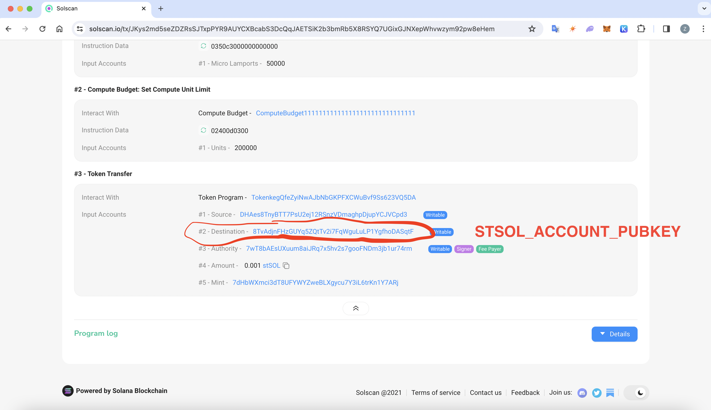

# Solana manual withdraw with CLI

## 1. Environment Setup

We've prepared a CLI in Solido to simplify your workflow. You'll need to:

1. **Install Rust**:
Follow the instructions at [Rust Installation](https://www.rust-lang.org/tools/install).

```bash
curl --proto '=https' --tlsv1.2 -sSf https://sh.rustup.rs | sh
source "$HOME/.cargo/env"
rustup override set 1.60.0
```

2. **Install Solana CLI v1.13.7**:
Visit [Solana CLI Installation](https://solana.com/docs/intro/installation).

```bash
sh -c "$(curl -sSfL https://release.solana.com/v1.13.7/install)"
export PATH="$HOME/.local/share/solana/install/active_release/bin:$PATH"
```

3. **Install Solido CLI v2.1.0** from the official GitHub repository:
See [Solido Releases](https://github.com/lidofinance/solido/releases/tag/v2.1.0).

```bash
git clone --recurse-submodules -b V2.1 https://github.com/lidofinance/solido solido_v2
cd solido_v2
cargo build --release
```

:::warning Compilation error with anchor-lang
If the build fails due to a broken submodule in the `anchor-lang` dependency, you need to create a fork with the fix:

```bash
git clone -b solana-1.9.28 https://github.com/AnchorLang/anchor-solana1.9.28.git
cd anchor-solana1.9.28

git submodule deinit -f examples/cfo/deps/stake || true
git rm -f examples/cfo/deps/stake || true
rm -rf .git/modules/examples/cfo/deps/stake || true

git commit -m "Remove broken stake submodule"
git remote set-url origin https://github.com/YOUR_GITHUB_USERNAME/anchor-solana1.9.28.git
git push origin solana-1.9.28
```

Then update `Cargo.toml` in the `solido_v2` directory, replacing the `anchor-lang` dependency with your fork:

```toml
anchor-lang = { git = "https://github.com/YOUR_GITHUB_USERNAME/anchor-solana1.9.28", branch = "solana-1.9.28" }
```

After that, re-run `cargo build --release`.
:::

## 2. Transfer stSOL to Local Account

⚠️ **Note**: Our CLI can only work with local keys. Consider using a new account for withdrawals to keep your main wallet secure. The withdrawal operation will utilize the following:

- **`SOL_ACCOUNT_PUBKEY`**: Public key of the local Solana account.
- **`STSOL_ACCOUNT_PUBKEY`**: Public key of the child stSOL account from **`SOL_ACCOUNT_PUBKEY`**.
- **`KEYPAIR_FILE`**: Local file containing the keypair from **`SOL_ACCOUNT_PUBKEY`**.
- **`STAKE_ACCOUNT_PUBKEY`**: Public key of the child stake account from **`SOL_ACCOUNT_PUBKEY`**.

1. **Create a new local account**:

```bash
solana-keygen new --outfile ./local-keypair.json
```

Remember the **`KEYPAIR_FILE`** path and **`SOL_ACCOUNT_PUBKEY`** from the output.

2. **Configure RPC endpoint**:

The default Solana RPC endpoint may not work reliably for mainnet operations. Set a dedicated RPC URL (e.g., from [Helius](https://www.helius.dev/)):

```bash
solana config set --url https://mainnet.helius-rpc.com/?api-key=YOUR_API_KEY
```

3. **Verify the new account with `SOL_ACCOUNT_PUBKEY`**:

```bash
solana balance SOL_ACCOUNT_PUBKEY
```

4. **Transfer stSOL to the local account using `SOL_ACCOUNT_PUBKEY`** and **note the transaction signature**.

5. **Identify `STSOL_ACCOUNT_PUBKEY`**:

⚠️ After transferring stSOL, a child account for stSOL is created under your local account. To proceed, locate this address by searching your **transaction signature** on [Solscan](https://solscan.io/) and saving the **Destination** pubkey found under **Token Program: TransferChecked** in the instruction details.



## 3. Withdraw stSOL

1. **Execute the withdrawal** to your stake account:

```bash
./target/release/solido --config ./solido_config.json --keypair-path KEYPAIR_FILE withdraw --amount-st-sol STSOL_AMOUNT
```

⚠️ **Note**: if you're seeing the following error:

```bash
Program log: The exchange rate is outdated, it was last computed in epoch 644, but now it is epoch 646.
```

Execute the following command to update the exchange rate

```bash
./target/release/solido --config solido_config.json --keypair-path KEYPAIR_FILE perform-maintenance
```

If you get an RPC response error, such as -32002, simply re-run the command.

Once the exchange rate is updated, you should get a message "Updated exchange rate", and you can proceed to re-run the withdrawal command.

2. Record the **`STAKE_ACCOUNT_PUBKEY`** for further steps.

3. **Deactivate the stake account**:

```bash
solana deactivate-stake STAKE_ACCOUNT_PUBKEY --keypair KEYPAIR_FILE
```

⚠️ Wait for the epoch to end (~1-2 days) for the stake account to become inactive. Check the epoch status on [Solana Explorer](https://explorer.solana.com/).

## 4. Transfer SOL to Main Account

After the epoch ends, withdraw SOL from **`STAKE_ACCOUNT_PUBKEY`** to your main account, referred to as **`MAIN_ACCOUNT_PUBKEY`**.

```bash
solana withdraw-stake **STAKE_ACCOUNT_PUBKEY** \
**MAIN_ACCOUNT_PUBKEY** SOL_AMOUNT \
--keypair **KEYPAIR_FILE**
```
