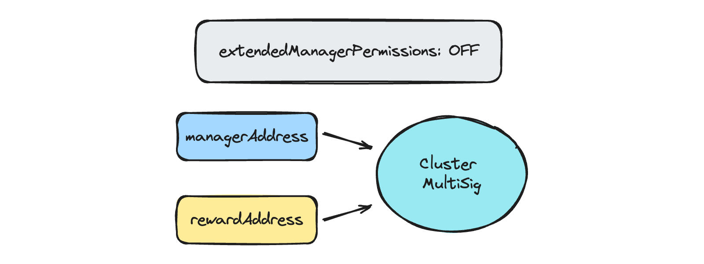

# Manager and Reward addresses

When a CSM Node Operator is created, two important addresses are set: `managerAddress` and `rewardAddress`. Let's find out the purpose of these addresses, their permissions, and the management surrounding them.

## Manager address

`managerAddress` is the address that can perform the following actions regarding the CSM Node Operator:

- Add new validator keys
- Delete validator keys that were not deposited yet
- Claim rewards (rewards will be transferred to the `rewardAddress`)
- Put depositable keys back into the deposit queue if they were skipped during the queue iteration
- Propose a new `managerAddress`

Hence, `managerAddress` is the address used to perform routine management operations regarding the CSM Node Operator.

:::info
`managerAddress` is never used as a recipient of rewards, unless it is the same address as `rewardAddress`.
:::

If no custom addresses were specified during the Node Operator creation, `managerAddress` would be set to `msg.sender` (transaction signer).

:::info
Given `managerAddress` permissions, it can be set to a "hot" address to ease Node Operator management.
:::

## Reward address

`rewardAddress` is the address that can perform the following actions regarding the CSM Node Operator:

- Claim rewards
- Propose a new `rewardAddress`
- Reset `managerAddress` to make it equal to the current `rewardAddress`

Also, `rewardAddress` is the ultimate recipient of the rewards. No matter from what address (`managerAddress` or `rewardAddress`) the claim rewards method was called, tokens will always be transferred to the `rewardAddress`.

Hence, `rewardAddress` is the ultimate recipient of the rewards and the address that has ultimate control over the Node Operator via the ability to reset `managerAddress`.

If no custom addresses were specified during the Node Operator creation, `rewardAddress` would be set to `msg.sender` (transaction signer).

:::info
Given `rewardAddress` permissions, the best option is to set it to a "cold" wallet address to ensure security.
:::

## Permissionless operations

On top of the permissions above, there are several permissionless methods that can be called by `managerAddress`, `rewardAddress`, or any other Ethereum address:

- Top-up bond;
- Distribute allocated Node Operator rewards to the Node Operator's [bond](../join-csm#bond);
- Compensate for the reported MEV stealing penalty;
- Report validator withdrawal to release [bond](../join-csm#bond) tokens (usually done by the CSM Bot);
- Report validator slashing (usually done by the CSM Bot);

## Changing addresses

The process of changing both `managerAddress` and `rewardAddress` is two-phased. The first phase is the proposal of the new address from the current one. The second phase is confirmation from the new address. This two-phased process is required to ensure that node operators will never change any addresses to an address they cannot access.

The only exception to the two-phased rule is the reset of the `managerAddress` from the `rewardAddress`. In this case, the `managerAddress` is set equal to the `rewardAddress`, which should sign the transaction. Hence, one can be confident that the managerAddress will be set to the address under the Node Operator's control.

:::info
To change `managerAddress` or `rewardAddress` using CSM UI, the Node Operator should first connect the wallet, which is the current `managerAddress` or `rewardAddress`, to propose a new address and then connect the wallet, which is the new address, to confirm change.
:::

## Advanced options

### Setting custom addresses upon Node Operator creation

Within the Node Operator creation transaction, one can specify a custom `managerAddress` and `rewardAddress` (different from the `msg.sender` aka transaction signer).

This function is not exposed by default in the standard CSM frontend since there is no way to verify that the Node Operator's creator can access the address provided.

:::warning
Specifying custom `managerAddress` and `rewardAddress` might result in a permanent loss of [bond](../join-csm#bond) tokens if the Node Operator's creator cannot access them.
:::

If you fully understand the risks and are still willing to set custom `managerAddress` and `rewardAddress` when creating a Node Operator in CSM, use the following links [mainnet](https://csm.lido.fi/?mode=extended), [testnet](https://csm.testnet.fi/?mode=extended).

### Extended Manager Address permissions

An option exists, although not exposed by default in the standard CSM frontend, to give the `managerAddress` extended permissions to accommodate cases where a limited-capability smart contract may be used as a rewards address (e.g. a standard 0xSplits splitter contract). Since some operations by default can be performed only by `rewardAddress`, and not all smart contracts have the ability for arbitrary calls to be made via other addresses, in order to prevent the possibility of a non-changeable `rewardAddress`, this `extendedManagerPermissions` feature has been included.

:::warning
The `extendedManagerPermissions` option can only be set once during Node Operator creation. It can not be changed later on.
:::

If the user selects to enable `extendedManagerPermissions` during Node Operator creation, the following changes to the default rules depicted above apply:

- `rewardAddress` will not be able to reset `managerAddress`
- `managerAddress` will be able to change `rewardAddress` without additional confirmation from the new address

These changes grant `managerAddress` the ultimate control over the Node Operator, while `rewardAddress` is only used to receive rewards.

:::info
`rewardAddress` would still be able to propose a new `rewardAddress` and claim rewards if the `extendedManagerPermissions` option is enabled.
:::

:::info
If the `extendedManagerPermissions` option is used, `managerAddress` should be set to a secure address ("cold" wallet or multisig).
:::

## Examples

### Default

By default, the Node Operator's creator is set as a `managerAddress` and `rewardAddress`.

Following the creation of the node operator (i.e. once at least one key has been registered), it is recommended that addresses be re-assigned according to one of the optimal configurations below.

### Optimal for solo operator

It is considered optimal to set `managerAddress` to a "Hot" or easily accessible address and `rewardAddress` to a secure "Cold" wallet or even multisig with arbitrary call functionality, such as [Safe](https://app.safe.global) if you are a solo operator.

### Optimal for DVT cluster

Several optimal options exist for DVT clusters.

The first is to set `managerAddress` to a "Hot" or just easily accessible address controlled by the cluster coordinator and `rewardAddress` to a cluster MultiSig. This option is only recommended in cases where cluster participants trust the coordinator completely (or have other types of guarantees/agreements in place) or if the DVT setup is an intra-operator setup rather than an inter-operator setup.

The second option is to create a CSM Node operator from a cluster MultiSig, setting `managerAddress` and `rewardAddress` to a cluster MultiSig.

The third option is to set `managerAddress` to a cluster MultiSig, `rewardAddress` to a splitter contract (e.g. to benefit from automated rewards splitting between cluster participants), and enable `extendedManagerPermissions`.

