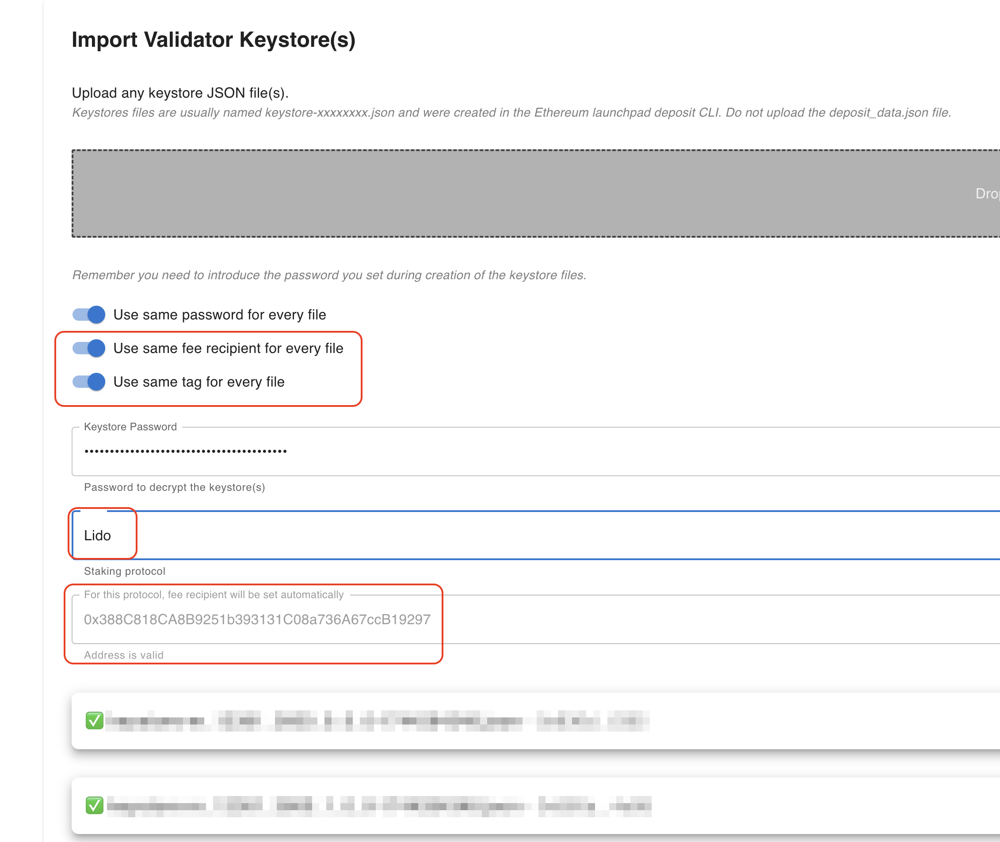
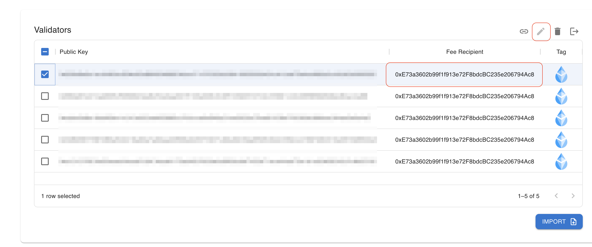
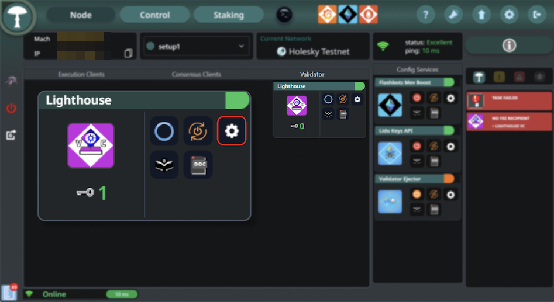
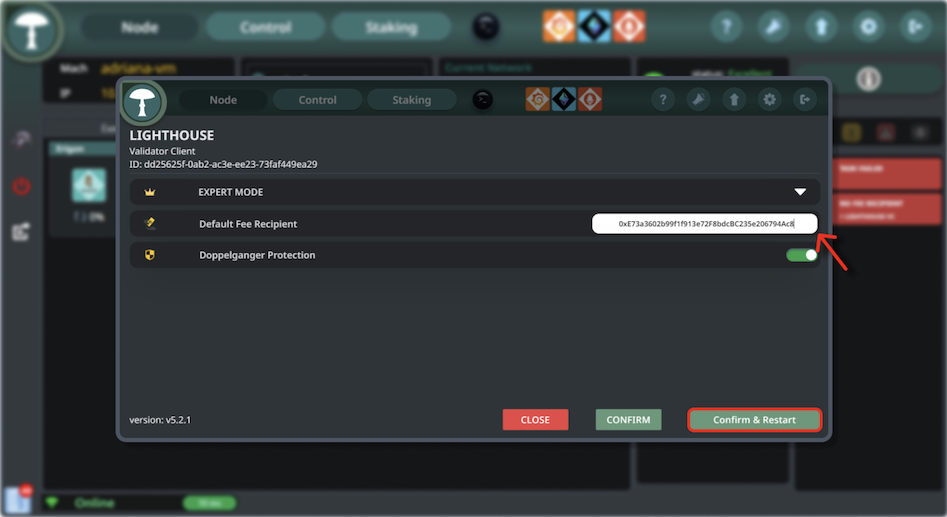
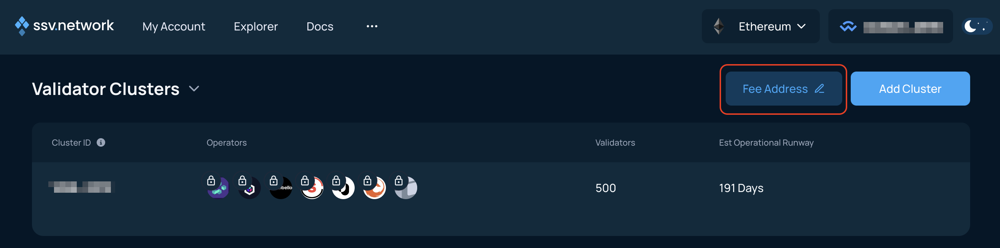
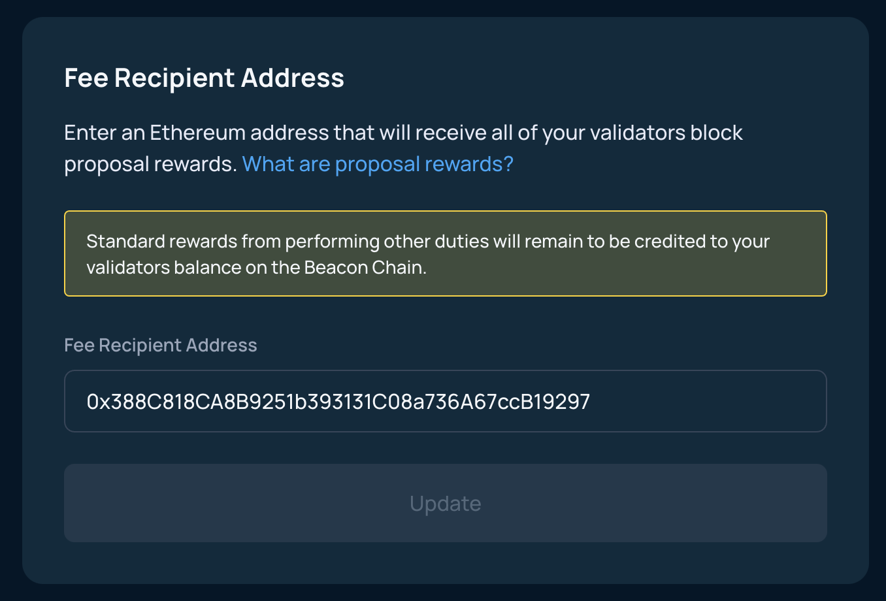
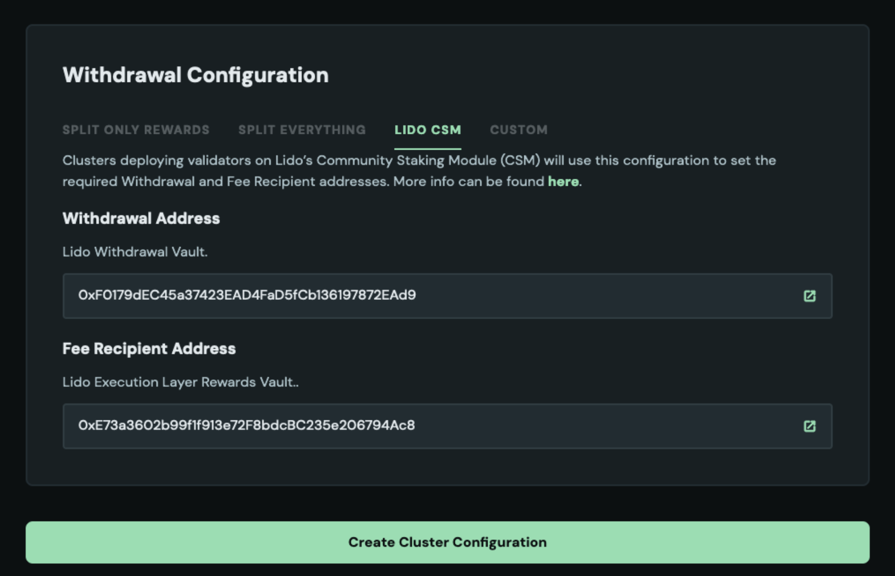

# Setting the Fee Recipient for Lido CSM Validators

When running validators via Lido Community Staking Module (CSM), it is **mandatory** to set the fee recipient to the **Lido Execution Layer Rewards Vault**:

- Mainnet: [`0x388C818CA8B9251b393131C08a736A67ccB19297`](https://etherscan.io/address/0x388C818CA8B9251b393131C08a736A67ccB19297)
- Hoodi testnet: [`0x9b108015fe433F173696Af3Aa0CF7CDb3E104258`](https://hoodi.etherscan.io/address/0x9b108015fe433F173696Af3Aa0CF7CDb3E104258)

:::info
For Hoodi Testnet users:

Use [`0x9b108015fe433F173696Af3Aa0CF7CDb3E104258`](https://hoodi.etherscan.io/address/0x9b108015fe433F173696Af3Aa0CF7CDb3E104258) instead of [`0x388C818CA8B9251b393131C08a736A67ccB19297`](https://etherscan.io/address/0x388C818CA8B9251b393131C08a736A67ccB19297) in the guides below.
:::

Failure to do so may result in [MEV stealing penalties](./mev-stealing), including:

- A **penalty** equal to the stolen execution layer rewards plus a fixed fine
- Your **bond being locked** until the full penalty amount is returned

This guide shows you how to correctly set the fee recipient on various platforms. It does not cover how to set up or run a validator node from scratch.

:::note
You can verify the fee recipient address on the [Lido Deployed Contracts](../../../deployed-contracts/) page.
:::

## Dappnode

Dappnode sets the fee recipient through the **Staking Brain** in the Web3Signer package, either during key import or by editing existing validator keys.

### Set fee recipient when importing new validator keys

**Step 1:** In the side panel, go to **“Stakers”**, then select the **Web3Signer** package and click **“Upload Keystores”** to open the **Staking Brain**.

**Step 2:** Enable **“Use same tag for every file”**, and in the **“Staking Protocol”** dropdown, select **“Lido”**. This automatically sets the fee recipient to:

`0x388C818CA8B9251b393131C08a736A67ccB19297`



**Step 3:** Click **“Submit Keystores”** to complete the import.

---

### Change fee recipient on existing validator keys

**Step 1:** In the side panel, go to **“Stakers”**, then select the **Web3Signer** package and click **“Upload Keystores”**.

**Step 2:** Review the **Fee Recipient** field for each validator key. If it's incorrect or missing, click the **edit** icon.



**Step 3:** Set the fee recipient to: `0x388C818CA8B9251b393131C08a736A67ccB19297`
    
**Step 4:** Click **“Submit Keystores”** to apply the changes.

:::warning
Known issue with Nimbus on Dappnode

Several users have [reported](https://research.lido.fi/t/proposed-blocks-with-wrong-fee-recipient-due-to-dappnode-nimbus-bug/9057) that when running **Nimbus** with Dappnode, the fee recipient set in the **Staking Brain** (Web3Signer) is not applied. Instead, the fee recipient set on the **consensus layer node** is used, which can result in MEV stealing, when it is not set to the Lido Execution Layer Rewards Vault.

This issue has been acknowledged by the Dappnode team but has not been confirmed as resolved.  

We do not recommend running Nimbus with Dappnode for Lido CSM validators until the issue is conclusively fixed. Consider switching to another consensus client if you’re currently running Nimbus.
:::

## Eth-Docker

If you're using [Eth-Docker](https://ethdocker.com/) (typically located in `~/eth-docker`), follow these steps to check or set the correct **fee recipient**.

### Step 1: Edit the `.env` file

Open the `.env` file in your Eth-Docker directory:

```bash
cd ~/eth-docker
nano .env
```

Make sure the following line is present and correctly set:

`FEE_RECIPIENT=0x388C818CA8B9251b393131C08a736A67ccB19297`

:::important
If the line already exists with a different value, update it to match the correct Lido address.
:::

### Step 2: Save and exit
Save the file and exit your editor (in nano: press `CTRL+O`, `ENTER`, then `CTRL+X`).

### Step 3: Apply the configuration
Run the update command to regenerate and restart the services with the new configuration:
```bash
./ethd update
./ethd up
```
If the address was already correct, you can keep Eth-Docker running without restarting.

## Sedge

If you're using [Sedge](https://docs.sedge.nethermind.io/) to manage your validator stack, follow these steps to check or set the correct **fee recipient**.

### Step 1: Navigate to the `sedge-data` folder

```bash
cd <your-sedge-folder>/sedge-data
```

### Step 2: Edit the `.env` file
```bash
nano .env
```

Ensure this line exists and is set correctly:

`FEE_RECIPIENT=0x388C818CA8B9251b393131C08a736A67ccB19297`

:::important
If the line already exists with a different value, update it to match the correct Lido address.
:::

### Step 3: Save and exit
Save the file and exit your editor (in nano: press `CTRL+O`, `ENTER`, then `CTRL+X`).

### Step 4: Restart Sedge
If you made any changes, restart Sedge:

```bash
./sedge down
./sedge run
```

If the address was already correct, you can keep Sedge running without restarting.

## Stereum

If you're using [Stereum](https://stereum.net/) to manage your Ethereum node and validators, follow these steps to verify or update the **fee recipient** address.

### Step 1: Open your Node Page

Access the node management interface in Stereum.

### Step 2: Go to the Validator Client Settings

In the interface, locate your validator client and click the **settings icon**.



### Step 3: Locate "Default Fee Recipient"

Find the field labeled **"Default Fee Recipient"**.



### Step 4: Verify or update the address

Make sure it is set to: `0x388C818CA8B9251b393131C08a736A67ccB19297`

If the address is missing or incorrect, enter the correct one.

### Step 5: Confirm and restart

Click **"Confirm & Restart"** to save your changes and restart the validator client.

:::important
Stereum sets the Lido fee recipient automatically, but you should still manually verify it is correct before restarting your node.
:::

## SSV Network

If you're running CSM validators using [SSV](https://ssv.network/), make sure your **Fee Recipient Address** is set correctly in the SSV dApp.

### Step 1: Open the SSV dApp

Navigate to the [SSV dApp](https://app.ssv.network) and log in with the wallet that registered your validator cluster.

### Step 2: Open the fee recipient settings

Click on **"Fee Address"** in the top right corner of the screen.



### Step 3: Set the correct fee recipient address

In the **"Fee Recipient Address"** field, enter:
`0x388C818CA8B9251b393131C08a736A67ccB19297`



If the field is empty or shows a different address, update it and click **"Update"** to initiate the transaction.

:::caution
The fee recipient address is set **per wallet**, not per cluster!  
If you're running validators with SSV for other protocols in parallel, you must use a **separate wallet** to set a different fee recipient.
:::

## Obol

In [Obol](https://obol.org/) DVT setups, the **fee recipient** is configured by the cluster leader during cluster creation.

### Fee recipient setup options

- **Using the [Obol DV Launchpad](https://launchpad.obol.org/):**  
  If you select **"Lido CSM"** under withdrawal configuration, the fee recipient is automatically set to: `0x388C818CA8B9251b393131C08a736A67ccB19297`
  
- **Using the CLI:**  
You must manually set the correct fee recipient address when creating the cluster definition file.

:::caution
Before finalizing the cluster creation, **double-check** that the fee recipient is correctly set. Once the cluster is created, **you cannot change the fee recipient**.  
If the wrong address was set, the only solution is to exit your validators and create a **new cluster** with the correct fee recipient address.
:::

## Systemd

### Step 1: Open your validator client’s systemd service file.

Typically located in `/etc/systemd/system/`

### Step 2: Update the service file with the appropriate flag and address:

#### [Lighthouse](https://lighthouse-book.sigmaprime.io/validator_fee_recipient.html)

```bash
ExecStart=/usr/local/bin/lighthouse vc \
  --suggested-fee-recipient=0x388C818CA8B9251b393131C08a736A67ccB19297 \
  [other flags...]
```

#### [Prysm](https://www.offchainlabs.com/prysm/docs/execution-node/fee-recipient/)

```bash
ExecStart=/usr/local/bin/validator \
  --suggested-fee-recipient=0x388C818CA8B9251b393131C08a736A67ccB19297 \
  [other flags...]
```

#### [Teku](https://docs.teku.consensys.io/how-to/configure/builder-network#example-builder-configurations)

```bash
ExecStart=/usr/local/bin/teku/bin/teku validator-client \
  --validators-proposer-default-fee-recipient=0x388C818CA8B9251b393131C08a736A67ccB19297 \
  [other flags...]
```

#### [Nimbus](https://nimbus.guide/suggested-fee-recipient.html)

```bash
ExecStart=/usr/local/bin/nimbus_validator_client \
  --suggested-fee-recipient=0x388C818CA8B9251b393131C08a736A67ccB19297 \
  [other flags...]
```

#### [Lodestar](https://chainsafe.github.io/lodestar/run/validator-management/vc-configuration#configuring-the-fee-recipient-address)

```bash
ExecStart=/usr/bin/lodestar validator \
  --suggestedFeeRecipient=0x388C818CA8B9251b393131C08a736A67ccB19297 \
  [other flags...]
```

### Step 3: Reload and restart the service

```bash
sudo systemctl daemon-reload
sudo systemctl restart <your-validator-service>
```

## Verify Your Fee Recipient

It’s important to **verify your fee recipient configuration before your validator proposes a block**, as incorrect settings may result in protocol penalties.

### Check your local configuration

Make sure the fee recipient address is set to:
`0x388C818CA8B9251b393131C08a736A67ccB19297`

Check this in your setup as follows:

- **Dappnode:** open the `Staking Brain` and review the `Fee Recipient` field for each validator.
- **Stereum:** open the UI and check the fee recipient field in the validator client settings.
- **Eth-Docker / Sedge:** inspect your `.env` file and confirm the `FEE_RECIPIENT` variable is set correctly.
- **SSV:** log in to [app.ssv.network](https://app.ssv.network), click on **Fee Address**, and verify the address.
- **Obol:** check your cluster definition file or Launchpad configuration _before_ deploying.
- **systemd:** inspect your validator service file (`/etc/systemd/system/<validator-client>.service`) and confirm the correct `--fee-recipient` or equivalent flag is set.

### Check client logs

Most validator clients log the configured fee recipient address during startup.  
Check your startup logs and confirm that the fee recipient is set to the **Lido Execution Layer Rewards Vault**.

## Seek Lido's help

If you're running a validator client or using a custom setup not covered in this guide, and need help setting the correct fee recipient address, the **Lido Community Validator Specialists (Chimera)** are here to help.

Join the [Lido Discord](https://discord.gg/lido) and tag:

`@community-validator-support`

We’ll assist you in configuring your setup correctly to avoid penalties.
