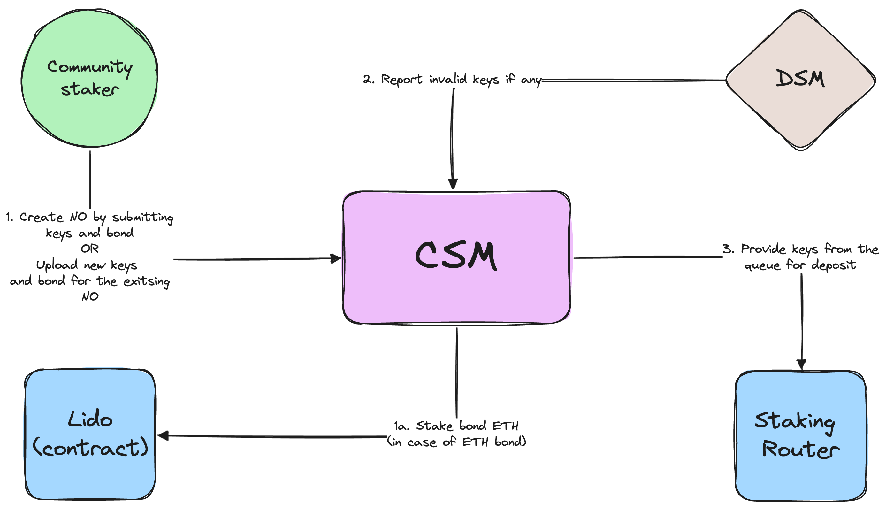
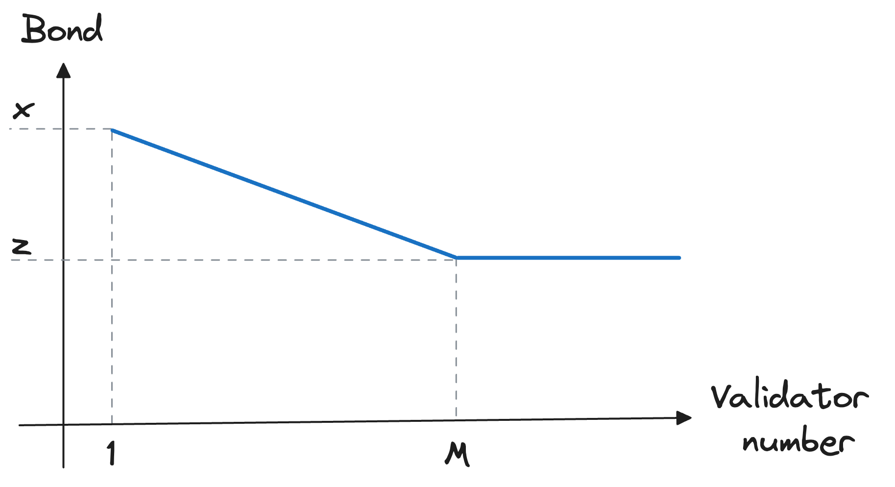
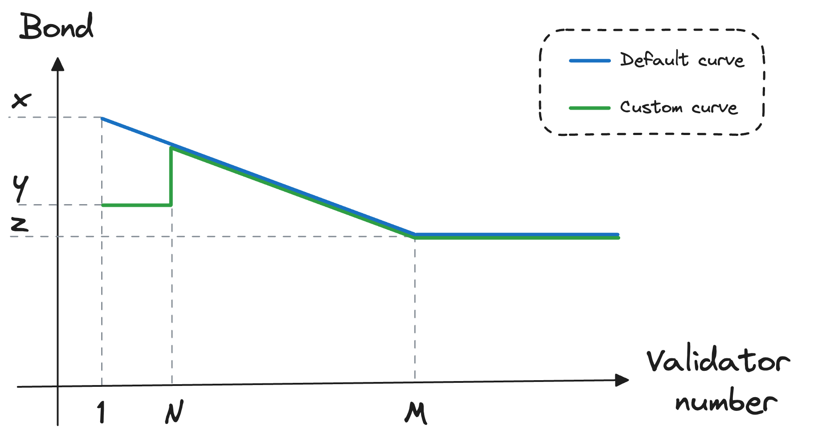
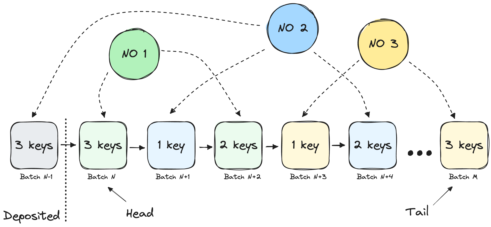
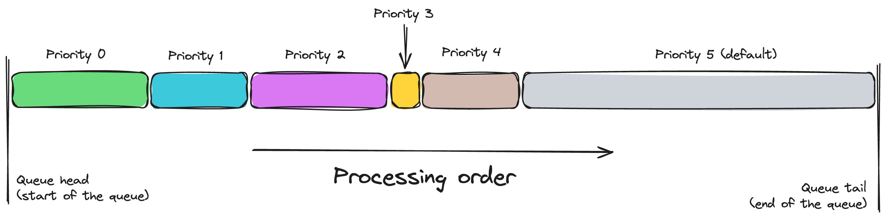

# Join CSM

:::info
- [🧪 Try CSM on Testnet 🧪](https://csm.testnet.fi)
- [✅ Join CSM on Mainnet ✅](https://csm.lido.fi)
:::

## Node Operator creation
To become a Node Operator in CSM or register new validators for an existing Node Operator, at least one [`validator pubkey`](https://github.com/ethereum/consensus-specs/blob/v1.4.0/specs/phase0/beacon-chain.md#validator), corresponding [`deposit signature`](https://github.com/ethereum/consensus-specs/blob/v1.4.0/specs/phase0/beacon-chain.md#signingdata), and the corresponding [bond](./join-csm#bond) amount should be provided.

## Deposit data preparation and upload
CSM accepts deposit data in the same [format](/contracts/node-operators-registry#addsigningkeys) (`validator pubkey` + `deposit signature`) as the [Curated module](/contracts/node-operators-registry.md). The main difference is that the bond must be submitted prior to or alongside the deposit data upload.

[`deposit signature`](https://github.com/ethereum/consensus-specs/blob/v1.4.0/specs/phase0/beacon-chain.md#signingdata) **must** sign the root of the `(deposit_message, domain)`. Where a `domain` is used to identify the chain, and `deposit_message` has the form of the following tuple:
- `validator pubkey`;
- `withdrawal_credentials` with the actual [`Lido Withdrawal Vault contract`](/contracts/withdrawal-vault) address. Should be retrieved from [Staking Router](/contracts/staking-router.md#getwithdrawalcredentials);
- `32 ETH amount`;

## Bond

:::info
Here and after, the term 'bond' has the following meaning:

**Bond** - a security collateral that Node Operators must submit before uploading validator keys into CSM. This collateral covers possible losses caused by inappropriate actions on the Node Operator's side. Once the validator exits from the Beacon chain and all losses that occurred are covered, the collateral can be claimed or reused to upload new validator keys.
:::

A [bond](./join-csm#bond) is a property of a Node Operator, not a validator. [Bond](./join-csm#bond) is stored in the form of stETH. Node Operators can submit [bond](./join-csm#bond) tokens in ETH, stETH, and wstETH. Provided ETH is staked, and wstETH is unwrapped during submission to ensure stETH is the only form of a [bond](./join-csm#bond).

The amount of the [bond](./join-csm#bond) required for each validator key to be uploaded and operated depends on the total number of Node Operator's validators and has the form of a curve.

There might be several [bond](./join-csm#bond) curves. Typically a default curve is assigned to Node Operators upon creation. However, should Node Operator be eligible for a custom [Node Operator type]((#node-operator-types)), a custom curve can be set for the Node Operator.

Existing Node Operators can top-up [bond](./join-csm#bond) without uploading deposit data to compensate for the penalties or to have [bond](./join-csm#bond) tokens uploaded upfront.

### Unbonded validators
The term "unbonded" is introduced to refer to the validators for which the [bond](./join-csm#bond) does not fully cover this validator. Taking into account the approach when the [bond](./join-csm#bond) is common for all Node Operator's validators, unbonded validators can be determined in a way illustrated below. In the example, validator N+1 is unbonded.

:::info
Any unbonded validators are requested to exit. Unbonded but not deposited keys are excluded from the stake allocation queue.
:::

### Possible negative stETH rebase consequences
With the [bond](./join-csm#bond) being stored in stETH, there is a risk of a reduction in the [bond](./join-csm#bond) amount due to a negative stETH rebase. This might result in some Node Operators being unable to claim rewards (due to the actual [bond](./join-csm#bond) being lower than required) or even validators becoming unbonded. This problem is described in detail in [Bond Mechanics in Lido ADR](https://hackmd.io/@lido/BJqWx7P0p). For this document, it is worth mentioning that no additional actions are required for CSM due to the low probability of the negative stETH rebase and a dedicated [insurance fund](/contracts/insurance) at the Lido DAO's disposal for possible use as cover.

## Deposit data validation and invalidation (aka vetting and unvetting)
CSM utilizes an [optimistic vetting](https://hackmd.io/@lido/ryw2Qo5ia) approach. Uploaded deposit data will be treated as valid unless DSM reports it is not. In case of invalid deposit data detection, DSM calls [`decreaseVettedSigningKeysCount`](/staking-modules/csm/contracts/CSModule.md#decreasevettedsigningkeyscount) to set `vettedKeys` pointer to the deposit data prior to the first invalid deposit data. In this case a Node Operator should remove invalid keys to resume stake allocation to the valid non-deposited keys.

## Depositable keys
Several factors determine if the deposit can be made using corresponding deposit data. This information is reflected in the Node Operator's `depositableKeys` property. This property indicates the number of deposit data records extracted sequentially starting from the last deposited record available in the Node Operator's key storage for deposits by the staking router. This number is determined as follows:
- If `targetLimit` is not set => `depositableKeys = min(vettedKeys - depositedKeys, max(addedKeys - depositedKeys - unbondedKeys, 0))`
- If `targetLimit` is set => `depositableKeys = min(vettedKeys - depositedKeys, max(addedKeys - depositedKeys - unbondedKeys, 0), max(targetLimit - (depositedKeys - withdrawnKeys), 0))`
- If Node Operator has `stuckKeys != 0` no matter the `targetLimit` => `depositableKeys = 0`.

## Stake allocation queue

The stake allocation queue in CSM is a traditional [FIFO](https://en.wikipedia.org/wiki/FIFO_(computing_and_electronics)) (first in, first out) queue. Node Operators occupy places in the queue with the `{noId, keysCount}` batches and wait for their turn.

Once the queue reaches the Node Operator's batch, CSM checks how many keys from the batch can be deposited using the formula: `min(depositableKeys, keysInBatch)`.

A simple analogy can be used to understand the CSM queue concept better. Imagine that there is a roller coaster with numbered tickets. Node Operators buy a bunch of tickets with the sequential numbers once they upload keys. When it is time for the next group to jump onto the roller coaster, the eligible ticket numbers are announced. Suppose Node Operators can not arrive on time (since they currently have no depositable keys) with the corresponding tickets. In that case, their tickets are invalidated, and the other Node Operators will be requested to join the roller coaster ride with the following tickets. All invalidated tickets should be repurchased once the keys are depositable.

A detailed description of the queue is provided in a separate [document](https://hackmd.io/@lido/ryw2Qo5ia).

### Priority queues

CSM v2 introduces the concept of priority queues. Depending on the [type](#node-operator-types), Node Operators can be eligible to get up to a certain number (`maxDeposits`) of the keys deposited via a priority queue defined by `queuePriority`. Both `queuePriority` and `maxDeposits` are defined per-node-operator-type.

Each priority queue operates in a FIFO manner as described above. The priority queues are processed in the order of their `queuePriority` value, with the lowest value being processed first.

More on the priority queues can be found in the [dedicated section of CSM v2 features](https://hackmd.io/@lido/csm-v2-tech#Priority-Queues) document.

## Deposit data deletion
The Node Operator might delete uploaded deposit data voluntarily if it has not been deposited yet. The `keyRemovalCharge` is confiscated from the Node Operator's [bond](./join-csm#bond) on each deleted key to cover the maximum possible operational costs associated with the queue processing. Deposit data can be deleted in continuous batches (ex., from index 5 to 10).

If the protocol has already deposited the validator related to the deposit data, the Node Operator cannot delete the deposit data. The only way to stop validation duties is to exit the validator on the CL. Once the validator is fully withdrawn, the Node Operator can claim the excess [bond](./join-csm#bond).

## Node Operator Types

Node Operators can have different types, which define the Node Operator's properties. The type is set during the Node Operator creation and can be changed later. The Node Operator type is defined by the bond curve assigned to the Node Operator.

The following parameters can be set for each Node Operator type:
- `keyRemovalCharge` - a fee charged for each deleted deposit data record;
- `elRewardsStealingAdditionalFine` - an additional fine charged for each validator that has stolen EL rewards;
- `keysLimit` - a limit on the number of active keys for the Node Operator;
- `queuePriority` and `maxDeposits` - parameters defining the priority queue for the Node Operator;
- `rewardShare` - a share of the Node Operator rewards that the Node Operator receives for each validator. Can be customized depending on the key index in the Node Operator's keys storage;
- `performanceLeeway` - a leeway for the Node Operator's validators' performance, which is used to define a performance threshold. Can be customized depending on the key index in the Node Operator's keys storage;
- `strikesParams` - parameters defining the Node Operator's strikes system, which is used to decide on the Node Operator's validators' ejection due to systematic bad performance;
- `badPerformancePenalty` - a penalty charged for each validator that has been ejected due to bad performance;
- `performanceCoefficients` - coefficients used to calculate the Node Operator's performance based on the validators' effectiveness in performing duties like attestation, proposing blocks, and sync committee participation;
- `allowedExitDelay` - an allowed delay between the moment Node Operator's validator was requested to exit and the moment it is actually initiated exit process;
- `exitDelayPenalty` - a penalty charged for each validator that has been requested to exit but has not exited within the allowed delay;
- `maxWithdrawalRequestFee` - a maximum fee charged for each Node Operator's validator that has been forcefully ejected using [EIP-7002](https://eips.ethereum.org/EIPS/eip-7002);

The Lido DAO defines Node Operator types and associated parameters. The Lido DAO also defines Node Operators eligible for a certain type, either directly or via subcommittees granted the corresponding permissions. The Lido DAO can change the Node Operator type at any time, which will affect the Node Operator's properties and behavior.
