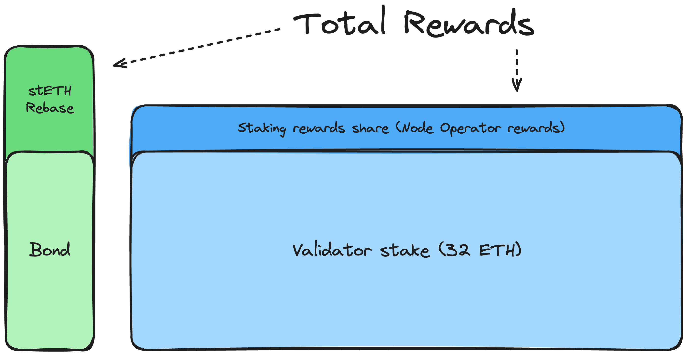

# Rewards

There are two types of rewards for CSM Node Operators:
- **Node Operator rewards;**
- **Bond rewards;**

Node Operator rewards come from the LoE protocol's share of the Consensus and Execution layers rewards. These rewards are calculated as a percentage of the rewards of a full 32 ETH validator. Node Operator rewards are distributed between all staking modules in the same [way](/contracts/staking-router#fee-distribution) (proportionally based on the number of active validators per module, where `active == deposited - exited`). Each [Accounting Oracle](/contracts/accounting-oracle.md) report allocates a new portion of staking rewards to CSM. Allocated rewards are stored on the module. Then, the allocation of the Node Operator rewards for CSM Node Operators using a Merkle tree is provided by CSM Performance Oracle once in a `frame`, making a new portion of the rewards available for claim.

[Bond](./join-csm#bond) rewards (rebase) part of the rewards come from stETH being a rebasing token and the [bond](./join-csm#bond) being stored in stETH. After each Accounting Oracle report, `shareRate` changes (most likely increases). Hence, the same amount of stETH shares will now be equal to a bigger stETH token balance.

The overall equation for the total rewards looks like this `totalRewards = validatorEffectiveBalance * networkAPR * moduleFee + bondAmount * shareRateChange`. More details on it are published in the [supplementary post](https://research.lido.fi/t/bond-and-staking-fee-napkin-math/5999).

A meaningful part of total rewards comes from [bond](./join-csm#bond) rebase. The [bond](./join-csm#bond) and the Node Operator rewards are combined before the claim. The final amount of rewards available for claiming is calculated as `totalBond + nodeOperatorRewards - bondRequired`. This approach also ensures that any missing [bond](./join-csm#bond) will be recouped by the protocol prior to a rewards claim.

Also, any excess [bond](./join-csm#bond) will be treated as a reward.

## Performance Oracle
The Performance Oracle creates a [Merkle tree](https://en.wikipedia.org/wiki/Merkle_tree) with the allocation of the Node Operator rewards and delivers the root on-chain. To make the original tree available to users, it is published on [IPFS](https://ipfs.tech/) and [GitHub](https://github.com/lidofinance/csm-rewards). Instead of storing multiple roots, each new tree consists of all Node Operator rewards ever acquired by CSM Node Operators. Hence, only the latest tree is required to determine the reward allocation at any moment of time. The amount of rewards available for claiming can be calculated as `totalAcquiredRewards - claimedRewards`. `claimedRewards` are stored for each Node Operator in the `CSAccounting` contract to ensure correct accounting.

The Performance Oracle uses the successful attestation rate `successfulAttestations / totalAssignedAttestations` as a proxy for the overall performance of a validator. A performance threshold is utilized to determine the allocation of the actual Node Operator rewards. Validators with performance above the threshold are included in the allocation pool, while the rest are not. Activation and exit events are accounted for during the Node Operator's share calculation. Once the allocation pool is formed, each validator gets a staking rewards part of `totalStakingRewardsAccumulated / totalValidatorsInAllocationPool`. This effectively means that all rewards acquired by the module will be allocated among well-performers. Then, validator shares are allocated to the corresponding Node Operators, and each Operator can claim rewards for all of their validators in one go.

:::info
Slashed validators are excluded from the reward allocation pool as well as all validators controlled by the Node Operator with the `stuckKeys != 0` during at least one block within an allocation frame.
:::

It is crucial to note that the Performance Oracle manages only part of the total rewards. Even if the validator performs below the threshold within a frame, [bond](./join-csm#bond) rewards (rebase) will still be acquired. One can find an example of the rewards calculation [here](https://docs.google.com/spreadsheets/d/1hLvuOesPVOYHDqO373bdyiKn4_3UXQF1rATbgTrKhWc/edit?usp=sharing). **Note that even when performing below the threshold, the rewards per validator will be higher than those for vanilla solo staking.**

The `frame` for the Performance Oracle report is set to 28 days. This makes the `frame` long enough to account for short performance outages (with a smaller frame, this effect will be lower, and the performance threshold will be less useful). Making the `frame` bigger than 28 days will result in an unnecessary delay in reward allocation.

The performance threshold is relative to the overall network attestation effectiveness to ensure that network issues outside the Node Operator's control do not affect reward allocation.

If you want to learn more about the actual Performance Oracle algorithm, check out this [detailed doc](https://hackmd.io/@lido/BJclaWbi6).

## Further reading

- [Penalties](/staking-modules/csm/penalties.md)
- [Validator exits](/staking-modules/csm/validator-exits.md)
