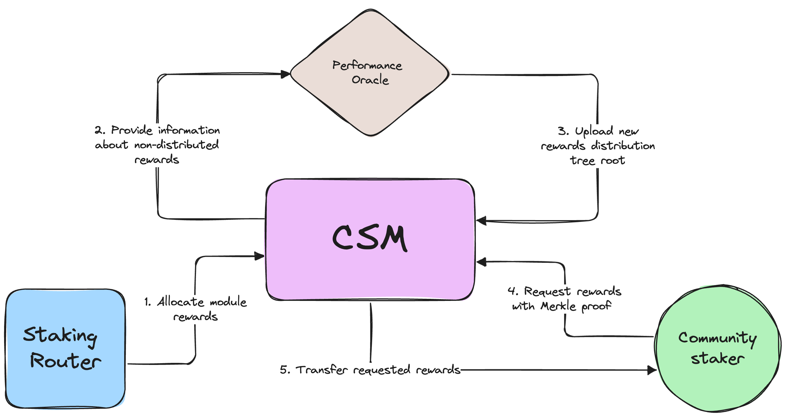
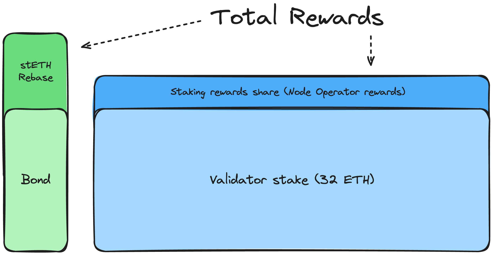
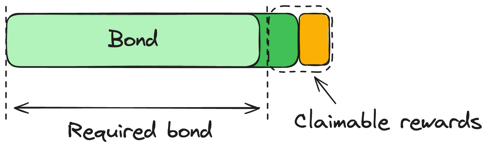
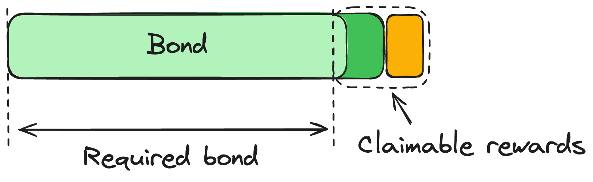
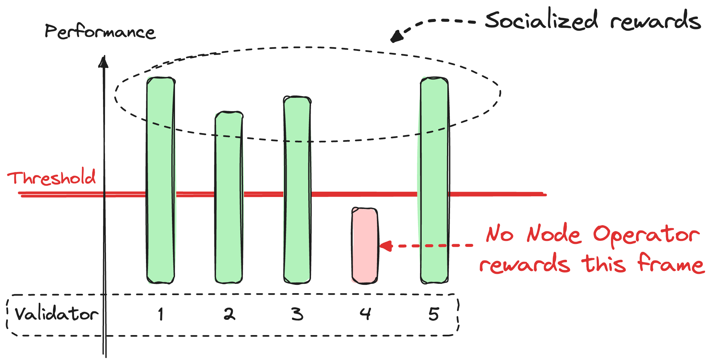

# Rewards

There are two types of rewards for CSM Node Operators:
- **Node Operator rewards**
- **Bond rewards**

## Node Operator rewards

Node Operator rewards are paid from the Lido on Ethereum protocol fees collected on Consensus and Execution Layer rewards. After an [Accounting Oracle](/contracts/accounting-oracle) report, [Staking Router](/contracts/staking-router#fee-distribution) mints the module fee allocated to CSM as `stETH` shares. The module transfers these shares to [`FeeDistributor`](./contracts/FeeDistributor.md), where they remain pending until the next [Performance Oracle](#performance-oracle) report.

Once per `frame`, the Performance Oracle allocates the pending shares among Node Operators. A validator's contribution to the allocation depends on how long it was active during the frame, its effective balance, its performance, and the reward share configured for the Node Operator type and key number. This accounts for both standard `32 ETH` validators and `0x02` validators with effective balances of up to `2048 ETH`. The Oracle publishes the cumulative allocation in a Merkle tree, making the newly allocated rewards claimable. Any shares designated as a protocol rebate are transferred from `FeeDistributor` to the Lido treasury.

## Bond rewards

[Bond](./join-csm#bond) rewards (rebase) part of the rewards come from stETH being a rebasing token and the [bond](./join-csm#bond) being stored in stETH. After each Accounting Oracle report, `shareRate` changes (most likely increases). Hence, the same amount of stETH shares will now be equal to a bigger stETH token balance.

## Total rewards

The overall equation can be represented as `totalRewards = nodeOperatorRewards + bondRewards`, where Node Operator rewards are allocated by the Performance Oracle and `bondRewards = bondAmount * shareRateChange`. The [supplementary post](https://research.lido.fi/t/bond-and-staking-fee-napkin-math/5999) provides more details.

A meaningful part of total rewards comes from [bond](./join-csm#bond) rebase. The [bond](./join-csm#bond) and the Node Operator rewards are combined before the claim. The final amount of rewards available for claiming is calculated as `totalBond + nodeOperatorRewards - bondRequired`. This approach also ensures that any missing [bond](./join-csm#bond) will be recouped by the protocol prior to a rewards claim.

Also, any excess [bond](./join-csm#bond) will be treated as a reward.

## Reward splitters

CSM v3 introduces an optional built-in fee splitter. When the Node Operator's portion of the staking fees is claimed, the configured shares are transferred to one or more `FeeSplitRecipients` (up to 10). This streamlines integration with infrastructure providers that charge a percentage of the staking rewards and can also be used for opt-in donations. Node Operators can also authorize another address to submit reward-claim transactions on their behalf. This address only triggers the claim; the claimed funds are always sent to the configured reward address.

## Performance Oracle
The Performance Oracle creates a [Merkle tree](https://en.wikipedia.org/wiki/Merkle_tree) with the allocation of the Node Operator rewards and delivers the root on-chain. To make the original tree available to users, it is published on [IPFS](https://ipfs.tech/) and [GitHub](https://github.com/lidofinance/csm-rewards). Instead of storing multiple roots, each new tree consists of all Node Operator rewards ever acquired by CSM Node Operators. Hence, only the latest tree is required to determine the reward allocation at any moment in time. The amount available for distribution can be calculated as `cumulativeFeeShares - distributedShares`. `FeeDistributor` stores `distributedShares` for each Node Operator to ensure correct accounting.

The Performance Oracle calculates validators performance based on their **attestation, block proposal, and sync committee participation effectiveness**. The exact formulas for performance calculation can be found [here](https://hackmd.io/@lido/csm-v2-tech#Updated-CSM-Performance-Oracle-metric).

A performance threshold is used to determine which validators participate in the Node Operator reward allocation. Validators at or above the threshold are included, while the rest receive no Node Operator rewards for the frame. Activation and exit events determine how long a validator participated in the frame. Each eligible validator's allocation weight is then adjusted by its effective balance and configured reward share. The resulting validator allocations are aggregated for each Node Operator and published in the cumulative rewards tree.

The `frame` for the Performance Oracle report is set to 28 days. This makes the `frame` long enough to account for short performance outages (with a smaller frame, this effect will be lower, and the performance threshold will be less useful). Making the `frame` bigger than 28 days will result in an unnecessary delay in reward allocation.

The performance threshold is relative to the overall network attestation effectiveness to ensure that network issues outside the Node Operator's control do not affect reward allocation.

### Artifacts

Performance Oracle creates a few artifacts for each successful round of reward distribution: a dump of a Merkle Tree with Node Operators' cumulative rewards and a log of per-operator performance assessment data.

Both files are uploaded to IPFS, and their corresponding CIDs (essentially hashes of the files used to retrieve the content back from the IPFS network) are pushed on-chain. The [`FeeDistributor` contract](/staking-modules/csm/contracts/FeeDistributor.md) has two view functions to retrieve these CIDs: [**treeCid**](/staking-modules/csm/contracts/FeeDistributor.md#treecid) and [**logCid**](/staking-modules/csm/contracts/FeeDistributor.md#logcid).

The Merkle tree dump can be used to construct a valid proof for Node Operators to claim their acquired rewards. For pre-generated proofs, see the [csm-rewards](https://github.com/lidofinance/csm-rewards) GitHub repository. This repository also provides detailed instructions on how to generate proof and claim rewards manually via Etherscan.

A frame performance assessment log aims to achieve more transparency on the rewards distribution made by Oracle. It's another JSON object that stores, among other things:

- The performance threshold for a given frame;
- The total amount of shares distributable in the frame;
- Attestation rates of validators as "assigned" and "included" pairs;
- The amount of shares distributed to every operator in the frame.

There's also additional data in the log; for a full definition, look at the following [typescript gist](https://github.com/lidofinance/staking-modules/blob/51e140617e000a92e821f760444245a177d585af/gists/FramePerfLog.ts).

One can inspect the file to ensure all the operators' `distributed` amounts are correct; for example, by using this [python gist](https://github.com/lidofinance/staking-modules/blob/51e140617e000a92e821f760444245a177d585af/gists/check_frame_log.py). Interested persons can also check the attestations summaries for each validator in the log and report any discrepancies using the official [Lido Discord](https://discord.com/invite/lido).

If you want to learn more about the actual Performance Oracle algorithm, check out this [detailed doc](https://hackmd.io/@lido/BJclaWbi6).

### Bad performance

If a Node Operator's performance is below the threshold, they will not receive any rewards for that frame. However, the Node Operator can still claim their [bond](./join-csm#bond) rewards (rebase) as usual. This means that even if a Node Operator's validators are not performing well, they can still benefit from the bond rebase. One can find an example of the rewards calculation [here](https://docs.google.com/spreadsheets/d/1hLvuOesPVOYHDqO373bdyiKn4_3UXQF1rATbgTrKhWc/edit?usp=sharing). **Note that even when performing below the threshold, the rewards per validator will be higher than those for vanilla solo staking.**

However, consistent bad performance can lead to forced ejection and the application of penalties. Please refer to the [Penalties](./penalties.md) section for more details on this process.
