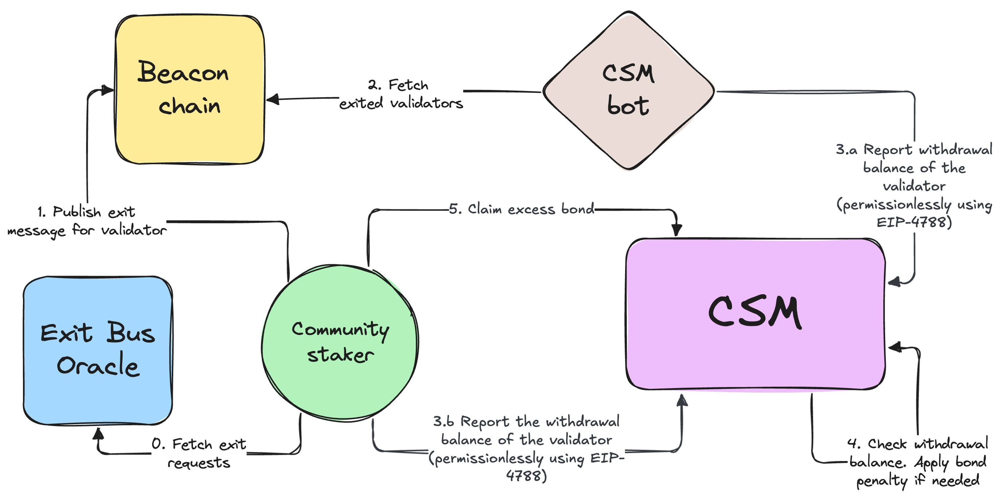

# Validator Exits

## Voluntary exits
Given the permissionless nature of CSM, NOs can voluntarily exit their validators at any moment.

## Protocol-initiated exits
For consistency with the core protocol and other staking modules, CSM uses [VEBO](../../contracts/validators-exit-bus-oracle) to request or trigger exits (to be implemented after the Pectra hardfork bringing [EIP-7002](https://eips.ethereum.org/EIPS/eip-7002) to life) for the validators.

From the core protocol side, validator exit can be requested to cover withdrawal requests from stETH holders, or according to the decision of the DAO.

From CSM side, validator exits can be requested for unbonded validators. These exits are requested automatically using the `forcedTargetLimit`.

> `forcedTargetLimit` is currently under development within the updated version of [Staking Router](https://hackmd.io/@lido/BJXRTxMRp#Forced-Exit-Requests1). In short, it is similar to the existing `targetLimit` but exits for the validators above `forcedTargetLimit` can be requested immediately, even without a need to fulfill withdrawal requests from stETH holders.

Node Operators should follow [VEBO](../../contracts/validators-exit-bus-oracle) events (for example, by using the [Ejector](https://github.com/lidofinance/validator-ejector)) to ensure they exit validators on time. The following penalties and limiting measures should be applied if the Node Operator refuses to exit validators after the protocol request:
1. Exclude Node Operator's keys from the CSM deposit queue and do not put them back until `stuckKeysCount = 0`;
2. Exclude the Node Operator from the staking rewards allocation cycle within the reporting period of the Performance Oracle if the Node Operator's `stuckKeysCount` was > 0 during it;

Also, in exceptional cases, Lido DAO can trigger exits for Node Operator's validators (to be implemented after the Pectra hardfork bringing [EIP-7002](https://eips.ethereum.org/EIPS/eip-7002) to life).

## Low performance for a long time

> This mechanics is to be implemented after the Pectra hardfork bringing [EIP-7002](https://eips.ethereum.org/EIPS/eip-7002) to life.

If a validator is performing below the Performance threshold for 3 frames within 6 frames, it is treated as a bad performer violating the rule of good performance within the protocol. Validators with 3 "strikes" (frames of low performance) can be ejected from the protocol using a permissionless method. There is also an option to confiscate missed profits by such validators from the Node Operator's bond. However, this option is still under consideration.

To learn more about bad-performers ejection please refer to the [separate document](https://hackmd.io/@lido/Sy0nRd36a).

## Withdrawal balance reporting
The withdrawal balance of the validator is required to release the bond and calculate the exit penalty, if any. This balance is reported permissionlessly using [EIP-4788](https://eips.ethereum.org/EIPS/eip-4788) by the CSM bot or the Node Operator themselves.

## Useful links

- [EIP-4788](https://eips.ethereum.org/EIPS/eip-4788)
- [EIP-7002](https://eips.ethereum.org/EIPS/eip-7002)
- [Pectra hardfork](https://eips.ethereum.org/EIPS/eip-7600)