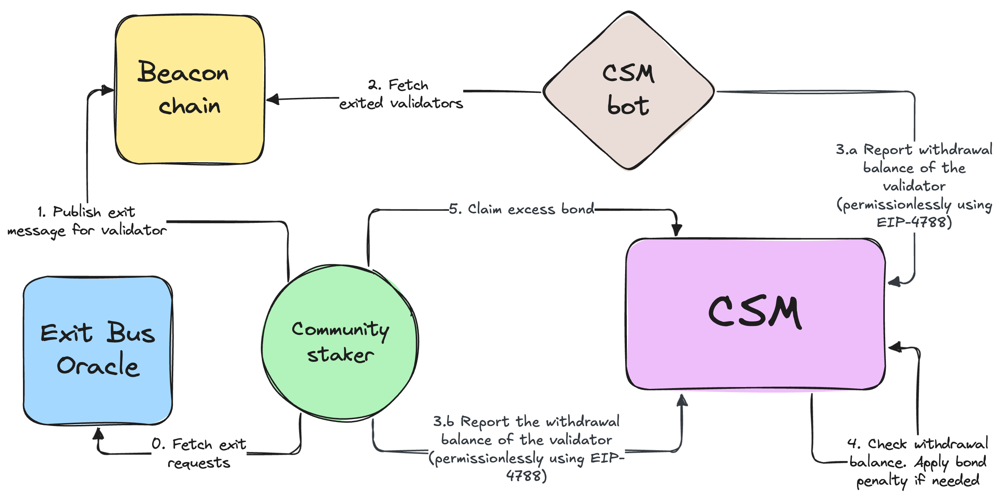

# Validator Exits

## Voluntary exits
Given CSM's permissionless nature, NOs can voluntarily exit their validators at any moment by publishing an exit message to the Ethereum Consensus Layer.

Should a Node Operator decide to exit their validators using [EIP-7002](https://eips.ethereum.org/EIPS/eip-7002), they can do so via the [Ejector](./contracts/Ejector.md) contract.

:::warning
Exiting validators using [EIP-7002](https://eips.ethereum.org/EIPS/eip-7002) is an emergency measure and should be used only in exceptional cases. It is recommended to exit validators using the standard method of publishing an exit message to the Ethereum Consensus Layer.
:::

## Protocol-initiated exits
For consistency with the core protocol and other staking modules, CSM uses [VEBO](/contracts/validators-exit-bus-oracle) to request or trigger validator exits. Details about the overall processes and mechanisms through which validator exits are requested by the protocol and why, including how these rules apply to CSM, are explained in the Lido on Ethereum Validator Exits SNOP 3.0 ([IPFS](https://ipfs.io/ipfs/QmW9kE61zC61PcuikCQRwn82aoTCj9yPuENGNPML9QLkSM), [GitHub](https://github.com/lidofinance/documents-and-policies/blob/main/Lido%20on%20Ethereum%20Standard%20Node%20Operator%20Protocol%20-%20Validator%20Exits.md))

From the core protocol side, validator exit can be requested to cover withdrawal requests from stETH holders or according to the DAO's decision.

From CSM side, validator exits can be requested or triggered for:
- Unbonded validators. These exits are requested automatically using the `targetLimitMode = 2` (forced mode);
- Validators with an excessive number of [bad performance strikes](/run-on-lido/csm/penalties#what-can-affect-your-bond). These exits are triggered via the permissionless method on the [ValidatorStrikes](./contracts/ValidatorStrikes.md) contract.

:::info
`targetLimitMode = 2` (forced mode) was introduced within the updated version of [Staking Router](https://hackmd.io/@lido/BJXRTxMRp#Forced-Exit-Requests1). In short, it is similar to the existing `targetLimit` but exits for the validators above `targetLimit` with `targetLimitMode = 2` (forced mode) can be requested within the next [VEBO](/contracts/validators-exit-bus-oracle) report, even without a need to fulfill withdrawal requests from stETH holders.
:::

Node Operators should follow [VEBO](/contracts/validators-exit-bus-oracle) events (for example, by using the [Ejector](https://github.com/lidofinance/validator-ejector)) to ensure they exit validators on time. The following penalties and limiting measures should be applied if the Node Operator fails to exit requested validators after in time:
1. VEBO will trigger exits for the delayed validators;
2. CSM will penalize the Node Operator's [bond](./join-csm#bond) tokens for the delayed exits;
3. CSM will confiscate `withdrawalRequestFee` paid by the protocol to trigger delayed validator exits from the Node Operator's [bond](./join-csm#bond) tokens;

Also, in exceptional cases, Lido DAO can trigger exits for Node Operator's validators based on the DAO's decision.

## Withdrawal balance reporting

The module settles a validator's exit after receiving a withdrawal report. Processing the report marks the validator as withdrawn and applies any exit-related [penalties and charges](/run-on-lido/csm/penalties).

### Non-slashed validators

After a full withdrawal is included in a beacon block, anyone can submit a [withdrawal proof](./contracts/Verifier.md#processwithdrawalproof) through [`Verifier`](./contracts/Verifier.md). Reports are typically submitted by the [prover bot](https://github.com/lidofinance/csm-prover-tool) or the Node Operator.

`Verifier` validates the proof against a beacon block root obtained through [EIP-4788](https://eips.ethereum.org/EIPS/eip-4788) and forwards the proof to the module to process.

If the withdrawal amount is below the [confirmed expected balance](./intro.md#validator-balance-tracking), the difference is applied as a penalty. The module also settles any previously recorded delayed-exit penalty, bad-performance penalty, and applicable execution-layer withdrawal request fee. Fixed exit penalties are [scaled with the validator's balance](/run-on-lido/csm/penalties#parameters-by-operator-profile).

### Slashed validators

Slashed validators use a separate permissioned flow because their full losses, including missed rewards, cannot always be determined from the withdrawal amount alone:

1. Anyone can submit a valid proof of the validator's slashed status through [`Verifier.processSlashedProof`](./contracts/Verifier.md#processslashedproof). This records the slashing in the module but does not settle the withdrawal.
2. A dedicated committee calculates the slashing loss off-chain and submits the validator's exit balance and explicit slashing penalty through an [Easy Track](/guides/easy-track-guide) motion.
3. When the motion is enacted, the module applies the slashing penalty and any other recorded exit penalties or charges, marks the validator as withdrawn, and updates the Node Operator's required bond.

## Useful links

- [EIP-4788](https://eips.ethereum.org/EIPS/eip-4788)
- [EIP-7002](https://eips.ethereum.org/EIPS/eip-7002)
- [Lido on Ethereum Validator Exits SNOP 3.0](https://ipfs.io/ipfs/QmW9kE61zC61PcuikCQRwn82aoTCj9yPuENGNPML9QLkSM)
