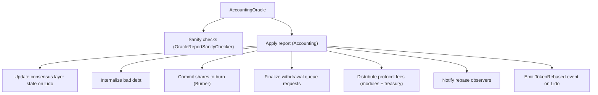

# stETH superuser functions

This guide describes the stETH control surface in Lido V3, the roles that can change protocol behavior, and the current role holders on mainnet. It focuses on the minimal set of contracts that can mint, burn, or pause stETH supply.

## What stETH is in Lido V3

- stETH is the rebasing token representing pooled ETH in the Core Lido pool
- stVaults can mint stETH as **external shares** against overcollateralized collateral
- Rebases are driven by oracle reports applied through [Accounting](/contracts/accounting)
- Total supply = internal shares (Lido Core pool) + external shares (stVaults)

## Control surfaces (first principles)

The supply of stETH can change only through the following paths:

| Surface | Contract | Mutators | Notes |
| --- | --- | --- | --- |
| Oracle report | [Accounting](/contracts/accounting) | `handleOracleReport()` | Applies protocol rebase and fee minting |
| External shares | [VaultHub](/contracts/vault-hub) | `mintShares()`, `burnShares()` | Mints/burns external shares for stVaults |
| Burn queue | [Burner](/contracts/burner) | `requestBurnShares()`, `commitSharesToBurn()` | Withdrawal finalization and penalties |
| Module rewards | [StakingRouter](/contracts/staking-router) | `reportRewardsMinted()` | Distributes minted shares to modules |
| Emergency pause | [Lido](/contracts/lido) | `stop()`, `resume()` | Pauses core stETH operations |

## Key contracts

| Contract                                   | Address                                                                                                                 | Purpose                                                      |
| ------------------------------------------ | ----------------------------------------------------------------------------------------------------------------------- | ------------------------------------------------------------ |
| [Lido](/contracts/lido)                    | [`0xae7ab96520DE3A18E5e111B5EaAb095312D7fE84`](https://etherscan.io/address/0xae7ab96520DE3A18E5e111B5EaAb095312D7fE84) | Core stETH token and staking pool                            |
| [Accounting](/contracts/accounting)        | [`0x23ED611be0e1a820978875C0122F92260804cdDf`](https://etherscan.io/address/0x23ED611be0e1a820978875C0122F92260804cdDf) | Oracle report handling and rebases                           |
| [StakingRouter](/contracts/staking-router) | [`0xFdDf38947aFB03C621C71b06C9C70bce73f12999`](https://etherscan.io/address/0xFdDf38947aFB03C621C71b06C9C70bce73f12999) | Staking module routing and withdrawal credentials management |
| [Burner](/contracts/burner)                | [`0xE76c52750019b80B43E36DF30bf4060EB73F573a`](https://etherscan.io/address/0xE76c52750019b80B43E36DF30bf4060EB73F573a) | stETH burning for withdrawals                                |
| [VaultHub](/contracts/vault-hub)           | [`0x1d201BE093d847f6446530Efb0E8Fb426d176709`](https://etherscan.io/address/0x1d201BE093d847f6446530Efb0E8Fb426d176709) | External share minting for stVaults                          |
| [HashConsensus](/contracts/hash-consensus) | [`0xD624B08C83bAECF0807Dd2c6880C3154a5F0B288`](https://etherscan.io/address/0xD624B08C83bAECF0807Dd2c6880C3154a5F0B288) | AccountingOracle consensus contract                          |
| Aragon ACL                                 | [`0x9895f0f17cc1d1891b6f18ee0b483b6f221b37bb`](https://etherscan.io/address/0x9895f0f17cc1d1891b6f18ee0b483b6f221b37bb) | Permission registry for AragonApp-based access control       |

## Who controls stETH behavior

Control is governed by the Lido DAO. Roles are assigned to DAO-owned contracts or protocol components.

| Entity             | Address                                                                                                                 | Description                                                                              |
| ------------------ | ----------------------------------------------------------------------------------------------------------------------- | ---------------------------------------------------------------------------------------- |
| DAO Agent          | [`0x3e40D73EB977Dc6a537aF587D48316feE66E9C8c`](https://etherscan.io/address/0x3e40D73EB977Dc6a537aF587D48316feE66E9C8c) | Holds most admin roles; executes DAO votes                                               |
| GateSeal Committee | [`0x8772E3a2D86B9347A2688f9bc1808A6d8917760C`](https://etherscan.io/address/0x8772E3a2D86B9347A2688f9bc1808A6d8917760C) | Emergency pause signer for GateSeal                                                      |
| Reseal Manager     | [`0x7914b5a1539b97Bd0bbd155757F25FD79A522d24`](https://etherscan.io/address/0x7914b5a1539b97Bd0bbd155757F25FD79A522d24) | Pause extension authority for GateSeal-paused apps under DualGovernance veto escalations |

All protocol proxy admins are set to the Lido DAO Agent.

## Pause and resume

**When paused**: Token transfers, approvals, and rebases are disabled. Core protocol entry points (staking, withdrawals) revert.

| Contract                | Role          | Role registry / owner contract                                                                                                       | Current holder(s) | Purpose         |
| ----------------------- | ------------- | ------------------------------------------------------------------------------------------------------------------------------------ | ----------------- | --------------- |
| [Lido](/contracts/lido) | `PAUSE_ROLE`  | Aragon ACL ([`0x9895f0f17cc1d1891b6f18ee0b483b6f221b37bb`](https://etherscan.io/address/0x9895f0f17cc1d1891b6f18ee0b483b6f221b37bb)) | Unassigned        | Pause protocol  |
| [Lido](/contracts/lido) | `RESUME_ROLE` | Aragon ACL ([`0x9895f0f17cc1d1891b6f18ee0b483b6f221b37bb`](https://etherscan.io/address/0x9895f0f17cc1d1891b6f18ee0b483b6f221b37bb)) | Unassigned        | Resume protocol |

**Mutators**: `stop()`, `resume()` on [Lido](/contracts/lido)

### Emergency pause via GateSeal

The GateSeal mechanism allows emergency pausing without a full DAO vote. The GateSeal Committee can trigger a time-limited pause (up to 14 days). The Reseal Manager holds both the pause and resume role for GateSeal-paused contracts to effectively prolong the pause if needed under certain DualGovernance veto conditions.

For current GateSeal contracts and protected apps, see the [GateSeal registry](/contracts/gate-seal).

## Burning stETH

Burning is routed through the [Burner](/contracts/burner) contract ([`0xE76c52750019b80B43E36DF30bf4060EB73F573a`](https://etherscan.io/address/0xE76c52750019b80B43E36DF30bf4060EB73F573a)).

| Contract                    | Role                         | Role registry / owner contract                                                                                                   | Current holder(s)                                                                                                                                                                                                                                                            | Purpose                           |
| --------------------------- | ---------------------------- | -------------------------------------------------------------------------------------------------------------------------------- | ---------------------------------------------------------------------------------------------------------------------------------------------------------------------------------------------------------------------------------------------------------------------------- | --------------------------------- |
| [Burner](/contracts/burner) | `REQUEST_BURN_SHARES_ROLE`   | Burner ([`0xE76c52750019b80B43E36DF30bf4060EB73F573a`](https://etherscan.io/address/0xE76c52750019b80B43E36DF30bf4060EB73F573a)) | Accounting ([`0x23ED611be0e1a820978875C0122F92260804cdDf`](https://etherscan.io/address/0x23ED611be0e1a820978875C0122F92260804cdDf)), CSAccounting ([`0x4d72BFF1BeaC69925F8Bd12526a39BAAb069e5Da`](https://etherscan.io/address/0x4d72BFF1BeaC69925F8Bd12526a39BAAb069e5Da)) | Request burns on behalf of others |
| [Burner](/contracts/burner) | `REQUEST_BURN_MY_STETH_ROLE` | Burner ([`0xE76c52750019b80B43E36DF30bf4060EB73F573a`](https://etherscan.io/address/0xE76c52750019b80B43E36DF30bf4060EB73F573a)) | Unassigned                                                                                                                                                                                                                                                                   | Burn caller's own stETH           |

**Used for**:

- Withdrawal finalization (burning stETH to release ETH)
- Covering slashing penalties
- DAO-directed burns (e.g., insurance fund operations)

## Staking limits

Controls the maximum ETH that can be staked per transaction or in total.

| Contract                | Role                   | Role registry / owner contract                                                                                                       | Current holder(s) | Purpose               |
| ----------------------- | ---------------------- | ------------------------------------------------------------------------------------------------------------------------------------ | ----------------- | --------------------- |
| [Lido](/contracts/lido) | `STAKING_CONTROL_ROLE` | Aragon ACL ([`0x9895f0f17cc1d1891b6f18ee0b483b6f221b37bb`](https://etherscan.io/address/0x9895f0f17cc1d1891b6f18ee0b483b6f221b37bb)) | Unassigned        | Adjust staking limits |

**Mutators**: `setStakingLimit()`, `removeStakingLimit()`, `pauseStaking()`, `resumeStaking()` on [Lido](/contracts/lido)

## External shares cap (stVaults)

External shares are stETH minted by stVaults against overcollateralized ETH. The cap limits how much stETH can be minted externally relative to the core pool.

| Contract                | Role                   | Role registry / owner contract                                                                                                       | Current holder(s) | Purpose                 |
| ----------------------- | ---------------------- | ------------------------------------------------------------------------------------------------------------------------------------ | ----------------- | ----------------------- |
| [Lido](/contracts/lido) | `STAKING_CONTROL_ROLE` | Aragon ACL ([`0x9895f0f17cc1d1891b6f18ee0b483b6f221b37bb`](https://etherscan.io/address/0x9895f0f17cc1d1891b6f18ee0b483b6f221b37bb)) | Unassigned        | Set external shares cap |

**Mutator**: `setMaxExternalRatioBP()` on [Lido](/contracts/lido)

**Current behavior**: External shares are capped as a basis point ratio of total shares. For example, if the cap is 1000 BP (10%), and total internal shares are 9M stETH, external shares cannot exceed 1M stETH.

**View methods**:

- `getExternalShares()` - Returns total external shares
- `getExternalEther()` - Returns ETH backing external shares
- `getMaxExternalRatioBP()` - Returns current cap in basis points

## Withdrawal credentials

Controls the Ethereum withdrawal credentials for new validators deposited by the protocol.

| Contract                                   | Role                                 | Role registry / owner contract                                                                                                          | Current holder(s) | Purpose                    |
| ------------------------------------------ | ------------------------------------ | --------------------------------------------------------------------------------------------------------------------------------------- | ----------------- | -------------------------- |
| [StakingRouter](/contracts/staking-router) | `MANAGE_WITHDRAWAL_CREDENTIALS_ROLE` | StakingRouter ([`0xFdDf38947aFB03C621C71b06C9C70bce73f12999`](https://etherscan.io/address/0xFdDf38947aFB03C621C71b06C9C70bce73f12999)) | Unassigned        | Set withdrawal credentials |

**Mutator**: `setWithdrawalCredentials()` on [StakingRouter](/contracts/staking-router) 

This is a sensitive operation that should only occur during protocol setup or major upgrades.

## Fees and treasury configuration

| Lever                | Role / permission              | Role registry / owner contract                                                                                                          | Current holder(s)                                                                                                                      |
| -------------------- | ------------------------------ | --------------------------------------------------------------------------------------------------------------------------------------- | -------------------------------------------------------------------------------------------------------------------------------------- |
| Protocol fee (total) | Aragon ACL permissions on Lido | Aragon ACL ([`0x9895f0f17cc1d1891b6f18ee0b483b6f221b37bb`](https://etherscan.io/address/0x9895f0f17cc1d1891b6f18ee0b483b6f221b37bb))    | Unassigned                                                                                                                             |
| Module fee splits    | `STAKING_MODULE_MANAGE_ROLE`   | StakingRouter ([`0xFdDf38947aFB03C621C71b06C9C70bce73f12999`](https://etherscan.io/address/0xFdDf38947aFB03C621C71b06C9C70bce73f12999)) | Aragon Agent ([`0x3e40D73EB977Dc6a537aF587D48316feE66E9C8c`](https://etherscan.io/address/0x3e40D73EB977Dc6a537aF587D48316feE66E9C8c)) |
| Treasury address     | Aragon ACL permissions on Lido | Aragon ACL ([`0x9895f0f17cc1d1891b6f18ee0b483b6f221b37bb`](https://etherscan.io/address/0x9895f0f17cc1d1891b6f18ee0b483b6f221b37bb))    | Unassigned                                                                                                                             |

**Contracts**: [Lido](/contracts/lido) ([`0xae7ab96520DE3A18E5e111B5EaAb095312D7fE84`](https://etherscan.io/address/0xae7ab96520DE3A18E5e111B5EaAb095312D7fE84)), [StakingRouter](/contracts/staking-router) ([`0xFdDf38947aFB03C621C71b06C9C70bce73f12999`](https://etherscan.io/address/0xFdDf38947aFB03C621C71b06C9C70bce73f12999))

Fee parameters are set on-chain and can change via DAO decisions. For current values, see [StakingRouter](/contracts/staking-router) and related module parameters.

Protocol fee and treasury permissions are intentionally unassigned today. The DAO can assign them later through Aragon ACL governance; see the [permissions transition guide](https://github.com/lidofinance/dual-governance/blob/main/docs/permissions-transition/permissions-transition-mainnet.md) for design context (prepared pre-V3 but still relevant on principles).

## Oracle and accounting flow

1. Oracle committee members submit reports to [HashConsensus](/contracts/hash-consensus) ([`0xD624B08C83bAECF0807Dd2c6880C3154a5F0B288`](https://etherscan.io/address/0xD624B08C83bAECF0807Dd2c6880C3154a5F0B288))
2. When quorum is reached, [AccountingOracle](/contracts/accounting-oracle) ([`0x852deD011285fe67063a08005c71a85690503Cee`](https://etherscan.io/address/0x852deD011285fe67063a08005c71a85690503Cee)) performs sanity checks
3. AccountingOracle updates consensus layer state on [Lido](/contracts/lido) ([`0xae7ab96520DE3A18E5e111B5EaAb095312D7fE84`](https://etherscan.io/address/0xae7ab96520DE3A18E5e111B5EaAb095312D7fE84)) via [Accounting](/contracts/accounting) ([`0x23ED611be0e1a820978875C0122F92260804cdDf`](https://etherscan.io/address/0x23ED611be0e1a820978875C0122F92260804cdDf))
4. [Accounting](/contracts/accounting) internalizes bad debt
5. [Accounting](/contracts/accounting) commits shares to burn via [Burner](/contracts/burner)
6. [Accounting](/contracts/accounting) finalizes withdrawal queue requests
7. [Accounting](/contracts/accounting) distributes protocol fees to modules and treasury
8. [Accounting](/contracts/accounting) notifies rebase observers
9. [Lido](/contracts/lido) emits `TokenRebased`

## On-chain verification

**Aragon ACL roles (Lido, Voting, Agent, etc.)**

- Use the ACL contract ([`0x9895f0f17cc1d1891b6f18ee0b483b6f221b37bb`](https://etherscan.io/address/0x9895f0f17cc1d1891b6f18ee0b483b6f221b37bb)) `hasPermission(entity, app, role)` for a specific entity.
- Aragon ACL cannot enumerate role members on-chain. To prove a role is not granted to any contract, you must index historical `SetPermission` events off-chain (see `tests/regression/test_permissions.py` in `lidofinance/scripts`: https://github.com/lidofinance/scripts and https://github.com/lidofinance/scripts/blob/master/tests/regression/test_permissions.py).

**AccessControlEnumerable roles (Burner, VaultHub, OperatorGrid, LazyOracle, PredepositGuarantee, StakingRouter)**

- Use `getRoleMemberCount` / `getRoleMember` (if available) or `hasRole` to verify role holders on-chain.

## Operational implications

### Pausing effects

| When paused...  | Effect                                                                           |
| --------------- | -------------------------------------------------------------------------------- |
| Token transfers | All `transfer()` and `transferFrom()` calls revert                               |
| Approvals       | `approve()` calls revert                                                         |
| Staking         | `submit()` reverts;no new ETH can be staked                                      |
| Withdrawals     | Withdrawal requests revert                                                       |
| Rebases         | AccountingOracle processing (via Accounting) can be blocked while Lido is paused |

### External shares cap effects

| Cap reached...    | Effect                                           |
| ----------------- | ------------------------------------------------ |
| stVault minting   | New `mintShares()` calls from VaultHub revert    |
| Core pool staking | Unaffected;internal shares can still grow        |
| Existing stVaults | Existing minted shares unaffected;can still burn |

### Fee configuration effects

| Change                  | Effect                                         |
| ----------------------- | ---------------------------------------------- |
| Increase protocol fee   | More staking rewards go to protocol vs stakers |
| Change module splits    | Affects node operator vs treasury distribution |
| Treasury address change | Future fee distributions go to new address     |

## Governance references

- [Lido DAO Voting](https://vote.lido.fi/)
- [Protocol levers](/guides/protocol-levers)
- [Emergency Brakes Multisigs](/multisigs/emergency-brakes)
- [Deployed contracts (mainnet)](/deployed-contracts)
