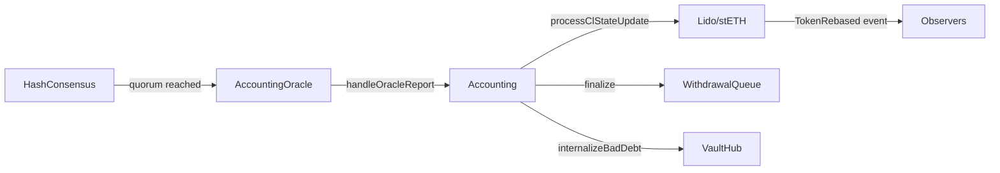

# stETH superuser functions

This guide describes the stETH control surface in Lido V3 and the roles that can change protocol behavior. It provides concrete addresses for role holders and explains the operational implications of each capability.

## What stETH is in Lido V3

- stETH is the rebasing token representing pooled ETH in the core Lido pool
- stVaults can mint stETH as **external shares** against overcollateralized collateral
- Rebases are driven by oracle reports applied through the [Accounting](/contracts/accounting) contract
- Total supply = internal shares (core pool) + external shares (stVaults)

## Key contracts

| Contract                                   | Address                                                                                                                 | Purpose                                                      |
| ------------------------------------------ | ----------------------------------------------------------------------------------------------------------------------- | ------------------------------------------------------------ |
| [Lido](/contracts/lido)                    | [`0xae7ab96520DE3A18E5e111B5EaAb095312D7fE84`](https://etherscan.io/address/0xae7ab96520DE3A18E5e111B5EaAb095312D7fE84) | Core stETH token and staking pool                            |
| [Accounting](/contracts/accounting)        | [`0x23ED611be0e1a820978875C0122F92260804cdDf`](https://etherscan.io/address/0x23ED611be0e1a820978875C0122F92260804cdDf) | Oracle report handling and rebases                           |
| [StakingRouter](/contracts/staking-router) | [`0xFdDf38947aFB03C621C71b06C9C70bce73f12999`](https://etherscan.io/address/0xFdDf38947aFB03C621C71b06C9C70bce73f12999) | Staking module routing and withdrawal credentials management |
| [Burner](/contracts/burner)                | [`0xE76c52750019b80B43E36DF30bf4060EB73F573a`](https://etherscan.io/address/0xE76c52750019b80B43E36DF30bf4060EB73F573a) | stETH burning for withdrawals                                |
| [VaultHub](/contracts/vault-hub)           | [`0x1d201BE093d847f6446530Efb0E8Fb426d176709`](https://etherscan.io/address/0x1d201BE093d847f6446530Efb0E8Fb426d176709) | External share minting for stVaults                          |
| Aragon ACL                                 | [`0x9895f0f17cc1d1891b6f18ee0b483b6f221b37bb`](https://etherscan.io/address/0x9895f0f17cc1d1891b6f18ee0b483b6f221b37bb) | Permission registry for AragonApp-based access control       |

## Who controls stETH behavior

Control is governed by the Lido DAO. Roles are assigned to DAO-owned contracts or protocol components.

| Entity             | Address                                                                                                                                        | Description                                |
| ------------------ | ---------------------------------------------------------------------------------------------------------------------------------------------- | ------------------------------------------ |
| DAO Agent          | [`0x3e40D73EB977Dc6a537aF587D48316feE66E9C8c`](https://etherscan.io/address/0x3e40D73EB977Dc6a537aF587D48316feE66E9C8c)                        | Holds most admin roles; executes DAO votes |
| GateSeal Committee | [`0x8772E3a2D86B9347A2688f9bc1808A6d8917760C`](https://app.safe.global/transactions/queue?safe=eth:0x8772E3a2D86B9347A2688f9bc1808A6d8917760C) | Emergency pause capability                 |

All protocol proxy admins are set to the Lido DAO Agent.

## Pause and resume

**When paused**: Token transfers, approvals, and rebases are disabled. Core protocol entry points (staking, withdrawals) revert.

| Contract                | Role          | Role registry | Role admin | Holder     | Purpose         |
| ----------------------- | ------------- | ------------- | ---------- | ---------- | --------------- |
| [Lido](/contracts/lido) | `PAUSE_ROLE`  | Aragon ACL    | DAO Agent  | Unassigned | Pause protocol  |
| [Lido](/contracts/lido) | `RESUME_ROLE` | Aragon ACL    | DAO Agent  | Unassigned | Resume protocol |

**Mutators**: `stop()`, `resume()` on [Lido](/contracts/lido)

### Emergency pause via GateSeal

The GateSeal mechanism allows emergency pausing without a full DAO vote. The GateSeal Committee can trigger a time-limited pause (up to 14 days), after which the DAO must vote to resume or extend.

| Contract                         | Address                                                                                                                 | Protects                      |
| -------------------------------- | ----------------------------------------------------------------------------------------------------------------------- | ----------------------------- |
| [GateSeal](/contracts/gate-seal) | [`0x8A854C4E750CDf24f138f34A9061b2f556066912`](https://etherscan.io/address/0x8A854C4E750CDf24f138f34A9061b2f556066912) | WithdrawalQueueERC721         |
| [GateSeal](/contracts/gate-seal) | [`0x881dAd714679A6FeaA636446A0499101375A365c`](https://etherscan.io/address/0x881dAd714679A6FeaA636446A0499101375A365c) | VaultHub, PredepositGuarantee |

## Burning stETH

Burning is routed through the [Burner](/contracts/burner) contract ([`0xE76c52750019b80B43E36DF30bf4060EB73F573a`](https://etherscan.io/address/0xE76c52750019b80B43E36DF30bf4060EB73F573a)).

| Contract                    | Role                         | Role registry | Role admin | Holder                   | Purpose                           |
| --------------------------- | ---------------------------- | ------------- | ---------- | ------------------------ | --------------------------------- |
| [Burner](/contracts/burner) | `REQUEST_BURN_SHARES_ROLE`   | Burner        | DAO Agent  | Accounting, CSAccounting | Request burns on behalf of others |
| [Burner](/contracts/burner) | `REQUEST_BURN_MY_STETH_ROLE` | Burner        | DAO Agent  | Unassigned               | Burn caller's own stETH           |

**Used for**:

- Withdrawal finalization (burning stETH to release ETH)
- Covering slashing penalties
- DAO-directed burns (e.g., insurance fund operations)

## Staking limits

Controls the maximum ETH that can be staked per transaction or in total.

| Contract                | Role                   | Role registry | Role admin | Holder     | Purpose               |
| ----------------------- | ---------------------- | ------------- | ---------- | ---------- | --------------------- |
| [Lido](/contracts/lido) | `STAKING_CONTROL_ROLE` | Aragon ACL    | DAO Agent  | Unassigned | Adjust staking limits |

**Mutators**: `setStakingLimit()`, `removeStakingLimit()`, `pauseStaking()`, `resumeStaking()`

## External shares cap (stVaults)

External shares are stETH minted by stVaults against overcollateralized ETH. The cap limits how much stETH can be minted externally relative to the core pool.

| Contract                | Role                   | Role registry | Role admin | Holder     | Purpose                 |
| ----------------------- | ---------------------- | ------------- | ---------- | ---------- | ----------------------- |
| [Lido](/contracts/lido) | `STAKING_CONTROL_ROLE` | Aragon ACL    | DAO Agent  | Unassigned | Set external shares cap |

**Mutator**: `setMaxExternalRatioBP()` on [Lido](/contracts/lido)

**Current behavior**: External shares are capped as a basis point ratio of total shares. For example, if the cap is 1000 BP (10%), and total internal shares are 9M stETH, external shares cannot exceed 1M stETH.

**View methods**:

- `getExternalShares()` - Returns total external shares
- `getExternalEther()` - Returns ETH backing external shares
- `getMaxExternalRatioBP()` - Returns current cap in basis points

## Withdrawal credentials

Controls the Ethereum withdrawal credentials for new validators deposited by the protocol.

| Contract                                   | Role                                 | Role registry | Role admin | Holder     | Purpose                    |
| ------------------------------------------ | ------------------------------------ | ------------- | ---------- | ---------- | -------------------------- |
| [StakingRouter](/contracts/staking-router) | `MANAGE_WITHDRAWAL_CREDENTIALS_ROLE` | StakingRouter | DAO Agent  | Unassigned | Set withdrawal credentials |

**Mutator**: `setWithdrawalCredentials()`

This is a sensitive operation that should only occur during protocol setup or major upgrades.

## Fees and treasury configuration

| Lever                | Role                         | Holder    |
| -------------------- | ---------------------------- | --------- |
| Protocol fee (total) | Aragon permissions           | DAO Agent |
| Module fee splits    | `STAKING_MODULE_MANAGE_ROLE` | DAO Agent |
| Treasury address     | Aragon permissions           | DAO Agent |

**Contracts**: [Lido](/contracts/lido), [StakingRouter](/contracts/staking-router) ([`0xFdDf38947aFB03C621C71b06C9C70bce73f12999`](https://etherscan.io/address/0xFdDf38947aFB03C621C71b06C9C70bce73f12999))

Fee parameters are set on-chain and can change via DAO decisions. For current values, see [StakingRouter](/contracts/staking-router) and related module parameters.

## Oracle and accounting flow

1. Oracle committee members submit reports to [HashConsensus](/contracts/hash-consensus.md)
2. When quorum is reached, [AccountingOracle](/contracts/accounting-oracle.md) triggers the report
3. [Accounting](/contracts/accounting) applies the report and updates Lido state
4. Token rebases are emitted via `TokenRebased` event

## Operational implications

### Pausing effects

| When paused...  | Effect                                                           |
| --------------- | ---------------------------------------------------------------- |
| Token transfers | All `transfer()` and `transferFrom()` calls revert               |
| Approvals       | `approve()` calls revert                                         |
| Staking         | `submit()` reverts;no new ETH can be staked                      |
| Withdrawals     | Withdrawal requests revert                                       |
| Rebases         | Oracle report processing and rebases may be blocked while paused |

### External shares cap effects

| Cap reached...    | Effect                                           |
| ----------------- | ------------------------------------------------ |
| stVault minting   | New `mintShares()` calls from VaultHub revert    |
| Core pool staking | Unaffected;internal shares can still grow        |
| Existing stVaults | Existing minted shares unaffected;can still burn |

### Fee configuration effects

| Change                  | Effect                                         |
| ----------------------- | ---------------------------------------------- |
| Increase protocol fee   | More staking rewards go to protocol vs stakers |
| Change module splits    | Affects node operator vs treasury distribution |
| Treasury address change | Future fee distributions go to new address     |

## Governance references

- [Lido DAO Voting](https://vote.lido.fi/)
- [Protocol levers](/guides/protocol-levers)
- [Emergency Brakes Multisigs](/multisigs/emergency-brakes)
- [Deployed contracts (mainnet)](/deployed-contracts)
