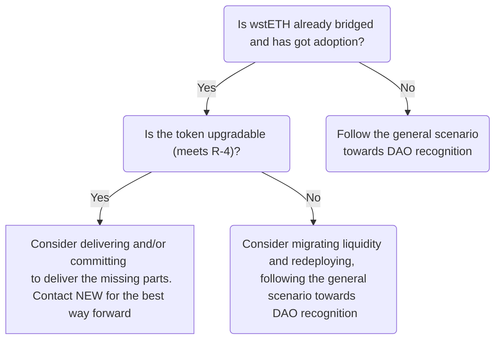

# wstETH rollup bridging guide

:::warning Disclaimer
This is an unofficial and incomplete version of the bridging guide intended for informational purposes only and does not state any commitment from the Lido DAO or from the Network Expansion Workgroup.
:::

## Intro

This document is intended for the developers representing network/rollup foundations and DAOs looking to bridge Lido's wstETH on Ethereum L2 (rollup) networks.

:::info
This guide doesn't cover yet bridging of rebasable stETH token nor bridging to non-L2-rollup networks. However, please note that bridging stETH in a standardish way might cause a loss of user assets due to the rewards accrued being stuck on an L1 bridge.
:::

While technically, it is feasible to bridge the wstETH token on an L2 network as any other standard plain ERC-20 compatible token, it might not be aligned with the long-term vision of the Lido DAO for stETH future-proof adoption and general community sentiment.

This guide covers the recommendations as well as provides general guidelines, and reveals the logic behind to smooth the process. It's essential to understand that conforming to or diverging from these guidelines won't ensure the recognition or rejection of a specific proposal by the Lido DAO. Nonetheless, adhering to these guidelines substantially increases the likelihood of gaining support from the Network Expansion Workgroup (NEW) and community. Ultimately, the final decision is determined by the outcome of the voting process.

:::info
Please send any of your feedback on the guide to the NEW — the doc gets iterative updates.
:::

## Why is this guide needed

As said before, the "standard" way to bridge an ERC-20 token is to deploy on L2 a non-upgradable token and use the general bridge contract, this guide proposes to implement a more complex solution.

In short, to deploy upgradable custom (still native) bridges on L1 and L2 and an upgradable token on L2, all governed by the Lido DAO on L1 ([Aragon Agent contract](https://etherscan.io/address/0x3e40D73EB977Dc6a537aF587D48316feE66E9C8c)) via a dedicated [AAVE-like governance executor](https://github.com/lidofinance/governance-crosschain-bridges/) contract on L2. This architecture is proposed to provide the following capabilities.

1. Have the ability to pass additional data and revamp logic. Specifically for the bridging rebasable stETH (requires passing wstETH/stETH rate). The stETH token is not a general-purpose token but an asset built on top of the liquid staking protocol, which has moving and upgradable parts.
2. Let the token be "future proof" and avoid the potential need to do high-cost liquidity migration as Ethereum continues to evolve and new standards like ERC-2612/ERC-1271 get added.
3. Have the ability to pause/resume token bridging in case of an emergency or upgrade operation planning.

## The Lido DAO bridging endpoints recognition

Lido DAO can recognize the bridged wstETH endpoints by means of a signaling snapshot. For example, it has happened for: [Base](https://snapshot.org/#/lido-snapshot.eth/proposal/0x8b35f64fffe67f67d4aeb2de2f3351404c54cd75a08277c035fa77065b6792f4), [zkSync Era](https://snapshot.org/#/lido-snapshot.eth/proposal/0xe35f56a6117599eeb9dbef982613c0545710d91403a828d1fba00ab21d5188f3), [Mantle](https://snapshot.org/#/lido-snapshot.eth/proposal/0x1d38c11b27590ab5c69ca21c5d2545d53b7f5150dada7e05f89d500ede5becad), [Linea](https://snapshot.org/#/lido-snapshot.eth/proposal/0x9382624eeee68a175dd7d1438347dbad4899ba0d2bfcf7c3955f087cb9f5cfc4).

If Lido DAO recognizes the bridged wstETH endpoints, in general, it means:
- Lido DAO has levers to upgrade the dedicated token bridge and token contracts;
- the integration would be highlighted on the frontend pages: landing, widget, and ecosystem pages; however,  there are no in-house bridging UIs yet;
- contracts are under the Lido's bug bounty program;
- there is a monitoring and alerting suite built on Forta;
- marketing campaign: blog, tweets, incentives for the liquidity bootstrapping long-term, potential reward share program cases.

Usually, the Lido DAO recognizes the bridged wstETH endpoints if the specific set of security and design recommendations are met. These recommendations are set out in [On-bridging-solution](#On-bridging-solution) section in paragraphs **R1-R8**. The rest of the recommendations (**R9-...**) are also important and foster the recognition's likelihood.

If only recommendations [R1-R4](https://www.hypernative.io/) are met the token might get acknowledged by the NEW as meeting security and future-proof baseline and/or get possible [LoL](https://research.lido.fi/t/liquidity-observation-lab-lol-liquidity-strategy-and-application-to-curve-steth-eth-pool/5335) incentives at max (still if safu but using the LoLs own criteria).

If any of [R1-R4](https://www.hypernative.io/) aren't satisfied, there is little chance of the Lido DAO recognition or the NEW's acknowledgment. It may be worth retracting the already deployed token from the market, though LoL still *hypothetically* could provide targeted support.

## The path to the Lido DAO recognition

Depending of the starting conditions, the path to bridging wstETH token might differ. Here is an approximate decision tree.

## General scenario towards the Lido DAO recognition

This section describes an approximate path to bridging wstETH to an L2 network. The order of the steps is not strict but follows the general flow.

🐾 Study the bridging guide and fill in [the questionnaire](#questionnaire) about your solution and send it to the NEW.

🐾 Coordinate on priority lane, timings, and reviews with the NEW.

🐾 Get the architecture and the deploy configuration verified by the NEW.

🐾 Deploy the contracts to testnet. Get the testnet deployment verified by coordinating through the NEW.

🐾 Express intention to bridge wstETH on the forum, outlining the details and technical plan. Consider:
- Target one network per proposal to make the discussion more focused.
- The post should be published in advance, ideally at least two weeks before any potential snapshot vote, to allow time for discussion and verification of the proposal.
- The deployment addresses are not required at once but must be proposed at least a week before the snapshot voting starts.
- If the proposed solution does not satisfy some of the recommendations (**R5...**), consider including the roadmap and committing to deliver it.
- Examples:
    - [wstETH to Base](https://research.lido.fi/t/wsteth-deployment-to-base-and-ownership-acceptance-by-lido-dao/5668)
    - [wstETH to zkSync Era](https://research.lido.fi/t/wsteth-deployment-on-zksync/5701)
    - [wstETH to Mantle](https://research.lido.fi/t/wsteth-deployment-on-mantle/5991)
    - [wstETH to Linea](https://research.lido.fi/t/wsteth-on-linea-ownership-acceptance-by-lido-dao/5961)

🐾 Deploy the contracts to mainnet. Get the mainnet deployment verified by the Lido protocol contributors and external security group if applicable (coordinating through NEW).

🐾 Pass snapshot voting on https://snapshot.org/#/lido-snapshot.eth/. It should contain the final mainnet addresses and audits according to **R1**. Otherwise, one more snapshot voting with the addresses would have been required.

## Recommendations

This section enumerates design and security recommendations for a wstETH bridging solution.

### Security and future-proof baseline

The baseline recommendations: if any are not met there is a minimal chance of the Lido DAO recognition or NEW acknowledgment.

#### R-1: Audited code and verifiable deployment

The entire codebase (rollup, bridge, token) must be audited by a reputable third party.
Please, contact the NEW to check the temperature if the audit provider isn't familiar with the protocol codebase (see the providers here: [https://github.com/lidofinance/audits/](https://github.com/lidofinance/audits/))

The deployment must be verifiable:
- all code accessible and the commit corresponds to the audit report;
- source code verified on the explorer;
- verifiable bytecode;
- correct levers setup.

For submitting sources for verification on explorer, please use standard JSON input - not flattened. It matters because it allows to verify the sources via automated tools (e.g., [diffyscan](https://github.com/lidofinance/diffyscan)).

#### R-2: "Lock and mint" bridge mechanics

Use the lock-and-mint bridging mechanism.

The general security approach here is to isolate L2/cross-chain risks, ensuring no additional risks are imposed on Lido protocol on Ethereum or to other L2s and alt L1s with already bridged wstETH. This is almost unachievable with a ‘burn-and-mint’ architecture.

#### R-3: Usage of canonical bridge

Usage of the bridge, canonical for the L2 network, is highly encouraged. If the native bridge does not exist, is not a public good, or is closed-sourced, it is okay to go with the most "canonical-ish" option.

#### R-4: L2 wstETH token upgradable

The bridged token should be upgradable by the Lido DAO to be future-proof (support of new standards, passing additional data, etc.) and to provide a foundation for potential stETH bridging without incurring liquidity fragmentation.

If a dedicated upgradable bridge is not deployed (R-5), it must provide the capability to set/change the bridge instance used.

### The Lido DAO recognition recommendations by the NEW

The recommendations from R-5 to R-8 are crucial for the recognition of the bridged wstETH endpoints by the Lido DAO.

The recommendations starting from R-9 are not crucial but significantly contribute to the likelihood of the Lido DAO recognition.

#### R-5: Bridging L1 Lido DAO decisions

Control over the contracts endpoints must be passed to the Lido DAO Agent on L1. The proposed method of doing this is to use a dedicated governance executor contract on L2.

Examples:
- [`OptimismBridgeExecutor`](https://optimistic.etherscan.io/address/0xefa0db536d2c8089685630fafe88cf7805966fc3);
- [Bridge executor on Base](https://basescan.org/address/0x0E37599436974a25dDeEdF795C848d30Af46eaCF) - reused `OptimismBridgeExecutor` contract;
- [`ZkSyncBridgeExecutor`](https://explorer.zksync.io/address/0x13f46b59067f064c634fb17e207ed203916dccc8#contract)
- [`LineaBridgeExecutor`](https://lineascan.build/address/0x74Be82F00CC867614803ffd7f36A2a4aF0405670)

For more examples, see Governance Bridge Executors at https://docs.lido.fi/deployed-contracts/#lido-on-l2. The contracts originate from [Aave Governance Cross-Chain Bridges](https://github.com/aave/governance-crosschain-bridges) and can be found at https://github.com/lidofinance/lido-l2/ and [PRs](https://github.com/lidofinance/governance-crosschain-bridges/pulls).

#### R-6: Dedicated upgradable bridge instances

Deploy dedicated upgradable instances of bridges on L1 and L2.
This is required to lay the foundation for the emergency capabilities (R-7) and for possible bridging of rebasable stETH. For more details on why, see for section [Why this guide needed](#why-is-this-guide-needed). For the architecture outline, see section [Reference architecture and permissions setup](#reference-architecture-and-permissions-setup).

#### R-7: Pausable deposits and withdrawals

To provide the capability to react fast and reduce losses in case of a security contingency, depositing and withdrawing should be pausable. Namely:

- L1 bridge has pausable and resumable deposits;
- L2 bridge/token has pausable and resumable withdrawals.

The capability to pause should be granted both to the DAO Agent instance (or its L2 representation) and the dedicated Emergency Multisig which is [ratified by the Lido DAO](https://snapshot.org/#/lido-snapshot.eth/proposal/0xfe2a6a6506a642b616118363bc29aa83dd9ef2ec80447bb607a8f52c0a96aed0). The permission to resume is proposed to be granted only to the Lido DAO Agent (or its L2 representation).

To reduce the power of the multisig beyond necessary, it is proposed to use "Gate Seals" mechanic. The mechanic limits the pause duration and restricts the capability to pause to a single time. To grant the capability repeatedly, the Lido DAO vote is required. The mechanic has been implemented, e.g., for withdrawals in Lido protocol on Ethereum in two parts:
- one-time disposable pauser contact [Gate Seals](https://github.com/lidofinance/gate-seals);
- [PausableUntil](https://github.com/lidofinance/lido-dao/blob/master/contracts/0.8.9/utils/PausableUntil.sol) contract (inherited by [WithdrawalQueue](https://github.com/lidofinance/lido-dao/blob/master/contracts/0.8.9/WithdrawalQueue.sol)).

#### R-8: Support of ERC-2612 permit enhanced with EIP-1271

The bridged wstETH should support [EIP-2612 permit ERC-20 token extension](https://eips.ethereum.org/EIPS/eip-2612) with [EIP-1271 standard signature validation method for contracts](https://eip1271.io/). The latter paves the way to Account Abstraction adoption, see https://eip1271.io/.

Please take into account that the [OpenZeppeling ERC20 with permit (EIP-2612) implementation](https://github.com/OpenZeppelin/openzeppelin-contracts/blob/master/contracts/token/ERC20/extensions/ERC20Permit.sol) does not support smart contract signatures validation EIP-1271 and thus shouldn't be used as it is. Please consider extending ERC20Permit using [OpenZeppeling SignatureChecker util](https://docs.openzeppelin.com/contracts/4.x/api/utils#SignatureChecker) or [stETHPermit contract](https://github.com/lidofinance/lido-dao/blob/master/contracts/0.4.24/StETHPermit.sol) as a reference implementation. NB, that the wstETH token itself on Ethereum doesn't support this due to non-upgradability.

#### R-9: wstETH token/bridge state before snapshot vote

By the snapshot vote start, deposits and withdrawals should be unpaused unless there are any specific considerations to do otherwise.
Going with unpaused states provides the following:
- the bridge being in the final state during the snapshot vote — without any temporary permissions granted to the resumer or other actors;
- less operational load for contributors and token holders (to re-vote on additional changes).

Nevertheless, consider risks of liquidity fragmentation in case the currently deployed setup is not supported by snapshot vote but some wstETH has already been deposited. It's recommended to unpause a few days before the snapshot vote is planned to happen.

#### R-10: Upgradability mechanics

- The regular (`ERC1967Proxy`) proxy pattern is good enough; the transparent proxy pattern might be an unnecessary complication.
- Use ossifiable proxies when possible. For example, consider [OssifiableProxy](https://github.com/lidofinance/lido-l2/blob/main/contracts/proxy/OssifiableProxy.sol), which is used in Lido protocol on Ethereum.

Please have the implementations petrified with dummy values. It helps to reduce confusion, like taking the implementation address instead of the proxy address. For example, see [zkSync Era ERC20BridgedUpgradeable implementation](https://explorer.zksync.io/address/0xc7a0daa1b8fea68532b6425d0e156088b0d2ab2c#contract) (bridge, decimals, name, symbol views).

#### R-11: Use AccessControlEnumerable for ACL

For access control, please prefer the standard OpenZeppelin ACL contract and its [enumerable version](https://docs.openzeppelin.com/contracts/4.x/api/access#AccessControlEnumerable) over non-enumerable versions. It allows full on-chain permissions verification — no need to analyze events or transactions as in non-enumerable implementations. For example, see [Lido ValidatorsExitBusOracle contract](https://etherscan.io/address/0xa89ea51fdde660f67d1850e03c9c9862d33bc42c#code).

#### R-12: Prepare the solution statements and share the deploy artifacts

It's advised to have the answered statements on the [wstETH bridging questionnaire](https://hackmd.io/@lido/H10HSoy3h?type=vie) included in the token bridge contracts GitHub repo README (see the [example](https://github.com/txfusion/lido-l2/tree/main/zksync#statements) for wstETH on zkSync Era)

Please share with the NEW: deploy scripts, acceptance tests, deploy plans, rollup-specific documentation on bridging approaches, etc. This would allow the NEW to simplify the deployment verification and make the feedback more specific.

:::note
To prepare the deployment actions plan, you might want to refer to the following [wstETH on Optimism deployment log](https://hackmd.io/@lido/By-ANUXT3?type=view) as a reference.
:::

#### R-13: No same contract addresses

Please avoid deploying contracts to the same addresses on L1 and L2 and/or testnets, as this might occur when deploying from a single EOA to multiple networks. Following this recommendation helps to avoid potential confusion in the future.

## Reference architecture and permissions setup

This section describes a kind of minimal bridging contracts setup and its configuration. This setup isn't a must and might not be the best for a specific network — its purpose is to outline the main functional parts and their interconnections.

Notation used:
- `Lido Agent` - Lido DAO [Aragon Agent](https://etherscan.io/address/0x3e40D73EB977Dc6a537aF587D48316feE66E9C8c) on L1;
- `Emergency Breaks L1 Multisig` - Emergency Multisig on L1 (ratified by the Lido DAO). See https://research.lido.fi/t/emergency-brakes-signer-rotation/5286;
- `Emergency Breaks L2 Multisig` - Emergency Multisig on L2 (the same participants but using the L2 Safe instance).

**L1 Custom Bridge**
- Upgradeable
	- Proxy admin is `Lido Agent`
- Admin is `Lido Agent`
- Deposits pausable by
	- `Lido Agent`
	- `Emergency Breaks Multisig`
- Deposits resumable by
	- `Lido Agent`
- Withdrawals pausable by
	- `Lido Agent`
	- `Emergency Breaks Multisig`
- Withdrawals resumable by
	- `Lido Agent`

**L2 Governance Executor**
- The only allow-listed L1 execution sender is `Lido Agent` (retrieved via `getEthereumExecutor()`)

**L2 Custom Bridge**
- Upgradeable
	- Proxy admin is `L2 Governance Executor`
- Admin is `L2 Governance Executor`
- Deposits pausable by
	- `L2 Governance Executor`
	- `Emergency Breaks Multisig`
- Deposits resumable by
	- `L2 Governance Executor`
- Withdrawals pausable by
	- `L2 Governance Executor`
	- `Emergency Breaks Multisig`
- Withdrawals resumable by
	- `L2 Governance Executor`

**L2 Token Bridged**
- Upgradeable
	- Proxy admin is `L2 Governance Executor`
- Mint is allowed only by `L2 Custom Bridge`
- Optionally applicable (if `L2 Custom Bridge` doesn't support these)
    - Admin is `L2 Governance Executor`
    - Withdrawals pausable by
        - `Emergency Breaks Multisig`
        - `L2 Governance Executor`
    - Withdrawals resumable by
        - `L2 Governance Executor`
    - Deposits pausable by
        - `L2 Governance Executor`
        - `Emergency Breaks Multisig`
    - Deposits resumable by
        - `L2 Governance Executor`

## The proposed configuration

### Mainnet

- `wstETH` - the wstETH token on L1
	- `0x7f39c581f595b53c5cb19bd0b3f8da6c935e2ca0`
- `Lido Agent` - Lido DAO Aragon Agent
	-  `0x3e40D73EB977Dc6a537aF587D48316feE66E9C8c`
- `Emergency Breaks L1 Multisig`
	- `0x73b047fe6337183A454c5217241D780a932777bD`
- `Emergency Breaks L2 Multisig`
	- ask the NEW for the address (the deployed Safe instance would be needed)

### Testnets

#### Holesky

:::info
Please, deploy to Holesky if possible:
- Görli is EOL;
- Sepolia is not good for Lido (permissioned validator set, deposit contract with a token, <2000 validators there
- Holešky has better long-term exposure and is suitable for large protocols and big testnets.
:::

- `wstETH` - the wstETH token on L1
	- `0x8d09a4502Cc8Cf1547aD300E066060D043f6982D`
- `Lido Agent` - Lido DAO Aragon Agent
	-  `0xE92329EC7ddB11D25e25b3c21eeBf11f15eB325d`
- `Emergency Breaks L1 Multisig`
	- `0xa5F1d7D49F581136Cf6e58B32cBE9a2039C48bA1` (EOA)
- `Emergency Breaks L2 Multisig`
	- `0xa5F1d7D49F581136Cf6e58B32cBE9a2039C48bA1` (EOA)

#### Görli (EOL)

- `wstETH` - the wstETH token on L1
	- `0x6320cd32aa674d2898a68ec82e869385fc5f7e2f`
- `Lido Agent` - Lido DAO Aragon Agent
	-  `0x4333218072D5d7008546737786663c38B4D561A4`
- `Emergency Breaks L1 Multisig`
	- `0xa5F1d7D49F581136Cf6e58B32cBE9a2039C48bA1` (EOA)
- `Emergency Breaks L2 Multisig`
	- `0xa5F1d7D49F581136Cf6e58B32cBE9a2039C48bA1` (EOA)

## FAQ

### Our network is Y-compatible, how about reusing the solution present on Y?

Yes, sure. For example, [OptimismBridgeExecutor](https://github.com/lidofinance/governance-crosschain-bridges/blob/master/contracts/bridges/OptimismBridgeExecutor.sol) has been [reused](https://basescan.org/address/0x0E37599436974a25dDeEdF795C848d30Af46eaCF#code) on Base network.
If do so, please don't alter the contract's code and use the same names. It allows to keep the audit valid and track origins.

### What if wstETH is already bridged and has ample liquidity?

Please consider getting in touch with the NEW if (**R1...R4**) are met.

## Questionnaire

To get fast feedback on the likelihood of the wstETH recognized by the Lido DAO, please fill in the questionnaire and send it to the NEW. In the comments section, please provide the relevant details: the artifacts, if present, and/or a description why the recommendation is not met or met partially, etc.

| Recommendation                               | Is satisfied?    | Comment |
| -------------------------------------------- | ---------------- | ------- |
| Has wstETH been bridged?                     | yes/no           |         |
| If bridged, how much adoption token has got? | yes/no           |         |
| R-1: Audited code and verifiable deployment  | yes/no/partially |         |
| R-2: Lock-and-mint bridge mechanics          | yes/no           |         |
| R-3: Usage of canonical bridge               | yes/no           |         |
| R-4: L2 wstETH token upgradable              | yes/no/partially |         |
| R-5: Bridging L1 Lido DAO decisions          | yes/no/partially |         |
| R-6: Dedicated upgradable bridge instances   | yes/no/partially |         |
| R-7: Pausable deposits and withdrawals       | yes/no/partially |         |
| R-8: ERC-2612 permit enhanced with EIP-1271  | yes/no/partially |         |
| R-9: Token/bridge state before snapshot vote | yes/no/partially |         |
| R-10: Upgradability mechanics                | yes/no/partially |         |
| R-11: Use AccessControlEnumerable for ACL    | yes/no/partially |         |
| R-12: Share the deploy artifacts             | yes/no/partially |         |
| R-13: No same contract addresses             | yes/no           |         |

## References

- Deployed contracts addresses https://docs.lido.fi/deployed-contracts/#lido-on-l2
- Lido L2 reference bridging contracts (Arbitrum and Optimism) https://github.com/lidofinance/lido-l2
- Unofficial guidelines (like the 1st iteration of the guide) https://research.lido.fi/t/unofficial-guidelines-for-bridging-solutions-network-expansion-workgroup/5790
- Lido emergency multisig https://research.lido.fi/t/emergency-brakes-signer-rotation/5286
- Lido DAO recognition proposal for wstETH on Base https://research.lido.fi/t/wsteth-deployment-to-base-and-ownership-acceptance-by-lido-dao/5668
- Lido DAO recognition proposal for wstETH on zkSync Era https://research.lido.fi/t/wsteth-deployment-on-zksync/5701
- Lido DAO recognition proposal for wstETH on Mantle https://research.lido.fi/t/wsteth-deployment-on-mantle/5991
- Lido DAO recognition proposal for wstETH on Linea https://research.lido.fi/t/wsteth-on-linea-ownership-acceptance-by-lido-dao/5961
