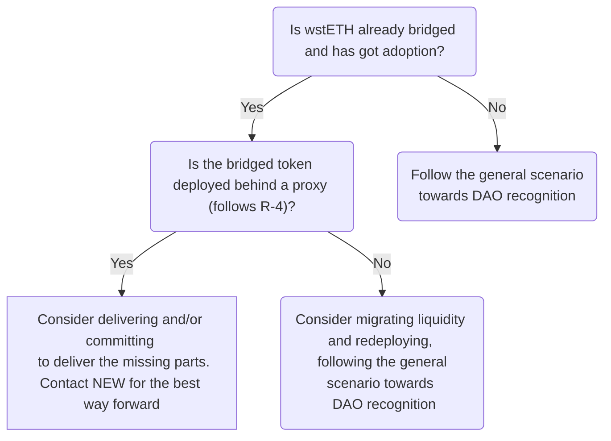

# wstETH rollup bridging guide

:::warning Disclaimer
This guide provides recommendations provided by the NEW workgroup. NEW is not a representative of the Lido DAO and by giving the feedback NEW makes no warranties, express or implied, and disclaims all implied warranties, including any warranty of the likelihood of the recognition or rejection by the Lido DAO and representation.
:::

## Intro

This document is intended for the developers representing network/rollup foundations and DAOs looking to bridge Lido's wstETH on Ethereum L2 (rollup) networks.

:::info
This guide doesn't cover yet bridging of rebasable stETH token nor bridging to non-L2-rollup networks. However, please note that bridging rebasable stETH token in a regular way might cause a loss of user assets due to the rewards accrued being stuck on an L1 bridge.
:::

While technically, it is feasible to bridge the wstETH token on an L2 network as any other standard plain ERC-20 compatible token, it might not be aligned with the long-term vision of the Lido DAO for stETH future-proof adoption and general community sentiment.

This guide covers the recommendations as well as provides general guidelines, and reveals the logic behind to smooth the process. **It's essential to understand that conforming to or diverging from these guidelines won't ensure the recognition or rejection of a specific proposal by the Lido DAO.** Nonetheless, adhering to these guidelines substantially increases the likelihood of gaining support from the Network Expansion Workgroup (NEW) and community. Ultimately, the final decision is determined by the outcome of the voting process.

:::info
Please send any of your feedback on the guide to the NEW — the doc gets iterative updates.
:::

## Why is this guide needed

As said before, the default way to bridge an ERC-20 token is to deploy on L2 a non-upgradable token and use the general bridge contract, this guide proposes to implement a more complex solution.

The solution involves deploying dedicated bridge endpoint contracts behind proxy on L1 and L2 and an upgradable token on L2, all governed by the Lido DAO on L1 ([Aragon Agent contract](https://etherscan.io/address/0x3e40D73EB977Dc6a537aF587D48316feE66E9C8c)) via a dedicated [governance executor](https://github.com/lidofinance/governance-crosschain-bridges/) contract on L2. This architecture is proposed to provide the following capabilities.

1. Passing arbitrary data. It allows laying the foundation for bridging rebasable stETH in the future (need to pass wstETH/stETH rate).
2. Revamping the token logic, as stETH is not a general-purpose token but an asset built on top of a living liquid-staking middleware.
3. Future-proofing the token, for example, to avoid high-cost liquidity migration as Ethereum continues evolving and new standards like [ERC-2612](https://eips.ethereum.org/EIPS/eip-2612)/[ERC-1271](https://eips.ethereum.org/EIPS/eip-1271) are adopted.
4. Pausing and resuming bridging in an emergency or during upgrades.

## The Lido DAO bridging endpoints recognition

Lido DAO can recognize the bridged wstETH endpoints by means of a signalling snapshot. For example, it has happened for:
[Base](https://snapshot.org/#/lido-snapshot.eth/proposal/0x8b35f64fffe67f67d4aeb2de2f3351404c54cd75a08277c035fa77065b6792f4),
[zkSync Era](https://snapshot.org/#/lido-snapshot.eth/proposal/0xe35f56a6117599eeb9dbef982613c0545710d91403a828d1fba00ab21d5188f3),
[Mantle](https://snapshot.org/#/lido-snapshot.eth/proposal/0x1d38c11b27590ab5c69ca21c5d2545d53b7f5150dada7e05f89d500ede5becad),
[Linea](https://snapshot.org/#/lido-snapshot.eth/proposal/0x9382624eeee68a175dd7d1438347dbad4899ba0d2bfcf7c3955f087cb9f5cfc4),
[Scroll](https://snapshot.org/#/lido-snapshot.eth/proposal/0xcdb7d84ea80d914a4abffd689ecf9bdc4bb05d47f1fdbdda8793d555381a0493)

If Lido DAO recognizes the bridged wstETH endpoints, in general, it means:

- the integration is highlighted on the frontend pages: [landing](https://lido.fi/lido-on-l2), [widget](https://stake.lido.fi/), and [ecosystem pages](https://lido.fi/lido-ecosystem);
- when/if the dedicated bridging Lido UI is implemented, the network will be included;
- the newly appeared integration announcement is published in the Lido's [blog](https://blog.lido.fi/category/l2/) and [twitter](https://twitter.com/LidoFinance);
- the endpoint contracts are under the Lido's [bug bounty program](https://immunefi.com/bug-bounty/lido/);
- the endpoint contracts get monitored by means of [Lido alerting system](https://github.com/lidofinance/alerting-forta/);
- the opportunity for obtaining extra support, potentially from [LEGO](https://lido.fi/lego) or [Liquidity observation Labs](https://lido.fi/governance#liquidity-observation-labs), becomes available. For the details one should [reach out to ProRel](https://tally.so/r/waeRLX).

Usually, the Lido DAO recognizes the bridged wstETH endpoints if the specific set of security and design recommendations are followed. These recommendations are set out in the [Recommendations](#recommendations) section in paragraphs **R-1..R-8**. The rest of the recommendations (**R-9...**) are also important and foster the recognition's likelihood.

If the recommendations **R-1...R-4** are followed, the token may have a chance of being acknowledged by NEW as following the security and future-proofing baseline.

If any of **R-1...R-4** isn’t followed, there can be less likelihood of the Lido DAO’s recognition or the NEW's acknowledgment.

## General scenario towards the Lido DAO recognition

This section describes an approximate path to bridging wstETH to an L2 network. The order of the steps is not strict but follows the general flow.

🐾 Study the bridging guide and fill in [the questionnaire](#questionnaire) about your solution and send it to the NEW.

🐾 Coordinate on priority lane, timings, and reviews with the NEW.

🐾 Get the architecture and the deploy configuration verified by the NEW.

🐾 Deploy the contracts to testnet. Get the testnet deployment verified by coordinating through the NEW.

🐾 Express intention to bridge wstETH on the forum, outlining the details and technical plan. Consider:

- Target one network per proposal to make the discussion more focused.
- The post should be published in advance, ideally at least two weeks before any potential snapshot vote, to allow time for discussion and verification of the proposal.
- The deployment addresses are not required at once but must be proposed at least a week before the snapshot voting starts.
- If the proposed solution does not include some of the recommendations (**R-5...**), consider including the roadmap and committing to deliver it.
- Examples:
  - [wstETH to Base](https://research.lido.fi/t/wsteth-deployment-to-base-and-ownership-acceptance-by-lido-dao/5668)
  - [wstETH to zkSync Era](https://research.lido.fi/t/wsteth-deployment-on-zksync/5701)
  - [wstETH to Mantle](https://research.lido.fi/t/wsteth-deployment-on-mantle/5991)
  - [wstETH to Linea](https://research.lido.fi/t/wsteth-on-linea-ownership-acceptance-by-lido-dao/5961)
  - [wstETH to Scroll](https://research.lido.fi/t/wsteth-deployment-on-scroll/6603)
  - [wstETH to Mode](https://research.lido.fi/t/wsteth-deployment-on-mode/7365)

🐾 Deploy the contracts to mainnet. Get the mainnet deployment verified by the external security group (getting in touch with NEW).

🐾 Pass snapshot voting on https://snapshot.org/#/lido-snapshot.eth/. It should contain the final mainnet addresses and audits according to **R-1**. Otherwise, one more snapshot voting with the addresses would have been required.

Here is also an approximate decision tree to guide on this scenario.

:::warning
Ensure that the official bridging UI utilizes the customized bridge endpoint contract. Using the default bridge contract in the past caused problems, leading to deposited funds becoming locked within the contract.
:::

## Recommendations

This section enumerates design and security recommendations for a wstETH bridging solution.

### Security and future-proof baseline

The baseline recommendations: the following of the recommendations are highly encouraged to increase the chance of the Lido DAO recognition or NEW acknowledgment.

#### R-1: Audited code and verifiable deployment

The entire on-chain codebase (rollup, bridge, token) must be audited by a third party. Please, contact the NEW to check the temperature if the audit provider isn't familiar with the Lido protocol codebase (see the providers here: https://github.com/lidofinance/audits/)

The deployment must be verifiable:

- all code accessible and the final deployed smart contracts' commit **strictly** corresponds to the audit report;
- source code verified on the explorer;
- verifiable bytecode (e.g. via the explorer or RPC calls);
- correct levers setup.

For submitting sources for verification on explorer, please use standard JSON input - not flattened.

To speed up the process and make it more robust, please provide the artifacts (i.e., open Pull Requests) for the automated tools:

- verify the sources via [diffyscan](https://github.com/lidofinance/diffyscan), examples:
  - [wstETH on Scroll](https://github.com/lidofinance/diffyscan/pull/35)
  - [wstETH on Linea](https://github.com/lidofinance/diffyscan/pull/29)
  - [wstETH on Mode](https://github.com/lidofinance/diffyscan/pull/41)

- verify the configuration and storage state via [state-mate](https://github.com/lidofinance/state-mate), examples:
  - [wstETH on Mantle](https://github.com/lidofinance/state-mate/tree/main/configs/mantle)
  - [a.DI on BNB](https://github.com/lidofinance/state-mate/tree/main/configs/binance)

#### R-2: "Lock and mint" bridge mechanics

Use the lock-and-mint bridging mechanism.

The general security approach here is to isolate L2/cross-chain risks, ensuring no additional risks are imposed on Lido protocol on Ethereum or to other L2s and alt L1s with already bridged wstETH. This is almost unachievable with a ‘burn-and-mint’ architecture.

#### R-3: Usage of canonical bridge

Usage of the bridge, canonical for the L2 network, is highly encouraged. If the native bridge does not exist, is not a public good, or is closed-sourced. Most "canonical like " options may be suitable.

#### R-4: L2 wstETH token upgradable

The bridged token contract should be deployed behind a proxy with the ability to set the proxy admin on a case-by-case basis (or even eventually ossify). This allows the token to be future-proof (support of new standards, passing additional data, etc.) and provides a foundation for potential stETH bridging without incurring liquidity fragmentation.

If a dedicated bridge endpoint contract is not deployed behind a proxy (**R-5**), it must provide the capability to set/change the bridge contract instance used.

### The Lido DAO recognition recommendations by the NEW

The recommendations **R-5...R-8** are highly encouraged to follow for the recognition of the bridged wstETH endpoints by the Lido DAO.

The recommendations starting from **R-9** are also encouraged and may significantly contribute to the likelihood of the Lido DAO recognition.

#### R-5: Bridging L1 Lido DAO decisions

A dedicated governance executor contract should be set as an admin the of the L2 endpoint contracts.

Examples:

- [`OptimismBridgeExecutor`](https://optimistic.etherscan.io/address/0xefa0db536d2c8089685630fafe88cf7805966fc3);
- [Bridge executor on Base](https://basescan.org/address/0x0E37599436974a25dDeEdF795C848d30Af46eaCF) - reused `OptimismBridgeExecutor` contract;
- [`ZkSyncBridgeExecutor`](https://explorer.zksync.io/address/0x13f46b59067f064c634fb17e207ed203916dccc8#contract)
- [`LineaBridgeExecutor`](https://lineascan.build/address/0x74Be82F00CC867614803ffd7f36A2a4aF0405670)
- [`ScrollBridgeExecutor`]https://scrollscan.com/address/0x0c67D8D067E349669dfEAB132A7c03A90594eE09)

For more examples, see Governance Bridge Executors at https://docs.lido.fi/deployed-contracts/#lido-on-l2. The contracts originate from [Aave Governance Cross-Chain Bridges](https://github.com/aave/governance-crosschain-bridges) and can be found at https://github.com/lidofinance/governance-crosschain-bridges and [PRs](https://github.com/lidofinance/governance-crosschain-bridges/pulls).

#### R-6: Dedicated upgradable bridge instances

Deploy dedicated instances of bridge contracts on L1 and L2. The contract instances should be deployed behind a proxy with the ability to set the proxy admin on a case-by-case basis (or even eventually ossify). This allows to lay the foundation for the emergency capabilities (**R-7**) and for possible bridging of rebasable stETH. For more details on why, see for section [Why is this guide needed](#why-is-this-guide-needed). For the architecture outline, see section [Reference architecture and permissions setup](#reference-architecture-and-permissions-setup).

#### R-7: Pausable deposits and withdrawals

To provide the capability to react fast and reduce losses in case of a security contingency, depositing and withdrawing should be pausable. Namely:

- L1 bridge endpoint has pausable and resumable deposits;
- L2 bridge endpoint and has pausable and resumable withdrawals.

The bridge endpoint contracts should have an ability to set the resume and pause roles holders on a case-by-case basis. For the pause role there should be at least two holders possible to be able to assign the dedicated Emergency Multisig which is [ratified by the Lido DAO](https://snapshot.org/#/lido-snapshot.eth/proposal/0xfe2a6a6506a642b616118363bc29aa83dd9ef2ec80447bb607a8f52c0a96aed0) as the second role holder.

To curb the multisig's power, it is proposed to use the "Gate Seals" mechanic. The mechanic limits the pause duration and restricts the capability to pause to a single use. To grant the capability repeatedly, the Lido DAO vote is required. The mechanic has been implemented, e.g., for withdrawals in Lido protocol on Ethereum in two parts:
- one-time disposable pauser contact [Gate Seals](https://github.com/lidofinance/gate-seals);
- [PausableUntil](https://github.com/lidofinance/lido-dao/blob/master/contracts/0.8.9/utils/PausableUntil.sol) contract (inherited by [WithdrawalQueue](https://github.com/lidofinance/lido-dao/blob/master/contracts/0.8.9/WithdrawalQueue.sol)).

#### R-8: Support of ERC-2612 permit enhanced with EIP-1271

The bridged wstETH should support [EIP-2612 permit ERC-20 token extension](https://eips.ethereum.org/EIPS/eip-2612) with [EIP-1271 standard signature validation method for contracts](https://eip1271.io/). The latter paves the way to Account Abstraction adoption, see https://eip1271.io/.

Please take into account that the [OpenZeppelin ERC20 with permit (EIP-2612) implementation](https://github.com/OpenZeppelin/openzeppelin-contracts/blob/master/contracts/token/ERC20/extensions/ERC20Permit.sol) does not support smart contract signatures validation EIP-1271 and thus shouldn't be used as it is. Please consider extending ERC20Permit using [OpenZeppelin SignatureChecker util](https://docs.openzeppelin.com/contracts/4.x/api/utils#SignatureChecker) or [stETHPermit contract](https://github.com/lidofinance/lido-dao/blob/master/contracts/0.4.24/StETHPermit.sol) as a reference implementation. NB, that the wstETH token itself on Ethereum doesn't support this due to non-upgradability.

#### R-9: wstETH token/bridge state before snapshot vote

By the snapshot vote start, deposits and withdrawals should be unpaused unless there are any specific considerations to do otherwise.
Going with unpaused states provides the following:

- the bridge being in the final state during the snapshot vote — without any temporary permissions granted to the resumer or other actors;
- less operational load for contributors and token holders (to re-vote on additional changes).

Nevertheless, consider risks of liquidity fragmentation in case the currently deployed setup is not supported by snapshot vote but some wstETH has already been deposited.

#### R-10: Upgradability mechanics

- The regular (`ERC1967Proxy`) proxy pattern is good enough; the transparent proxy pattern might be an unnecessary complication.
- Use ossifiable proxies when possible. For example, consider [OssifiableProxy](https://github.com/lidofinance/lido-l2/blob/main/contracts/proxy/OssifiableProxy.sol), which is used in Lido protocol on Ethereum.

Please have the implementations petrified with dummy values. It helps to reduce confusion, like taking the implementation address instead of the proxy address. For example, see [zkSync Era ERC20BridgedUpgradeable implementation](https://explorer.zksync.io/address/0xc7a0daa1b8fea68532b6425d0e156088b0d2ab2c#contract) (bridge, decimals, name, symbol views).

#### R-11: Use AccessControlEnumerable for ACL

For access control, please prefer the standard OpenZeppelin ACL contract and its [enumerable version](https://docs.openzeppelin.com/contracts/4.x/api/access#AccessControlEnumerable) over non-enumerable versions. It allows full on-chain permissions verification — no need to analyze events or transactions as in non-enumerable implementations. For example, see [Lido ValidatorsExitBusOracle contract](https://etherscan.io/address/0xa89ea51fdde660f67d1850e03c9c9862d33bc42c#code).

#### R-12: Prepare the solution statements and share the deploy artifacts

It's advised to have the answered statements of the [questionnaire](#questionnaire) included in the token bridge contracts GitHub repo README. As an example one might see https://github.com/txfusion/lido-l2/tree/main/zksync#statements for wstETH on zkSync Era (but note that the questions are outdated there).

Please share with the NEW: deploy scripts, acceptance tests, deploy plans, rollup-specific documentation on bridging approaches, etc. A PR to the diffyscan repo with [configs like this](https://github.com/lidofinance/diffyscan/tree/main/config_samples/zksync). This would allow the NEW to simplify the deployment verification and make the feedback more specific.

:::note
To prepare the deployment actions plan, you might want to refer to the following [wstETH on Optimism deployment log](https://hackmd.io/@lido/By-ANUXT3?type=view) as a reference.
:::

#### R-13: No same contract addresses

Please avoid deploying contracts to the same addresses on L1 and L2 and/or testnets, as this might occur when deploying from a single EOA to multiple networks. Following this recommendation helps to avoid potential confusion in the future.

## Reference architecture and permissions setup

This section describes a kind of minimal bridging contracts setup and its configuration. This setup is a recommendation and might not be the best for a specific network — it serves as a suggestion for the main functional parts and their interconnections.

Notation used:

- `Lido Agent` - Lido DAO [Aragon Agent](https://etherscan.io/address/0x3e40D73EB977Dc6a537aF587D48316feE66E9C8c) on L1;
- `Emergency Brakes L1 Multisig` - Emergency Multisig on L1 (ratified by the Lido DAO). See https://research.lido.fi/t/emergency-brakes-signer-rotation/5286;
- `Emergency Brakes L2 Multisig` - Emergency Multisig on L2 (the same participants but using the L2 Safe instance).

**L1 Custom Bridge Endpoint**
- Upgradeable
	- Proxy admin is `Lido Agent`
- Admin is `Lido Agent`
- Deposits pausable by
	- `Lido Agent`
	- `Emergency Brakes Multisig`
- Deposits resumable by
	- `Lido Agent`
- Withdrawals pausable by
	- `Lido Agent`
	- `Emergency Brakes Multisig`
- Withdrawals resumable by
	- `Lido Agent`

**L2 Governance Executor**

- The only allow-listed L1 execution sender is `Lido Agent` (retrieved via `getEthereumExecutor()`)

**L2 Custom Bridge Endpoint**
- Upgradeable
	- Proxy admin is `L2 Governance Executor`
- Admin is `L2 Governance Executor`
- Deposits pausable by
	- `L2 Governance Executor`
	- `Emergency Brakes Multisig`
- Deposits resumable by
	- `L2 Governance Executor`
- Withdrawals pausable by
	- `L2 Governance Executor`
	- `Emergency Brakes Multisig`
- Withdrawals resumable by
	- `L2 Governance Executor`

**L2 Token Bridged**
- Upgradeable
	- Proxy admin is `L2 Governance Executor`
- Mint is allowed only by `L2 Custom Bridge`
- Optionally applicable (if `L2 Custom Bridge` doesn't support these)
    - Admin is `L2 Governance Executor`
    - Withdrawals pausable by
        - `Emergency Brakes Multisig`
        - `L2 Governance Executor`
    - Withdrawals resumable by
        - `L2 Governance Executor`
    - Deposits pausable by
        - `L2 Governance Executor`
        - `Emergency Brakes Multisig`
    - Deposits resumable by
        - `L2 Governance Executor`

## The proposed configuration

### Mainnet

- `wstETH` - the wstETH token on L1
	- `0x7f39c581f595b53c5cb19bd0b3f8da6c935e2ca0`
- `Lido Agent` - Lido DAO Aragon Agent
	- `0x3e40D73EB977Dc6a537aF587D48316feE66E9C8c`
- `Emergency Brakes L1 Multisig`
	- `0x73b047fe6337183A454c5217241D780a932777bD`
- `Emergency Brakes L2 Multisig`
	- ask the NEW for the address (the deployed Safe instance would be needed)

### Testnets

:::info
Please, deploy to Holešky if possible because it has better long-term exposure and more robust Lido protocol deployment.
:::

#### Holesky

- `wstETH` - the wstETH token on L1
	- `0x8d09a4502Cc8Cf1547aD300E066060D043f6982D`
- `Lido Agent` - Lido DAO Aragon Agent
	- `0xE92329EC7ddB11D25e25b3c21eeBf11f15eB325d`
- `Emergency Brakes L1 Multisig`
	- `0xa5F1d7D49F581136Cf6e58B32cBE9a2039C48bA1` (EOA)
- `Emergency Brakes L2 Multisig`
	- `0xa5F1d7D49F581136Cf6e58B32cBE9a2039C48bA1` (EOA)

#### Sepolia

- `wstETH` - the wstETH token on L1
	- `0xB82381A3fBD3FaFA77B3a7bE693342618240067b`
- `Lido Agent` - Lido DAO Aragon Agent
	- `0x32A0E5828B62AAb932362a4816ae03b860b65e83`
- `Emergency Brakes L1 Multisig`
	- `0xa5F1d7D49F581136Cf6e58B32cBE9a2039C48bA1` (EOA)
- `Emergency Brakes L2 Multisig`
	- `0xa5F1d7D49F581136Cf6e58B32cBE9a2039C48bA1` (EOA)

## FAQ

### Our network is Y-compatible, how about reusing the solution present on Y?

Yes, sure. For example, [OptimismBridgeExecutor](https://github.com/lidofinance/governance-crosschain-bridges/blob/master/contracts/bridges/OptimismBridgeExecutor.sol) has been [reused](https://basescan.org/address/0x0E37599436974a25dDeEdF795C848d30Af46eaCF#code) on Base network.
If so, please don't alter the contract's code and use the same names. It allows to keep the audit valid and track origins.

To speed up the process, you might perform a deployment verification against the bytecode already used for another network and configuration/storage state comparison to be 1:1 except only for the network specific configuration changes needed.
Follow the case of [`wstETH on Mode`](https://research.lido.fi/t/wsteth-deployment-on-mode/7365) for the reference.

### What if wstETH is already bridged and has ample liquidity?

Please consider getting in touch with the NEW if (**R-1...R-4**) are followed.

## Questionnaire

To get fast feedback on the likelihood of the wstETH recognized by the Lido DAO, please fill in the questionnaire and send it to the NEW. **Please note: NEW is not a representative of the Lido DAO and by giving the feedback NEW makes no warranties, express or implied, and disclaims all implied warranties, including any warranty of the likelihood of the recognition or rejection by the Lido DAO and representation.**

In the comments section, please provide the relevant details: the artifacts, if present, and/or a description why the recommendation is not followed or followed partially, etc.

| Question                                                                                                                                     | Is followed and/or comment |
| -------------------------------------------------------------------------------------------------------------------------------------------- | -------------------------- |
| Has wstETH been bridged?                                                                                                                     | yes/no                     |
| If bridged, how much adoption token has got?                                                                                                 | yes/no                     |
| R-1: Audited code and verifiable deployment                                                                                                  | yes/no/partially           |
| R-2: Lock-and-mint bridge mechanics                                                                                                          | yes/no                     |
| R-3: Usage of canonical bridge                                                                                                               | yes/no                     |
| R-4: L2 wstETH token upgradable                                                                                                              | yes/no/partially           |
| R-5: Bridging L1 Lido DAO decisions                                                                                                          | yes/no/partially           |
| R-6: Dedicated upgradable bridge instances                                                                                                   | yes/no/partially           |
| R-7: Pausable deposits and withdrawals                                                                                                       | yes/no/partially           |
| R-8: ERC-2612 permit enhanced with EIP-1271                                                                                                  | yes/no/partially           |
| R-9: Token/bridge state before snapshot vote                                                                                                 | yes/no/partially           |
| R-10: Upgradability mechanics                                                                                                                | yes/no/partially           |
| R-11: Use AccessControlEnumerable for ACL                                                                                                    | yes/no/partially           |
| R-12: Share the deploy artifacts                                                                                                             | yes/no/partially           |
| R-13: No same contract addresses                                                                                                             | yes/no                     |
| Bridges are complicated in that the transaction can succeed on one side and fail on the other. What's the handling mechanism for this issue? |                            |
| Is there a deployment script that sets all the parameters and authorities correctly?                                                         |                            |
| Is there a post-deploy check script that, given a deployment, checks that all parameters and authorities are set correctly?                  |                            |

## References

- Deployed contracts addresses https://docs.lido.fi/deployed-contracts/#lido-on-l2
- LOL (Liquidity Observation Labs) https://research.lido.fi/t/liquidity-observation-lab-lol-liquidity-strategy-and-application-to-curve-steth-eth-pool/5335
- Lido L2 reference bridging contracts (Arbitrum and Optimism) https://github.com/lidofinance/lido-l2
- Unofficial guidelines (like the 1st iteration of the guide) https://research.lido.fi/t/unofficial-guidelines-for-bridging-solutions-network-expansion-workgroup/5790
- Lido emergency multisig https://research.lido.fi/t/emergency-brakes-signer-rotation/5286
- Lido DAO recognition proposal for wstETH on Base https://research.lido.fi/t/wsteth-deployment-to-base-and-ownership-acceptance-by-lido-dao/5668
- Lido DAO recognition proposal for wstETH on zkSync Era https://research.lido.fi/t/wsteth-deployment-on-zksync/5701
- Lido DAO recognition proposal for wstETH on Mantle https://research.lido.fi/t/wsteth-deployment-on-mantle/5991
- Lido DAO recognition proposal for wstETH on Linea https://research.lido.fi/t/wsteth-on-linea-ownership-acceptance-by-lido-dao/5961
- Lido DAO recognition proposal for wstETH on Scroll https://research.lido.fi/t/wsteth-deployment-on-scroll/6603
- Lido DAO recognition proposal for wstETH on Mode https://research.lido.fi/t/wsteth-deployment-on-mode/7365
