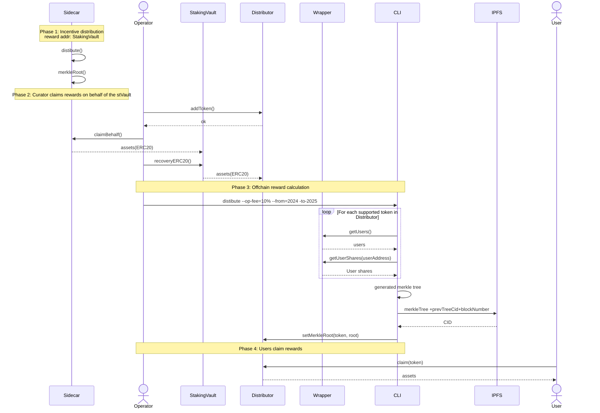

# DeFi Wrapper Technical Design

## Abstract

DeFi Wrapper is a modular system that **uses stVaults** to enable **delegated staking with optional liquidity** and **automated looping strategies**. It lowers the entry barrier to running an stVault as an end-user product with multiple depositors and DeFi yield optimization.


## Design

**Core Use Cases:**

- **Delegated Staking with optional liquidity**: Multiple users pool ETH into a single stVault, and some of them occasionally mint stETH for themselves to access liquidity on demand.
- **Delegated pooled Staking without optional liquidity**: Multiple users pool ETH into a single stVault.
- **Delegated non-pooled Staking with optional liquidity**: A single user puts ETH into a single stVault and can mint stETH when needed.
- **Pooled staking with automated stETH mint and optional boost**: New and existing stVault users can opt into a leveraged staking (looping) strategy: stETH serves as collateral on a lending protocol, and the borrowed ETH is deposited back into the same stVault.

**Unsupported Use cases**
- **Delegated Staking with optional liquidity**: Mixing users who mint stETH (and pay the infra and liquidity fees) with users who only deposit ETH (and expect the infra fee alone) in one stVault distributes risk, rewards and fees unfairly. Supporting it requires changes to LazyOracle.
- **Delegated non-pooled Staking with optional liquidity**: Technically possible by assigning FUND_ROLE per-user (whitelisting vault funders).
LazyOracle calculates rewards globally, and nothing attributes them to individual users inside the stVault, so this case requires off-chain reward tracking. The Wrapper does not support it: it suits advanced integrations or Node Operator-managed private deployments instead.

**Supported Use Cases by Wrapper**
- **Delegated pooled staking**
- **Delegated pooled staking with liquidity**
- **Delegated pooled staking with automated yield-boosting strategy**

## Solution Overview

DeFi Wrapper provides pre-built modules that compose on top of stVaults through a three-layer architecture:


**Layer 1: Deposits & Withdrawals (stvToken Layer):**
- Accepts deposits from multiple users
- Funds ETH into the underlying stVault and issues stvToken shares representing each user's portion
- Manages the withdrawal queue and coordinates validator exits
- Keeps pure stvToken accounting, distributing rewards through price appreciation

**Layer 2: stETH Wrapping & Unwrapping:**

- Wrapping and unwrapping between stETH and stvToken uses `VaultHub` mint and burn shares
- `calculateMaxMintable` accounts for the stVault's reserve ratio


**Layer 3: Strategy Delegation & Adapters:**

- Strategy adapters deployed per (vault × strategy × user) combination
- Users delegate their staking position (full or partial amount, represented with `stvToken`) to strategies for automated leverage (auto delegated on deposit)
- Strategies use stETH Wrapping & Unwrapping and Deposits & Withdrawals
- The architecture enables support for different protocols: Aave, Fluid, Gearbox, GGV via the strategy adapter interface to be shared with partners

**Layer 4: Utility Layer**

The utility layer provides essential tools and interfaces to streamline the deployment, configuration and ongoing management of the vault.

- The `DApp` provides a user-friendly interface for end-users to deposit ETH into the wrapper, view their balances, claim rewards, and manage withdrawals, without interacting directly with smart contracts or the CLI.
- The `Factory` allows a Node Operator to deploy a new vault, wrapper, distributor, and withdrawal queue in a single transaction.  The system ensures all components are properly linked and configured, automatically setting up the correct roles and fee structures, minimizing manual steps and the risk of misconfiguration.
- The `CLI` is a toolkit for Node Operators and advanced users to interact with protocol contracts in a user-friendly and automated way.

## Architecture

### System Overview


### Deposits

**Purpose**: Main user interface for pooled staking

**Key Features**:
- Accepts ETH deposits from multiple users
- Issues stvToken shares
- Pools funds into underlying StakingVault
- Withdrawal queue
- Whitelist

**Deposits**

The main flow:
1. The user deposits ETH to the Wrapper contract.
   - The Wrapper funds the connected `StakingVault` through the Dashboard and mints `stvToken`.
   - The Node Operator can pause deposits.
   - The Node Operator or the users **must** apply a fresh report to the stVault.


2. The Node Operator deposits validators through [PDG](https://hackmd.io/@lido/stVaults-design#315-Essentials-PredepositGuarantee), or through the [PDG bypass](https://hackmd.io/@lido/stVaults-design#PDG-bypass-and-rewards-adjustment).


### Withdrawals and Emergency Exit

#### Withdrawal Queue System

All withdrawals must go through a queue system with specific requirements:

- **Fresh Reports Required**: Node Operators or users must provide fresh reports for withdrawals to be processed
- **Amount Limits**: MIN/MAX withdrawal limits per single request (similar to Lido Withdrawal Queue)
- **Individual Queues**: Each wrapper maintains its own withdrawal queue
- **Autonomous Management**: Node Operators autonomously regulate validator withdrawals
- **Finalization Control**: Request finalization remains under Node Operator control

#### Emergency Exit

Emergency exit functionality is available when reports are stale for extended periods, allowing users to exit without waiting for fresh reports.

:::info
Detailed specifications for the withdrawal queue and the emergency exit live in separate technical documents:

- [Withdrawal Queue Specification](https://hackmd.io/ZsDoWqxJRouoFQWn1mezkA)
- [Emergency Exit Specification](https://hackmd.io/78cCnn72T86yUE8RWHH5MA)
:::

**Reward Distribution**

The system supports two types of rewards for users:

#### 1. Staking Rewards (via LazyOracle reports)
 - The LazyOracle periodically submits an aggregated report.
 - The Node Operator is responsible for keeping the stVault's report fresh.
    - Users can bring report data themselves too
    - If the report is outdated, users may not be able to withdraw or receive their correct share of rewards.


#### 2. Sidecar Rewards (Obol, SSV, restaking, points, etc.)

The Sidecar Rewards system enables Wrapper participants to receive additional incentives from third-party protocols and services beyond standard staking rewards.

#### ERC20 rewards

ERC20 reward providers such as Obol and SSV allocate rewards to the withdrawal credentials, which here is the `StakingVault`. Withdrawing those rewards from the stVault for distribution among stakers uses `StakingVault.recoveryERC20()`.

:::warning
Providers need to be able to make permissionless claims on behalf of others.
:::

#### Points rewards

Point-based reward systems (Symbiotic, EigenLayer, Babylon, etc.) represent a category of restaking and staking incentives. Unlike ERC20 tokens, points are typically:

- Off-chain tracked by the protocol
- Non-transferable until converted to tokens
- Time-sensitive with specific claiming windows

Points accumulate on the `StakingVault` address automatically. Once a protocol announces the points-to-token conversion, the standard claim → recovery → distributor scheme applies.


#### RewardDistributor Contract

The `Distributor` contract distributes ERC-20 rewards among Vaults Wrapper users in proportion to their stvToken holdings. It uses a Merkle tree for efficient distribution and prevents double-spending.

- **DEFAULT_ADMIN_ROLE**: Full control over the contract
- **MANAGER_ROLE**: Distribution management (adding tokens, setting Merkle root)

#### CLI

The [CLI tool](https://github.com/lidofinance/vaults-wrapper-distributor) for Distributor provides a complete set of commands for managing reward distribution, generating Merkle trees, and allowing users to claim rewards.

```bash
distribute --operator-fee=10%
```




### stETH Wrapping & Unwrapping

In **Delegated pooled staking with liquidity**, the user's share of stvToken is locked and the stVault mints the maximum stETH it allows. To get the deposited ETH back, the user returns the stETH and goes through the withdrawal procedure.

The Wrapper always mints the maximum stETH available against the user's stvToken.

### Strategy Delegation & Adapters

Detailed specification for Boost and Strategy delegation you can find here:
 - [Boost Strategy for DeFi Wrapper](https://hackmd.io/HmWsAh3ySq-ffps6vgovVw)

### Pause and Upgradeability

The DeFi Wrapper is to give the Vault Owner levers for containing the damage if a threat or vulnerability is found in the protocol.

Detailed description of mechanism can be found here:
- [Emergency Leverages for DeFi Wrapper](https://hackmd.io/QgDpZIohQtGxdKijB2j6fA)

## Risks

**Smart Contract Risk:**
- NO trust model
- Inflation attack on pool https://blog.openzeppelin.com/a-novel-defense-against-erc4626-inflation-attacks
- Complex interactions between the Wrapper, the stVault and the strategies
- **Mitigation**: Comprehensive testing, multiple audits

**Leverage Risk:**
- Liquidation risk if stETH/ETH ratio moves unfavorably
- **Mitigation**: Conservative health factors (150% minimum), automatic rebalancing

**Oracle Risk:**
- Dependency on LazyOracle for accurate reward calculation
- **Mitigation**: Inherit stVaults' proven oracle security model

**Mass slashing and bad debt**
 - insurance playbook for NO
 - rebalance issue


### Economic Risks


**Liquidity Risk:**
- Large withdrawals may require validator exits, adding a delay of 27 hours or more
- **Mitigation**: Emergency exit mechanism, reserve management

**Strategy Risk:**
- External DeFi protocols may experience exploits or failures
- **Mitigation**: Strategy whitelisting, position limits, emergency pausing

**Slashing Risk:**
- Underlying validators may be slashed, affecting all users
- **Mitigation**: Inherit stVaults' slashing protections and insurance


## Useful Links

- **[stVaults Technical Design](https://hackmd.io/@lido/stVaults-design)** - Core infrastructure specification
- **[Aave V3 Documentation](https://docs.aave.com/developers/getting-started/v3-overview)** - Lending protocol integration
- **[Flashloan Best Practices](https://docs.aave.com/developers/guides/flash-loans)** - Leverage implementation patterns
- **[ERC-4626 Vault Auditor Primer](https://github.com/devdacian/ai-auditor-primers/blob/main/primers/amy.vault.erc4626.primer.md)** - Common pitfalls in vault share accounting
