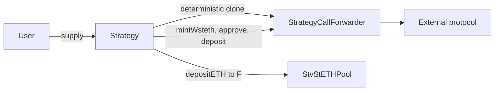
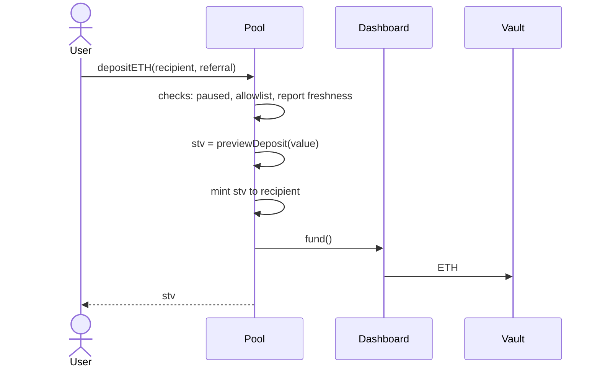
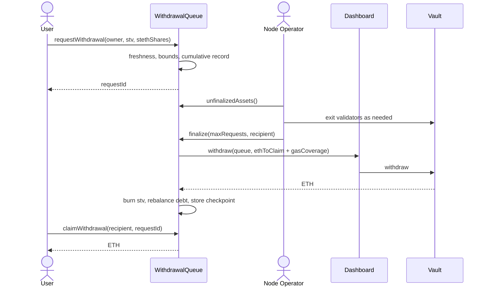

# DeFi Wrapper Technical Design and Architecture

## 1. Abstract

The DeFi Wrapper turns a single [stVault](./stvaults-detailed-technical-design.md) into a multi-user product. An stVault on its own has one owner; the Wrapper puts a tokenized pool in front of it, so many depositors can share one vault, hold a transferable claim on it, mint stETH against their own share, and route that stETH into a DeFi strategy — without any of them holding vault permissions.

Everything is deployed from a factory in two transactions and handed to a timelock. The Vault Owner keeps the levers that matter for safety (pause, upgrade) and gives up the ones that would let them touch user funds.

This page describes what the contracts do. For operating a deployed pool, see the [pooled staking product guides](../../stvaults/building-guides/pooled-staking-product/index.md); for the command reference, the [stVaults CLI](https://lidofinance.github.io/lido-staking-vault-cli/).

:::info
Source: [`lidofinance/vaults-wrapper`](https://github.com/lidofinance/vaults-wrapper), branch `main`. Audited three times — see [Audits](/security/audits).
:::

## 2. Design

### 2.1 Goals

- **Pool one stVault across many depositors** while keeping each depositor's position individually accounted.
- **Keep stETH minting per-account.** A depositor's debt is their own: it limits their own withdrawals and can be liquidated without touching anyone else's position.
- **Make the operator's discretion bounded.** The Node Operator decides *when* to return ETH from validators, but not at what rate a request settles.
- **Deploy without a trusted setup step.** The factory wires every role in one transaction and revokes itself, so a deployment cannot be left half-configured.

### 2.2 Principles

- **The pool holds no permissions a user could abuse.** Vault roles land on the pool, the queue and the timelock — never on an individual.
- **Losses are shared, gains are not.** A withdrawal request settles at the *lower* of its creation rate and the finalization rate, so waiting in the queue cannot be used to capture rewards, and cannot be used to escape penalties.
- **Degrade automatically, recover deliberately.** Bad debt, unassigned liability and stale reports block operations without anyone acting; unpausing after an incident requires the timelock.
- **Stay inside Lido Core's guarantees.** The Wrapper never re-implements vault accounting; it reads `maxLockableValue`, `liabilityShares` and report freshness from the Dashboard and VaultHub.

### 2.3 Product configurations

A deployment is one of three shapes, decided by `poolType` at deploy time and immutable afterwards:

| Configuration | Contract | Minting | Strategy | Allowlist |
| --- | --- | --- | --- | --- |
| Pooled staking | `StvPool` | no | no | optional |
| Pooled staking with liquidity | `StvStETHPool` | yes | no | optional |
| Pooled staking with a DeFi strategy | `StvStETHPool` | yes | required | required |

:::note
`StvStrategyPool` is a **pool type, not a contract**. The third configuration is `StvStETHPool` deployed with `poolType == STRATEGY_POOL_TYPE` and a strategy proxy added to its allowlist. `Factory.derivePoolType` enforces that a strategy requires both minting and the allowlist (`InvalidConfiguration`).
:::

### 2.4 Unsupported configuration

Mixing depositors who mint stETH with depositors who only stake, in one pool, is not supported. They pay different fees — minting adds the liquidity and reservation fees on top of the infra fee — but rewards are computed by LazyOracle for the vault as a whole, so the fee difference cannot be attributed back to the accounts that caused it. Supporting it requires changes in Lido Core accounting, not in the Wrapper.

## 3. Architecture

### 3.1 Component map


A deployment consists of seven contracts, of which the first four are the Wrapper proper:

| Contract | Role |
| --- | --- |
| `StvPool` / `StvStETHPool` | the pool: ERC-20 `stv` accounting, deposits, per-account minting |
| `WithdrawalQueue` | request, finalize and claim lifecycle for exits |
| `Distributor` | Merkle-based distribution of external rewards |
| Strategy (optional) | adapter routing minted wstETH into an external protocol |
| `TimelockController` | governance: holds `DEFAULT_ADMIN_ROLE` everywhere |
| `StakingVault` + `Dashboard` | the underlying stVault, from Lido Core |

```mermaid
flowchart TB
    subgraph Core["Lido Core"]
        VH[VaultHub]
        LO[LazyOracle]
        ST[stETH]
    end

    subgraph Vault["stVault"]
        SV[StakingVault]
        DB[Dashboard]
    end

    subgraph Wrapper["DeFi Wrapper"]
        P[StvPool / StvStETHPool]
        WQ[WithdrawalQueue]
        D[Distributor]
        S[Strategy]
        TL[TimelockController]
    end

    User -->|ETH| P
    P -->|fund, mint, burn, rebalance| DB
    WQ -->|withdraw| DB
    P --- WQ
    S --- P
    TL -.->|admin| P
    TL -.->|admin| WQ
    TL -.->|admin| DB
    DB --- SV
    SV --- VH
    VH --- ST
    VH --- LO
```



The pool never holds vault ownership. The factory grants `FUND_ROLE`, `REBALANCE_ROLE` and, for minting pools, `MINT_ROLE` and `BURN_ROLE` on the Dashboard to the pool, and `WITHDRAW_ROLE` to the queue. `DEFAULT_ADMIN_ROLE` on the Dashboard goes to the timelock, and the factory revokes itself in the same transaction.

### 3.2 StvPool

The base pool. It accepts ETH, forwards it into the stVault through `Dashboard.fund()`, and issues `stv` — a transferable ERC-20 claim on the vault's value.

#### stv accounting

`stv` has **27 decimals** while the underlying asset has 18. The pool is initialized by minting `vaultBalance × 1e9` stv **to itself** for the connect deposit already sitting in the vault, which fixes the starting rate at 1 ETH = 1e27 stv and keeps later conversions exact.

The value backing the token is read from Lido Core, not tracked locally:

$$
\text{totalNominalAssets} = \texttt{Dashboard.maxLockableValue()}
$$

$$
\text{totalAssets} = \text{totalNominalAssets} - \text{unassignedLiabilitySteth}
$$

Conversions round in the direction that protects the pool: `previewDeposit` floors the stv minted, `previewWithdraw` ceils the stv burned, `previewRedeem` floors the assets returned.

#### Unassigned liability and bad debt

Two conditions can arise that make the pool's own accounting untrustworthy, and both freeze it:

- **Unassigned liability** — the vault owes stETH that no pool account is recorded as owing. This happens if liability is transferred in from another vault. It is measured as the excess of vault liability over the pool's recorded minted shares.
- **Bad debt** — the vault's total value is below its liability, so stv cannot be priced against a solvent position.

Both are checked inside the ERC-20 `_update` hook, so while either holds, **every** transfer, mint and burn of stv reverts — deposits included. No role is involved and nobody can override it; the condition has to be cleared.

Unassigned liability can be cleared permissionlessly, by anyone, in two ways:

```solidity
function rebalanceUnassignedLiability(uint256 _stethShares) external;
function rebalanceUnassignedLiabilityWithEther() external payable;
```

The first repays it out of the vault's own assets, the second out of ETH the caller supplies. Both refuse to touch liability that belongs to an account (`NotEnoughToRebalance`).

#### Deposits

```solidity
function depositETH(address _recipient, address _referral) public payable returns (uint256 stv);
receive() external payable;   // auto-deposits to msg.sender
```

Each deposit checks, in order: non-zero value, non-zero recipient, deposits not paused, allowlist membership, and **report freshness** — `VaultHub.isReportFresh(vault)`, reverting `VaultReportStale`. Freshness is required because stv is priced from the last report; without it a depositor could be issued stv at a stale rate. See [Apply oracle reports](../vault-owners-curators-and-stakers/basic-stvaults/apply-oracle-reports.md).

The allowlist is implemented as a role, not a mapping: membership *is* `DEPOSIT_ROLE`, whose admin is `ALLOW_LIST_MANAGER_ROLE`. Whether the allowlist is enforced at all is fixed in the constructor and cannot be toggled later — changing it means upgrading to a new implementation.

### 3.3 StvStETHPool

Adds per-account stETH minting on top of `StvPool`. Each account has its own debt, its own collateral requirement and its own liquidation.

#### The reserve ratio gap

The pool does **not** mint up to the vault's own reserve ratio. It keeps a margin:

$$
RR_{\text{pool}} = \min(RR_{\text{vault}} + \text{gap},\; 99.99\%)
\qquad
FRT_{\text{pool}} = \min(FRT_{\text{vault}} + \text{gap},\; 99.98\%)
$$

The gap is immutable per deployment and is **250 BP (2.5%)** in every shipped configuration. It exists so that an account can be liquidated by the pool before the *vault* becomes subject to forced rebalancing by the protocol — the pool always hits its own threshold first.

`syncVaultParameters()` is permissionless and pulls the current vault parameters, so a tier change in Lido Core reaches the pool as soon as anyone calls it.

#### Per-account collateral

For an account holding assets $A$ with debt $L$ in stETH shares:

$$
\text{mintable}(A) = \left\lfloor A \times (1 - RR_{\text{pool}}) \right\rfloor
\qquad
\text{lock}(L) = \left\lceil \frac{L}{1 - RR_{\text{pool}}} \right\rceil
$$

An account is unhealthy once its assets fall below the threshold implied by $FRT_{\text{pool}}$. The `_update` hook adds a second guard on top of the base pool's: an account cannot transfer away stv that its own debt requires as collateral (`InsufficientReservedBalance`).

#### Liquidation

```solidity
function forceRebalance(address _account) external returns (uint256 stvBurned);
function forceRebalanceAndSocializeLoss(address _account) external returns (uint256 stvBurned);
```

`forceRebalance` is **permissionless** — anyone may liquidate a breached account. It swaps the account's stETH debt for its stv at the current rate, bringing it back to the reserve-ratio level, solving:

$$
x = \frac{L - (1 - RR_{\text{pool}}) \times A_{\text{shares}}}{RR_{\text{pool}}}
$$

If the account's stv does not cover its debt, the account is **undercollateralized** and `forceRebalance` refuses to act (`UndercollateralizedAccount`). Only `forceRebalanceAndSocializeLoss` can close such a position, it requires `LOSS_SOCIALIZER_ROLE`, and the shortfall is spread across every remaining pool participant. The amount that may be socialized in one call is capped by `maxLossSocializationBP`, which **defaults to 0** — until the timelock raises it, socialization is impossible and an undercollateralized account cannot be closed at all.

#### Exceeding minted stETH

If the stVault is rebalanced directly, bypassing the pool, vault liability drops while the pool's record of who owes what does not. The difference is *exceeding minted stETH*: value the pool holds as stETH rather than ETH. `totalAssets()` accounts for it explicitly, and the pool can hold both assets at once:

```
exceeding > 0  →  totalAssets = nominalAssets + exceedingMintedSteth
otherwise      →  totalAssets = nominalAssets − unassignedLiabilitySteth
```

Only one of the two can be non-zero at a time. Accounts may settle their debt against the exceeding amount voluntarily via `rebalanceExceedingMintedStethShares`, which the contract's own NatSpec flags as front-runnable: the exceeding amount is a shared pool-wide budget, so competing calls revert with `InsufficientExceedingShares`.

### 3.4 WithdrawalQueue

Exits are a FIFO queue, because the ETH to satisfy them usually has to come back from the Consensus Layer first. The queue's job is to tell the operator how much is owed, and to settle each request at a rate that cannot be gamed in either direction.

#### The request

```solidity
function requestWithdrawal(address _owner, uint256 _stvToWithdraw, uint256 _stethSharesToRebalance)
    external returns (uint256 requestId);
```

Requests are records, not tokens — the `owner` is fixed at creation and only they can claim. A request stores cumulative sums of stv, stETH shares and assets, which is what lets any range of requests be priced with two lookups.

Both bounds are on the request:

| Constant | Value | Purpose |
| --- | --- | --- |
| `MIN_WITHDRAWAL_VALUE` | 0.001 ETH | stops the queue filling with dust |
| `MAX_WITHDRAWAL_ASSETS` | 10,000 ETH | stops one request monopolizing returned ETH |

The minimum applies to the *value* of the request — assets minus any stETH being rebalanced — so a request that is mostly debt repayment is measured on what is actually paid out. Creating a request requires a fresh report and transfers the stv, and when rebalancing also the debt, to the queue.

#### Finalization

```solidity
function finalize(uint256 _maxRequests, address _gasCostCoverageRecipient) external returns (uint256);
```

`FINALIZE_ROLE` only, held by the Node Operator by default. The call walks the queue from the first unfinalized request and **stops at the first request that fails any of four conditions**:

1. claimable ETH exceeds the vault's `withdrawableValue`;
2. claimable plus rebalanced ETH exceeds the vault's `availableBalance`;
3. the minimum withdrawal delay has not elapsed since the request was created;
4. the request was created *after* the latest oracle report — at least one report must have landed in between.

The delay is immutable per deployment with a **one-hour floor** enforced in the constructor; every shipped configuration sets exactly one hour. Condition 4 is what makes the rate meaningful: a request must be priced against a report that already knows about it.

Everything finalized in one call shares a **checkpoint** recording the stv rate, the stETH share rate and the gas-cost coverage in force. Claims are priced from checkpoints, which is why claiming needs a checkpoint hint, or lets the contract binary-search for one.

#### The one-sided discount

At claim time the request's own creation rate is compared with its checkpoint rate:

```
requestStvRate = assetsToClaim × 1e36 / stv

if requestStvRate > checkpoint.stvRate:
    assetsToClaim = stv × checkpoint.stvRate / 1e36     // discounted
```

If the rate **fell**, the request is discounted — the queue absorbs its share of the loss. If the rate **rose**, nothing happens and the request still settles at its creation amount. Rewards earned while a request sat in the queue stay with the depositors who are still in the pool, which is correct: the exiting depositor's validators were being exited, not earning.

The operator cannot set the rate. What they do choose is *when* to finalize and whether to batch, and batching socializes rewards across the batch rather than letting earlier requests capture them.

#### Gas cost coverage

Finalization costs the operator gas, so each request can carry a small deduction that is paid to whoever finalizes:

| Constant | Value |
| --- | --- |
| `MAX_GAS_COST_COVERAGE` | 0.0005 ETH per request |
| default `gasCostCoverage` | 0 |

The ceiling is derived in the contract's own comments: about 200k gas for a single-request finalization and 300k for a batch of ten, so 0.0005 ETH covers gas prices up to roughly 2.5 gwei single and 16.6 gwei batched. The value in force is captured in the checkpoint, so changing it never re-prices requests that were already finalized.

#### Claiming

```solidity
function claimWithdrawal(address _recipient, uint256 _requestId) external;
function claimWithdrawalBatch(address _recipient, uint256[] _requestIds, uint256[] _hints) external;
```

Only the request owner can claim, once, after finalization. Claiming is **not pausable** and keeps working after the stVault has been disconnected — once ETH is locked against a finalized request, nothing in the system can hold it back.

### 3.5 Strategies

A strategy pool routes each depositor's minted wstETH into an external protocol. Two adapters exist:

| Adapter | Target | Status |
| --- | --- | --- |
| `MellowStrategy` | Mellow vaults — the **Lido Earn ETH** connector | current |
| `GGVStrategy` | BoringVault via `TellerWithMultiAssetSupport` | earlier integration |

:::note
This connector appears under three names across older material: `GGVStrategy` in the repository README, `MellowStrategy` in the source and the 03-2026 audit, and **Lido Earn ETH** in the CLI and the published docs. The last is current.
:::

#### Per-user custody

Strategy positions are not commingled. Each user gets their own `StrategyCallForwarder` — a minimal clone deployed at a CREATE2 address derived from the chain id, the strategy id, the strategy address and the user, so it is deterministic and unique per user per strategy.



**The forwarder holds the stv, not the user.** The user's claim is mediated by the strategy. The forwarder is `onlyOwner` with the strategy as owner, and every strategy entry point resolves the forwarder from `msg.sender`, so a user can only ever act on their own — which is what makes the permissionless recovery helpers safe.

`GGVStrategy.finalizeRequestExit` always reverts with `NotImplemented()`: GGV exposes no way to read a request's status on-chain.

### 3.6 Distributor

A standalone cumulative Merkle distributor for rewards that arrive as ERC-20 tokens — sidecar incentives from DVT providers, restaking points once they convert, residual value swept from a disconnected vault.

```solidity
function addToken(address _token) external;                       // MANAGER_ROLE
function setMerkleRoot(bytes32 _root, string _cid) external;      // MANAGER_ROLE
function claim(address _recipient, address _token, uint256 _cumulativeAmount, bytes32[] _proof) external;
```

Accounting is cumulative: the leaf commits to a total, and a claim transfers the difference against what that recipient already took. A root can be set at most once per block and must actually change.

`claim` is **permissionless** — anyone may submit a proof on someone's behalf, and the tokens always go to the recipient named in the leaf.

:::warning
The Distributor is **not wired into the pool**. No contract transfers into it, and the pool holds it only as an address. It is funded by ordinary ERC-20 transfers and driven entirely off-chain: build the tree, pin it to IPFS, push the root. Staking rewards do **not** flow through it — they accrue implicitly, because `totalAssets()` tracks the vault's value and every stv holder's claim grows with it.
:::

### 3.7 Factory and deployment

Deployment is two transactions, because the pool and the queue reference each other and neither can be constructed first.

**Start** deploys the timelock, both proxies pointed at a dummy implementation, the vault and Dashboard, the queue implementation, the distributor and the pool implementation — then stores a hash of the entire configuration with a **24-hour deadline**.

**Finish** connects the vault to VaultHub (requiring `CONNECT_DEPOSIT` as `msg.value`), upgrades and initializes both proxies, deploys and allowlists the strategy, grants every role, and hands admin to the timelock.

The commitment hash binds the caller **and** every configuration field. A different sender, a mutated parameter or a missed deadline all make the finish call revert — a deployment cannot be finished into a different shape than it was started in.

### 3.8 Governance, upgrades and pausing

#### Timelock

`DEFAULT_ADMIN_ROLE` on the pool, the queue, the distributor and the Dashboard all land on an OpenZeppelin `TimelockController` whose own admin is `address(0)` — self-administered from creation, with no separate owner. Proposer and executor are configured at deploy.

#### Upgrades

The pool, the queue and the strategy sit behind `OssifiableProxy` with the timelock as admin. Upgrading is therefore a timelock operation: propose, wait out the delay, execute. `proxy__ossify()` freezes an implementation permanently.

#### Pause matrix

Pausing is per feature, not per contract, so an incident can be contained without stopping everything:

| Feature | Pause role | What stops | What keeps working |
| --- | --- | --- | --- |
| `DEPOSITS_FEATURE` | `DEPOSITS_PAUSE_ROLE` | new deposits | withdrawals, claims |
| `MINTING_FEATURE` | `MINTING_PAUSE_ROLE` | minting stETH and wstETH | burning, repaying |
| `WITHDRAWALS_FEATURE` | `WITHDRAWALS_PAUSE_ROLE` | new withdrawal requests | finalization, claims |
| `FINALIZE_FEATURE` | `FINALIZE_PAUSE_ROLE` | finalization | claiming already-finalized requests |
| `SUPPLY_FEATURE` / `REDEEM_FEATURE` | strategy pause roles | strategy entry and exit | pool-level operations |

The pause roles go to the emergency committee at deployment; the Dashboard's `PAUSE_BEACON_CHAIN_DEPOSITS_ROLE` goes there too, so the same committee can stop validator deposits.

:::warning
**No address holds the resume roles after deployment.** Every implementation constructor pre-pauses its features, and the factory grants only the pause halves. `DEPOSITS_RESUME_ROLE`, `MINTING_RESUME_ROLE`, `WITHDRAWALS_RESUME_ROLE`, `FINALIZE_RESUME_ROLE`, the strategy resume roles and `LOSS_SOCIALIZER_ROLE` are unassigned.

Pausing is therefore fast and unpausing is not: resuming requires a timelock proposal to grant the resume role first, then a second call to use it. Plan that delay into any incident response.
:::

#### Role summary

| Role | Contract | Default holder |
| --- | --- | --- |
| `DEFAULT_ADMIN_ROLE` | pool, queue, distributor, Dashboard | Timelock |
| `FINALIZE_ROLE` | WithdrawalQueue | Node Operator |
| `MANAGER_ROLE` | Distributor | Node Operator Manager |
| `ALLOW_LIST_MANAGER_ROLE` | pool | allowlist manager from config; **nobody** for strategy pools |
| pause roles | pool, queue, strategy, Dashboard | Emergency committee |
| resume roles, `LOSS_SOCIALIZER_ROLE` | pool, queue, strategy | **nobody** |

## 4. Flows

### 4.1 Deposit




With minting, `depositETHAndMintStethShares` or `depositETHAndMintWsteth` adds a capacity check and a `Dashboard.mintShares` call in the same transaction. Through a strategy, the pool credits stv to the user's forwarder, mints wstETH from it, and the adapter deposits into the external protocol.

The ETH is then staked by the Node Operator through PDG in the ordinary way:


### 4.2 Withdrawal



The gap between request and finalization is the Consensus Layer exit queue, and it is the operator's job to watch the queue depth and decide how much to bring back. See the [withdrawals guide](../../stvaults/building-guides/pooled-staking-product/withdrawals.md).

### 4.3 Rewards


Staking rewards need no distribution transaction. LazyOracle reports the vault's value, `totalAssets()` rises, and every stv holder's claim rises with it. It does require somebody to keep applying reports: a stale report blocks deposits, requests, finalization, minting and liquidation alike. `LazyOracle.updateVaultData` is permissionless, so anyone can do it, but somebody has to.

Value that arrives as tokens rather than as vault growth — DVT sidecar rewards, points after conversion — is swept out of the vault with `StakingVault.collectERC20` and distributed through the [Distributor](#36-distributor).

### 4.4 Degradation

Some states need no attacker and no role to take effect:

| Condition | Effect | Cleared by |
| --- | --- | --- |
| stale oracle report | deposits, requests, finalization, minting and liquidation all revert | anyone: `LazyOracle.updateVaultData` |
| unassigned liability | every stv transfer, mint and burn reverts | anyone: `rebalanceUnassignedLiability` |
| bad debt | every stv transfer, mint and burn reverts | vault recovery, or Lido Core bad-debt handling |
| account below the pool threshold | that account is liquidatable | anyone: `forceRebalance` |

## 5. Risks

### 5.1 From Lido DAO

**Seizure of vault stake through a malicious upgrade.** Mitigated by community monitoring, Dual Governance (stakers can veto), and the vault's ability to disconnect from Lido Core. Disconnecting, though, requires repaying all minted stETH, and stETH locked as collateral in a strategy may not be repayable inside the objection window.

### 5.2 From Lido Core

**Contract vulnerabilities** — mitigated by audits, the Protocol Security Committee, a bug bounty, and the ability to pause VaultHub and PDG through GateSeal while a fix is voted through.

**Malicious oracles** — a single actor cannot move a report; a colluding quorum is still bounded by on-chain sanity checks, including the [quarantine](./how-quarantine-works.md) on sudden value increases.

### 5.3 From the stVault

**Node Operator misbehaviour.** The operator cannot move delegated stake, but they can be slow: delaying validator exits keeps depositors waiting in the queue. What bounds this today is the operator's reputation and the finalization rules, which stop them from profiting from the delay.

:::warning
The Emergency Exit mechanism described in the original design notes — permissionless finalization once the queue has been stuck for 60 days — is **not implemented**. Finalization is unconditionally gated by `FINALIZE_ROLE`. A pool whose operator stops finalizing has no on-chain path for depositors to force their own exit.
:::

**Deposit front-running** — mitigated by [PDG](../node-operators/pdg.md), which the Wrapper's vaults use.

### 5.4 From the Wrapper

**Contract vulnerabilities** — mitigated by three audits, the per-feature pause matrix, and timelocked upgrades. The asymmetry documented above applies: pausing is immediate, resuming needs a governance round-trip.

**Loss socialization.** An undercollateralized account cannot be closed without `LOSS_SOCIALIZER_ROLE`, and closing it charges the shortfall to everyone else. `maxLossSocializationBP` defaults to 0, which means the default configuration cannot socialize at all — safe against abuse, but it also means an undercollateralized position simply stays open.

### 5.5 From strategies

**External protocol failure or malicious upgrade** — bounded by working only in the wstETH and (W)ETH pair, LTV sanity checks, and per-user custody, which keeps one user's position from touching another's.

**Strategy economics.** Leverage carries liquidation risk if the stETH/ETH ratio moves, the risk that pool liquidity is insufficient to close a position, and exposure to rising borrow rates. These are inherent to leverage rather than defects, and users take them on knowingly.

### 5.6 Inherited risks

Everything that applies to a plain stVault applies here too — slashing, correlated slashing across an operator's vaults, forced rebalancing, and the [oracle quarantine](./how-quarantine-works.md) on sudden value jumps. See [stVaults Technical Design](./stvaults-detailed-technical-design.md).

## 6. Useful links

- [`lidofinance/vaults-wrapper`](https://github.com/lidofinance/vaults-wrapper) — contracts
- [stVaults CLI: DeFi Wrapper commands](https://lidofinance.github.io/lido-staking-vault-cli/) — deployment, operations, timelock governance
- [Audits](/security/audits) — MixBytes (01-2026), Ackee Blockchain (01-2026), MixBytes MellowStrategyAdapter (03-2026)
- [End-user staking product by DeFi Wrapper](../../stvaults/building-guides/pooled-staking-product/index.md) — deployment and operations guides
- [stVaults Technical Design and Architecture](./stvaults-detailed-technical-design.md) — the layer underneath
- [Environments](./architecture-overview.md#environments) — factory addresses per network
