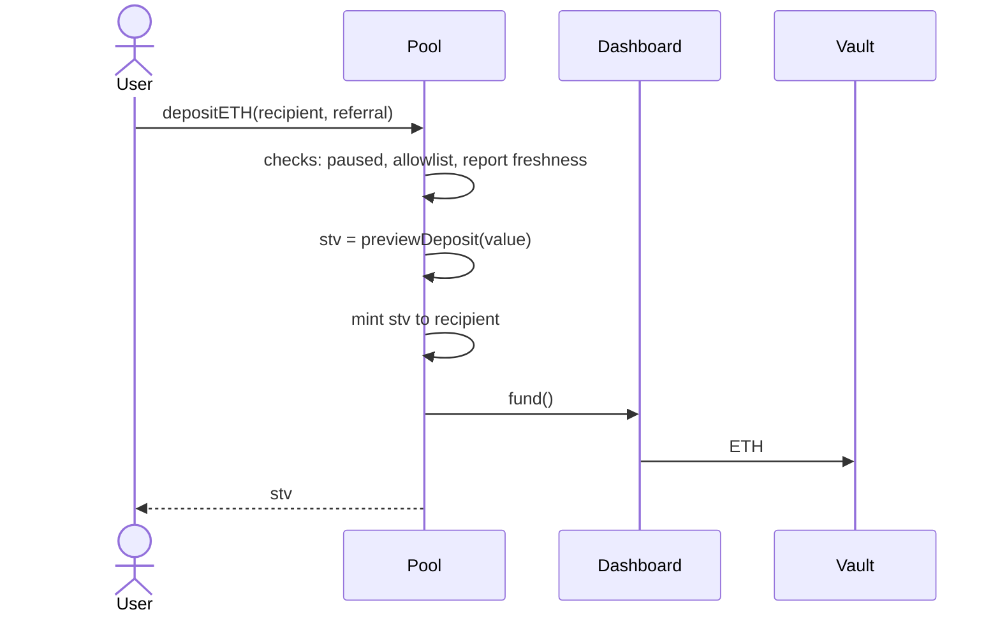
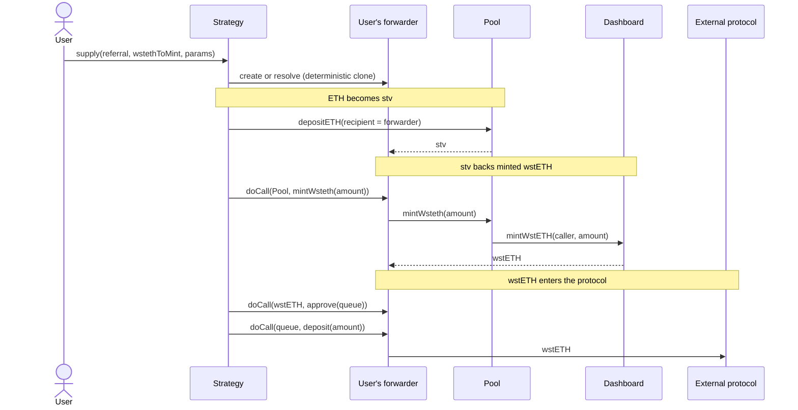
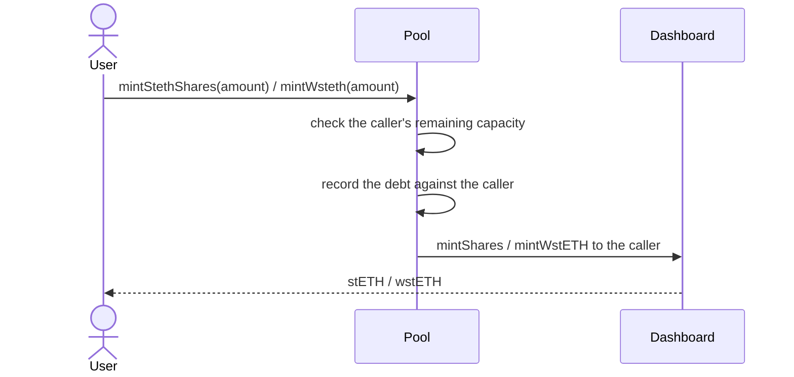
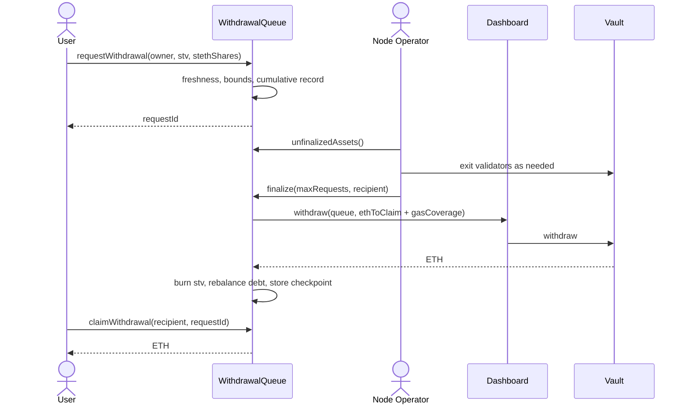
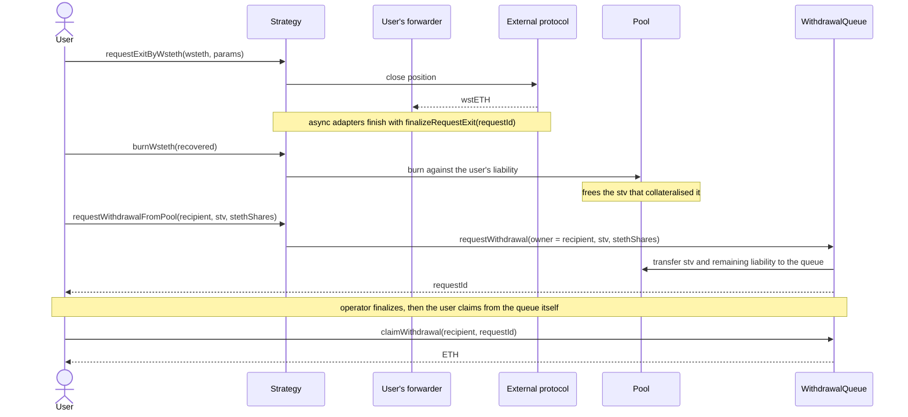

# DeFi Wrapper Technical Design and Architecture

## 1. Abstract

The DeFi Wrapper turns a single [stVault](./stvaults-technical-design.md) into a multi-user product. An stVault on its own has one owner; the Wrapper puts a tokenized pool in front of it, so many depositors can share one vault, hold a transferable claim on it, mint stETH against their own share, and route that stETH into a DeFi strategy — without any of them holding vault permissions.

Everything is deployed from a factory in two transactions and handed to a timelock. The Vault Owner keeps the levers that matter for safety (pause, upgrade) and gives up the ones that would let them touch user funds.

## 2. Design

### 2.1 Goals

- **Pool one stVault across many depositors** while keeping each depositor's position individually accounted.
- **Keep stETH minting per-account.** A depositor's debt is their own: it limits their own withdrawals and can be rebalanced away without touching anyone else's position.
- **Make the operator's discretion bounded.** The Node Operator decides *when* to return ETH from validators, but not at what rate a request settles.
- **Deploy without a trusted setup step.** The factory wires every role in one transaction and revokes itself, so a deployment cannot be left half-configured.

### 2.2 Principles

- **The pool holds no permissions a user could abuse.** Vault roles land on the pool, the queue and the timelock — never on an individual.
- **Losses are shared, gains are not.** A withdrawal request settles at the *lower* of its creation rate and the finalization rate, so waiting in the queue cannot be used to capture rewards, and cannot be used to escape penalties.
- **Degrade automatically, recover deliberately.** Bad debt, unassigned liability and stale reports block operations without anyone acting; unpausing after an incident requires the timelock.
- **Stay inside Lido Core's guarantees.** The Wrapper never re-implements vault accounting; it reads `maxLockableValue`, `liabilityShares` and report freshness from the Dashboard and VaultHub.

### 2.3 Product configurations

A deployment is one of three shapes, decided by `poolType` at deploy time and immutable afterwards:

| Configuration | Pool type | Minting | Strategy | Allowlist |
| --- | --- | --- | --- | --- |
| Pooled staking | `StvPool` | no | no | optional |
| Pooled staking with liquidity | `StvStETHPool` | yes | no | optional |
| Pooled staking with a DeFi strategy | `StvStrategyPool` | yes | required | required |

Only two of these are contracts. A strategy pool is `StvStETHPool` carrying the `StvStrategyPool` type tag, with a strategy proxy in its allowlist — which is why an existing minting pool can be upgraded into one in place, and why everything in [§3.3](#33-stvstethpool) applies to it.

### 2.4 Lido fee socialization and economic consequences

Nothing stops a minting pool from holding both depositors who mint stETH and depositors who only stake — minting is per account, and neither the pool nor the vault rejects the mix. It is left unsupported because of how the cost lands.

The liquidity and reservation fees are charged on the vault as a whole. They raise its cumulative Lido fees, which lowers `maxLockableValue`, which lowers `totalAssets()` — so the price of every stv drops, including that of holders who never minted. LazyOracle reports for the vault, not per account, so there is no way to bill those fees back to the accounts that caused them.

The result is a silent subsidy from stakers to minters, which is why the recommended shape is one pool per behaviour.

## 3. Architecture


### 3.1 Component map

A deployment consists of seven contracts, of which the first four are the Wrapper proper:

| Contract | Role |
| --- | --- |
| `StvPool` / `StvStETHPool` | the pool: ERC-20 `stv` accounting, deposits, per-account minting |
| `WithdrawalQueue` | request, finalize and claim lifecycle for exits |
| `Distributor` | Merkle-based distribution of external rewards |
| Strategy (optional) | adapter routing minted wstETH into an external protocol |
| `TimelockController` | governance: holds `DEFAULT_ADMIN_ROLE` everywhere |
| `StakingVault` + `Dashboard` | the underlying stVault, from Lido Core |

The pool never holds vault ownership. The factory grants `FUND_ROLE`, `REBALANCE_ROLE` and, for minting pools, `MINT_ROLE` and `BURN_ROLE` on the Dashboard to the pool, and `WITHDRAW_ROLE` to the queue. `DEFAULT_ADMIN_ROLE` on the Dashboard goes to the timelock, and the factory revokes itself in the same transaction.

### 3.2 StvPool

The base pool. It accepts ETH, forwards it into the stVault through `Dashboard.fund()`, and issues `stv` — a transferable ERC-20 claim on the vault's value.

:::info
**stv** stands for *staking vault token* — the pool's own share token.
:::

#### stv accounting

`stv` has **27 decimals** while the underlying asset has 18. The pool is initialized by minting `vaultBalance × 1e9` stv **to itself** for the connect deposit already sitting in the vault, which fixes the starting rate at 1 ETH = 1e27 stv and keeps later conversions exact.

The value backing the token is read from Lido Core, not tracked locally:

$$
\text{totalNominalAssets} = \texttt{Dashboard.maxLockableValue()}
$$

$$
\text{totalAssets} = \text{totalNominalAssets} - \text{unassignedLiabilitySteth}
$$

Conversions round in the direction that protects the pool: `previewDeposit` floors the stv minted, `previewWithdraw` ceils the stv burned, `previewRedeem` floors the assets returned.

#### Unassigned liability and bad debt

Two conditions can arise that make the pool's own accounting untrustworthy, and both freeze it:

- **Unassigned liability** — the vault owes stETH that no pool account is recorded as owing, measured as the excess of vault liability over the pool's recorded minted shares. It arises through [bad debt socialization](./stvaults-technical-design.md#bad-debt): the DAO can move uncovered liability from one vault onto another **run by the same Node Operator**, and if the pool's vault is the acceptor, its liability grows while nobody in the pool has minted anything.
- **Bad debt** — the vault owes more stETH than it is worth, so there is no longer enough value behind stv to price it. This is not a normal state: losses have to exceed the reserve entirely, which takes an exceptional event such as mass slashing, not a dip in validator performance. Rebalancing cannot fix it; the Lido Core [escalation path](./stvaults-technical-design.md#bad-debt) can.

Both are checked inside the ERC-20 `_update` hook, so while either holds, **every** transfer, mint and burn of stv reverts — deposits included. No role is involved and nobody can override it; the condition has to be cleared.

Unassigned liability can be cleared permissionlessly, by anyone, in two ways:

```solidity
function rebalanceUnassignedLiability(uint256 _stethShares) external;
function rebalanceUnassignedLiabilityWithEther() external payable;
```

The first repays it out of the vault's own assets, the second out of ETH the caller supplies. Neither can repay more than the unassigned amount, or the call reverts with `NotEnoughToRebalance`. That cap matters because both spend the vault's assets, which belong to every stv holder: without it, anyone could clear one account's personal debt at everyone else's expense.

#### Deposits

```solidity
function depositETH(address _recipient, address _referral) public payable returns (uint256 stv);
receive() external payable;   // auto-deposits to msg.sender
```

Each deposit checks, in order: non-zero value, non-zero recipient, deposits not paused, allowlist membership, and **report freshness**. Freshness is required because stv is priced from the last report; without it a depositor could be issued stv at a stale rate. See [Apply oracle reports](../vault-owners-curators-and-stakers/basic-stvaults/apply-oracle-reports.md).

The allowlist is implemented as a role, not a mapping: membership *is* `DEPOSIT_ROLE`, whose admin is `ALLOW_LIST_MANAGER_ROLE`. Whether the allowlist is enforced at all is fixed in the constructor and cannot be toggled later — changing it means upgrading to a new implementation.

### 3.3 StvStETHPool

Adds per-account stETH minting on top of `StvPool`. Each account has its own debt, its own collateral requirement and its own forced rebalancing.

#### The reserve ratio gap

The pool does **not** mint up to the vault's own reserve ratio. It keeps a margin:

$$
RR_{\text{pool}} = RR_{\text{vault}} + \text{gap}
\qquad
FRT_{\text{pool}} = FRT_{\text{vault}} + \text{gap}
$$

The gap is immutable per deployment and is **250 BP (2.5%)** in every shipped configuration. It exists so that the pool can force-rebalance an account before the *vault* becomes subject to forced rebalancing by the protocol — the pool always hits its own threshold first.

Both results are capped just below 100%: a reserve ratio of exactly 100% would leave nothing to mint against and would divide by zero in the collateral formulas, and the threshold is capped one basis point lower still so that it stays under the reserve ratio. Neither cap binds in practice, since the highest vault reserve ratio is the Default tier's 50%.

The pool keeps its own copy of both numbers rather than reading them from the vault on each call, so a tier change in Lido Core does not reach it by itself: until someone calls `syncVaultParameters()`, minting capacity and the rebalancing threshold still follow the old tier. The call is permissionless, so anyone can bring them up to date.

#### Per-account collateral

Every position is measured on its own: the assets an account's stv is worth, $A$, against the stETH debt it has minted, $L$. The two pool ratios turn that pair into two amounts of assets:

$$
\text{lock}(L) = \left\lceil \frac{L}{1 - RR_{\text{pool}}} \right\rceil
\qquad
\text{threshold}(L) = \left\lceil \frac{L}{1 - FRT_{\text{pool}}} \right\rceil
$$

**`lock`** is what the account must keep to carry the debt it has. Read the other way round, it says how much the account may mint against what it holds:

$$
\text{mintable}(A) = \left\lfloor A \times (1 - RR_{\text{pool}}) \right\rfloor
$$

Rounding always runs against the account — `mintable` floors, `lock` ceils — so rounding can never leave a position short of collateral.

**`threshold`** is the same shape with the lower ratio, so it always sits below `lock`. Above it the account is healthy; below it anyone may [force-rebalance](#forced-rebalancing) it. The gap between the two is the room an account has to lose value before that happens, and it is thin for an account that mints to the limit.

`lock` is enforced on every transfer, not only at mint time: the `_update` hook rejects any move that would leave the account holding less stv than its own debt requires (`InsufficientReservedBalance`). That is on top of the pool-wide freezes described in [§3.2](#32-stvpool).

#### Forced rebalancing

```solidity
function forceRebalance(address _account) external returns (uint256 stvBurned);
function forceRebalanceAndSocializeLoss(address _account) external returns (uint256 stvBurned);
```

`forceRebalance` is **permissionless** — anyone may force-rebalance a breached account. It repays part of the debt out of the account's own stv, burning stv worth exactly what it extinguishes. Both sides of the position therefore shrink by the same amount $x$, and $x$ is chosen to land the account back on the reserve ratio:

$$
\frac{L - x}{A_{\text{shares}} - x} = 1 - RR_{\text{pool}}
\qquad\Longrightarrow\qquad
x = \frac{L - (1 - RR_{\text{pool}}) \times A_{\text{shares}}}{RR_{\text{pool}}}
$$

$x$ is the amount of stETH shares repaid, and $A_{\text{shares}}$ is the account's assets expressed in stETH shares. The account keeps whatever stv is left once that much has been burned.

If the account's stv does not cover its debt, the account is **undercollateralized** and `forceRebalance` refuses to act (`UndercollateralizedAccount`). Only `forceRebalanceAndSocializeLoss` can close such a position, it requires `LOSS_SOCIALIZER_ROLE`, and the shortfall is spread across every remaining pool participant. The amount that may be socialized in one call is capped by `maxLossSocializationBP`, which **defaults to 0** — until the timelock raises it, socialization is impossible and an undercollateralized account cannot be closed at all.

#### Exceeding minted stETH

Two contracts count the same debt. The pool tracks what its accounts owe *it*, and the vault tracks what it owes *Lido Core*. Normally the two agree; when they drift apart, the difference has a name in each direction:

- the vault owes more than the pool has on record → **unassigned liability**, covered in [§3.2](#32-stvpool);
- the pool has on record more than the vault owes → **exceeding minted stETH**.

The second happens when the vault's debt is repaid without the pool being involved — a rebalance performed on the vault directly. The vault spends its own ETH to burn stETH liability, so both its value and its liability fall, while every account in the pool still owes exactly what it owed before.

Those unchanged debts are worth something. The accounts owe stETH that the vault no longer owes anyone, and that claim belongs to the pool, offsetting the ETH the rebalance consumed. So the pool can hold value in two forms at once, and `totalAssets()` picks the branch that applies:

```
exceeding > 0  →  totalAssets = nominalAssets + exceedingMintedSteth
otherwise      →  totalAssets = nominalAssets − unassignedLiabilitySteth
```

Only one branch can ever be live, because the two quantities are the same difference measured in opposite directions.

An account can settle against that claim with `rebalanceExceedingMintedStethShares`: it burns its own stv, its debt drops, and no vault-level rebalance is needed — the vault's liability is already lower. The catch is that the exceeding amount is one pool-wide budget served first come, first served. The contract's NatSpec flags the front-running risk outright, and whoever loses the race gets `InsufficientExceedingShares`.

### 3.4 WithdrawalQueue

Exits are a FIFO queue, because the ETH to satisfy them usually has to come back from the Consensus Layer first. The queue's job is to tell the operator how much is owed, and to settle each request at a rate that cannot be gamed in either direction.

#### The request

```solidity
function requestWithdrawal(address _owner, uint256 _stvToWithdraw, uint256 _stethSharesToRebalance)
    external returns (uint256 requestId);
```

Requests are records, not tokens — the `owner` is fixed at creation and only they can claim. A request stores cumulative sums of stv, stETH shares and assets, which is what lets any range of requests be priced with two lookups.

A request is bounded at both ends, and the two bounds deliberately measure different things:

| Constant | Value | Measured on | Reverts with |
| --- | --- | --- | --- |
| `MIN_WITHDRAWAL_VALUE` | 0.001 ETH | what the request will actually pay out — the assets minus any debt it settles | `RequestValueTooSmall` |
| `MAX_WITHDRAWAL_ASSETS` | 10,000 ETH | the gross assets the stv is worth, debt included | `RequestAssetsTooLarge` |

A request that mostly repays debt is small as a payout but can still be large in gross size, so the floor keeps dust out of the queue while the ceiling keeps any one request from monopolizing the ETH coming back from validators.

Creating a request requires a fresh report, and moves the stv — plus the debt, when the request settles any — to the queue.

#### Finalization

```solidity
function finalize(uint256 _maxRequests, address _gasCostCoverageRecipient) external returns (uint256);
```

`FINALIZE_ROLE` only, held by the Node Operator by default. The call walks the queue from the first unfinalized request and **stops at the first request that fails any of four conditions**:

1. claimable ETH exceeds the vault's `withdrawableValue`;
2. claimable plus rebalanced ETH exceeds the vault's `availableBalance`;
3. the minimum withdrawal delay has not elapsed since the request was created;
4. the request was created *after* the latest oracle report — at least one report must have landed in between.

The delay is immutable per deployment with a **one-hour floor** enforced in the constructor; every shipped configuration sets exactly one hour. Condition 4 is what makes the rate meaningful: a request must be priced against a report that already knows about it.

Everything finalized in one call shares a **checkpoint** recording the stv rate, the stETH share rate and the gas-cost coverage in force. Checkpoints accumulate in an append-only list, each one stamped with the first request it covers.

Claims are priced from them, so claiming starts by locating the right one: the last checkpoint whose first request number does not exceed yours. The list is ordered, so that is a binary search, and there are two ways to run it.

`claimWithdrawal(recipient, requestId)` does it on-chain, scanning the whole list at the claimer's expense. `claimWithdrawalBatch` instead takes the indices as an argument — the **hint** — which callers compute beforehand with the `findCheckpointHint` and `findCheckpointHintBatch` view functions, for free. The hint is never required, only cheaper, and it matters more the longer the pool has been finalizing requests.

#### The one-sided discount

At claim time the request's own creation rate is compared with its checkpoint rate:

```
requestStvRate = assetsToClaim × 1e36 / stv

if requestStvRate > checkpoint.stvRate:
    assetsToClaim = stv × checkpoint.stvRate / 1e36     // discounted
```

If the rate **fell**, the request is discounted — the queue absorbs its share of the loss. If the rate **rose**, nothing happens and the request still settles at its creation amount. Rewards earned while a request sat in the queue stay with the depositors who are still in the pool, which is correct: the exiting depositor's validators were being exited, not earning.

The operator cannot set the rate. What they do choose is *when* to finalize and whether to batch, and batching socializes rewards across the batch rather than letting earlier requests capture them.

#### What a claim pays out

A request can carry stETH debt as well as stv, through `stethSharesToRebalance`. Finalization settles that debt out of the vault and burns the stv that backed it, so only the remainder leaves as ETH:

```
payout = assets (discounted to the checkpoint rate, if the rate fell)
       − stethSharesToRebalance valued at the checkpoint share rate
       − gas cost coverage
```

Carrying 1000 ETH of stv with 900 stETH of debt into the queue therefore pays out around 100 ETH, not 1000. That is not a loss: the depositor minted those 900 stETH earlier and still holds them, so exiting nets the debt against the collateral, the way closing a loan returns equity rather than the gross position.

It is also why the minimum is measured on the value rather than the assets — a request that is mostly debt repayment still has to pay out something.

#### Gas cost coverage

Finalization is work the Node Operator pays for while the exiting depositors get the benefit, and a queue full of small requests makes that worse — the loop runs per request. So each request can carry a deduction that goes to whoever finalizes it.

The amount is set by `FINALIZE_ROLE` through `setFinalizationGasCostCoverage`, is **0 by default**, and cannot exceed `MAX_GAS_COST_COVERAGE`, a constant of 0.0005 ETH per request. The ceiling is what stops an operator from turning the deduction into a toll on exits.

At finalization each request gives up `min(payout, coverage)` — a request worth less than the coverage surrenders what it has and never goes negative — and the total is withdrawn from the vault alongside the claimable ETH and sent to the address passed to `finalize`, defaulting to the caller.

The rate in force is captured in the checkpoint, so an operator who changes it later does not re-price requests that were already finalized but not yet claimed.

The contract's own note gives both motives: a non-zero coverage compensates finalizers for gas, and it makes flooding the queue with dust requests cost the sender something.

#### Claiming

```solidity
function claimWithdrawal(address _recipient, uint256 _requestId) external;
function claimWithdrawalBatch(address _recipient, uint256[] _requestIds, uint256[] _hints) external;
```

Only the request owner can claim, once, after finalization. Claiming is **not pausable** and keeps working after the stVault has been disconnected — once ETH is locked against a finalized request, nothing in the system can hold it back.

### 3.5 Strategies

A strategy pool routes each depositor's minted wstETH into an external protocol. One adapter comes out of the box: `MellowStrategy`, the **Lido EarnETH** connector, whose factory is the only strategy factory deployed on either network.

Any other protocol needs its own adapter. That means two contracts — one implementing `IStrategy`, and a factory implementing `IStrategyFactory.deploy(pool, deployBytes)` for `Factory.createPoolFinish` to call. The [custom strategy guide](../builders/defi-wrapper/multi-user-staking-with-custom-strategy.md) walks through writing and deploying one.

#### Per-user accounting

Whichever adapter is used, the custody model is the same — it lives in `StrategyCallForwarderRegistry`, which every strategy inherits. Positions are not commingled. Each user gets their own `StrategyCallForwarder` — a minimal clone deployed at a CREATE2 address derived from the chain id, the strategy id, the strategy address and the user, so it is deterministic and unique per user per strategy.

**The forwarder holds the stv, not the user.** The user's claim is mediated by the strategy, and two rules keep that from being a hazard.

First, the forwarder answers to nobody but the strategy: `doCall`, `sendValue` and `safeTransferERC20` on it are all `onlyOwner`, and the owner is the strategy contract, set when the clone is initialized. A user cannot drive their own forwarder directly.

Second, the strategy never takes a forwarder address as an argument. It derives one with `_getOrCreateCallForwarder(msg.sender)`, and the CREATE2 salt makes that address a function of the caller. There is no input through which one user could reach another's forwarder.

Together they make the recovery helpers safe to leave open. `safeTransferERC20` on the strategy carries no role check at all — anyone may call it, for any token, to any recipient — because the tokens it moves always come from the caller's own forwarder. Such helpers exist because balances collect there: refunds from the external protocol, ETH left over after a call.

#### Lido EarnETH specifics

EarnETH strategy talks to a Mellow vault through three queues: a synchronous deposit queue, an asynchronous one, and an asynchronous redeem queue. At least one deposit queue must be configured; the redeem queue is mandatory.

**Entering** picks a path with `MellowSupplyParams{isSync, merkleProof}`. The proof is Mellow's whitelist check, run against the user's forwarder — without it the supply is refused. The two paths differ in cost as much as in timing:

- **Synchronous** settles in the same transaction, and costs more for it: the price is cut by the queue's penalty and then by the vault's deposit fee. It also only works while Mellow's price report is younger than the queue's `maxAge`.
- **Asynchronous** records a request the user collects later with `claimShares()`, paying the deposit fee but no penalty. Only one request may be outstanding at a time — supplying again before claiming is rejected.

Either path is simulated by `previewSupply` first, and `supply` reverts with `SupplyFailed()` if that simulation fails: a paused queue, a stale or suspicious price, a missing whitelist entry all stop the deposit before any ETH moves.

**Leaving is always asynchronous.** `requestExitByWsteth` places a `redeem` on the redeem queue, and the position is collected later with `finalizeRequestExit(requestId)`. The request id is `bytes32(block.timestamp)`, so a user's exits made in the same block merge into one underlying request: expect more than one event carrying that id, and a single finalize settling the lot.

The constructor validates the queues against the vault before anything is deployed — each must belong to that vault, be of the right kind, and hold wstETH as its asset, with the synchronous one additionally named `SyncDepositQueue`. It also requires that the strategy itself has no pre-existing deposit or redeem request. A mismatch reverts with `InvalidQueue`, so an adapter cannot be pointed at a Mellow vault it does not fit.

### 3.6 Distributor

A standalone cumulative Merkle distributor for rewards that arrive as ERC-20 tokens — sidecar incentives from DVT providers, restaking points once they convert, residual value swept from a disconnected vault.

```solidity
function addToken(address _token) external;                       // MANAGER_ROLE
function setMerkleRoot(bytes32 _root, string _cid) external;      // MANAGER_ROLE
function claim(address _recipient, address _token, uint256 _cumulativeAmount, bytes32[] _proof) external;
```

Accounting is cumulative: the leaf commits to a total, and a claim transfers the difference against what that recipient already took. A root can be set at most once per block and must actually change.

`claim` is **permissionless** — anyone may submit a proof on someone's behalf, and the tokens always go to the recipient named in the leaf. It works from the DeFi Wrapper widget or the CLI; for strategy pools the leaf names the user's forwarder rather than the user, so the widget claims and then calls `safeTransferERC20` on the strategy to pass the tokens on, in one batch.

#### How a distribution is built

The tree is assembled off-chain and published to IPFS — the contract stores only the root, the CID and `lastProcessedBlock`. Each leaf is `(recipient, token, cumulativeAmount)`, and a recipient's share of the newly arrived tokens is their stv balance over the effective supply, after the operator's cut:

```
distributable = balance now − (balance at the previous root − claimed since)
share         = balanceOf(user) / (totalSupply − balanceOf(pool))
```

The pool's own stv, minted against the connect deposit, is excluded from the supply. `MANAGER_ROLE` — the Node Operator Manager by default — pushes the root. There is no schedule: a root can be submitted at any time, at most once per block, and has to differ from the current one.

:::warning
The share is a **snapshot taken when the tree is built**, not a time-weighted average, and only the current root can be proven against. Two consequences:

- a depositor who exits before claiming loses what they had accrued — the next tree omits their leaf, and the root it replaces is no longer accepted;
- recipients are discovered from `Deposit` events, so an account that received stv by transfer never enters the tree.
:::

### 3.7 Factory and deployment

Deployment is two transactions, because the pool and the queue reference each other and neither can be constructed first.

**Start** deploys the timelock, both proxies pointed at a dummy implementation, the vault and Dashboard, the queue implementation, the distributor and the pool implementation — then stores a hash of the entire configuration with a **24-hour deadline**.

**Finish** connects the vault to VaultHub (requiring `CONNECT_DEPOSIT` as `msg.value`), upgrades and initializes both proxies, deploys and allowlists the strategy, grants every role, and hands admin to the timelock.

The commitment hash binds the caller **and** every configuration field. A different sender, a mutated parameter or a missed deadline all make the finish call revert — a deployment cannot be finished into a different shape than it was started in.

### 3.8 Governance, upgrades and pausing

#### Timelock

`DEFAULT_ADMIN_ROLE` on the pool, the queue, the distributor and the Dashboard all land on an OpenZeppelin `TimelockController` whose own admin is `address(0)` — self-administered from creation, with no separate owner.

Two addresses drive it, both set at deploy: a **proposer**, which schedules operations and can also cancel them, and an **executor**, which runs them once the delay has passed. In practice both are the Vault Owner, usually a multisig. The emergency committee is then given `CANCELLER_ROLE`, which lets it drop a scheduled operation without being able to schedule or run one.

#### Upgrades

The pool, the queue and the strategy sit behind `OssifiableProxy` with the timelock as admin. Upgrading is therefore a timelock operation: propose, wait out the delay, execute. `proxy__ossify()` freezes an implementation permanently.

#### Pause matrix

Pausing is per feature, not per contract, so an incident can be contained without stopping everything:

| Feature | Pause role | What stops | What keeps working |
| --- | --- | --- | --- |
| `DEPOSITS_FEATURE` | `DEPOSITS_PAUSE_ROLE` | new deposits | withdrawals, claims |
| `MINTING_FEATURE` | `MINTING_PAUSE_ROLE` | minting stETH and wstETH | burning, repaying |
| `WITHDRAWALS_FEATURE` | `WITHDRAWALS_PAUSE_ROLE` | new withdrawal requests | finalization, claims |
| `FINALIZE_FEATURE` | `FINALIZE_PAUSE_ROLE` | finalization | claiming already-finalized requests |
| `SUPPLY_FEATURE` / `REDEEM_FEATURE` | strategy pause roles | strategy entry and exit | pool-level operations |

The pause roles go to the emergency committee at deployment; the Dashboard's `PAUSE_BEACON_CHAIN_DEPOSITS_ROLE` goes there too, so the same committee can stop validator deposits.

:::warning
**No address holds the resume roles after deployment.** Every implementation constructor pre-pauses its features, and the factory grants only the pause halves. `DEPOSITS_RESUME_ROLE`, `MINTING_RESUME_ROLE`, `WITHDRAWALS_RESUME_ROLE`, `FINALIZE_RESUME_ROLE`, the strategy resume roles and `LOSS_SOCIALIZER_ROLE` are unassigned.

Pausing is therefore fast and unpausing is not: resuming requires a timelock proposal to grant the resume role first, then a second call to use it. Plan that delay into any incident response.
:::

#### Role summary

| Role | Contract | Default holder |
| --- | --- | --- |
| `DEFAULT_ADMIN_ROLE` | pool, queue, distributor, Dashboard | Timelock |
| `FINALIZE_ROLE` | WithdrawalQueue | Node Operator |
| `MANAGER_ROLE` | Distributor | Node Operator Manager |
| `ALLOW_LIST_MANAGER_ROLE` | pool | allowlist manager from config; **nobody** for strategy pools |
| pause roles | pool, queue, strategy, Dashboard | Emergency committee |
| resume roles, `LOSS_SOCIALIZER_ROLE` | pool, queue, strategy | **nobody** |

## 4. Flows

### 4.1 Deposit



#### Deposit through a strategy

A strategy deposit is one call from the user's point of view. Underneath, the ETH becomes stv, the stv backs newly minted wstETH, and only that wstETH reaches the external protocol — all of it on the user's [forwarder](#35-strategies), never on the user's own address:



The wstETH lands on the forwarder because minting always credits the caller: `StvStETHPool.mintWsteth` passes `msg.sender` down to `Dashboard.mintWstETH`, and the call was made by the forwarder. The same is true of the debt and of the capacity it is checked against — the position belongs to the forwarder throughout, which is why `remainingMintingCapacitySharesOf(user, ethToFund)` on the strategy resolves it for you.

Plain stETH does not appear in this path: `mintWstETH` mints and wraps in one step. An account only holds stETH if it mints through `mintStethShares` directly.

Whatever the shape, the ETH is then staked by the Node Operator through [PDG](../node-operators/basic-stvaults/pdg.md) in the ordinary way.

### 4.2 Minting stETH

Minting is a separate act from depositing, not a stage of it. It is available in a minting pool to any account holding stv, for any amount within that account's own [capacity](#33-stvstethpool), at any time.



Repaying is symmetric. `burnStethShares` and `burnWsteth` reduce the debt whenever the account wants, which releases the stv that was locked against it. A strategy pool works the same way, with the calls made through the strategy so they land on the user's forwarder.

### 4.3 Withdrawal



The gap between request and finalization is the Consensus Layer exit queue, and it is the operator's job to watch the queue depth and decide how much to bring back. See the [withdrawals guide](../node-operators/defi-wrapper/manage-withdrawal-queue.md).

#### Withdrawal through a strategy

A depositor whose position sits in a strategy cannot go straight to the queue: their stv is held by the forwarder and encumbered by stETH debt. Unwinding runs in three steps before the queue is involved at all, and the first of them is the only strategy-specific one.

**Step 1 — leave the external position.** `requestExitByWsteth(wsteth, params)` returns a strategy-level `requestId`. With Lido EarnETH the exit goes through an asynchronous redeem queue, so it completes in a second call, `finalizeRequestExit(requestId)`; a custom adapter settles however its own protocol does.

**Step 2 — repay what can be repaid.** `burnWsteth(amount)` burns the recovered wstETH against the user's own liability, which frees the stv that was locked as its collateral. Only the part that cannot be recovered stays as debt.

**Step 3 — enter the queue.** `requestWithdrawalFromPool(recipient, stv, stethSharesToRebalance)` files the request from the forwarder, carrying both the stv and the remaining debt. The `recipient` is passed through as the request owner, so the ETH can land directly on the user.



Note where the calls go. Everything touching the position runs through the strategy, because the stv sits on the forwarder and only the strategy can move it. The claim does not: `recipient` is passed straight through as the request owner, so the user calls the queue directly at the end. Pass your own address there rather than the forwarder, or the request ends up owned by the forwarder.

From here the path is identical to the plain case: the operator finalizes, and the user claims. The remaining debt rides along with the request and is settled at finalization, so the payout is the stv value net of it — see [what a claim pays out](#what-a-claim-pays-out).

### 4.4 Rewards

Staking rewards need no distribution transaction. LazyOracle reports the vault's value, `totalAssets()` rises, and every stv holder's claim rises with it. It does require somebody to keep applying reports: a stale report blocks deposits, requests, finalization, minting and forced rebalancing alike. `LazyOracle.updateVaultData` is permissionless, so anyone can do it, but somebody has to.


An account's claim is always its share of whatever the pool is currently worth:

$$
\text{assets}(\text{account}) = \text{stv}(\text{account}) \times \frac{\text{totalAssets}}{\text{totalSupply}}
$$

Nothing on the right-hand side changes when a report lands except `totalAssets`, so every claim moves together and in proportion. The diagram above works one through: two depositors fund 10 and 22 ETH, a report lifts the vault to 40 ETH, and their claims become 12.5 and 27.5 ETH.

It predates the current naming, so it labels the pool "Wrapper" and the token "stvToken", and it shows the report being applied by the Node Operator when in fact `updateVaultData` is permissionless.

Value that arrives as tokens rather than as vault growth — DVT sidecar rewards, points after conversion — is swept out of the vault with `StakingVault.collectERC20` and distributed through the [Distributor](#36-distributor).


## 5. Risks

### 5.1 From Lido DAO

**Governance capture.** Vaults depend on Lido Core contracts that the DAO can upgrade. That dependency is the surface a compromised or hostile governance would have to work through: in principle an upgrade could replace those contracts with code that moves a vault's ETH.

Three things stand in the way, which is why this stays theoretical: proposals are watched by the community, Dual Governance lets stakers block one or leave before it takes effect, and a vault can disconnect from Lido Core altogether.

### 5.2 From Lido Core

**Contract vulnerabilities** — mitigated by audits, the Protocol Security Committee, a bug bounty, and the ability to pause VaultHub and PDG through GateSeal while a fix is voted through.

**Malicious oracles** — a single actor cannot move a report; a colluding quorum is still bounded by on-chain sanity checks, including the [quarantine](./how-quarantine-works.md) on sudden value increases.

### 5.3 From the stVault

**Node Operator misbehaviour.** The operator cannot move delegated stake, but they can be slow: delaying validator exits keeps depositors waiting in the queue. Three things bound this. The finalization rules stop them from profiting from the delay, since they set neither the rate nor the order. Their reputation is at stake. And `FINALIZE_ROLE` is administered by the Timelock Controller, so governance can grant it to another address if the operator goes quiet — depositors have no permissionless route of their own, but the pool is not locked to one finalizer.

**Deposit front-running** — mitigated by [PDG](../node-operators/basic-stvaults/pdg.md), which the Wrapper's vaults use.

Everything that applies to a plain stVault applies to the pool's vault as well — slashing, correlated slashing across an operator's vaults, forced rebalancing, bad debt. Those are not repeated here; see [stVaults Technical Design](./stvaults-technical-design.md).

### 5.4 From the Wrapper

**Contract vulnerabilities** — mitigated by three audits, the per-feature pause matrix, and timelocked upgrades. The asymmetry documented above applies: pausing is immediate, resuming needs a governance round-trip.

**Loss socialization.** An undercollateralized account cannot be closed without `LOSS_SOCIALIZER_ROLE`, and closing it charges the shortfall to everyone else. `maxLossSocializationBP` defaults to 0, which means the default configuration cannot socialize at all — safe against abuse, but it also means an undercollateralized position simply stays open.

### 5.5 From strategies

**External protocol failure or malicious upgrade** — bounded by working only in the wstETH and (W)ETH pair, LTV sanity checks, and per-user custody, which keeps one user's position from touching another's.

**Strategy economics.** An adapter built on leverage — none of the shipped ones are — carries liquidation risk if the stETH/ETH ratio moves, the risk that pool liquidity is insufficient to close a position, and exposure to rising borrow rates. These come with leverage itself rather than being faults in the design, and a user accepts them when choosing such a strategy.

## 6. Useful links

- [Architecture overview, detailed information about environments and source code repository](./architecture-overview.md)
- [stVaults Technical Design and Architecture](./stvaults-technical-design.md)
- [DeFi Wrapper building guides](../builders/defi-wrapper/)
- [Building Guide Selector](../builders/)
- [DeFi Wrapper for Node Operators](../node-operators/defi-wrapper/)
- [DeFi Wrapper for Vault Owners, Curators, and Stakers](../vault-owners-curators-and-stakers/defi-wrapper/)
- [stVaults CLI: DeFi Wrapper commands](https://lidofinance.github.io/lido-staking-vault-cli/category/defi-wrapper)